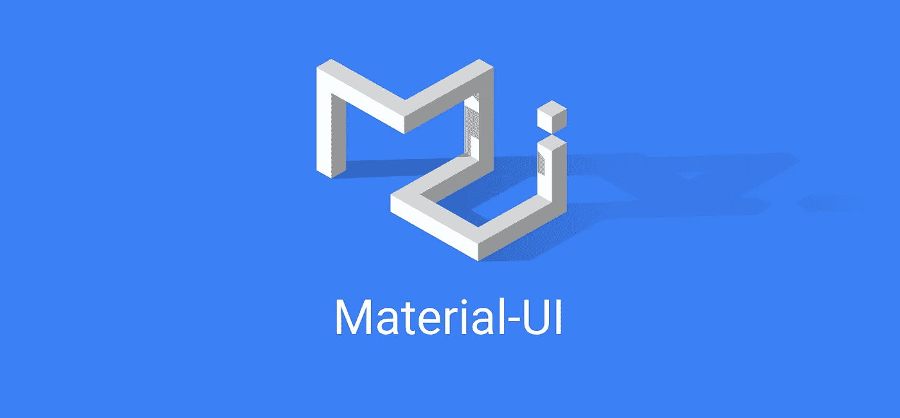

# 使用 React Hooks + Material UI 制作漂亮的 Todo 应用程序

> 原文：<https://itnext.io/making-a-beautiful-todo-app-using-react-hooks-material-ui-52dacf3245f4?source=collection_archive---------1----------------------->

材料用户界面❤

这篇文章已被移到:

 [## 使用 React Hooks + Material UI 制作漂亮的 Todo 应用程序

### 首先，我们将从创建一个新的 CodeSandbox 开始。我们将 Todo 应用程序分解成 4 个组件:因为我们…

blog.blackbox-vision.tech](https://blog.blackbox-vision.tech/making-a-beautiful-todo-app-using-react-hooks-material-ui)