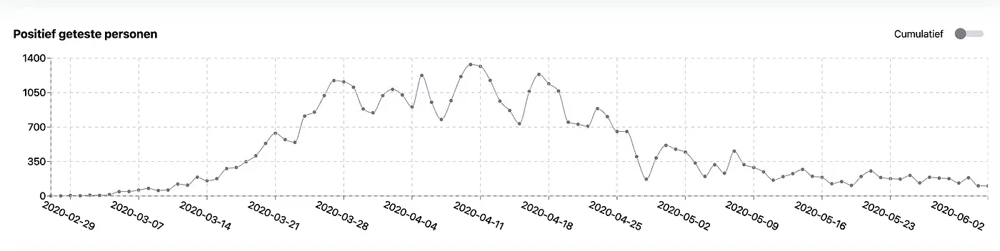

# 为荷兰制作新冠肺炎仪表板

> 原文：<https://itnext.io/making-a-covid-19-dashboard-for-the-netherlands-1af8b2e5d376?source=collection_archive---------1----------------------->



**几周前，荷兰首相表示需要一个仪表板来查看最新的新冠肺炎数据。有了仪表板，我们将能够仔细检查和分析新冠肺炎在全国各地的表现，限制的影响是什么，并检查重症监护病床的可用性。已经有一些令人惊叹的仪表板，但它们的范围是全球性的。我的想法是做一个仪表板，专注于荷兰的数据。**

通过查看不同的仪表板，我注意到它们中的大多数都非常分散注意力。如果你包括世界范围的数据，这是一个不可避免的问题。必须有一个地图，排名列表等等。这就是拥有如此大范围数据的挑战。我注意到我对其他国家的统计数据也不太感兴趣。考虑到这一点，我设想了一个最小的仪表板，为用户提供每日信息和一些关于病毒发展的简单图表。

然后是网站技术方面的选择。我希望网站速度快。我认为这很容易，因为只有一个页面，而且网站的功能很少；这意味着需要下载的 JavaScript 更少。数据来自我们的官方卫生保健机构，每天更新。这就是我决定使用服务器端渲染(SSR)的原因。服务器端呈现是一种用于在构建时生成 HTML 的技术，不会失去其动态特性。

我选择 Next.js 是因为它是 React.js 的最小 SSR 框架。Next.js 提供了一个名为 *getStaticProps* 的方法来公开缓存页面。它还带有搜索引擎优化(SEO)和性能的预渲染。该函数有一个实验属性叫做*unstable _ revalidate*(next . js 的一个开发者推荐我用这个特性，并说这个应该很快就能发货了，用起来很安全)。属性需要一个以秒表示的数字。因为 3600 秒是一个小时，所以我将重新验证值设置为 3600 乘以 2，也就是 2 个小时。每两个小时，静态道具会更新一次。两个小时内的第一个用户将触发一个新的请求，下一个用户将从缓存的结果中获利，使网站速度惊人。

```
export const getStaticProps: GetStaticProps = async _ => {… return { props: { yourData }, unstable_revalidate: 3600 * 2 };}
```

我用了大约一天的时间建立了网站的第一个版本。我面临的最大挑战是选择正确的图表库。我尝试了其中的 5 款，但最终决定选择[充电](http://recharts.org/en-US/)，因为它反应灵敏，具有可定制的功能。该网站包括对黑暗模式的支持，为那些想在睡觉前查看最新数据的人，而不是被灯光弄瞎的[。](https://open.spotify.com/album/2ZfHkwHuoAZrlz7RMj0PDz?highlight=spotify:track:0sf12qNH5qcw8qpgymFOqD)

幸运的是，人们浏览了网站，我被评论惊呆了。很明显，我们需要一个清晰简洁的平台来查看最新的新冠肺炎数据。我得到了一些反馈，包括添加 PWA 支持，这将支持文件和页面的本地缓存，离线使用，并能够将网站添加到您的主页。这些功能还需要优化，但大部分工作已经完成。

另一个功能请求是向图表添加累积数据。最初，我将它编程为在图表中显示非累积数据，显示标志性的病毒曲线。我添加了一个开关，可以切换到累积数据。在 toggle 上，recharts 库漂亮地将这条线动画化为累积数据线，显示一条指数增长的线，然后是一条指数下降的线。至少，在写这篇文章的时候。让我们希望它保持这样。

我实现的最后一个功能是省级下拉菜单。该网站使用的是全国范围的数据，但一位来自格罗宁根的用户向我提到，他对自己省份的数据更感兴趣。可以理解，因为全国的数据不代表他所在省份的数据。例如，今天，阳性检测者、住院人数和死亡人数为零，而这些数字在全国范围内差异很大。

为了托管我的网站，我使用了[网络技术](https://www.netlify.com/)。这是一个免费的平台，可以免费托管您的应用程序，具有基本的 CI/CD 集成。第一次使用该平台时，我惊讶地发现网站在几分钟内就启动并运行了，包括 SSL 认证设置。他们的文档很容易理解，可以用于大多数现代框架或 JavaScript 库。

我的作品 LINKIT 也与 Axual 合作，在北约挑战的竞赛中创建了一个公共数据平台。通用数据平台提供了一种标准化的新冠肺炎数据流方式。写这篇文章的时候，我们已经进入了决赛，只差击败另外 9 家公司了。在这里投出您的一票。

如果你很好奇，可以查看网站[这里](https://corona-dashboard-nl.netlify.app/)。