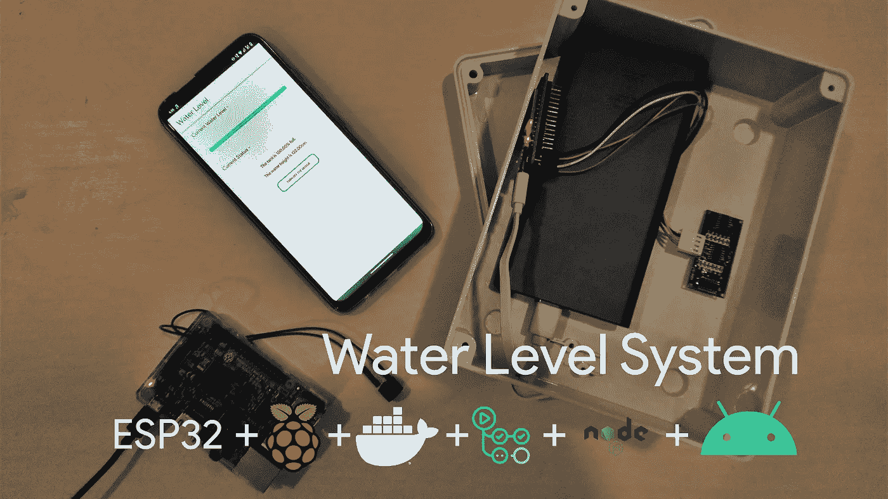
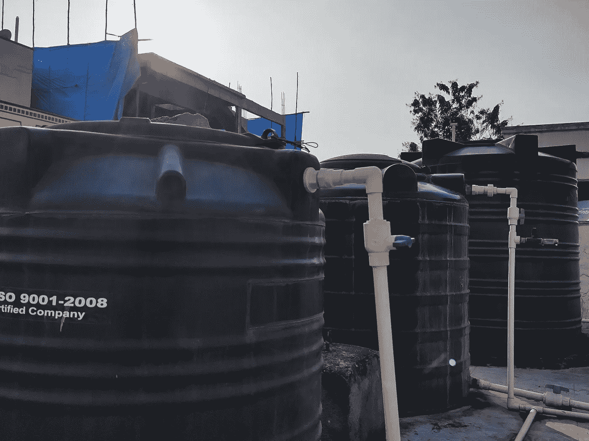
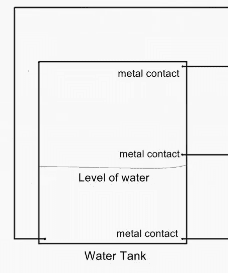
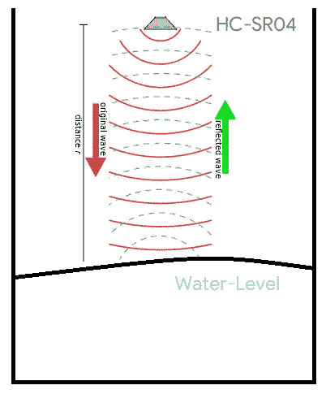
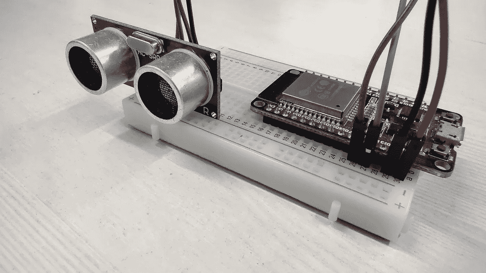
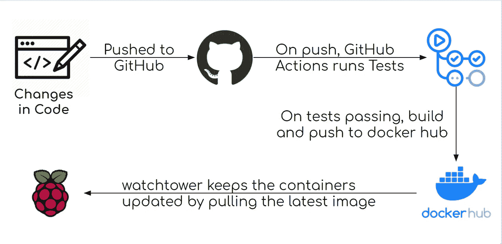
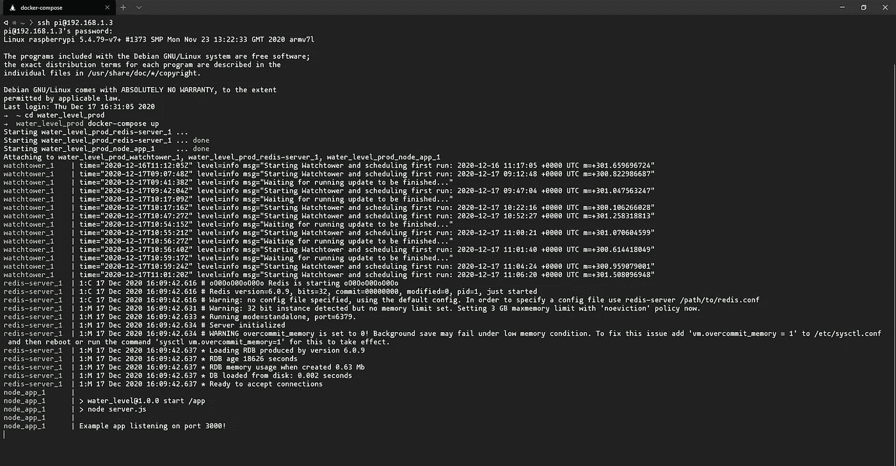
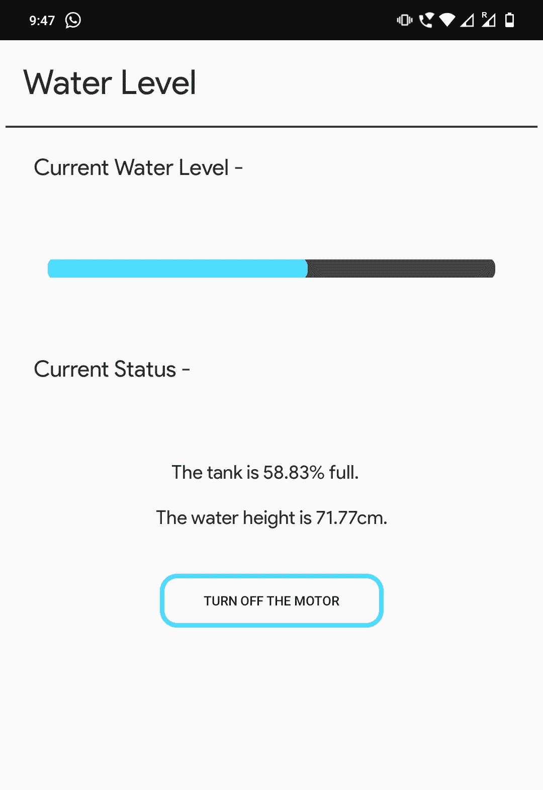
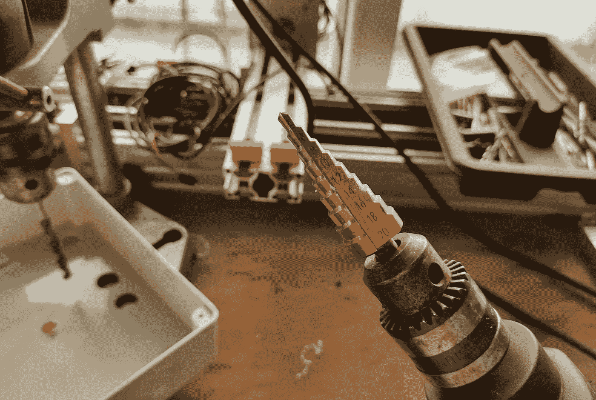
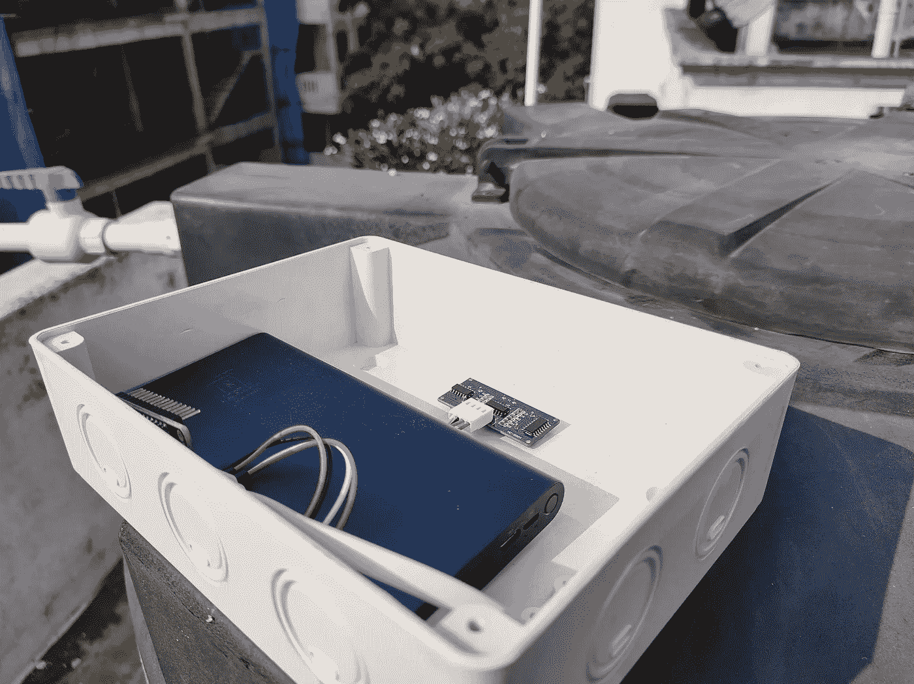

# 打造超级工程水报警解决方案

> 原文：<https://itnext.io/making-a-hyper-engineered-water-alarm-solution-19ba5078d2bc?source=collection_archive---------1----------------------->

树莓 Pi，ESP32，Docker，Nodejs，CI/CD，还有一个安卓应用。它拥有一切。

看似危险的供水系统

每个独立的房子都有一个主要问题，当谈到水。通过走上许多楼梯来检查水箱中的当前水位总是一项令人生畏的任务。

我一直想在我的房子里“IoTfy”东西，通常只限于简单的家庭自动化任务，如灯和开关。因此，当我被分配到找出解决这个看似危险的水系统的任务时，我想通过制造一个真正独特的系统来充分利用它。

## 传统水位系统

可用的水位系统

传统系统利用水的导电特性来完成电路。通过在不同的水平面上保持金属接触来监测水箱中的水位。通过增加接触次数，我们可以获得更高的水位分辨率。

这种系统的缺点是需要对坦克进行大量改装，需要大量体积的硬件，最重要的是需要*联系*。

## 全无接触——一种新的测量方法。

正如 2020 年的所有事情一样，我通过使用超声波传感器尝试了一种非接触式替代方案。

超声波传感器测量原始波和反射波之间的时间差，从中我们可以推断出传感器和任何物体之间的距离。

通过将这样的传感器固定在水箱的顶部，我们可以通过从水箱的高度减去距离来获得水箱中的水位。

## ESP32:低功率野兽

用于测试的原型

由于一些原因，我们选择的微控制器是 ESP32。

*   我们需要一个完全无线的解决方案，因为它被安装在阳台上，处理所有的电线是一个麻烦。ESP32 内置 wifi 模块，可以轻松地将数据发送到服务器。Arduino 库可以很容易地发送 HTTP 请求。
*   一个非常重要的因素是，ESP32 有一个低功耗模式，它基本上是*消耗*功率。加载时需要几 mA 电流，深度睡眠模式下仅需要几 uA 电流。将它连接到一个 10000 毫安的电源上可以让它运行几个月。它非常节能，我们不得不缩短电源组的轮询间隔，以意识到有东西连接。

ESP32 每 20 秒从低功耗模式中唤醒，并连接到 wifi 网络。然后，它使用超声波传感器模块获得传感器和水之间的距离，并将其发送到服务器。为了省电，我们不执行任何额外的计算。

## 服务器以及我们为什么使用 Docker 和 Github 操作

ESP32 必须向 Express API 发送请求，该 API 将距离存储在 Redis 集群中。这是一个简单的 API，有一些更新当前值和获取数据的途径。它通过执行计算和发送最新的水位和填充百分比来响应 Android 应用程序客户端。当达到临界水位时，它还会连续发出蜂鸣声。

如果没有 Docker 和 GitHub 的行动，这个项目也可以完成。将 Raspberry Pi 挂接到显示器和键盘/鼠标上就足够了，但是开发和调试起来会非常糟糕。

这就是为什么 Docker 的构建、发布和随处运行的口号是一个容易集成的选择。

工作流程

我可能会为此制作一个单独的教程，因为有太多关于 docker 多拱构建的内容需要解释。跟着走，这样你就不会错过。

点击这里查看知识库:[https://github.com/vinay-lanka/water-level-api](https://github.com/vinay-lanka/water-level-api)。

手动设置 Redis 集群非常繁琐。使用 docker-compose 可以很容易地将 Express API 和 Redis 集群设置为容器。

这里的挑战是用 Nodejs 脚本中使用的[“onoff”](https://www.npmjs.com/package/onoff)NPM 包发出蜂鸣声(控制 I/O)。在容器内部这样做需要容器具有硬件特权，并且在测试时会产生问题。

最终的系统使得在 Raspberry Pi 上构建、测试和部署应用程序变得非常容易。甚至启动服务器也是一个简单的命令，如果一个服务出了问题，容器会通过重启来修复自己。

ssh 和启动服务器。

## Android 应用程序

我们需要一个一直存在于我们手机上的界面，随时向我们展示信息。一个网站将导致 UX(用户体验)差，因为人们将不得不去网站找到水平。

一款手机应用解决了这个问题。最近，家里有不少人转用了安卓系统，制作应用程序变得非常容易。

该应用程序显示当前的水位和百分比值，以及一个自定义的进度条，以图形方式显示值。

它向 raspberry pi express API 发送接收数据的请求。

当用户需要时，整个应用程序使用 SwipeToRefresh 布局来更新值。

它使用凌空作为网络库和自定义按钮的进度条和按钮。

Raspberry Pi 上的蜂鸣器持续鸣响，直到按下应用程序上的按钮，确保填充油箱的电机确实关闭。

## 打包并安装

我们将 ESP32、电源组和超声波传感器打包在一个可以无线操作的单元中。

电子产品和水不能很好地混合。这就是为什么我们需要一个防水盒，可以承受飞溅和偶尔的降雨。

我们仍然需要超声波传感器的开口，所以我们在防水盒上钻了两个孔。

我们用一个特殊的钻头在外壳上钻孔

装有所有组件的盒子如图所示。我只是用了一个防水盒，所以它不是最合适的。理想情况下，我会选择一个更小的盒子，以便更有效地包装部件。

都在一个整洁的包装中

# 结论

因此，这是一个相当不错的 3-4 天的项目，目前看来运作良好。尽管我有所保留，超声波传感器到目前为止似乎在潮湿的环境中保持良好。将来我可能会尝试用一个更好的防水超声波传感器来替换它。

该项目是完全开源的，所以如果任何人想为该项目做贡献，他们可以，回购是链接[这里](https://github.com/vinay-lanka/water-level-api)。

我也会试着上传这个应用的源代码，我没有任何上传 Android 项目到 GitHub 的经验，但是如果有人想改进这个应用(它非常乏味..我不是一个应用程序开发人员 xD)，我会尽量上传。

让我知道你们是否想要一个关于多架构 docker 构建过程或 esp32 深度睡眠模式的博客，因为它们是我在制作这个项目时探索的非常有趣的主题。

希望能少去几次露台。