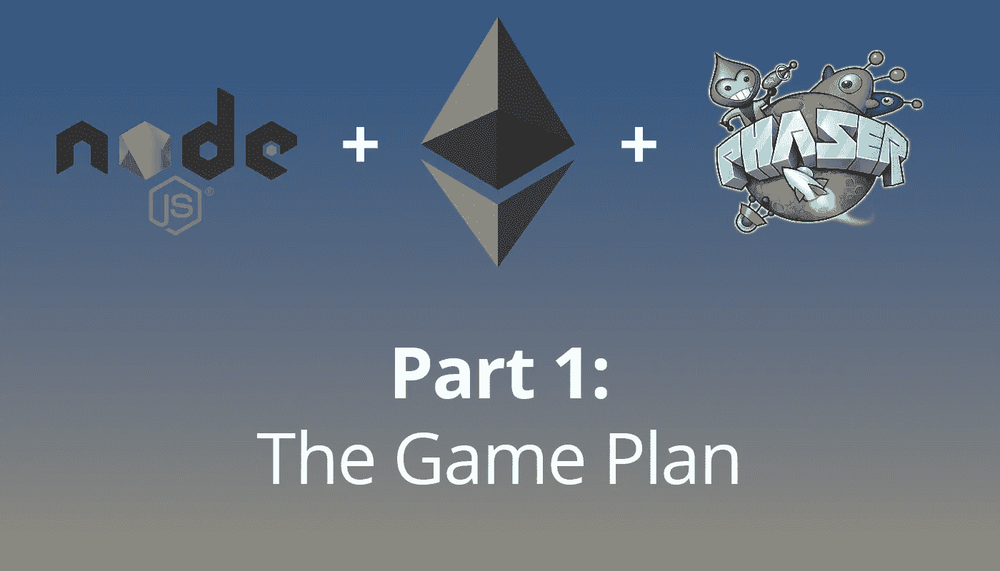

# 使用 Phaser，NodeJS 和以太坊制作一个多人区块链游戏。一

> 原文：<https://itnext.io/making-a-multiplayer-blockchain-game-using-phaser-nodejs-and-ethereum-pt-1-d967aa714efe?source=collection_archive---------7----------------------->

加密小猫棒极了。这是第一个向我们展示智能合约有多么强大，更重要的是有多么有趣的 dApp。

另一款名为[以太精灵](https://www.etheremon.com/)的区块链游戏是最近开发的。这基本上是区块链口袋妖怪。这个游戏的唯一问题是成本。

我花了大约 15 美元，只是为了抓住一个以太精灵，并与它战斗**一次**。

那完全剥夺了它的乐趣。

这让我想到…一定有一种方法可以制作一个有趣的游戏，它建立在以太坊的基础上，但又便宜又容易上手。

# **游戏概念**

这场比赛将是一场激战。玩家带着一个角色和一堆物品(每个都是他们自己的 ERC721 代币)进入游戏，战斗到死。

为了使它均匀，游戏将非常基于技能。游戏将是一个基于 2D 物理学的侧边滚动器。物品会给玩家带来新的技能，但只会略微增加他们的属性。也许一双靴子会降低重力，或者一把猎枪会把你扔来扔去。

带着一套很棒的物品进入游戏会帮助你，但是你需要能够很好地控制你的玩家来赢得战斗。

玩家可以在世界上找到作为代币的箱子。这些箱子可以在游戏之外打开，会随机为玩家产生一两件物品。

这个想法是，一旦玩家有了负荷，他们就可以免费玩他们想玩的游戏。他们唯一需要在交易上花钱的时候就是打开箱子，把东西放进他们的箱子里。

# 堆栈

**客户端**将用[相位器](https://phaser.io/)制作。这将把信息从服务器投射给用户。

**服务器**将用 NodeJS 制作。用户将使用以太坊钱包作为他们的帐户凭证来加入游戏。使用 Web3，服务器将获得该玩家的所有信息，如他们的库存和当前负载。

**智能合同**将与 Solidity 签订。这将把所有的字符和项目作为 ERC721 令牌来处理。它还将处理箱子和项目的生成。

# 接下来，也帮我一下！

我几乎完成了服务器和客户端的安装和运行，并完全连接到以太坊区块链。在第 2 部分中，我将描述我是如何做到这一点的，以及接下来的步骤是什么。

我确信游戏中有一些我没有想到的问题。我喜欢所有我能得到的帮助！

我们的计划是尽快推出一个游戏的基本版本，这样我们就可以一起尝试了。