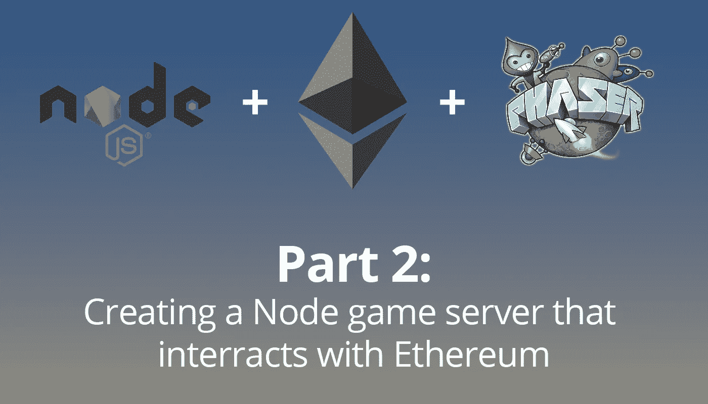

# 使用 Phaser、NodeJS 和以太坊制作多人区块链游戏。2

> 原文：<https://itnext.io/making-a-multiplayer-blockchain-game-using-phaser-nodejs-and-ethereum-pt-2-702b0c667e44?source=collection_archive---------4----------------------->

这个项目的第一步是服务器。我已经建立了一个非常简单的节点环境，并安装了`planck-js`、`socket.io`和`web3`。

第一步是初始化我们的导入。

这使我们能够访问重要的普朗克变量(我们的物理引擎)、我们的服务器、我们的 websocket io (socket.io)和 Web3(以太坊)。

现在我们需要设置我们的物理引擎，初始化 Web3，并创建一些变量来跟踪客户端。

我们首先使用 Ropsten testnet 初始化 Web3。这将让我们测试东西，而不必实际花费，甚至没有任何以太坊。

然后，我们为服务器设置一个固定的时间步长，并初始化物理世界。请注意，重力设置为 10，但普朗克的默认值是-9。我们需要这是积极的发挥相位器好。

我们为玩家创建了一个简单的平台，并创建了一个保存客户信息的对象。这将作为一个映射，连接 id(由 socket.io 提供)作为键，它们的客户端对象作为值。这使得与特定客户端的交互更加容易。

现在让我们在游戏中找一些玩家并设置 Web3！

任何时候有人连接到我们的服务器都会被呼叫。一旦发生这种情况，我们就可以设置函数来调用关于这个客户端的特定数据包。其中的第一个是加入消息。

当玩家加入时，我们只需要向他们的客户端对象添加一些信息。现在，当一个玩家简单地连接时，我们可以做所有这些，但是有一些东西我们需要等待。具体来说，我们希望客户确保他们有一个有效的以太坊帐户，并且在我们允许他们加入游戏之前，他们已经将帐户信息发送给了我们。

# 当客户端发送加入消息时

其余的将去`TODO 1`所在的地方。

首先，让我们设置玩家的统计和物理身体。

一旦他们加入，我们将他们的属性设置为我们上面设置的默认值(因为我们还没有设置智能契约来保存属性)，并给他们一个新的物理体。

客户会把他们的以太坊账户地址发给我们，所以我们把它作为一个属性添加进去。

**为了测试我们的 Web3 功能**,我们获得它们的平衡，并将其作为属性添加进来。稍后，我们会将此发送给客户，以便他们可以显示它。

我们将这个客户端添加到`clients`对象中，然后向所有其他客户端广播这个玩家已经成功加入。这将告诉其他客户端开始渲染这个播放器。

当我们调用`client.broadcast.emit`时，socket.io 将把这个消息发送给除当前客户端之外的所有连接的客户端。

# 后续步骤

接下来的这些步骤将进行到`TODO 2`所在的地方。

# 投入

这为输入包添加了一个监听器。这是一个简单的对象，每个重要的键都有一个布尔值(WASD)。客户端**将仅在输入已经改变**时发送该分组。这使我们可以跟踪哪些键被按下，而不必每 1/20 秒从玩家那里发送一次更新。

# 玩家状态请求

一些玩家会比其他人晚加入。我们不希望不断地发送球员的整个状态，只是为了更新他们的位置这样的小事。当客户端连接时，他们可以看到其他玩家也连接了，但是不会有任何信息。当一个客户端检测到一个没有信息的玩家，他们发送一个`playerStateRequest`包。

这将简单地把玩家的状态发送给客户端，这样他们就可以得到最新的状态。

# 播放器断开连接

当一个玩家断线时，我们需要做一些事情。首先，我们需要告诉所有其他玩家他们已经断开连接。这可以由客户端通过添加某种超时来推断(可能该玩家的更新已经有一段时间没有进来了)。在过去，我发现这样做真的很烦人。

如果我们在一段时间内没有收到他们的消息，就简单地删除一个玩家，这意味着我们必须发送一个心跳来防止他们在每个客户端超时。这在使用 UDP 时肯定是有用的，但是对于 WebSockets(本质上是 TCP ),我们不想这样做。我们发送的每一条消息都是可靠的，所以让我们也让每一个玩家变得可靠！

# 游戏循环

这段代码现在位于`io.on(‘connection’)`函数之外。

这是我们服务器的发电站。每 1/20 秒执行一次(`FIXED_TIME_STEP`)。这很简单，所以我就简单介绍一下。

**第 4-5 行**我们想要遍历所有的客户端，所以我们从`clients`对象中获取所有的键并遍历它。

**第 7–9 行**在这段时间内，某个客户端可能已被删除，因此我们要确保该客户端仍然存在。

**第 14–27 行**根据玩家当前的输入状态调整他们的物理身体。

**第 30–36 行**为了确保每个玩家都不是闪电侠，我们限制了他们的速度。

**第 39 行**向每个客户端发出新状态。这包括我们刚刚搞定的客户。这是因为我们也需要让客户端跟上速度！

**第 42 行**让物理学在时间中前进。我把物理速度减半，只是为了让游戏慢一点。这部分只是偏好。

# 最后润色

我们在这里所做的就是创建一个间隔，每 1/20 秒调用一次`gameLoop`函数，然后我们让服务器开始监听！

# 结论

我们现在有了一个使用 Web3 连接到以太坊的游戏服务器！

在第 3 部分中，我将展示如何设置客户端并上传游戏，这样我们就可以开始使用这个家伙了！