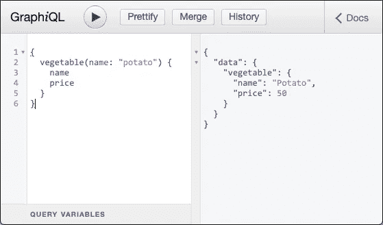

# 用 Go 制作一个简单的 GraphQL 服务器

> 原文：<https://itnext.io/making-a-simple-graphql-server-with-go-dcb9b60460c6?source=collection_archive---------2----------------------->


# 介绍

正如你在 [AWS AppSync](https://aws.amazon.com/appsync/) 和 [Prisma](https://www.prisma.io/) 中看到的，GraphQL 不仅用于前端应用，还用于制作封装各种数据库的数据层。因为 Go 具有良好的类型安全和并发模型，所以在 Go 中实现 GraphQL 服务器是合理的。

# 为 Go 选择 GraphQL 模块

有一些用于 Go 的 GraphQL 模块。它们在设计上有所不同，比如模式处理。因为 graph-gophers/graphql-go 看起来很接近 Apollo，所以我在本文中使用它。

*   [graphql-go/graphql](https://github.com/graphql-go/graphql)
*   [graph-gophers/graph QL-go](https://github.com/graph-gophers/graphql-go)
*   [gqlgen](https://gqlgen.com/)
*   [惊雷](https://github.com/samsarahq/thunder)

在本文中，我将[graph-gophers/graphql-go](https://github.com/graph-gophers/graphql-go)称为 graph QL-go。

# (计划或理论的)纲要

与 Apollo 类似，graphql-go 使用 [GraphQL 模式](https://graphql.github.io/graphql-spec/June2018/)作为其输入。在 schema 中，您可以定义类型、查询、突变等。

```
const Schema = `
type Vegetable {
    name: String!
    price: Int!
    image: String
}type Query {
    vegetable(name: String!): Vegetable
}schema {
    query: Query
}
`
```

它可以按如下方式进行解析和服务。

```
import (
    "context"
    "log"
    "net/http"
    "strings" "github.com/friendsofgo/graphiql"
    graphql "github.com/graph-gophers/graphql-go"
    "github.com/graph-gophers/graphql-go/relay"
)// TODO: Schema// TODO: Modeltype query struct{}// TODO: Resolverfunc main() {
    schema := graphql.MustParseSchema(s, &query{})
    http.Handle("/query", &relay.Handler{Schema: schema}) // TODO: init model // TODO: graphiql // Run
    log.Println("Server ready at 8080")
    log.Fatal(http.ListenAndServe(":8080", nil))
}
```

此时，您将会遇到一个异常错误，提示没有名为`vegetable`的方法。

# 用于 Go 的 GraphQL IDE

当您创建浏览实际数据的查询时，拥有可视化 IDE 非常有用。有一个很好的围棋模块，名叫`graphiql`。

添加这些行来替换`graphiql`注释。

```
// First argument must be same as graphql handler path
graphiqlHandler, err := graphiql.NewGraphiqlHandler("/query")
if err != nil {
    panic(err)
}http.Handle("/", graphiqlHandler)
```

# 实施解析器

让我们继续实现解析器。解析器是在模式文件中定义了字段的结构。

使用模型结构作为解析器是可能的，但是我不推荐这样做，因为解析器和模型在 null 处理中可能有不同的方式。在 graphql-go 中，可空类型是指针类型。

```
type VegetableResolver struct {
    v *Vegetable
}func (r *VegetableResolver) Name() string   { return r.v.name }
func (r *VegetableResolver) Price() int32   { return int32(r.v.price) }
func (r *VegetableResolver) Image() *string { return r.v.image }
```

上面的解析器由接受参数的查询解析器返回。
它必须是一个查询对象的方法。

查询参数作为结构中的第二个参数传递。

```
func (q *query) Vegetable(ctx context.Context, args struct{ Name string }) *VegetableResolver {
    v, ok := vegetables[strings.ToLower(args.Name)]
    if ok {
        return &VegetableResolver{v: &v}
    }
    return nil
}
```

您应该使用为每个请求创建的上下文，而不是背景。使用 Stackdriver 时很重要。

因此，解析器与模式相关联。

# 数据模型

为了简化这个例子，让我们考虑一个简单的 struct 映射作为我们的数据源。您可以在 ORM 需要的字段中添加标签。

```
type Vegetable struct {
    name  string
    price int
    image *string
}var vegetables map[string]Vegetable// Utils
func strPtr(str string) *string {
    return &str
}
```

`func main`中的初始化是:

```
// init model
vegetables = map[string]Vegetable{
    "tomato": Vegetable{name: "Tomato", price: 100, image: strPtr("https://picsum.photos/id/152/100/100")},
    "potato": Vegetable{name: "Potato", price: 50, image: strPtr("https://picsum.photos/id/159/100/100")},
    "corn": Vegetable{name: "Corn", price: 200},
}
```

通过运行包含所有代码片段的 main.go 并打开`http://localhsot:8080/`，您可以尝试这样的查询。



# 结论

因此，在 Go 中制作一个基本的 GraphQL 服务器并不困难。一旦您制作了一个简单的服务器，集成各种数据库客户机就非常简单了。此外，您可以通过应用`go generate`或`reflect`模块来简化这些集成。