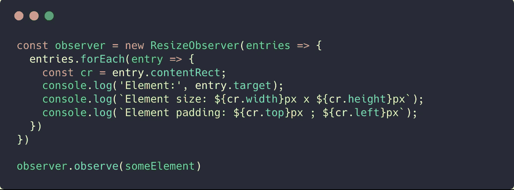
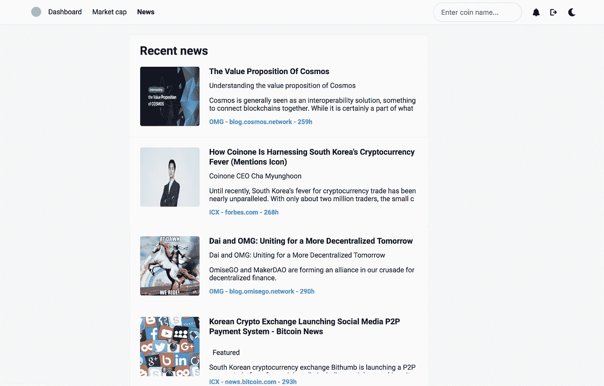
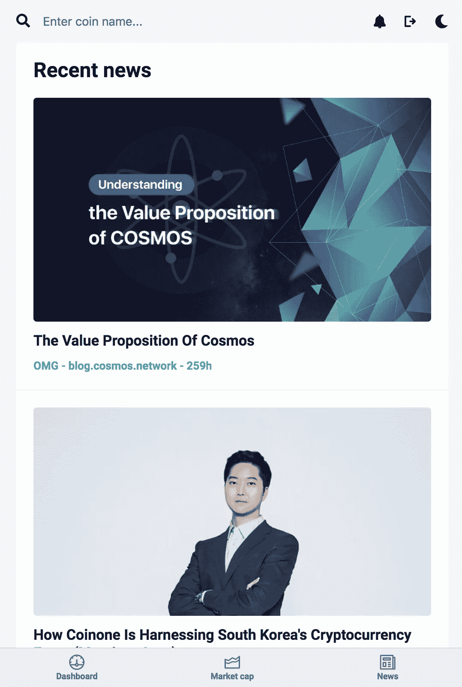
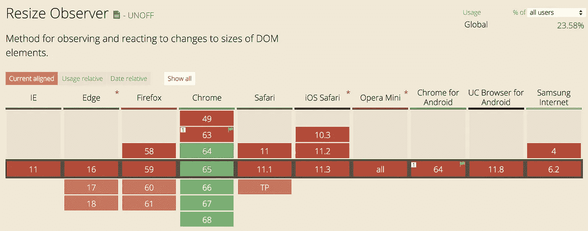
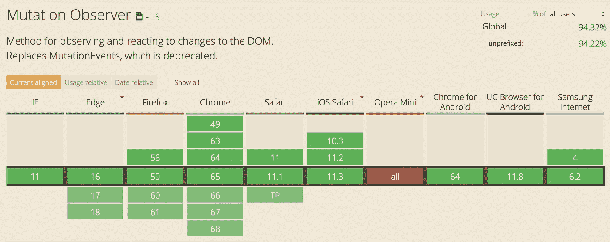

# 用 ResizeObserver 制作响应式 Vue 组件

> 原文：<https://itnext.io/making-adaptive-vue-components-with-resizeobserver-123b5ebb20ae?source=collection_archive---------1----------------------->

大家好。今天我想分享一个小但很有用的东西。

在我目前的项目中，我有许多可重用的组件(我将其命名为“小部件”)，可以放在任何地方。我遇到了响应式设计的问题。

最后，我明白 css `@media`查询在我的情况下是绝对不可用的。

# 那么，有什么问题呢？

假设我们有一些`PostsItem`组件。我们有`PostsPage`的帖子列表:

有帖子的新闻页面

就几行 CSS 吧？

此外，我们还希望保持移动视图良好。它可能看起来像:

你可以说“容易”，`@media`解决了这个问题，对吧？

好的，它起作用了。但是如果我们将在另一个地方使用我们的`PostsItem`组件呢？

哦，可怜的眼睛。我们的屏幕很大，但我们没想到会连续看到 3 篇帖子。

所以，`@media`查询的最大问题是:

> 您的组件响应基于屏幕大小，但应该基于它自己的大小

但是，在这种情况下，组件布局只取决于它们。这些组件应该是原子的，独立地确定它们自己的大小，并使布局适应它。

我们需要当地的回应风格。又来了 **ResizeObserver** ！

# resize 观察者

[**resize observer**](https://developers.google.com/web/updates/2016/10/resizeobserver)是一个新特性，当一个元素的内容矩形改变了它的大小时，它会通知你，并做出相应的反应。

用法非常简单:

你可以说浏览器支持不好:

不过，幸运的是， **ResizeObserver** 有 [**polyfill**](https://github.com/que-etc/resize-observer-polyfill) 这是基于**变异 Observer** :

# 与 Vue 一起使用

我为 Vue.js

现在它看起来很好，即使我们把三个职位在一排:

现在，我们的组件真正独立了！

它也给你机会定义不同的 html 标记，而不仅仅是 css。例如，我为小型区块添加了选项卡和“超小型”帖子视图:

此外，我想指出的是，为了支持 ResizeObserver，我完全删除了当前项目中的所有`@media`查询😉

# UPD:奖金:`v-responsive`指令

幸亏 [**这家伙**](https://www.reddit.com/r/vuejs/comments/8eap88/making_responsive_vue_components_with/dxtx0bu/) 出了个主意。我添加了`v-responsive`指令来去掉包装组件:

# 再次所有链接

*   [ResizeObserver:就像 document . on resize for Elements](https://developers.google.com/web/updates/2016/10/resizeobserver)
*   [ResizeObserver polyfill](https://github.com/que-etc/resize-observer-polyfill)
*   [vue . js 的包装器](https://github.com/Kelin2025/vue-responsive-components)
*   [我的推特:)](http://twitter.com/kelin2025)