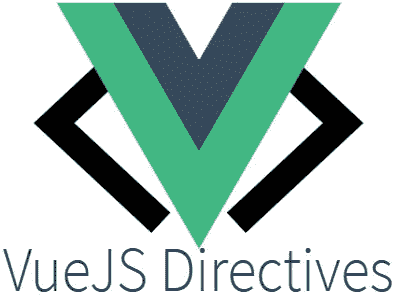
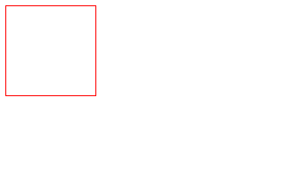
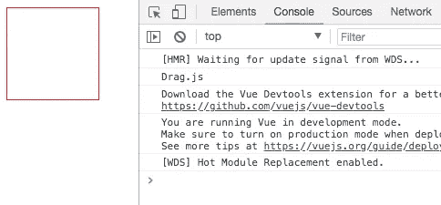
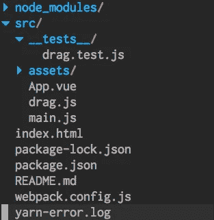
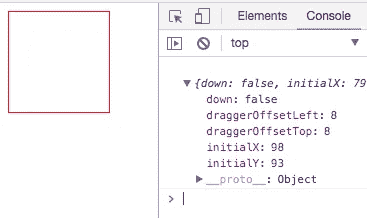

# 为 npm 构建并发布 v-drag 指令

> 原文：<https://itnext.io/making-and-publishing-a-v-drag-directive-to-npm-6d20a80dedba?source=collection_archive---------4----------------------->



图片来自[http://vegibit.com/vue-js-directives/](http://vegibit.com/vue-js-directives/)

自定义指令是 Vue.js API 的一个强大部分。让我们来看看如何构建一个定制的`v-drag`指令，并将其发布到 NPM，以及一个测试套件。

我们将构建一个简单的指令，允许任何元素成为`draggable`。下面是一个快速预览:



v-drag，我们正在构建的指令。

使用这样的标记:

```
<template>
  <div v-drag>
  </div>
</template> 
```

演示项目源代码在此处为，最终指令代码在此处为。最后，发布的包是[这里的](https://www.npmjs.com/package/@branu-jp/v-drag)。

[](http://vuejs-course.com/)

来看看我的 [Vue.js 3 课程](https://vuejs-course.com/)！我们涵盖了组合 API、类型脚本、单元测试、Vuex 和 Vue 路由器。

## 设置

首先，我们将使用`vue-cli`搭建一个新项目。如果你还没有安装，运行`npm install vue-cli -g`。然后使用`vue init webpack-simple dragger`创建一个新项目。

创建应用程序后，在`src/App.vue`中，删除现有标记并创建添加以下内容:

```
<template>
  <div id="outer">
    <div id="dragger" v-drag></div>
  </div>
</template><script>
import drag from './drag'export default {
  name: 'app'directives: {
    drag
  }
}
</script><style>
body {
  height: 100vh;
}#outer {
  height: 100%;
}#dragger {
  position: absolute;
  border: 1px solid red;
  width: 100px;
  height: 100px;
}
</style>
```

我们的指令将在`drag.js`中生效。继续在与`App.vue`相同的级别上创建它，并添加以下内容:

```
import Vue from 'vue'export default Vue.directive('drag', {
  inserted: function (el, binding, vnode) {
    console.log('Drag.js')
  } 
})
```

运行`npm run dev`启动 app，访问`localhost:8080`。您应该会在控制台中看到“Drag.js ”:



Drag.js 指令。

注意上面的`inserted`功能。Vue 指令有几个对开发人员公开的钩子。我们将使用`inserted`，它在元素被安装时被调用(就像`mounted`钩子组件暴露一样)。我们还将使用`unbind`，当指令被解除绑定时，当组件被从 DOM 中移除时，就会调用这个函数。

## 检测元素何时被单击

下一步将是检测用户何时用`v-drag`点击元素。当用户点击该元素时，我们将设置一个`down`布尔值为`true`，当用户放开时则相反。我们还将保存 x 和 y 坐标，以便在移动时计算元素的位置。

将以下内容添加到`drag.js`:

```
const data = {
  down: false,
  initialX: 0,
  initialY: 0
}export function mousedown (e, el, _data) {
  _data.down = true
  _data.initialX = e.clientX
  _data.initialY = e.clientY
}export function mouseup (e, el, _data) {
  _data.down = false
}export default Vue.directive('drag', {
  inserted: function (el, binding, vnode) {
    el.addEventListener('mouseup', (e) => mouseup(e, el))
    el.addEventListener('mousedown', (e) => mousedown(e, el))
  } 
})
```

`inserted`接收三个参数:元素本身，一个`binding`对象和`vnode`，前者有一堆我们不会用到的属性，后者由 Vue 的编译器和虚拟 dom 使用。我们将把`mouseup`和`mousedown`事件绑定到元素上。`v-drag`将使用的数据将保存在`data`中。然后我们将`data`对象传递给任何需要它的函数——这将使测试函数变得更容易。

## 开玩笑的测试

在继续之前，让我们写一些测试。我们将使用令人敬畏的测试库..继续安装 Jest 和一些支持包。

```
npm install jest babel-preset-env babel-jest --save-dev
```

你还需要用新的`env`更新`.babelrc`，这是我从 Jest [文档](https://facebook.github.io/jest/docs/en/getting-started.html)中了解到的。

```
{
  "presets": [
    ["env", { "modules": false }],
    "stage-3"
  ],
  "env": {
    "test": {
      "presets": [["env"]]
    }
  }
}
```

在`src`里面做一个`__tests__`文件夹，给它加一个`drag.test.js`。该项目现在看起来像这样:



项目层次结构

让我们从测试`mouseup`和`mousedown`开始。将以下内容添加到`drag.test.js`。还要确保将`export`添加到`drag.js`中的两个函数中，以便它们能够被导入到测试中。

```
import { mouseup, mousedown } from '../drag.js'describe('drag', () => {  
  describe('mouseup', () => {
    it('sets down = false', () => {
      const data = {
        down: true
      } mouseup(undefined, undefined, data)
      expect(data.down).toBe(false)
    })
  }) describe('mousedown', () => {
    it('sets down = true and initial mouse position', () => {
      const data = { 
        initialX: 0,
        initialY: 0,
        down: false
      } const evt = {
        clientX: 1,
        clientY: 1
      } mousedown(evt, undefined, data) 
      expect(data.down).toBe(true)
      expect(data.initialX).toBe(1)
      expect(data.initialY).toBe(1)
    })
  })
})
```

向`package.json`添加新行:

```
"scripts": {
  "test": "jest"
}
```

现在您可以使用`npm run test`运行测试套件。

当前 out 指令在被点击时仍然不“做”任何事情，但是随着测试套件的建立，我们已经准备好了。

## 计算移动和偏移

为了计算元素被拖动时的位置，我们应该保存元素被单击时的初始位置。我们用一个`setInitialOffset`函数来做吧。

```
const _data = {
  /* other variables */  
  draggerOffsetLeft: 0,
  draggerOffsetTop: 0
}export function setDraggerOffset (el, _data) {
  _data.draggerOffsetLeft = el.offsetLeft
  _data.draggerOffsetTop = el.offsetTop
}
```

和一个快速测试来确保它的工作:

```
describe('setInitialOffset', () => {
  it('sets the initial offset of the element', () => {
    const data = {
      draggerOffsetLeft: 0,
      draggerOffsetTop: 0
    }
    const el = {
      offsetLeft: 1,
      offsetTop: 1
    } setDraggerOffset(el, data)
    expect(data.draggerOffsetLeft).toBe(1)
    expect(data.draggerOffsetTop).toBe(1)
  })
})
```

太好了。让我们通过调用`inserted`中的`setInitialOffset`来设置安装元素时的初始偏移量。

```
export default Vue.directive('drag', {
  inserted: function (el, binding, vnode) {
    el.addEventListener('mouseup', (e) => mouseup(e, el, _data))
    el.addEventListener('mousedown', (e) => mousedown(e, el, _data))
    setDraggerOffset(el, _data)
  }
})
```

如果你把`console.log(_data)`加到`mousedown`中，仔细检查一切都正常。点击将记录`_data`物体。



保存元素的初始偏移量。

## 移动元素

我们再加一个`mousemove`功能。如果`_data.down`为真，我们将计算元素的新位置，并更新`style.top`和`style.left`值。

先说`_data.down`为*假*的情况。我们应该什么都不做。一个测试看起来像这样:

```
describe('mousemove', () => {
  it('does nothing is down === false', () => {
    const data = {
      down: false
    }
    const el = {
      style: {
        left: 0,
        top: 0
      }
    } mousemove(undefined, el, data) expect(el.style.left).toBe(0)
    expect(el.style.top).toBe(0)
  })
})
```

我们断言元素的样式不会改变。现在是激动人心的部分，移动元素。该公式如下所示:

elementNewLeft = elementInitialLeft+(mouse newx-mouse initialx)

这些价值观我们都有！

*   elementNewLeft: `el.style.left`
*   elementInitialLeft: `_data.draggerOffsetLeft`
*   mouseNewX: `e.clientX`。(我们将传入客户端事件)
*   mouseInitialX: `_data.initialX`

因此，在代码中:

```
export function mousemove (e, el, _data) {
  if (_data.down) {
    el.style.left = _data.draggerOffsetLeft + (e.clientX - _data.initialX) + 'px'
    el.style.top = _data.draggerOffsetTop + (e.clientY - _data.initialY) + 'px'
  }
}
```

并在`inserted`中添加监听器:

```
export default Vue.directive('drag', {
  inserted: function (el, binding, vnode) {
    el.addEventListener('mouseup', (e) => mouseup(e, el, _data))
    el.addEventListener('mousedown', (e) => mousedown(e, el, _data))
    el.addEventListener('mousemove', (e) => mousemove(e, el, _data))
    setDraggerOffset(el, _data)
  }
})
```

这应该足够让箱子动起来了！


有用！

让我们添加一个测试:

```
describe('mousemove', () => {
  it('updates the element style if down === true', () => {
    const data = {
      down: true,
      initialX: 10,
      initialY: 10,
      draggerOffsetLeft: 0,
      draggerOffsetTop: 0
    }
    const e = {
      clientX: 20, // clientX - initialX. 20 - 10 = 10
      clientY: 20
    }
    const el = {
      style: {
        left: 0,
        top: 0
      }
    } mousemove(e, el, data) expect(el.style.left).toBe('10px')
    expect(el.style.top).toBe('10px')
  })
})
```

有一些小虫子。首先，你只能绘制元素一次——我们应该在`mouseup`中重置元素的初始偏移量。

```
export function mouseup (e, el, _data) {
  _data.down = false
  setDraggerOffset(el, _data)
}
```

现在测试失败了。使用模拟`el`更新测试。

```
describe('mouseup', () => {
  it('sets down = false', () => {
    const el = {}
    const data = {
      down: true
    }

    mouseup(undefined, el, data)
    expect(data.down).toBe(false)
  })
})
```

测试套件又变绿了。还有更多改进——如果用户快速拖动鼠标，它离开了元素，`mouseup`就不会被调用，元素的行为就会不正确。为了简洁起见，让我们继续发布模块。

## 发布到 NPM

尽管我们使用了一个`vue-cli`项目来构建指令。当发布时，我们希望有一点不同的项目设置。我们希望默认导出是指令，并将代码编译成 ES5，以确保在任何浏览器中的正确行为。创建一个新文件夹`v-drag`，并初始化一个新的节点项目:

```
npm init -y
```

并安装一些软件包:

```
npm install babel-cli  babel-preset-env rimraf --save-dev
```

我们需要 babel 来编译，每次发布时需要 rimraf 来清除编译好的`lib`文件。

更新`package.json`:

```
{
  "name": "[@branu](http://twitter.com/branu)-jp/v-drag",
  "version": "0.0.1",
  "description": "A Vue.js draggable directive",
  "main": "index.js",
  "dependencies": {},
  "devDependencies": {
    "babel-cli": "^6.26.0",
    "babel-preset-env": "^1.6.1",
    "rimraf": "^2.6.2"
  },
  "main": "lib/index.js",
  "scripts": {
    "start": "babel-node src",
    "build": "rimraf lib && babel src -d lib --ignore src/__tests__"
  },
  "repository": {
    "type": "git",
    "url": "[https://github.com/branu-ws/v-drag](https://github.com/branu-ws/v-drag)"
  },
  "keywords": [],
  "author": "BRANU",
  "license": "MIT"
}
```

确保更新了`name`属性。我正在发布一个有作用域的包，更多信息可以在 [npm 文档](https://docs.npmjs.com/misc/scope)中找到。还要注意我们有一个`build`脚本，它将把`src`文件夹中的任何代码编译到`lib`文件夹中。

创建一个`src`文件夹，在里面添加一个`index.js`文件，指令代码来自`drag.js`。

我们还应该将`__tests__`添加到`src`文件夹，并将它们更新为从`index.js`导入，而不是从`drag.js`导入。最后，我们想安装 Vue 作为一个`peerDependency`，`v-drag`假设 Vue 安装在任何使用它的项目中。

为了发布，我们运行`npm run build`，它在`lib`文件夹中编译成 ES5。

现在只需运行`npm publish`。如果您以前没有发布到 npm，您将看到一个错误:

```
npm ERR! code ENEEDAUTH
npm ERR! need auth auth required for publishing
npm ERR! need auth You need to authorize this machine using `npm adduser`
```

如果你还没有账户，在 [npm](https://www.npmjs.com/) 上创建。然后继续运行`npm adduser`，并添加您的详细信息。然后`npm publish`，你的包就活了。你应该看看

```
+ [@branu](http://twitter.com/branu)-jp/v-drag@0.0.2
```

如果一切顺利。我的副本在这里直播。现在，它可以像任何其他软件包一样安装。以我为例，`npm install @branu-jp/v-drag`。

## 下一步？

继续尝试发布一个包吧！我将做一些事情来改善我的套餐:

*   添加一个自述文件，解释如何安装和使用您的软件包
*   添加演示

演示代码为[此处为](https://github.com/lmiller1990/vue-drag/tree/article)(文章分支)，发布的模块代码为[此处为](https://github.com/branu-ws/v-drag)。