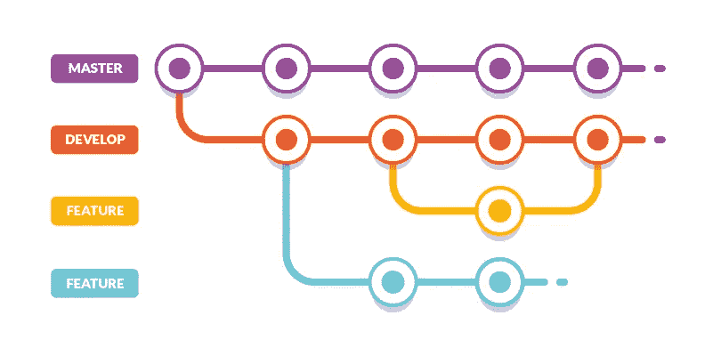
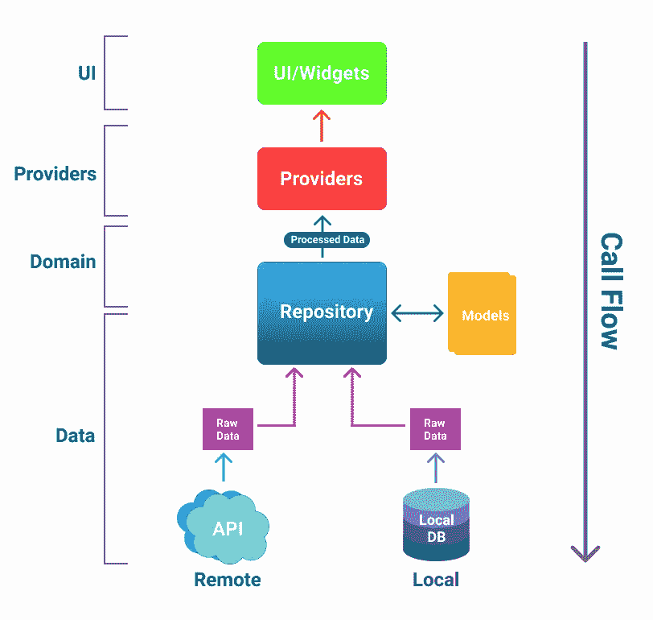
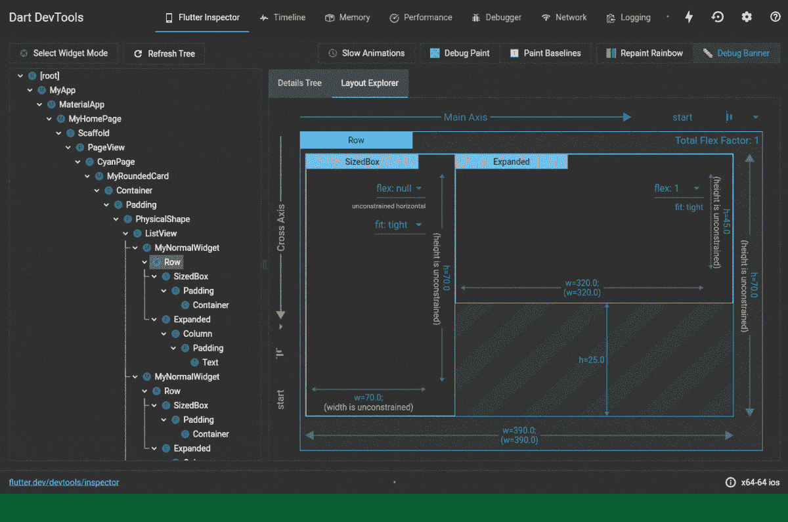

# 在 Flutter 中制作生产就绪型应用

> 原文：<https://itnext.io/making-production-ready-apps-in-flutter-e0abd1c23c83?source=collection_archive---------1----------------------->

克里斯蒂安·威迪格在 [Unsplash](https://unsplash.com/s/photos/mobile-app?utm_source=unsplash&utm_medium=referral&utm_content=creditCopyText) 上拍摄的照片

在这篇文章中，我将讨论开发应用程序时应该记住的一些要点。编写可扩展和可维护的应用程序总是一个好的实践。

我将在本文中讨论以下主题:

1.  设置开发/生产环境
2.  编写干净代码的最佳实践
3.  测试、调试和监控
4.  通过 CI/CD 分发应用程序

# 设置环境

## Git 版本控制和分支策略

版本控制允许您跟踪任何文件更改并识别代码中的差异。在团队中工作时，这是一个方便的工具。但是，如果每个人都开始向主分支提交变更，它会很快变得混乱。因此，应该为不同的目的定义特定的分支。一个简单的惯例是有三个分支:

*   **主人:**这里是生产就绪代码。
*   **开发:**在合并到主分支之前进行最终测试的代码
*   **特定于特性的分支:**这些分支具有当前正在处理的特性的名称

*图片取自*[*https://buddy.works/blog/5-types-of-git-workflows*](https://buddy.works/blog/5-types-of-git-workflows)

## 用于颤振的码头集装箱(可选)

想象一个场景，你想在一台没有安装 Flutter 或者 Android SDK 的机器上运行一个 Flutter 项目。手动下载和安装一切是一个令人厌倦的过程。更不用说修复安装错误了😰。这就是 Docker 发挥作用的地方。Docker 容器非常有用，把我们从" ***中拯救出来，但是它在我的机器上运行..*** “问题。它便于携带，重量很轻。它也是独立于平台的，这意味着它在你的机器上运行就像在我的机器上运行一样，与操作系统无关。

为 Flutter 设置 Docker 相对容易。可以参考这篇文章寻求帮助。

 [## 如何对 Flutter 应用进行分类

### Souvik Biswas 展示了如何使用 Docker 来简化 Flutter app 开发工作流程。

blog.codemagic.io](https://blog.codemagic.io/how-to-dockerize-flutter-apps/) 

# 编写干净代码的最佳实践

## 干净的建筑

不管你的 app 有多棒，如果你不能理解和调试你前几天写的代码，它是没有用的。每个人都应该至少遵循一个基本的架构，将业务逻辑从 UI 中分离出来。我喜欢遵循的架构是由 [Reso Coder](https://resocoder.com/2019/08/27/flutter-tdd-clean-architecture-course-1-explanation-project-structure/) 提出的架构的一个小修改。

干净的架构模式

该架构的细分如下:

1.  **UI** :用户交互的部分。这个部分接收用户的输入，并将其发送给提供者。数据的验证可以在这里完成。
2.  **Provider:** 这个部分包含您想要使用的任何状态管理。在上图中，我使用了提供者包。
3.  **存储库(域):**域层的存储库是一个抽象类，包含了提供者需要的所有方法。
4.  **存储库(数据):**数据层的存储库是抽象的实现。这一层决定用户需要的数据应该从服务器还是本地缓存中获取。
5.  **Remote:** 顾名思义，它处理所有的服务器请求。
6.  **Local:** 它管理所有与离线存储数据和在需要时从本地数据库获取数据相关的任务。

下面是一个使用上述架构的项目。

 [## ibtesam 123/数字琐事

### 一个新的颤振项目。这个项目是颤振应用的起点。一些帮助您入门的资源…

github.com](https://github.com/ibtesam123/NumberTrivia) 

## 错误处理

错误处理是任何应用程序最重要的方面之一。错误和崩溃会严重影响你的用户群。你可以通过使用类似****的数据类型来解决这个问题。**两者都是 dartz 库的一部分，它可以帮助有效地处理异常。它充当两种数据类型的包装器——左(异常)和右(预期数据)。使用这两种方法的好处是，您需要为这两种情况定义逻辑。这可以确保你处理好每一种情况。**

**使用任一类型进行错误处理**

# **测试、调试和监控**

## **测试**

**测试是必不可少的，这样你就可以在把应用程序交付给用户之前发现并改正错误。随着应用程序的增长，手动测试变得更加困难。颤振提供三类测试:**

*   ****单元测试:**测试单个函数、方法或类。应该有一堆单元测试，因为这些测试执行起来很快。所有的单元测试都可以在 CI 环境中进行。**
*   ****Widget 测试:**测试单个 Widget；这些测试比单元测试慢，应该在本地执行。尽量不要在 CI 环境中运行它们，因为它们会占用您大量的构建时间。**
*   ****集成测试:**测试完整 app 或其中很大一部分；这些测试应该严格地在本地执行，因为它们非常慢，不适合 CI 环境。**

**测试还可以确保没有人破坏先前工作的代码。可以建立一个 CI 工作流来运行测试，只要开发分支有一个 pull 请求。**

## **排除故障**

**dart[**dev tools**](https://flutter.dev/docs/development/tools/devtools/overview)**提供了多种工具和功能来帮助调试 Flutter 应用程序。我对开发工具相当陌生，但我喜欢 flutter inspector，它允许测试不同的布局参数，而无需更改实际代码。您还可以监控应用程序发出的网络请求，而无需在应用程序中手动打印出来。****

********

****图片取自 [flutter.dev](https://flutter.dev/)****

## ****监视****

****在 play store 或 app store 上部署你的应用并不是终点。您需要跟踪那些脱离开发阶段的 bug 和错误。[**Firebase crash lytics**](https://pub.dev/packages/firebase_crashlytics)提供了一种简单的方法来监控你的应用在用户手机上的行为。您可以记录错误，甚至将它们记入日志。****

****燃烧基分解剂****

# ****通过 CI/CD 分销****

## ****为什么重要？****

*   ****如果你经常为你的应用推送更新，CI/CD 可以帮助你自动化各种任务，这样你就不用浪费很多时间了。****
*   ****尽早发现错误；您也可以很容易地确定错误的位置。****
*   ****释放速度更快。CI/CD 不断地合并代码，并在彻底测试后将它们部署到生产环境中，使代码保持发布就绪状态。****
*   ****增加生产时间；由于 CI/CD 自动化了许多任务，开发人员可以花更多的时间在开发上。****

## ****如何为你的 flutter app 设置？****

****最简单的方法是使用 [Codemagic](https://codemagic.io/start/) 。Codemagic 为创建工作流提供了一个易于设置的用户界面。你可以看看他们的教程。****

**** [## 出版 Codemagic 博客。移动应用项目的 CI/CD

### 探索 Codemagic 背后的魔力——持续集成和持续交付。自动化您的整个工作流程，以…

blog.codemagic.io](https://blog.codemagic.io/tags/publishing/) 

还有其他选项，比如 [Github 动作](https://github.com/features/actions)。接下来我会写一篇博客，讲述如何为你的 Flutter 应用在不同环境下安全地建立工作流程。**** 

# ****概述****

*   ****为您的项目设置 git 和 git 分支策略，以将生产和开发代码分开。****
*   ****您可以为您的项目设置 Docker，以确保在所有平台上轻松开发。****
*   ****遵循一种架构模式来分离您的业务逻辑和 UI 组件。****
*   ****选择任一类型以获得更好的错误处理。****
*   ****总是为你的应用程序编写测试。这确保了为您的用户发布无错误的版本。****
*   ****使用调试器工具来简化应用程序的调试过程，并监控应用程序的资源使用情况。****
*   ****使用 Firebase crashlytics 跟踪用户设备上的崩溃。****
*   ****使用 CI/CD 来自动化所有重复的任务，并在实际开发上花费更多的时间。****

****这些是我在开发生产应用程序时谨记的几点。如果你喜欢这篇文章，不要忘记给一些掌声👏。如果你还有更多要补充的，请在下面评论。谢谢你😄****