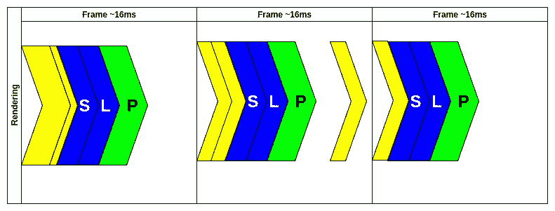
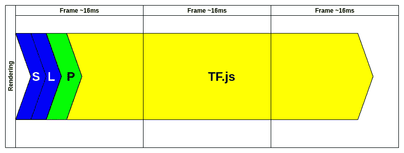
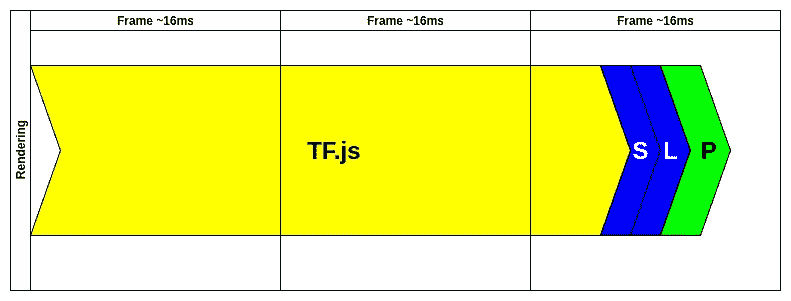
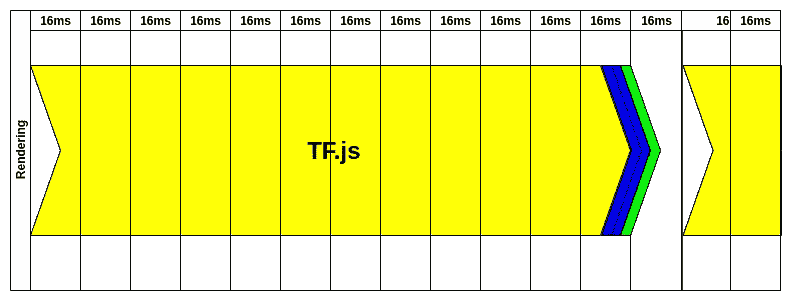
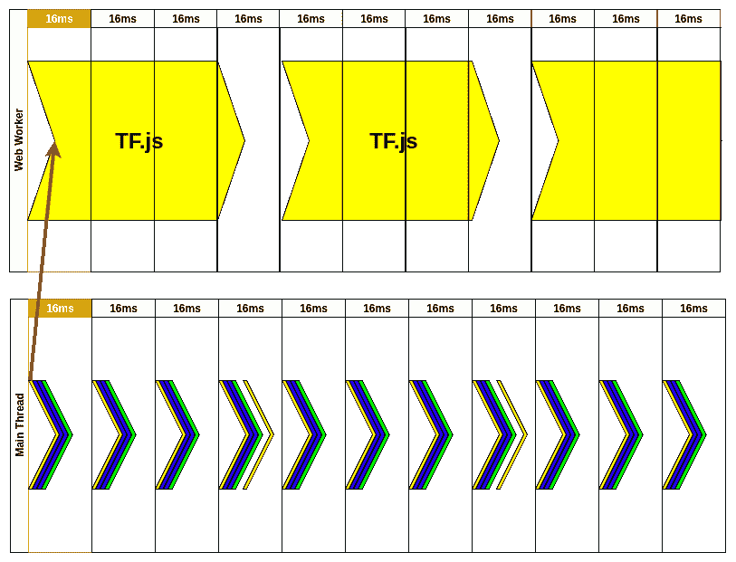
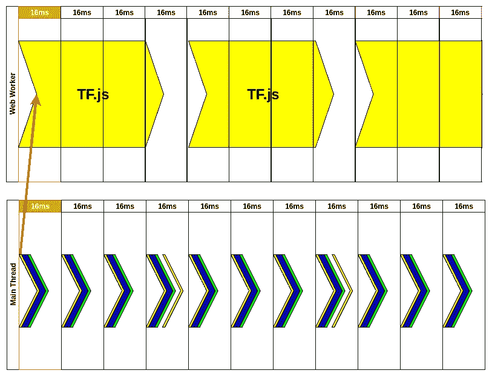
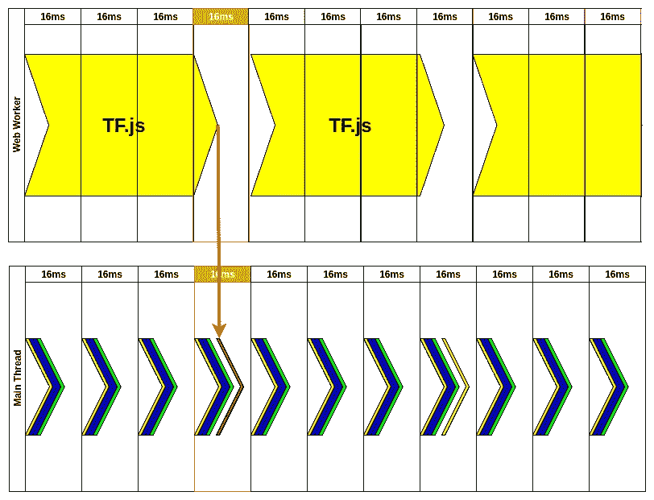
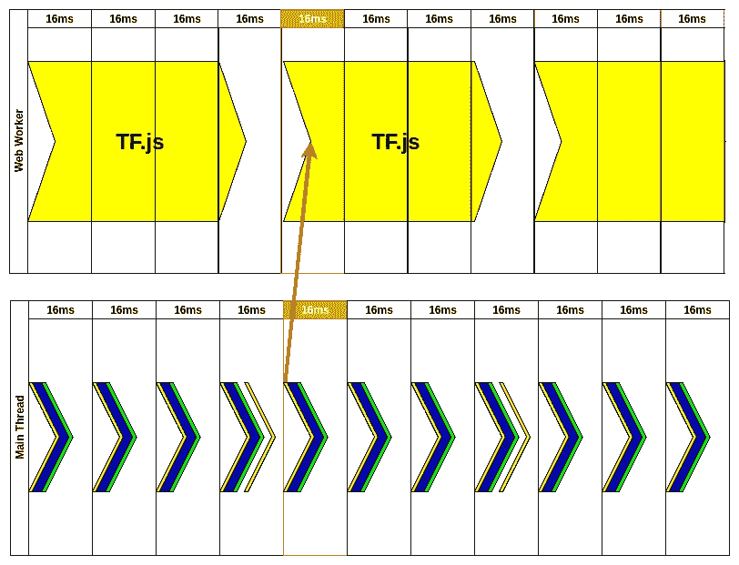

# 让 TensorflowJS 与 WebWorkers 一起更快地工作。

> 原文：<https://itnext.io/making-tensorflowjs-work-faster-with-webworkers-c356157a9d42?source=collection_archive---------9----------------------->


## 提高在 web 应用程序中运行张量流模型的性能。

# 问题

如果您曾经使用过 TensorflowJS，您可能知道通过模型运行数据(尤其是图像处理)需要很长时间。因为 JavaScript 是单线程的，这给站点响应带来了巨大的问题。每当 sth 阻塞主线程，用户就无法与你的网站进行交互。你能做些什么来解决这个问题呢？答案很简单，使用 WebWorker 运行您的模型。

# 事件循环

[事件循环](https://html.spec.whatwg.org/multipage/webappapis.html#event-loops)负责执行代码，收集处理事件，执行排队的子任务。至少 [MDM 是这么说的](https://developer.mozilla.org/en-US/docs/Web/JavaScript/EventLoop) …

> 我不会花太多时间来描述它是如何工作的，但是如果你感兴趣，可以看看 [Jake Archibald 在 JSConf 上的演讲。亚洲](https://www.youtube.com/watch?v=cCOL7MC4Pl0)

基本上每次你在 JS 中运行某个东西，它都阻塞了主线程。你的目标是达到 60FPS(或每帧 16 毫秒)。这意味着如果主线程执行时间超过 16ms(由于样式和布局的重新计算和打印，准确的时间会稍短)，用户会注意到“延迟”。通常，浏览器会这样做:


还有 ofc。执行代码的更好方式。你可以把它批处理成 **requestAnimationFrame** 。这种方式保证了你的代码在 render 之前执行(Safari 除外:(因为 Safari 很怪异)。如果你看第二帧，你会注意到有时在 **requestAnimationFrame** 之外执行了一个“事件”。那次事件可能只是类似事件的一次点击，并不会真正影响到 UX。



# 为什么事件循环不能处理 TF 模型的执行？



通过我们的模型传递数据需要时间，很多时间。在 16 毫秒内完成是非常不可能的。在这种情况下，即使将其放入 requestAnimationFrame 也无济于事:



如果你看到这些图片，你可能会想“嗯，只是少了两帧。没什么大不了的，我们可以接受。”。如果你用小模型工作，那是真的。通常(例如图像处理)看起来像:



如果您考虑像实时对象检测这样的应用，处理一帧至少需要 65 毫秒(tiny YOLOv3)。如果你用的是更精确的型号，那就更多了(标准 YOLOv3 是 0.25 秒)。你必须记住，这些数字是在你的用户可能没有的高端计算机上获得的(作为软件开发人员，很容易忘记这一点)。

# 如何使用 WebWorker/s 修复此问题？

如果我们坚持主线程仅用于执行关键工作(用户交互、应用程序逻辑等)的规则。)我们可以将一些工作(TF 处理)卸载给 [WebWorker](https://developer.mozilla.org/en-US/docs/Web/API/Web_Workers_API/Using_web_workers) 。如果您不熟悉 workers 的概念，您可以将它们视为单独的线程(不是多线程),您可以与它们交换数据。

每个工人(可能有很多人)在单独的进程中运行，所以即使你想运行需要 0.25 秒才能完成的函数，你也不会在这段时间阻塞主应用程序。

# 工人解决方案



让我为你剖析一下那个动画。首先，我们必须初始化 web worker，但这是在制作动画之前完成的。一旦我们有了 WW，我们需要为我们的模型创建输入数据。这是在第一帧的 RAF(requestAnimationFrame)内部完成的。它可以是照相机图像提取等。



在 WW 内部，我们不关心框架。处理我们刚刚发送的数据可能需要一段时间，但没关系。那时，用户仍然可以使用网站，因为没有任何东西阻塞主线程。每次一个新的帧通过，我们都在重新打印应用程序的变化，仍然在监听来自 WW 的消息。



大约 50 毫秒后，我们的模型完成了，我们收到了来自 WW 的消息。英国皇家空军没有收到这条消息。我们在当前帧中处理它并更新状态，这样结果可以被下一个 RAF 获得。



接下来，英国皇家空军认识到有来自 WW 的新数据，因此发送新图像以供我们的模型处理将是非常棒的。“样式”、“布局”和“打印”正在更新用户应该在屏幕上看到的内容，没有延迟。

你可能会注意到我们每 64 毫秒更新一次预测。这给了我们大约 15FPS(这是远离流体运动)。用户可以在屏幕上看到，因为相机图像每帧更新一次，我们的预测每 4 帧更新一次。在等待 TF 处理我们的图像的这段时间里，这仍然比一个冻结的相机要好。

# 实施细节

> *我们将使用*[*workerize-loader*](https://github.com/developit/workerize-loader)*，它可用于 webpack，使它更容易与我们的 WW 通信。主要的区别在于，在 workerize 中，我们不必处理 WW 消息。*

你甚至不必在主线程中加载 TF，我们在那里不需要它。因为我们使用的是 **workerize-loader** ，所以我们可以导出我们的 async **getPrediction** 函数，并在主线程中使用它。

```
// get-predictions.worker.js// Import TF and Model
import '@tensorflow/tfjs';
import * as ssd from '@tensorflow-models/coco-ssd';let net;// Load our model from the web
ssd
  .load({
    base: 'lite_mobilenet_v2',
  })
  .then(model => {
    net = model;
  });// export function you want to call to get predictions
export async function getPrediction(image) {
  // check if model is loaded
  // sometime you might want to handle if function returns null
  if (!net) {
    return null;
  }// run object detection
  const result = await net.detect(image);
  const boxes = result.map(boxInfo => [
    boxInfo.bbox[0],
    boxInfo.bbox[1],
    boxInfo.bbox[0] + boxInfo.bbox[2],
    boxInfo.bbox[1] + boxInfo.bbox[3],
  ]);
  const scores = result.map(boxInfo => boxInfo.score);
  const classes = result.map(boxInfo => boxInfo.class);// return data we need to print our boxes
  return { result, boxes, classes, scores };
}
```

在 WW 代码中，我们唯一要做的事情就是在 worker 初始化时加载一个合适的模型。getPrediction 非常简单，但是我们仍然需要检查模型是否被加载，如果没有，我们可以返回 null，这样主线程就知道还没有模型。

在第 27 行，我们用我们的图像作为输入来调用 TF 模型。

```
const result = await net.detect(image);
```

之后，结果被处理并以新对象的形式返回。

负责向 WW 发送图像的代码使用 **navigator.mediaDevices** 来访问相机，然后从中获取当前帧。

```
navigator.mediaDevices
  .getUserMedia({
    audio: false,
    video: videoConstraints,
  })
  .then(stream => {
    window.stream = stream;
    webcamRef.current.srcObject = stream;
    return new Promise(resolve => {
      webcamRef.current.onloadedmetadata = () => {
        resolve();
      };
    });
  });
```

之后，我们只需将图像发送到 WW 并处理响应。

```
const predictionResults = await predict(stopDetection);const ctx = canvasRef.current.getContext('2d');
predictionResults.result.forEach(box => {
  drawBoxWithLabel(box, ctx);
});
```

你可以在这里查看全部代码(它有很多额外的功能，但核心保持不变):[https://github . com/burn piro/erdem . pl/blob/master/src/components/Detector/Detector . js](https://github.com/burnpiro/erdem.pl/blob/master/src/components/Detector/Detector.js)

> 请原谅我把所有的东西都放在一个文件里，但是我认为给一个文件的链接比在 GitHub 上导航更容易。

这里还有物体检测的例子:[https://erdem.pl/object-detection/](https://erdem.pl/object-detection/)

# 摘要

如果你在网上处理 TF，把它卸载到一个新的线程中几乎总是一个好主意。它迫使我们处理主应用程序和 WW 之间的通信，但在像 **workerize、**这样的加载器的帮助下，我们几乎可以像使用一个纯粹的函数一样使用它。

*最初发布于*[*https://erdem . pl*](https://erdem.pl/2020/02/making-tensorflow-js-work-faster-with-web-workers)*。*