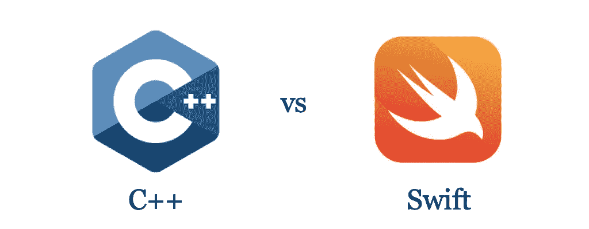
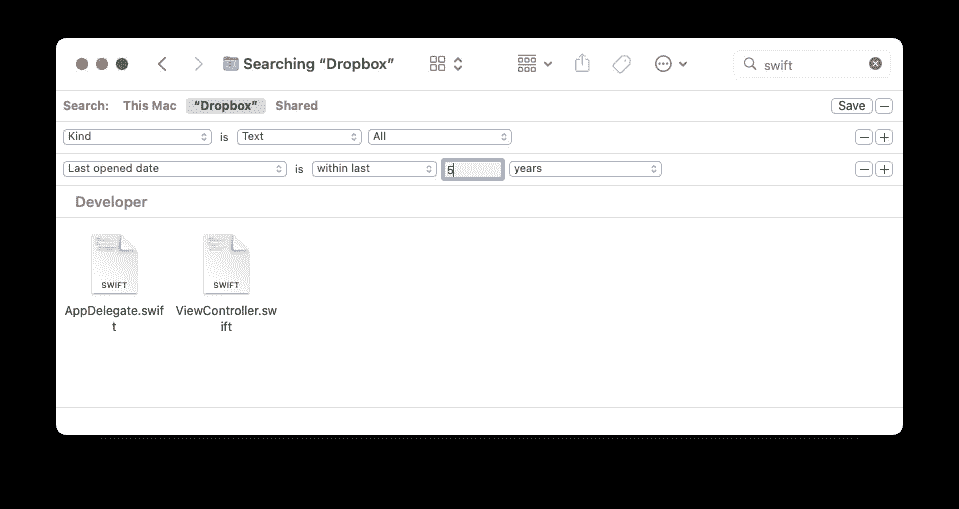
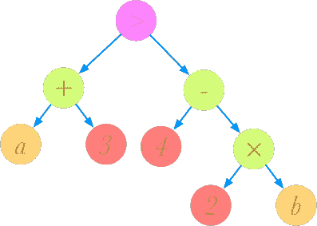
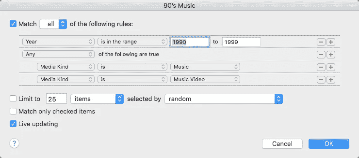
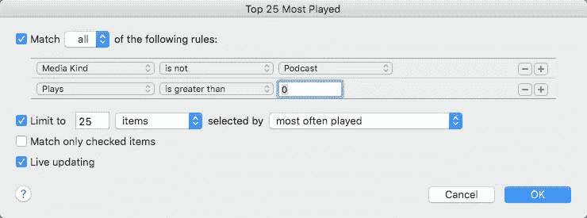
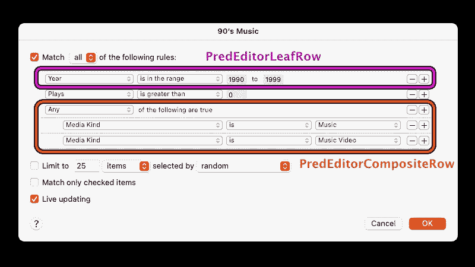
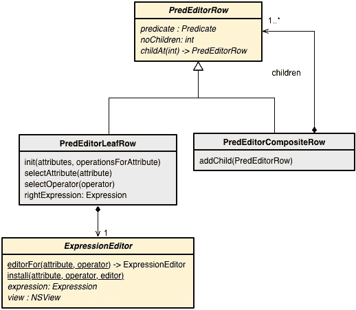
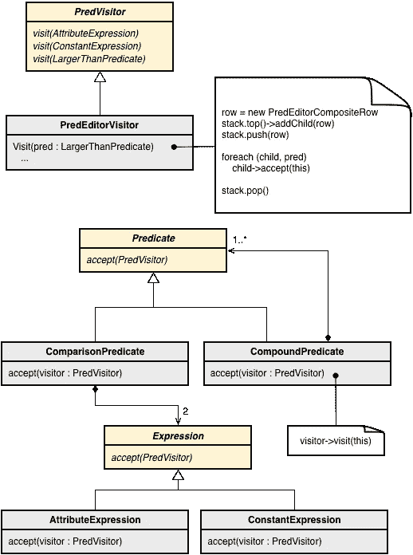

# Swift 在处理访问者模式方面优于 C++

> 原文：<https://itnext.io/making-visitor-pattern-obsolete-using-swift-c16e49a2e52f?source=collection_archive---------0----------------------->

## 通过学习 Swift 如何解决 C++软件架构中的一个常见问题，感受 Swift 的强大，这个问题没有优雅的解决方案。



作为一名 C++开发人员，我广泛使用了面向对象的设计模式。其中一种模式叫做**访客模式，**最早由[四人组](https://en.wikipedia.org/wiki/Design_Patterns)在著名的[设计模式](https://en.wikipedia.org/wiki/Design_Patterns)一书中描述。

我选择在这个故事中讲述这种模式，因为这是为什么 Swift 允许您编写比 C++更优雅、更易维护的代码的最清晰的例子之一。当我几年前写下这个故事时，我受到了一篇由 Ron Avitzur 撰写的文章的启发，这篇文章的标题是:[将图形计算器从 C++移植到 Swift](https://www.swift.org/blog/graphing-calculator/) 。

Ron 谈到他如何通过从 C++移植到 Swift 来大幅减少代码的大小:

> 最终，该端口的可维护性、可读性和紧凑性大大提高。当我移植功能的单个部分时，Swift 源代码通常只有相应 C++代码的 30%。

这篇文章的许多评论者认为 Swift 能够如此显著地减少代码量是不可思议的。我希望这个故事能让好奇的人知道这是怎么可能的。

在 C++中，访问者模式允许你解决一些棘手的问题，但是它是通过增加相当多的复杂性来实现的。为了维护代码，您或其他开发人员需要能够容易地理解代码。难读的代码比易读的代码更难维护。



macOS Finder 中使用的谓词编辑器，用于过滤文件系统中符合一组标准的文件。

我将介绍的代码示例基于我构建图形用户界面(GUI)的经验，该界面用于表示过滤对象集合的规则。macOS file manager Finder 和 iTunes 都使用这种基于规则的过滤器，称为*谓词编辑器*。

# 用谓词编辑器定义过滤器规则

谓词是返回布尔值的运算符或函数。下面是一个谓词，它用一个比较运算符组合了两个表达式:

```
a + 3 > 4 - 2b
```

在内存中，我们可以将它表示为一个对象树。这里每种颜色代表不同类别的对象或类。



表达式树表示: *a + 3 > 4 — 2b*

在 macOS 上，有许多支持通过 GUI 编辑器创建谓词的应用程序示例。iTunes 中的智能播放列表就是一个例子。



在 iTunes 中配置谓词编辑器以查找 20 世纪 90 年代发行的歌曲。

想象一下，我们想用 C++创建这样一个编辑器。因此，我们需要一个 GUI，它允许我们编写一个谓词。一旦我们得到了谓词，我们可能想要过滤 MP3 歌曲的列表，以找到可以归类为 90 年代音乐的歌曲。

我们就考虑简单点的吧。我们如何表达 25 首播放最多的歌曲的谓词？下面是 iTunes 的一种做法。



用于在 GUI 中构建谓词表达式的谓词编辑器。每一行都是一个子谓词表达式。

让我们关注其中一个子表达式，假设我们希望歌曲播放的次数大于零:

```
plays > 0
```

我们可以构建一个表达式树来表示这个表达式。表达式的每一部分都是由不同的 C++类表示的表达式树中的一个节点。例如，播放次数将是每首歌曲的属性`plays`。我们用一个`AttributeExpression`类来表示这样的属性。数字 0 由一个`ConstantExpression`类表示，以此类推。

```
// C++ code for defining an expression tree for `plays > 0`Expression *plays = AttributeExpression("plays");
Expression *zero  = ConstantExpression(0);
Predicate *pred = LargerThanPredicate(plays, zero);
playedsongs = allsongs.filter(pred);
```

所以为了使用谓词，我们处理`Expression`和`Predicate`对象。我们的目标是能够使用如前所示的图形用户界面构建这种表达式树。在这个接口中，每个子表达式都作为单独的一行来处理。我们如何用代码表示这个接口？

我们可以用一个`PredEditorRow`类来代表每一行的 GUI。然而，有许多不同种类的行。谓词可以任意嵌套，所以我们需要复合行。

让我们重温我们的第一个音乐智能列表。90 年代的音乐谓词大概是这样的:

```
1990 < year < 1999 && (mediakind == "music" || mediakind == "music video")
```

所以年份范围可以用一个`PredEditorLeafRow`来表示,“媒体种类”行必须有一个父对象，这个父对象可以是一个`PredEditorCompositeRow`。



每一行都是一个预编辑行，但是我们区分叶行和复合行。

我们用[复合设计模式](https://en.wikipedia.org/wiki/Composite_pattern)来表示谓词编辑器。这一行最右边的部分将代表我们要比较属性的某种形式的表达式。可以简单地表示为文本字段中的一个数字或字符串。但是它也可以是合法值的列表、调色板中的颜色等。因此，为了处理所需的灵活性，我们可以使用一种[策略模式](https://en.wikipedia.org/wiki/Strategy_pattern)。在我们的图表中，我们将其表示为`ExpressionEditor`。



描述用于定义谓词编辑器图形用户界面(GUI)的 C++类的 UML 图。

想象一下，每一行都指向一个表达式编辑器，可以与另一个编辑器交换。细节并不重要，因为我们主要对访问者模式的实现感兴趣。这只是给出一个大概的想法。

# 使用访问者遍历表达式树

面临的挑战是:给定一个表示谓词的对象树，我们如何将它转化为谓词编辑器的 GUI 元素树。如果我们从磁盘上读取一个谓词表示，并想为它显示一个编辑器，就会出现这个问题。

这样的对象树将不是同质的，因为它将由表达式和谓词对象组成。每个对象都有自己的子类。表达式可以细分为例如属性表达式和常数。因为它不是同质的，所以没有简单的方法以通用的方式遍历这样的结构。

这就是为什么一个访问者是有益的。我们可以设计我们的表达式和谓词类来接受类型`PredVisitor`的访问者。然后我们可以用不同的子类来构建不同类型的数据结构。例如，`PredEditorVisitor`子类可以从一个谓词构建一个 GUI，而`PredJSONVisitor`子类可以将谓词以 JSON 格式存储到磁盘。

下面的 UML 图显示了谓词类和访问者是如何相互连接的。



黄色代表抽象基类，灰色方框是具体的实现类。

在内部，`PredEditorVisitor`将需要两个堆栈来跟踪父节点，因为我们构建 GUI。对于谓词，我们首先获得顶部的父节点，因此我们必须自顶向下构建。复杂的是有不同种类的父节点。表达式节点有一个比较谓词作为父节点。而比较谓词必须有一个像 AND、OR、XOR 等复合谓词作为父节点。因此，我们维护两个不同的堆栈`compositeStack`和`leafStack`:

```
**class** PredEditorVisitor : PredVisitor {
    **virtual** void visit(AttributeExpression *exp);
    **virtual** void visit(ConstantExpression *exp);
    **virtual** void visit(LargerThanPredicate *pred);
**private**:
    Stack<PredEditorCompositeRow *> compositeStack;
    Stack<PredEditorLeafRow *> leafStack;
    MetaData *metaData; // Describe data we are filtering
}
```

每当访问者访问谓词表达式树中的一个节点时，它必须决定将创建的 GUI 组件放在哪个堆栈中。使用哪个堆栈取决于我们访问的是表达式、比较还是复合谓词。下面是一个访问*复合*谓词节点的例子:

```
**void**
PredEditorVisitor::Visit(CompoundPredicate *pred) {
    PredEditorCompositeRow *row = **new** PredEditorCompositeRow(pred);
    **if** (!compositeStack.empty())
        compositeStack.top()->addChild(row);

    compositeStack.push_back(row);
    **for** (Predicate *child: pred) {
        pred->Accept(this);
    }
    compositeStack.pop_back();
}
```

当访问一个*比较*谓词节点时，我们利用叶栈:

```
**void**
PredEditorVisitor::Visit(ComparisonPredicate *pred) {
    PredEditorLeafRow *row = new PredEditorLeafRow(
              metaData->attributes, operationsForAttribute);

    **if** (!compositeStack.empty())
      compositeStack.top()->addChild(row);

    leafStack.push_back(row)
    pred->leftExpression->accept(this)
    row->selectOperator(pred->operator)    
    pred->rightExpression->accept(this)

    leaf_stack_.pop_back();
}
```

如果我们所做的只是添加新类型的访问者，那么这种解决方案相当有效。然而，如果添加了新的谓词和表达式，那么就很难管理，因为您需要更新每个访问者。

# 使用 Swift 类扩展使访问者变得多余

我们的 C++解决方案需要使用访问者，因为我们无法预先知道我们可能想要为谓词创建什么样的 GUI，或者我们想要将其序列化为什么样的格式。我们还希望分离关注点，不要将 GUI 代码与模型代码混在一起。

有了 Swift，你可以用类扩展解决这样的问题。类扩展允许我们向现有的类添加功能。

假设我们从另一家公司购买了现成的谓词和表达式类，比如说 Translusion。即使代码是封闭源代码并且不能被修改，我们仍然可以通过类扩展为它们添加功能。现有的谓词和表达式代码将*而不是*依赖于这些新的扩展。来自 Translusion 的类不需要知道我们对它们的类所做的任何扩展。我们实现了完全脱钩。

## 使用 Swift 中的类扩展从表达式树构建谓词编辑器

让我们回顾一下 C++ visitor 解决方案中的一些案例。首先，我们看了如何使用访问者从复合谓词创建嵌套行。

使用 Swift，我们只需为每个谓词和表达式子类添加一个创建 GUI 行的方法。首先，我们要为表达式和谓词添加一个默认方法，以防我们添加了一个新的子类而忘记实现我们的 GUI 行创建代码。我们总是需要访问我们要为其创建谓词和表达式的数据的描述，因为例如，可用于字符串数据的比较运算符对于例如数字是不同的。因此，我们总是需要提供某种元数据对象。

```
**extension** Expression {
   **func** createExpressionEditor(meta: MetaData) -> ExpressionEditor {
       **var** attr = self.attribute(meta)
       **return** ExpressionEditor.editorFor(attr, attr.defaultOperator) 
   } **func** attribute(meta: MetaData) -> Attribute {
       **return** meta.defaultAttribute
   }
}

**extension** Predicate {
   **func** createPredEditorRow(meta: MetaData) -> PredEditorRow? {
       **return** nil
   }
}
```

然后，对于每个子类，我们实现代码来为特定类型的谓词或表达式创建 GUI 行。例如，让我们看看`ComparisonPredicate`:

```
**extension** ComparisonPredicate {
   **func** createPredEditorRow(meta: MetaData) -> PredEditorRow? {
       **let** row = PredEditorLeafRow(meta.attributes,
                                   meta.operationsForAttribute)
       row.selectAttribute(leftExpression.attribute(meta))
       row.selectOperator(self.operator(meta))
       row.expressionEditor = rightExpression.createExpressionEditor(meta)
       **return** row
   }
}
```

获得细节并不重要，但是让我们大致了解一下正在发生的事情:我们一次为一行创建 GUI。我们需要配置这一行，因此在左边它显示了一个下拉列表，列出了我们也将应用谓词的对象的可能属性。谓词可以应用于歌曲、电子邮件、文件或图像等对象。如果我们过滤电子邮件，那么 meta 将包含有关电子邮件对象的元数据，例如电子邮件可能具有的属性:

*   **发件人** —谁发的邮件
*   **收件人**——我们将电子邮件发送给谁
*   **主题** —邮件的主题
*   **优先级** —这封邮件有多重要

在决定哪些运算符可用于比较时，选择了哪些属性是很重要的。

重要的是看到我们如何容易地添加 GUI 特定的代码作为非 GUI 类的扩展。这并没有破坏关注点的分离，因为同一个类可以很容易地在以后重用，而没有任何 GUI 依赖性。扩展不能添加成员变量或更改现有方法的行为。

我们可以通过在它们的共享基类中实现扩展来处理所有复合谓词，如 AND、OR、XOR:

```
**extension** CompoundPredicate {
   **func** createPredEditorRow(meta: MetaData) -> PredEditorRow? {
       **let** row = PredEditorCompositeRow(pred)
       **for** childpred in self {
           row.addChild(childpred.createPredEditorRow(meta))
       }
   }
}
```

您可以看到，在迭代子谓词时，我们不需要任何类型的转换，因为编译器知道每个谓词都有一个`createPredEditorRow`，因为我们将它作为扩展添加到了`Predicate`协议中。

## 使用类扩展生成 JSON 表示

实现 JSON 序列化比重新创建 GUI 容易得多。扩展允许我们将序列化代码放在与谓词代码完全分离的文件中。

和以前一样，我们需要在基类或协议中创建 JSON 代码，这样编译器就会知道`createJSONRepresentation`对所有子类都可用。

```
**extension** Expression {
    **func** createJSONRepresentation() -> Any? {
        **return** nil
    }
}

**extension** Predicate {
    **func** createJSONRepresentation() -> Any?
        **return** nil
    }
}**extension** AttributeExpression {
   **func** createJSONRepresentation() -> Any? {
       **return** ["type" : "AttributeExpression", "name", self.name] 
}**extension** ConstantExpression {
   **func** createJSONRepresentation() -> Any? {
       **return** ["type" : "ConstantExpression", "value", self.value] 
}**extension** ComparisonPredicate {
   **func** createJSONRepresentation() -> Any? {
       **return** 
          ["type" : "ComparisonPredicate",
       "operator" : self.comparisonOperator,
"leftExpression"  : self.leftExpression.createJSONRepresentation(),
"rightExpression" : self.rightExpression.createJSONRepresentation()]
   } 
}
```

# 结论

诚然，谓词编辑器的例子可能不容易理解。但是这强调了另一个事实，即解决这类问题是相当复杂的，当你需要依赖访问者模式时，它们会变得更加复杂。因为 Swift 支持类扩展，功能是第一类的等等，许多常见的设计模式消失了或者变得无关紧要。这是件好事。设计模式从根本上说是一种语言气味。它们指出了需要发明设计模式的语言中缺乏的特性。