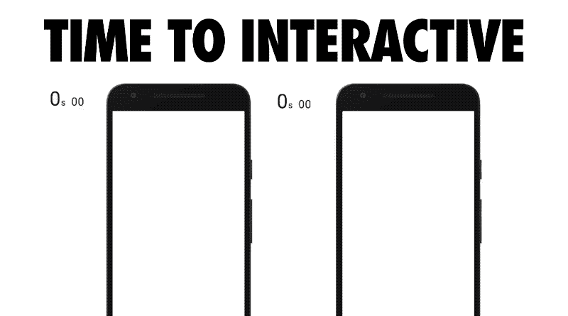
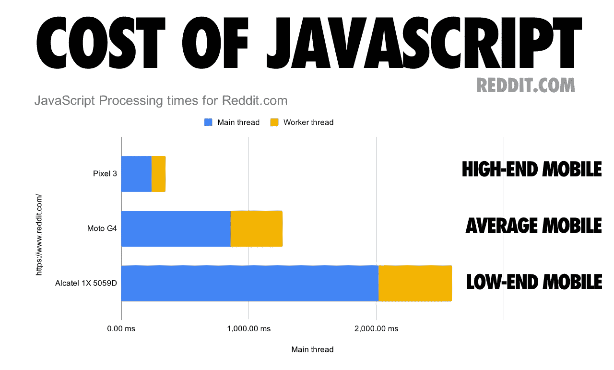

# 作为移动网络专家让网络变得更好

> 原文：<https://itnext.io/making-web-better-as-a-mobile-web-specialist-834275cb67e6?source=collection_archive---------4----------------------->

来源:[网络年鉴—手机网](https://almanac.httparchive.org/en/2019/mobile-web)

在 JavaScript 框架之争和讨论为什么我们作为 web 开发人员*大多*未能提供一个健康的 web 的边缘，**重温构建网站的基本原则，不仅看起来很棒，而且在移动设备上性能更好** 对开发人员和企业来说变得更加重要。

web 浏览器是当今开发人员最广泛使用的部署平台。它自然会安装在每一部智能手机、平板电脑、笔记本电脑、台式机以及介于两者之间的任何其他形式的电脑上。在过去的几年里，已经研究了累积的行业增长预测[，到 2025 年大约有超过 380 亿台联网设备](https://www.statista.com/statistics/802690/worldwide-connected-devices-by-access-technology/)——每台设备都有浏览器，至少有 WiFi 或蜂窝连接，或者两者都有。不管它们的版本或操作系统如何，每台设备都将至少有一个浏览器，它本身每天都在获得更多的功能，一些值得注意的是 PWA，WebVR，WebAssembly 等。

根据 2019 年 7 月的 [Akamai mPulse](https://developer.akamai.com/akamai-mpulse-real-user-monitoring-solution) 数据，今天，移动占所有搜索的 59%和所有网络流量的 58.7%。这是人们体验网络的主要方式，而不是像 15 年前那样的第二个想法。那么，考虑到移动设备的重要性，我们能为访问者提供什么样的体验呢？我们错在哪里？

# 有什么问题？

许多开发者和企业陷入的陷阱是，假设他们的用户通过永久互联网接入在最新规格的高端移动设备上使用他们的产品。我们在微优化的讨论中迷失了自己，以至于忘记了我们的核心价值——以用户为中心。

## **我们的妄想**

在一个完美的世界中，我们将拥有永久的互联网接入，每个人都将拥有一台配备最新 CPU 和内存硬件的超高速移动设备。可惜，这不是一个完美的世界。

“交互时间的可视化突出显示了一个糟糕的加载体验如何让用户认为他们可以实现一个目标，而事实上，页面还没有完成加载所有必要的代码。”—Addy Osmani "[2018 年 JavaScript 的成本](https://medium.com/@addyosmani/the-cost-of-javascript-in-2018-7d8950fbb5d4)

我们*必须*维护使用低端移动设备的用户**、在世界各地漫游的用户、在数据覆盖区域之外旅行的用户**、在咖啡馆使用不良本地 WiFi 的用户**作为我们主要目标受众的用户*。*******

**************

*******“Reddit 的 JavaScript 在几个不同设备类别(低端、普通和高端)上的成本”—Addy Osmani & Mathias Bynens "[2019 年 JavaScript 的成本](https://v8.dev/blog/cost-of-javascript-2019)"*******

> *******如果只有用户的网络和硬件可以处理，通过逐步添加高端功能，我们可以向所有用户提供快速核心体验，并使我们的产品比以往任何时候都更容易访问。*******

## *******低估了一个核心价值——以用户为中心*******

*******我们倾向于迷失在关于微观优化的讨论中，将事情过于复杂化，以至于在向世界交付产品时忘记了我们的主要目标。*******

*******当你过度复杂最简单的任务时*******

*******我们很容易成为特定技术或框架的粉丝，并且我们几乎忘记了我们网站最重要的因素——用户！*******

*******为我们所有的用户建立友好的、可访问的和快速的用户体验应该是我们业务的核心。当我们把这个目标放在我们的商业和文化的中心时，*我们用来交付界面的技术就变得过时了*，只要它对我们所有的用户表现良好。*******

*******所以，请不要再取笑那些使用 jQuery 为网页引入交互性的开发者和网站了。它仍然是有史以来最受欢迎的 JavaScript 库，根据 [WebAlmanac](https://almanac.httparchive.org/en/2019/javascript) 的数据，85.03%的桌面页面和 83.46%的移动页面使用它。虽然有许多浏览器 API 和方法可以将该库提供的大部分功能替换成本机形式，如 [Fetch](https://developer.mozilla.org/en-US/docs/Web/API/Fetch_API) 和 [querySelector](https://developer.mozilla.org/en-US/docs/Web/API/Document/querySelector) ，但它可能仍然非常适合您的下一个移动 web 应用程序。以 Booking.com 为例，它仍然在自己的主页上使用 jQuery，并且是加载速度最快的电子商务网站之一。*******

> *******用户并不关心你是否使用了最新的技术趋势或者帮助你进行微优化的技术，即使这并不是必需的。用户关心的是它是否能工作，是否能快速工作。*******

# *******绩效作为一种文化*******

*******网络的规模为我们带来了数十亿台联网设备和庞大的在线服务用户群，以及对高性能网络应用的高需求。正如在与性能相关的书籍、演讲和文章中多次提到的，**速度的确是一个特征**。对于一些企业来说，这是**的**特征。*******

*****有像 [SpeedCurve](https://speedcurve.com/) 这样的在线服务，它将你的网站与你的竞争对手进行比较，将网页性能与用户体验联系起来，测量你最重要的内容何时呈现，并跟踪网页性能对你的业务指标的影响。*****

*****如果你不把绩效文化带入你的核心业务，你可能会像 Vox 几年前做的那样宣布绩效破产。*****

**********

*****Verge 及其竞争对手的性能指标比较*****

> *****表现好是每个人的责任；从设计师到开发人员，从运营到广告，到编辑等等。*****
> 
> *****如果我们做得好，每个人都会更加了解他们的决策如何影响我们平台的整体性能。*****
> 
> *****— [宣布表演破产](https://product.voxmedia.com/2015/5/6/8561867/declaring-performance-bankruptcy)作者丹·奇尔顿*****

*****正如 Vox 的公开声明所言，我们都有责任将绩效文化带入我们组织的核心。*****

# *****PWA 优先的方法加强了移动 web 开发的最佳实践*****

*****当您构建移动应用程序时，有许多方面需要考虑。有些是你在构建桌面网站时可能从未考虑过的。*****

*****[Gartner 最近发表了一篇文章](https://www.forbes.com/sites/forbestechcouncil/2019/11/26/building-a-mobile-app-for-your-business-consider-these-12-factors-first/)，其中福布斯技术委员会讨论了企业在开发移动应用时应该注意的 12 个关键要素。作为一名 PWA 的传播者，看到“**渐进式网络应用的进步**”一节建议考虑渐进式网络应用(PWA)而不是本地应用，我并不感到惊讶。*****

> *****考虑渐进式网络应用程序(pwa)而不是本地应用程序。pwa 越来越受欢迎，因为它们创造了更好的用户体验。它们体积更小，加载更快，更安全，用户可以像从应用商店下载应用一样访问它们。一些已经转向成本效益型公共福利机构的行业包括金融服务、医疗制造、建筑和其他行业。 [—约翰·麦克唐纳](https://twitter.com/jpmcdon)， [ClearObject](https://www.clearobject.com/)*****

## *****什么是 PWA-first？*****

*****渐进式网络应用已经存在了一段时间，可以在移动和桌面平台上提供类似本机的应用体验。而且，类似于*移动优先*机芯，还有一种新机芯叫做 ***PWA 优先*** 。*****

*****这个想法帮助你从第一天起就建立和监控你的网站，关心许多用户和性能导向的功能，如；*****

*   *****速度*****
*   *****离线能力*****
*   *****渐进增强*****
*   *****易接近*****
*   *****无邱建动画*****
*   *****流畅的布局*****

## *****度量很重要*****

*****采用 PWA-first 方法有助于您在核心业务和开发工作流中使用度量和监控。*****

*****在针对移动优化的网站首次推出后，监控您的指标和应用程序性能至关重要。它将用户体验和满意度带入您的文化，并通过及时改进来帮助整个组织进一步维护这些指标。*****

> *****组织绩效预算确保预算为所有人所有，而不仅仅是由一个群体定义。— [阿迪·奥斯马尼](https://addyosmani.com/blog/performance-budgets/)*****

*****为您的企业维持一个健康的移动网络战略；*****

*   *****了解绩效指标和预算
    [https://web.dev/performance-budgets-101/](https://web.dev/performance-budgets-101/)*****
*   *****为你的网站引入预算，无论是基于规则还是基于数量的指标
    [https://developers . Google . com/web/tools/light house/audits/budgets](https://developers.google.com/web/tools/lighthouse/audits/budgets)
    [https://web.dev/your-first-performance-budget/](https://web.dev/your-first-performance-budget/)*****
*   *****将 lighthouse 整合到你的 CI 中，可以自己动手，也可以使用像 [Calibre](https://calibreapp.com/) 这样的服务*****
*   *****通过使用像 [SpeedCurve](https://speedcurve.com/) 这样的服务来监控你的指标*****
*   *****将您的网站与竞争对手的监控服务进行对比*****

# *******改善网络的举措*******

*****谷歌通过提高意识、引入开源工具和库、帮助社区开发人员关系团队、引入网络博客和认证计划，在改善网络方面投入巨大。*****

*****由谷歌工程师推动的社区贡献的一些很好的例子是:*****

*   *****[网络年鉴](https://almanac.httparchive.org/en/2019/)*****
*   *****[网络开发博客](https://web.dev/)*****
*   *****[V8 开发博客](https://v8.dev/blog/)*****
*   *****[网络基础](https://developers.google.com/web/fundamentals)*****
*   *****[自适应加载](https://dev.to/addyosmani/adaptive-loading-improving-web-performance-on-low-end-devices-1m69)*****
*   *****[轨道型号](https://developers.google.com/web/fundamentals/performance/rail)*****

*****除了这些令人敬畏的资源，谷歌还创建了一个名为“移动网络专家”的认证项目，在这个项目中，它认可展示移动网络开发专业知识的开发者。这是前端世界中为数不多的认证之一。*****

**********

*****您可以通过参加以下考试成为移动网络专家—[https://developers . Google . com/certification/Mobile-Web-Specialist](https://developers.google.com/certification/mobile-web-specialist)*****

*****除了认证，我相信这是一个伟大的倡议，以提高建立一个健康的网络意识。对人们来说，这是一种象征，表明他们关心一个健康的网络，他们有技能和专业知识让网络变得更好。*****

# *****我们如何帮助您自助？*****

*****我们在 [LINKIT](https://www.linkit.nl/) 建立了一个名为[移动网络专家训练营](https://mobilewebcourse.linkit.nl/)的为期 5 天的培训项目，以帮助开发者建立优秀的移动网站，专注于网络基础和技术，而不是框架和库。*****

***** [## LINKIT -移动网络专家训练营

### 在这个为期 5 天的培训中，你将学习构建一个高性能移动优先网站的来龙去脉。2 月 10 日至 14 日…

mobilewebcourse.linkit.nl](https://mobilewebcourse.linkit.nl/) 

它涵盖了[移动网络专家认证学习指南](https://developers.google.com/certification/mobile-web-specialist/study-guide)的主题，并通过*实践的繁重议程*向参与者传授现代网络开发实践。

它旨在让参与者最终对构建出色的移动网站体验充满信心，并帮助他们获得谷歌的移动网络专家认证。

## 我们帮助企业——雇主须知

我们帮助像您这样的经理为您的企业带来文化变革。通过投资让您的员工参加这一培训，您可以确保为您的企业构建出色的移动战略和产品。

通过投资 PWA-first，您可以确保以最少的摩擦接触到最多的人，从而降低业务风险。一些显著的案例研究显示了对业务目标的直接积极影响:

*   [Pinterest 将他们的 JavaScript 包从 2.5MB 减少到 200KB，互动时间从 23 秒减少到 5.6 秒](https://medium.com/dev-channel/a-pinterest-progressive-web-app-performance-case-study-3bd6ed2e6154)。收入增长了 44%，注册人数增长了 753%，[移动网络每周活跃用户增长了 103%](https://medium.com/@Pinterest_Engineering/a-one-year-pwa-retrospective-f4a2f4129e05) 。
*   [AutoTrader 将其 JavaScript 包的大小减少了 56%，其页面的交互时间减少了约 50%](https://engineering.autotrader.co.uk/2017/07/24/how-we-halved-page-load-times.html) 。
*   [Nikkei 将其 JavaScript 包大小减少了 43%,交互时间缩短了 14 秒。](https://youtu.be/Mv-l3-tJgGk?t=1967)
*   更多案例研究请访问[谷歌开发者博客](https://developers.google.com/web/showcase/tags/progressive-web-apps)和 [PWAStats](https://developers.google.com/web/showcase/tags/progressive-web-apps)

## 我们帮助开发人员—员工注意

我们帮助像您这样的开发人员专注于业务目标和用户体验，而不是技术趋势。我们将 web 基础和原生浏览器功能放在框架和库的顶部，因此选择哪个方向由您决定。

通过参加 LINKIT 的移动网络专家培训来投资自己，你就可以确保自己能够跟上最佳实践，打造一个让世界各地的访问者都满意的网站体验。

我们创建了一个校友社区，在这里我们可以交流思想，互相提问，分享我们认为对该主题有用的资源，这些资源来自和流向由志同道合的人(如您)建立的社区。***** 

*****如果您对认证或我们的培训项目有任何问题或意见，请随时在 [Twitter](https://twitter.com/onderceylan) 或 [LinkedIn](https://www.linkedin.com/in/onderceylan/) 上给我发短信。*****

*****我们热爱网络，我们押注于网络，让我们一起让它变得更好！*****