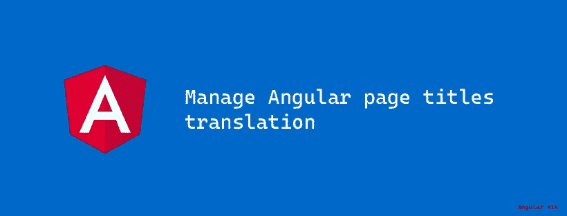
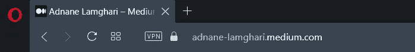

# 管理角度页面标题翻译

> 原文：<https://itnext.io/manage-angular-page-titles-translation-d1384bbede86?source=collection_archive---------2----------------------->

## 使用简化的页面标题功能翻译页面标题！



Angular v14.1 来了！！

2022 年 6 月初，Angular 团队宣布发布 Angular v14。这个版本带来了一些很酷的特性，比如:独立组件、类型化表单等等(在这篇[文章](https://blog.angular.io/angular-v14-is-now-available-391a6db736af)中了解新特性)。

在本文中，我将讨论如何使用 Angular 中的一个新特性来管理页面标题翻译: **Streamlined page title** 。



中等个人资料页面标题

## **精简页面标题(**内置[标题策略](https://angular.io/api/router/TitleStrategy))

这个超级酷的功能使得管理页面标题变得更加容易。要为页面添加标题，只需使用新的 [**路线**](https://angular.io/api/router/Routes) 属性' ***标题*** '，Angular 就会变魔术了！

这里有一个例子说明它是如何工作的:

在本例中，Angular-[*title strategy*](https://angular.io/api/router/TitleStrategy)-将在基于*主*路由器出口成功从一个页面导航到另一个页面后设置页面标题。

> 如果你想为你的页面标题定义一个前缀，你可能需要覆盖 TitleStrategy。

## 翻译页面标题:

如果你的应用程序是多语言的，你也需要翻译页面的标题。在这一段中，我将告诉你如何做到这一点:

为了翻译这个应用程序，我将使用 [ngx-translate](https://github.com/ngx-translate) 库。

```
npm install @ngx-translate/core @ngx-translate/http-loader
```

我将把应用程序翻译成 3 种语言，所以我将创建 3 个翻译文件；每种语言一个:

en.json

```
{
  "TOOLBAR": {
    "WELCOME": "Welcome",
    "PAGE_1": "Page 1",
    "PAGE_2": "Page 2"
  },
  "PAGE_1": {
    "TITLE": "Page title 1"
  },
  "PAGE_2": {
    "TITLE": "Page title 2"
  }
}
```

json 神父

```
{
  "DEFAULT_TITLE": "Home",
  "TOOLBAR": {
    "WELCOME": "Bienvenue",
    "PAGE_1": "Page 1",
    "PAGE_2": "Page 2"
  },
  "PAGE_1": {
    "TITLE": "Titre de la page 1"
  },
  "PAGE_2": {
    "TITLE": "Titre de la page 2"
  }
}
```

ar.json

```
{
  "TOOLBAR": {
    "WELCOME": "مرحبا",
    "PAGE_1": "الصفحة 1",
    "PAGE_2": "الصفحة 2"
  },
  "PAGE_1": {
    "TITLE": "عنوان الصفحة 1"
  },
  "PAGE_2": {
    "TITLE": "عنوان الصفحة 2"
  }
}
```

如何使用 ngx-translate lib 我就不赘述了，如果你不熟悉，我推荐你这篇很棒的文章:[Angular+@ ngx-translate+Typings](https://betterprogramming.pub/angular-ngx-translate-typings-816eb4b5d92)作者[卡洛斯·卡瓦列罗](https://medium.com/u/2065d5fbfedc?source=post_page-----d1384bbede86--------------------------------)。

要翻译页面标题，我们必须覆盖页面标题的角度行为(title strategy)；通过创建一个 CustomPageTitleStrategy 类，该类将获取标题翻译关键字并设置正确的翻译标题。

要覆盖 TitleStrategy，我们只需将它添加到 app.module providers:

```
{ provide: TitleStrategy, useClass: CustomPageTitleStrategy }
```

最后，我们需要编辑路由中的标题:因此，我们将使用标题翻译关键字代替页面标题，如下所示:

下面是一个演示项目:[https://angular-page-title-translate . stack blitz . io](https://angular-page-title-translate.stackblitz.io)

Github 上的项目:

[https://github . com/adnanelamghari/angular-page-title-translate](https://github.com/adnanelamghari/angular-page-title-translate)