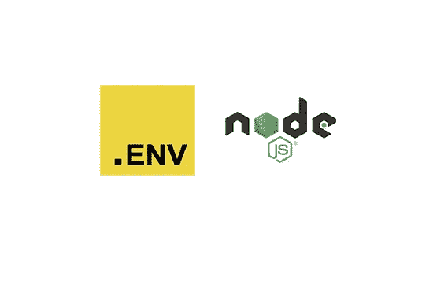
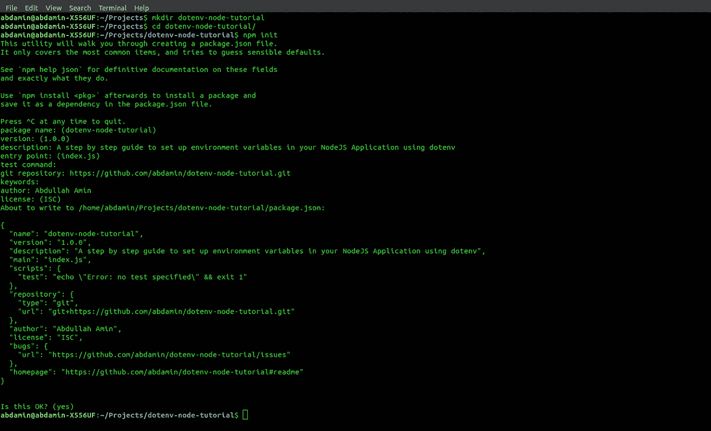
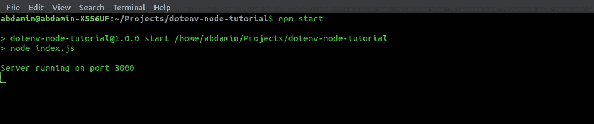
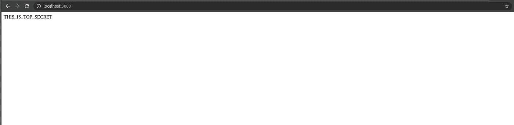

# 用 dotenv 管理 NodeJs 应用程序中的环境变量

> 原文：<https://itnext.io/manage-environment-variables-in-your-nodejs-application-with-dotenv-520914a9254b?source=collection_archive---------1----------------------->



在 web 开发生涯的某个阶段，您可能需要配置您的应用程序，以便它可以在不同的环境中工作。您也可以使用需要 API 凭证、OAuth 令牌或 SSH 密钥才能访问的第三方资源。然而，在源代码中公开这些凭证或者将它们提交到版本控制中是违反约定的，原因您很清楚！这就是使用环境变量的方便之处。应用程序所需的敏感信息或特定于平台的信息可以存储在本地的环境变量中。

# 什么是 dotenv？为什么要用 dotenv？

[**Dotenv**](https://www.npmjs.com/package/dotenv) 是一个模块，我们将使用它来访问应用程序中的环境变量。当一个 **NodeJs** 应用程序运行时，它会注入一个名为[**process . env**](https://nodejs.org/docs/latest/api/process.html#process_process_env)**的全局变量，该变量包含关于应用程序运行的环境状态的信息。[**Dotenv**](https://www.npmjs.com/package/dotenv)**将允许我们加载我们存储在**中的环境变量。env** 文件变成 [**process.env**](https://nodejs.org/docs/latest/api/process.html#process_process_env) 。注意，在运行 **NodeJs** 应用程序时，您也可以通过终端传递环境变量；然而，当您在处理一堆变量时，通过终端传递环境变量会变得很糟糕！****

# ****概观****

****今天，我们将使用 **Express** 实现一个基本的 **NodeJs** 服务器，并使用环境变量来配置它。我们将把我们的**端口**和 **APP_SECRET** 存储在**中。env** 文件，并使用 [**dotenv**](https://nodejs.org/docs/latest/api/process.html#process_process_env) 模块将其加载到[**process . env**](https://nodejs.org/docs/latest/api/process.html#process_process_env)**中。然后，我们将在代码中访问这些变量，以成功运行环境指定的应用程序。******

# ******NodeJs 项目设置******

******在一个单独的文件夹中，运行 **npm init** 来设置 NodeJs 项目。******

********

****使用 **npm 初始化**的 NodeJS 应用设置****

## ****项目相关性****

****我们将在 NodeJs 应用程序中使用一组依赖项。从项目的根目录在终端中运行以下命令:****

```
**npm i express dotenv**
```

******快递**将帮助我们设置我们的服务器。我们将使用 [**dotenv**](https://nodejs.org/docs/latest/api/process.html#process_process_env) 模块从**加载环境变量。env** 文件变成[**process . env**](https://nodejs.org/docs/latest/api/process.html#process_process_env)**。******

## ****package.json 中的安装启动脚本****

****用下面的脚本替换 **package.json** 中的现有脚本，这样我们就可以运行我们的应用程序 **:******

```
**"start": "node index.js"**
```

****package.json 文件****

## ****中设置环境变量。环境文件****

****创建一个**。在终端中运行以下命令，将 env** 文件放在项目的根目录下:****

```
**touch .env**
```

****我们将通过设置**中的**端口**和 **APP_SECRET** 变量来指定我们的服务器监听的端口和我们的 app secret。env** 文件。****

```
PORT=3000
APP_SECRET="THIS_IS_TOP_SECRET"
```

## **设置初始服务器入口点:index.js**

**在终端从项目根目录运行以下命令，创建 **index.js** 文件:**

```
touch index.js
```

## **将环境变量加载到 process.env**

**在 **index.js** 文件的顶部添加以下行，以从**加载环境变量。env** 文件转换成[文件 **process.env** 文件](https://nodejs.org/docs/latest/api/process.html#process_process_env):**

```
const dotenv = require("dotenv");
dotenv.config();
```

**注意，建议在应用程序代码中尽早添加这些行**。****

## **访问环境变量**

**我们将从我们的 **index.js** 文件中访问我们的**端口**和 **APP_SECRET** 加载到 [**process.env**](https://nodejs.org/docs/latest/api/process.html#process_process_env) 中，如下所示:**

```
const MY_PORT = process.env.PORT;
const MY_APP_SECRET = process.env.APP_SECRET;
```

# ****设置快捷应用****

**如果你以前使用过 **Express** ，这应该看起来很简单。您可以查看 **Express** [文档](https://expressjs.com/en/5x/api.html)，获取如何设置端点的详细说明。我们将创建一个基本端点，它将返回我们从环境变量中访问的 **APP_SECRET** 。此外，服务器将监听由我们的环境变量指定的端口。**

```
const express = require("express");
const app = express();app.get("/", (req, res) => { return res.send(MY_APP_SECRET);}); app.listen(MY_PORT, () => console.log(`Server running on port ${MY_PORT}`))
```

**最终索引. js**

# **运行应用程序**

**您可以在终端中运行以下命令，使用来自 **package.json 的启动脚本来运行 web 服务器:****

```
npm start
```

****

**npm 在终端上启动**

****

**localhost:浏览器上的 3000**

**正如预期的那样，我们的服务器运行在环境指定的端口上，并返回配置好的 APP_SECRET。**

# **补充。环境到。gitignore**

**请注意，不建议将环境变量提交给版本控制，因为它可能包含机密或特定于环境的信息。**

**创建一个**。gitignore 应用程序根目录中的**文件:**

```
touch .gitignore
```

**将以下文本添加到**中。gitignore** 文件**

```
.env
```

# **结论**

**值得注意的是，我们在本教程中仅仅触及了皮毛，环境变量还有很多用途！这是 [**链接**](https://github.com/abdamin/dotenv-node-tutorial) 到 **Github** **存储库**，包含我们应用程序的完整代码。**

**如果您有任何问题，请随时发表评论。此外，如果这帮助了你，请喜欢并与他人分享。我定期发表与 web 开发相关的文章。考虑 [**在这里输入你的电子邮件**](https://abdullahsumsum.com/subscribe) 来获得与 web 开发相关的最新文章和教程。你也可以找到更多关于我在 abdullahsumsum.com 做什么的信息**