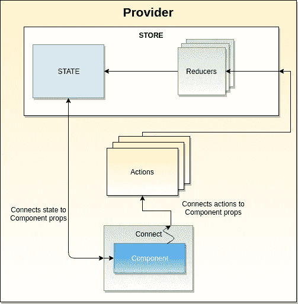
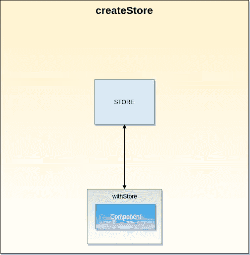
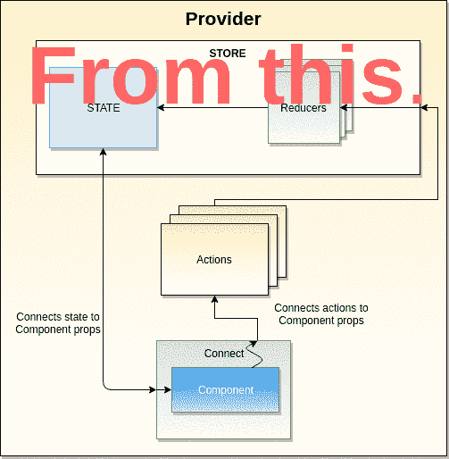

# 管理无冗余的反应状态

> 原文：<https://itnext.io/manage-react-state-without-redux-a1d03403d360?source=collection_archive---------0----------------------->

## 如何更容易更漂亮地使用 React Context API？

*免责声明*:我在制作中使用 *Redux* 和 *React* ，我对此相当满意。

## TL；DR；

你真差劲！你只是想要代码，但是如果你很着急，下载 [repo](https://github.com/Spyna/react-store) 或者在你的项目中安装 [npm 库](https://www.npmjs.com/package/@spyna/react-store)。

到本文结束时，您将学会如何以一种快速简单的方式在 React 应用程序的一个组件和另一个组件之间读取、写入和删除数据。


如果你的应用程序存储像这样混乱，请继续阅读。每篇文章都有一张照片，所以我需要用 [chuttersnap](https://unsplash.com/@chuttersnap?utm_source=medium&utm_medium=referral) 在 [Unsplash](https://unsplash.com?utm_source=medium&utm_medium=referral) 上添加这张照片

> 编辑 2019 年 11 月
> 
> 我用 React Hooks 发布了这个故事的一个版本，它更加现代和更新。请点击此链接阅读:

[](https://medium.com/swlh/react-global-state-with-hooks-f163e49f90f9) [## 用钩子和上下文反应全局状态

### 使用钩子和上下文 API 管理 React 应用程序全局状态的解决方案。

medium.com](https://medium.com/swlh/react-global-state-with-hooks-f163e49f90f9) 

# 介绍

几周前我用 React 启动了一个项目，我不想用 Redux，因为这个项目很小。如果你想知道我不想使用 redux 的原因，让我们看看它的架构和流程。

## Redux

如果你熟悉 redux，就跳过这一节，那个 a 对你来说可能听起来有点枯燥。



冗余组件

在 redux 中，您必须设置和维护:

*   [**提供者**](https://github.com/reduxjs/react-redux/blob/master/docs/api/Provider.md#overview):`<Provider />`使 Redux `store`对任何已经被包装在`connect()`函数中的嵌套组件可用。
*   [**连接**](https://github.com/reduxjs/react-redux/blob/master/docs/api/connect.md#overview) :函数`connect()`将一个 React 组件连接到一个 Redux 存储。
*   [**中间件**](https://redux.js.org/advanced/middleware#middleware) :中间件提供了一个第三方的扩展点，从调度一个动作，到它到达 reducer 的时刻。
*   [**动作**](https://redux.js.org/basics/actions#actions) **:** 动作是将数据从应用程序发送到商店的有效信息负载。他们是商店唯一的信息来源。您使用`[store.dispatch()](https://redux.js.org/api/store#dispatch)`将它们发送到商店。
*   [**reducer**](https://redux.js.org/basics/reducers#reducers):reducer 指定应用程序的状态如何变化，以响应[发送到商店的](https://redux.js.org/basics/actions)动作。记住动作只描述了发生了什么，而没有描述应用程序的状态是如何变化的。

更不用说你还得用`[createStore](https://redux.js.org/api/createstore#createstorereducer-preloadedstate-enhancer)`创建 redux Store，用`[combineReducers](https://redux.js.org/api/combinereducers#combinereducersreducers)`、`applyMiddlewares`串联 redux，比如 *redux-thunk。*然后你必须`connect`你的*组件*与状态和动作，使用`mapStateToProps`、`mapActionsToProps`，有时使用`mapDispatchToProps`。

这意味着，如果你决定在周二早上在你的项目中使用 redux，你将会花一上午的时间来设置它。如果您已经在另一个项目中使用了 redux，也许您可以节省一些复制/粘贴代码的时间，并在几个小时内开始工作。

接下来，您必须决定哪个是放置业务逻辑的最佳位置:组件？行动？减速器？中间件？

三个月后，当你发现应用程序中的一个 bug 并重新打开代码库时，你必须记住那个缩减器做了什么，以及为什么状态没有像预期的那样改变。

这不是吓唬你，只是我的经验😃。

# 我们想做什么

本文的目标是找到一种方法来降低(双关语)我们的应用程序的复杂性。下图是我们想要实现的最终架构的剧透。



一种更简洁的管理应用状态的方式

## 回到介绍

经过以上考虑，我想到了使用 [*React 上下文 API*](https://reactjs.org/docs/context.html) 的决定。

> 上下文提供了一种通过组件树传递数据的方式，而不必在每一层手动向下传递属性。

它实现了共享一个全局*状态*(或*存储*)或任何你想叫它的东西的目标，但是我发现它非常冗长，并且不容易使用。

本文的目标是使*全局应用* *状态*管理易于使用(对于开发者而言)。您将在一个*组件*中使用`store.set(’a_key’, 'a value’)`访问全局存储，并在另一个*组件*中使用`store.get(’a_key’)`读取该值。

换句话说，我们将创建一个全局*键/值映射*来存储数据，当它的值改变时，它将重新呈现您的*组件*。

首先要做的是创建一个`Context`、`Context.Provider`和一个`Context.Consumer`。代码是:

```
import React, { Component } from 'react'const **StoreContext = React.createContext()**class MyComponent extends Component {
 **static contextType = StoreContext** //this line does the magic, binding this.context to the value of the Provider render() {
    return <div>Hello {this.context.name}</div>
  }
}const MyApp = props => (
  <div>
    <MyComponent />
  </div>
)class **AppWithContext** extends Component {
  state = { name: 'Spyna' } render() {
    return (
      **<StoreContext.Provider** ***value***={**this.state**}>
        <MyApp />
      </StoreContext.Provider>
    )
  }
}export default AppWithContext
```

CodeSandbox 上的工作代码

在这段代码中，您创建了一个 React `Context`，然后将 *MyApp 组件*包装到上下文`Provider`中，最后，您使用 `static contextType = StoreContext`将 *MyComponent* [与上下文绑定。](https://reactjs.org/docs/context.html#classcontexttype)

由于我们将`StoreContext.Provider`的*值*属性设置为`this.state`(即`AppWithContext`的状态)，当该状态发生变化时，`AppWithContext`会更新，导致其子节点的重新渲染。

为了实现这些变化，您需要一些上下文(没有双关语)方法来:*状态*中的`set`、`get`和`remove`数据。我们使用了*AppWithContext*作为提供者值，所以我们要给它添加这些方法，这翻译成代码的意思是:

```
class AppWithContext extends Component {
  state = {
    **get**: (key) => {
      return this.state[key]
    },
    **set**: (key, value) => {
      const state = this.state
      state[key] = value
      this.setState(state)
    },
    **remove**: key => {
      const state = this.state
      delete state[key]
      this.setState(state)
    }
  }...}
```

提供者*值*是`this.state`，所以我们在那里添加了我们的方法*。*您肯定注意到属性`name`不再存在于 *AppWithContext* `state`中，我们需要使用我们刚刚创建并添加到*状态*中的新鲜、新且精彩的方法来添加它。为了测试这是否有效，我们将使用`set`方法在 *MyComponent* 中设置`name`属性，并使用`get`在 render 方法中读取它。

```
class MyComponent extends Component {
  static contextType = StoreContext
  componentDidMount() {
    let context = this.context
    **context.set('name', 'Spyna')** //sets the property 'name' with the value 'Spyna'
  }

  render() {
    return <div>Hello {**this.context.get('name')**}</div>
    //reads the property 'name' from the context
  }
}
```

CodeSandbox 上的工作代码

是的，有效！

当*组件**【did mount】*时，我们调用`context.set(’name’, ‘Spyna’)`来设置*上下文*中的属性*name】*。由于*上下文*被修改，所以*组件*更新，并且当*渲染*方法被调用时，打印*【name】*的值。如果你运行这段代码，你会在屏幕上看到“*Hello Spyna”*。

这段代码看起来不像我喜欢的那样漂亮。我们想做的是让它更具有声明性，更易于使用。为了实现这个目标，我们将创建两个*高阶组件*:一个用于*上下文* `*Provider*`，另一个用于*上下文* `Consumer`。

根据 React 文档，一个 [*高阶组件*](https://reactjs.org/docs/higher-order-components.html) 是:

> 高阶组件(HOC)是 React 中重用组件逻辑的一种高级技术。本质上，hoc 不是 React API 的一部分。它们是从 React 的组合性质中出现的一种模式。
> 
> 具体地说，**高阶分量是取一个分量并返回一个新分量的函数。**
> 
> `*const EnhancedComponent = higherOrderComponent(WrappedComponent);*`

如果你想了解更多关于 HOC 的信息，请看这里。

## 商店提供者特设

```
const createStore = WrappedComponent => {
  return class extends React.Component {
    state = {
      get: key => {
        return this.state[key]
      },
      set: (key, value) => {
        const state = this.state
        state[key] = value
        this.setState(state)
      },
      remove: key => {
        const state = this.state
        delete state[key]
        this.setState(state)
      }
    }
    render() {
      return (
        **<StoreContext.Provider value={this.state}>**
          <WrappedComponent {...this.props} />
        </StoreContext.Provider>
      )
    }
  }
}
```

如果这段代码对你来说看起来很奇怪，看看没有箭头功能的版本`=>`:[https://codesandbox.io/s/l21x87543z?autoresize=1&hide navigation = 1&module = % 2 fsrc % 2f store . js](https://codesandbox.io/s/l21x87543z?autoresize=1&hidenavigation=1&module=%2Fsrc%2Fstore.js)

*函数* `createStore`返回一个组件，*呈现*在*上下文* ***提供者*** 中作为*参数*传递的任何组件。

要使用这个特设，你所要做的只是:

```
export default createStore(MyApp);
```

## 商店消费者特设

```
const withStore = WrappedComponent => {
  return class extends React.Component {
    render() {
      return (
        **<StoreContext.Consumer>**
          {context => <WrappedComponent **store**={context} {...this.props} />}
        <StoreContext.Consumer>
      )
    }
  }
}
```

*函数* `withStore`返回一个组件，*呈现*您在*上下文* ***消费者*** 中作为参数传递的任何组件。另外，它将一个名为`store`的道具注入到你的组件中，这就是*上下文*值。

现在，您可以访问上下文，执行以下操作:

```
const MyComponent = (props) => <div>{props.store.get('data')}</div>export default withStore(MyComponent)
```

## 把所有的放在一起

让我们创建一个名为`store.js`的文件，添加两个 HOC 并导出它们。

```
import React from 'react'const StoreContext = React.createContext()const **createStore** = WrappedComponent => {
  return class extends React.Component {
    state = {
      get: key => {
        return this.state[key]
      },
      set: (key, value) => {
        const state = this.state
        state[key] = value
        this.setState(state)
      },
      remove: key => {
        const state = this.state
        delete state[key]
        this.setState(state)
      }
    }
    render() {
      return (
        <StoreContext.Provider value={this.state}>
          <WrappedComponent {...this.props} />
        </StoreContext.Provider>
      )
    }
  }
}const **withStore** = WrappedComponent => {
  return class extends React.Component {
    render() {
      return (
        <StoreContext.Consumer>
          {context => <WrappedComponent store={context} {...this.props} />}
        </StoreContext.Consumer>
      )
    }
  }
}export { **createStore, withStore** }
```

最后，用下面的代码使用 HOCs，它看起来比开始时漂亮多了:

```
// MyComponent.js
import React, { Component } from 'react'
import { **withStore**} from './store';class MyComponent extends Component {
  componentDidMount() {
    this.props.store.set('name', 'Spyna')
  }render() {
    return <div>Hello {this.props.store.name}</div>
  }
}export default **withStore**(MyComponent)// App.js
import React, { Component } from 'react'
import { **createStore**} from './store'
import MyComponent from './MyComponent'
//import MyOtherWithStoreComponent from './MyOtherComponent'const MyApp = props => (
  <div>
    <MyComponent />
    {/*<MyOtherWithStoreComponent />*/}
  </div>
)export default **createStore**(MyApp)
```

## 考虑

你所做的只是管理你的应用程序状态之旅的开始。你可能想给你已经创建的`store`添加一些特性。例如，您想要:

*   设置一个**初始值**，可能是从本地存储器读取，也可能是从 API: `createStore(MyApp, initialValue)`读取。
*   如果存储中没有数据，则获取一个**默认值**:`store.get('my_key', defaultValue)`。
*   为存储方法提供**不变性**，以避免由于错误造成任何损害，例如，如果调用`store.get = () => 'hey I just broke everything'`就会破坏`get`方法。
*   **将**存储方法从它的值中分离出来:现在你可以通过`store.get(’my_key’)`或`store.my_key`从存储中访问一个值。这一点也不差，也许你想让这个行为可配置。
*   make store 方法返回一个**承诺**以便您可以使用:`store.remove(’my_key’).then(() =>{ doSomething() })`。

所有这些想法都很棒，你可能认为实现它们需要很多时间，这就是为什么我创建了项目[*react-store*](https://www.npmjs.com/package/@spyna/react-store)*它已经为你做了所有这些事情。代码库很小，如果想复制，可以看看下面链接的回购。*

*[](https://github.com/Spyna/react-store) [## Spyna/react-store

### 轻松管理 React 应用的状态。通过在…上创建帐户，为 Spyna/react-store 的发展做出贡献

github.com](https://github.com/Spyna/react-store) 

正如我在开始时所说的，我是 Redux 的粉丝，并且认为它非常有用，尤其是在处理大项目的时候。但是，我觉得在小项目里设置有点矫枉过正，不舒服。* 

*我发现使用这个库的一个问题是，除非你定义一些模式或规则，否则事情会变得有点混乱。一个例子可以更好地解释这一点:我们的状态(或存储)可以从项目中的任何*组件*修改。这意味着您可以在多个地方使用`store.set('**logged_user**', user)`或`store.get('**logged_user**')`(您也可以使用 redux 来实现这一点，只是稍微冗长一点)。让我们以这个项目结构为例:*

```
*└── src
    └── features
        ├── gallery
        ├── layout
        │   ├── footer
        │   └── **header**
        ├── **login**
        ├── navigation
        │   ├── menu
        │   └── **sideNavigation**
        └── search*
```

*`features`下的每个文件夹都包含了该项目的一个特性:*

*   **头组件*(显示用户名)使用`store.get('logged_user').`*
*   **侧边导航组件*(当你登录/退出时改变菜单项)使用`store.get('logged_user')`。*
*   *登录组件(让用户登录/退出)使用`store.set('logged_user')`。*

*重点是你必须在每个*组件*中记住你用键“`logged_user`”在商店中保存了登录的用户信息。*

*这个问题的解决方案是集中这些信息，要做到这一点，你可以创建一个`storeMap.js`文件，在这里为你在*商店*中使用的每个*键*放置一个映射。该文件将如下所示:*

```
*export default {
  LOGIN : {
    LOGGED_USER : 'login/logged_user', //who is logged
    ACCESS_TOKEN : 'login/access_token' //user token to call our API
  },
  SEARCH : {
    SEARCH_TERM : 'search/search_term', //the term you searched
    SEARCH_RESULTS : 'search/search_result', //search results
    CURRENT_PAGE : 'search/current_page' // the current page
  }
}*
```

*组件现在将使用`store.get(StoreMap.LOGIN.LOGGED_USER)`而不是`store.get('logged_user')`，即:*

*   *不容易出错:你不必写一个字符串*
*   ***集中式**:整个应用程序状态被映射到一个文件中(如果需要，可以使用导入/导出将其拆分成更多文件)*
*   *易于重构:只需从你的超级 IDE 中重命名一个键或一个值。*
*   *不言自明的:当查看这个文件时，你可以对整个应用程序的状态有一个概念*

**

*redux 和 react-store 的复杂度比较*

*恭喜你！！😎你坚持到了最后。如果你喜欢👌这篇文章，点击下面按钮👏。这对我意义重大，也有助于其他人了解这个故事。*

**更多帖子由*[*spyna*](https://medium.com/@spyna)*发布。**

*[](https://medium.com/swlh/react-global-state-with-hooks-f163e49f90f9) [## 用钩子和上下文反应全局状态

### 使用钩子和上下文 API 管理 React 应用程序全局状态的解决方案。

medium.com](https://medium.com/swlh/react-global-state-with-hooks-f163e49f90f9) [](/react-svg-radar-chart-a89d15760e8) [## 反应 SVG 雷达图

### 周围有很多库，用来创建图表，但是很多都很重。让我们看看如何建立一个…

itnext.io](/react-svg-radar-chart-a89d15760e8)*