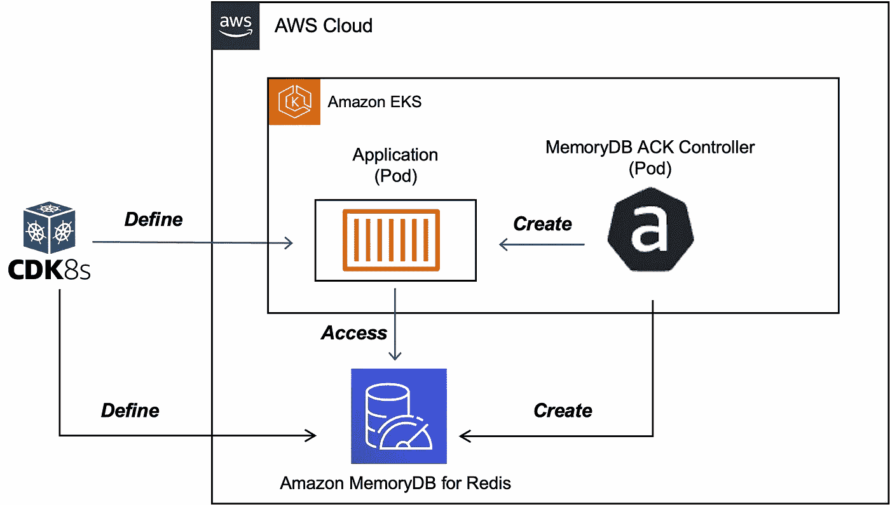
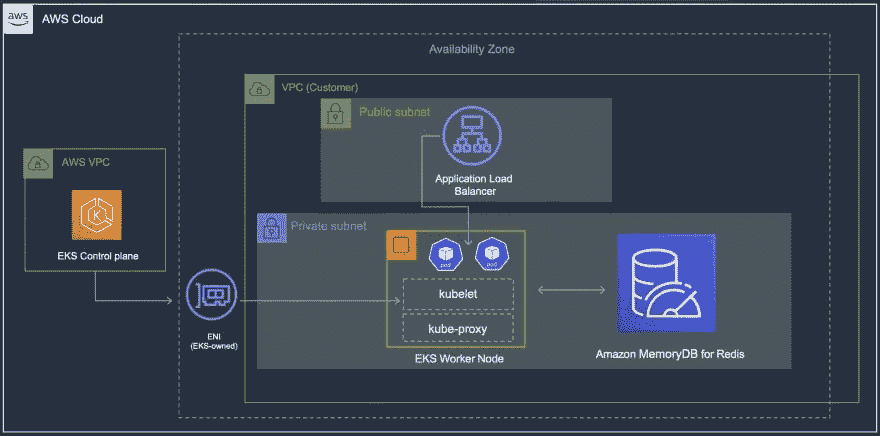

# 管理 Kubernetes 上的 Redis

> 原文：<https://itnext.io/manage-redis-on-aws-from-kubernetes-eeadba7eb889?source=collection_archive---------2----------------------->



使用 ACK 为 EKS 的 Redis 集群创建 Amazon MemoryDB

## 使用`AWS Controller for Kubernetes` 和`CDK for Kubernetes`

在这篇博文中，你将学习如何使用`ACK`和[亚马逊 EKS](https://docs.aws.amazon.com/eks/latest/userguide/what-is-eks.html) 在 AWS 上创建一个 Redis 集群(和[亚马逊 MemoryDB](https://docs.aws.amazon.com/memorydb/latest/devguide/what-is-memorydb-for-redis.html) )。

[Kubernetes 的 AWS 控制器](https://aws-controllers-k8s.github.io/community/docs/community/overview/)(也称为 **ACK** )利用 [Kubernetes 自定义资源和自定义资源定义](https://kubernetes.io/docs/concepts/extend-kubernetes/api-extension/custom-resources/#custom-resources)，让您能够直接从 Kubernetes 管理和使用 AWS 服务，而无需在集群之外定义资源。它[支持多种 AWS 服务](https://aws-controllers-k8s.github.io/community/docs/community/services/)，包括`S3`、`DynamoDB`、`MemoryDB`等。

通常情况下，您会使用 YAML 在 ACK 中定义自定义资源。但是，在这种情况下，我们将利用[cdk8s](https://cdk8s.io/docs/latest/)(Kubernetes 的云开发工具包)，这是一个开源框架(CNCF 的一部分)，允许您使用常规编程语言(而不是`yaml`)定义您的 Kubernetes 应用程序。由于`cdk8s`对 [Kubernetes 自定义资源定义](https://betterprogramming.pub/write-your-kubernetes-infrastructure-as-go-code-using-custom-resource-definitions-with-cdk8s-5d9500693e02)的支持，我们将把`MemoryDB``ACK`CRD 作为 API 导入，然后使用代码定义一个集群(为此我将使用`Go`)。

还没完呢！除了基础设施之外，我们还将关注代表将与 MemoryDB 集群连接的应用程序的应用程序。为此，我们将使用 [cdk8s-plus 库](https://cdk8s.io/docs/latest/plus/)来定义一个 Kubernetes `Deployment`(并使用`Service`来公开它)，从而构建一个端到端的解决方案。在这个过程中，你会了解到`ACK`的其他一些细微差别，比如`FieldExport`等。

> *我围绕 cdk8s 和 Go* *写了一篇* [*的几篇博文，也许你会觉得有用*](https://betterprogramming.pub/kubernetes-infrastructure-as-code-for-go-developers-cdk8s-plus-in-action-ee3eb2203745)

# 先决条件

要一步一步地学习，除了 AWS 账户，你还需要安装 [AWS CLI](https://docs.aws.amazon.com/cli/latest/userguide/getting-started-install.html) 、 [cdk8s CLI](https://cdk8s.io/docs/latest/getting-started/#install-the-cli) 、 [kubectl](https://kubernetes.io/docs/tasks/tools/#kubectl) 、 [helm](https://helm.sh/docs/intro/install/) 和 [Go 编程语言](https://go.dev/dl/)。

有很多种方法可以创建一个亚马逊 EKS 集群。我更喜欢使用 eks CTL CLI，因为它提供了方便！

# 首先，设置 MemoryDB 控制器

> *以下大部分步骤改编自* `*ACK*` *文档-* [*安装 ACK 控制器*](https://aws-controllers-k8s.github.io/community/docs/user-docs/install/)

**使用** `**Helm**` **:** 安装

```
export SERVICE=memorydb#change/update this as required [https://api.github.com/repos/aws-controllers-k8s/memorydb-controller/releases/latest](https://api.github.com/repos/aws-controllers-k8s/memorydb-controller/releases/latest)
export RELEASE_VERSION=0.0.2export ACK_SYSTEM_NAMESPACE=ack-system

# you can change the region as required
export AWS_REGION=us-east-1

aws ecr-public get-login-password --region us-east-1 | helm registry login --username AWS --password-stdin public.ecr.aws

helm install --create-namespace -n $ACK_SYSTEM_NAMESPACE ack-$SERVICE-controller \
  oci://public.ecr.aws/aws-controllers-k8s/$SERVICE-chart --version=$RELEASE_VERSION --set=aws.region=$AWS_REGION
```

要确认，请运行:

```
kubectl get crd# output (multiple CRDs)
NAME                                         CREATED AT
acls.memorydb.services.k8s.aws               2022-08-13T19:15:46Z
adoptedresources.services.k8s.aws            2022-08-13T19:15:53Z
clusters.memorydb.services.k8s.aws           2022-08-13T19:15:47Z
eniconfigs.crd.k8s.amazonaws.com             2022-08-13T19:02:10Z
fieldexports.services.k8s.aws                2022-08-13T19:15:56Z
parametergroups.memorydb.services.k8s.aws    2022-08-13T19:15:48Z
securitygrouppolicies.vpcresources.k8s.aws   2022-08-13T19:02:12Z
snapshots.memorydb.services.k8s.aws          2022-08-13T19:15:51Z
subnetgroups.memorydb.services.k8s.aws       2022-08-13T19:15:52Z
users.memorydb.services.k8s.aws              2022-08-13T19:15:53Z
```

由于控制器必须与 AWS 服务交互(进行 API 调用)，我们需要为服务帐户(也称为 **IRSA** )配置 [IAM 角色。](https://docs.aws.amazon.com/eks/latest/userguide/iam-roles-for-service-accounts.html)

> *详见* [*配置 IAM 权限*](https://aws-controllers-k8s.github.io/community/docs/user-docs/irsa/)

***IRSA 配置***

*首先，为您的群集创建一个 OIDC 身份提供者。*

```
*export EKS_CLUSTER_NAME=<name of your EKS cluster>
export AWS_REGION=<cluster region>eksctl utils associate-iam-oidc-provider --cluster $EKS_CLUSTER_NAME --region $AWS_REGION --approve*
```

*目标是创建一个 IAM 角色并通过策略附加适当的权限。然后，我们可以创建一个 [Kubernetes 服务帐户](https://kubernetes.io/docs/tasks/configure-pod-container/configure-service-account/)，并为其附加 IAM 角色。因此，控制器`Pod`将能够进行 AWS API 调用。注意，我们通过`arn:aws:iam::aws:policy/AmazonMemoryDBFullAccess`策略向我们的控件提供所有的`DynamoDB`权限。*

*多亏了`eksctl`，这一点只用一行就能做到！*

```
*export SERVICE=memorydb
export ACK_K8S_SERVICE_ACCOUNT_NAME=ack-$SERVICE-controller# recommend using the same name
export ACK_SYSTEM_NAMESPACE=ack-system
export EKS_CLUSTER_NAME=<enter EKS cluster name>
export POLICY_ARN=arn:aws:iam::aws:policy/AmazonMemoryDBFullAccess# IAM role has a format - do not change it. you can't use any arbitrary name
export IAM_ROLE_NAME=ack-$SERVICE-controller-roleeksctl create iamserviceaccount \
    --name $ACK_K8S_SERVICE_ACCOUNT_NAME \
    --namespace $ACK_SYSTEM_NAMESPACE \
    --cluster $EKS_CLUSTER_NAME \
    --role-name $IAM_ROLE_NAME \
    --attach-policy-arn $POLICY_ARN \
    --approve \
    --override-existing-serviceaccounts*
```

> **根据*[*https://github . com/AWS-controllers-k8s/memory db-controller/blob/main/config/iam/recommended-policy-arn*](https://github.com/aws-controllers-k8s/memorydb-controller/blob/main/config/iam/recommended-policy-arn)选择策略( `*AmazonMemoryDBFullAccess*` *)**

*要进行确认，您可以检查 IAM 角色是否已创建，并检查 Kubernetes 服务帐户*

```
*aws iam get-role --role-name=$IAM_ROLE_NAME --query Role.Arn --output textkubectl describe serviceaccount/$ACK_K8S_SERVICE_ACCOUNT_NAME -n $ACK_SYSTEM_NAMESPACE# you will see similar outputName:                ack-memorydb-controller
Namespace:           ack-system
Labels:              app.kubernetes.io/instance=ack-memorydb-controller
                     app.kubernetes.io/managed-by=eksctl
                     app.kubernetes.io/name=memorydb-chart
                     app.kubernetes.io/version=v0.0.2
                     helm.sh/chart=memorydb-chart-v0.0.2
                     k8s-app=memorydb-chart
Annotations:         eks.amazonaws.com/role-arn: arn:aws:iam::568863012249:role/ack-memorydb-controller-role
                     meta.helm.sh/release-name: ack-memorydb-controller
                     meta.helm.sh/release-namespace: ack-system
Image pull secrets:  <none>
Mountable secrets:   ack-memorydb-controller-token-2cmmx
Tokens:              ack-memorydb-controller-token-2cmmx
Events:              <none>*
```

*为了使`IRSA`生效，您需要重新启动 ACK `Deployment`:*

```
*# Note the deployment name for ACK service controller from following command
kubectl get deployments -n $ACK_SYSTEM_NAMESPACEkubectl -n $ACK_SYSTEM_NAMESPACE rollout restart deployment ack-memorydb-controller-memorydb-chart*
```

*确认`Deployment`已重启(当前为`Running`)且`IRSA`已正确配置:*

```
*kubectl get pods -n $ACK_SYSTEM_NAMESPACEkubectl describe pod -n $ACK_SYSTEM_NAMESPACE ack-memorydb-controller-memorydb-chart-5975b8d757-k6x9k | grep "^\s*AWS_"
# The output should contain following two lines:AWS_ROLE_ARN=arn:aws:iam::<AWS_ACCOUNT_ID>:role/<IAM_ROLE_NAME>
AWS_WEB_IDENTITY_TOKEN_FILE=/var/run/secrets/eks.amazonaws.com/serviceaccount/token*
```

*现在我们已经完成了配置，是时候…*

# *`cdk8s`在行动！*

*我们将一步一步来:*

*   *构建应用 Docker 映像并将其推送到亚马逊 ECR[中的私有注册表](https://docs.aws.amazon.com/AmazonECR/latest/userguide/what-is-ecr.html)*
*   *部署`MemoryDB`以及应用程序和所需的配置*
*   *测试应用程序*

## *构建 Docker 映像并推送到 ECR*

***创建 ECR 私有存储库***

*登录到 ECR:*

```
*aws ecr get-login-password --region <enter region> | docker login --username AWS --password-stdin <enter aws_account_id>.dkr.ecr.<enter region>.amazonaws.com*
```

*创建私有存储库:*

```
*aws ecr create-repository \
    --repository-name memorydb-app \
    --region <enter region>*
```

***构建映像并推送到 ECR***

```
*# if you're on Mac M1
#export DOCKER_DEFAULT_PLATFORM=linux/amd64
docker build -t memorydb-app .docker tag memorydb-app:latest <enter aws_account_id>.dkr.ecr.<enter region>.amazonaws.com/memorydb-app:latestdocker push <enter aws_account_id>.dkr.ecr.<enter region>.amazonaws.com/memorydb-app:latest*
```

## *使用`cdk8s`和`kubectl`部署 MemoryDB 和应用程序*

*这是一个现成的`cdk8s`项目，你可以使用。整个逻辑在 [main.go 文件](https://github.com/abhirockzz/memorydb-ack-cdk8s-go/blob/master/memorydb-cdk8s/main.go)中——我将在下一节深入研究代码的本质。*

*从 Github 克隆项目，并切换到正确的目录:*

```
*git clone https://github.com/abhirockzz/memorydb-ack-cdk8s-go.git
cd memorydb-ack-cdk8s-go*
```

***生成并部署清单***

*使用`cdk8s synth`生成`MemoryDB`的清单、应用程序以及所需的配置。然后我们可以使用`kubectl`来`apply`它。*

```
*export SUBNET_ID_LIST=<enter comma-separated list of subnet IDs. should be same as your EKS cluster># for example:
# export SUBNET_ID_LIST=subnet-086c4a45ec9a206e1,subnet-0d9a9c6d2ca7a24df,subnet-028ca54bb859a4994export SECURITY_GROUP_ID=<enter security group ID># for example
# export SECURITY_GROUP_ID=sg-06b6535ee64980616export DOCKER_IMAGE=<enter ECR repo that you created earlier>
# example
# export DOCKER_IMAGE=1234567891012.dkr.ecr.us-east-1.amazonaws.com/memorydb-app:latest*
```

> **还可以添加其他环境变量*`*MEMORYDB_CLUSTER_NAME*`*`*MEMORYDB_USERNAME*`*`*MEMORYDB_PASSWORD*`*。这些不是强制性的，默认分别为* `*memorydb-cluster-ack-cdk8s*` *、* `*demouser*` *和*`*Password123456789*`***

***要生成清单:***

```
***cdk8s synth# check the "dist" folder - you should see these files:0000-memorydb.k8s.yaml
0001-config.k8s.yaml
0002-deployment.k8s.yaml***
```

***让我们逐个部署它们，从创建`MemoryDB`集群的那个开始。除了集群，它还将提供支持组件，包括 [ACL](https://docs.aws.amazon.com/memorydb/latest/devguide/components.html#whatis.components.acls) 、[用户](https://docs.aws.amazon.com/memorydb/latest/devguide/components.html#whatis.components.user)和[子网组](https://docs.aws.amazon.com/memorydb/latest/devguide/components.html#whatis.components.subnetgroups)***

```
***kubectl apply -f dist/0000-memorydb.k8s.yaml#output
secret/memdb-secret created
users.memorydb.services.k8s.aws/demouser created
acls.memorydb.services.k8s.aws/demo-acl created
subnetgroups.memorydb.services.k8s.aws/demo-subnet-group created
clusters.memorydb.services.k8s.aws/memorydb-cluster-ack-cdk8s***
```

> ****`***Secret***`*用于保存* `*MemoryDB*` *集群用户的密码。*****

**这将启动集群创建。您可以使用 AWS 控制台检查状态。创建完成后，您可以使用`redis-cli`测试连通性:**

```
**# run this from EC2 instance in the same subnet as the cluster
export REDIS=<enter cluster endpoint>
# example
# export REDIS=clustercfg.memorydb-cluster-ack-cdk8s.smtjf4.memorydb.us-east-1.amazonaws.comredis-cli -h $REDIS -c --user demouser --pass Password123456789 --tls --insecure**
```

**让我们应用第二个清单。这将创建与配置相关的组件，即`ConfigMap`和`FieldExport`s——这些是我们的应用程序所需要的(将在此之后部署)**

```
**kubectl apply -f dist/0001-config.k8s.yaml#output
configmap/export-memorydb-info created
fieldexports.services.k8s.aws/export-memorydb-endpoint created
fieldexports.services.k8s.aws/export-memorydb-username created**
```

**在这种情况下，我们创建两个`FieldExport`来从我们之前创建的集群(来自`.status.clusterEndpoint.address`和用户(`.spec.name`)资源中提取数据，并将其植入`ConfigMap`。**

> **`*ConfigMap*` *和* `*FieldExport*` *:***
> 
> **`*FieldExport*` *是一个 ACK 组件，可以*“将 ACK 资源中的任何规范或状态字段导出到 Kubernetes `ConfigMap`或`Secret`*。你可以阅读* [*ACK 文档*](https://aws-controllers-k8s.github.io/community/docs/user-docs/field-export/) *中的细节以及一些例子。***

**您应该能够通过检查`FieldExport`和`ConfigMap`来确认:**

```
**kubectl get fieldexport#output
NAME                       AGE
export-memorydb-endpoint   20s
export-memorydb-username   20skubectl get configmap/export-memorydb-info -o yaml**
```

**我们从一个空白的`ConfigMap`开始，但是`ACK`神奇地用所需的属性填充了它:**

```
**apiVersion: v1
data:
  default.export-memorydb-endpoint: clustercfg.memorydb-cluster-ack-cdk8s.smtjf4.memorydb.us-east-1.amazonaws.com
  default.export-memorydb-username: demouser
immutable: false
kind: ConfigMap
#....omitted**
```

**让我们创建应用程序资源— `Deployment`和`Service`。**

```
**kubectl apply -f dist/0003-deployment.k8s.yaml#output
deployment.apps/memorydb-app created
service/memorydb-app-service configured**
```

> ***由于服务类型是* `*LoadBalancer*` *，将提供一个合适的* [*AWS 负载平衡器*](https://docs.aws.amazon.com/eks/latest/userguide/network-load-balancing.html) *以允许外部访问。***

**检查`Pod`和`Service`:**

```
**kubectl get pods
kubectl get service/memorydb-app-service# to get the load balancer IP
APP_URL=$(kubectl get service/memorydb-app-service -o jsonpath="{.status.loadBalancer.ingress[0].hostname}")echo $APP_URL# output example
a0042d5b5b0ad40abba9c6c42e6342a2-879424587.us-east-1.elb.amazonaws.com**
```

**您已经部署了应用程序，并且知道可以公开访问它的端点。以下是当前架构的高级视图:**

****

**高级解决方案架构**

# **现在您可以访问应用程序了…**

**这非常简单——它公开了几个 HTTP 端点来读写 Redis 中的数据(您可以在 [GitHub](https://github.com/abhirockzz/memorydb-ack-cdk8s-go/tree/master/memorydb-app) 上查看):**

```
**# create a couple of users - this will be added as a `HASH` in Rediscurl -i -X POST -d '{"email":"user1@foo.com", "name":"user1"}' http://$APP_URL:9090/curl -i -X POST -d '{"email":"user2@foo.com", "name":"user2"}' http://$APP_URL:9090/ HTTP/1.1 200 OK
Content-Length: 0# search for user via email
curl -i http://$APP_URL:9090/user2@foo.comHTTP/1.1 200 OK
Content-Length: 41
Content-Type: text/plain; charset=utf-8{"email":"user2@foo.com","name":"user2"}**
```

> ***如果在访问 LB URL 时出现* `*Could not resolve host*` *错误，请等待一分钟左右，然后重试***

**一旦你完成了…**

## **…不要忘记删除资源..**

```
**# delete MemoryDB cluster, configuration and the applicationkubectl delete -f dist/# to uninstall the ACK controller
export SERVICE=memorydb
helm uninstall -n $ACK_SYSTEM_NAMESPACE ack-$SERVICE-controller# delete the EKS cluster. if created via eksctl:
eksctl delete cluster --name <enter name of eks cluster>**
```

**到目前为止，您已经为 MemoryDB 部署了 ACK 控制器，设置了一个集群，一个连接到集群的应用程序，并测试了端到端解决方案。太好了！**

**现在让我们看看让这一切发生的`cdk8s`代码。逻辑分为三个`Chart`。为了简洁起见，我将只关注代码的关键部分，其余部分将被省略。**

> ***可以参考* [*上的完整代码 GitHub*](https://github.com/abhirockzz/memorydb-ack-cdk8s-go/tree/master/memorydb-cdk8s)**

# **代码遍历**

****内存数据库及相关组件****

**我们首先定义`MemoryDB`集群以及所需的组件——ACL、用户和子网组。**

```
**func NewMemoryDBChart(scope constructs.Construct, id string, props *MyChartProps) cdk8s.Chart {
    //...
    secret = cdk8splus22.NewSecret(chart, jsii.String("password"), &cdk8splus22.SecretProps{
        Metadata:   &cdk8s.ApiObjectMetadata{Name: jsii.String(secretName)},
        StringData: &map[string]*string{"password": jsii.String(memoryDBPassword)},
    }) user = users_memorydbservicesk8saws.NewUser(chart, jsii.String("user"), &users_memorydbservicesk8saws.UserProps{
        Metadata: &cdk8s.ApiObjectMetadata{Name: jsii.String(memoryDBUsername)},
        Spec: &users_memorydbservicesk8saws.UserSpec{
            Name:         jsii.String(memoryDBUsername),
            AccessString: jsii.String(memoryDBUserAccessString),
            AuthenticationMode: &users_memorydbservicesk8saws.UserSpecAuthenticationMode{
                Type: jsii.String("Password"),
                Passwords: &[]*users_memorydbservicesk8saws.UserSpecAuthenticationModePasswords{
                    {Name: secret.Name(), Key: jsii.String(secretKeyName)},
                },
            },
        },
    })**
```

**`ACL`引用上面定义的`User`:**

```
**acl := acl_memorydbservicesk8saws.NewAcl(chart, jsii.String("acl"),
        &acl_memorydbservicesk8saws.AclProps{
            Metadata: &cdk8s.ApiObjectMetadata{Name: jsii.String(memoryDBACLName)},
            Spec: &acl_memorydbservicesk8saws.AclSpec{
                Name:      jsii.String(memoryDBACLName),
                UserNames: jsii.Strings(*user.Name()),
            },
        })**
```

**子网 ID(对于子网组)以及集群的安全组 ID 是从环境变量中读取的。**

```
**subnetGroup := subnetgroups_memorydbservicesk8saws.NewSubnetGroup(chart, jsii.String("sg"),
        &subnetgroups_memorydbservicesk8saws.SubnetGroupProps{
            Metadata: &cdk8s.ApiObjectMetadata{Name: jsii.String(memoryDBSubnetGroup)},
            Spec: &subnetgroups_memorydbservicesk8saws.SubnetGroupSpec{
                Name: jsii.String(memoryDBSubnetGroup),
                SubnetIDs: jsii.Strings(strings.Split(subnetIDs, ",")...), //same as EKS cluster
            },
        })**
```

**最后，定义了`MemoryDB`集群——它引用了上面创建的所有资源(有意省略了):**

```
**memoryDBCluster = memorydbservicesk8saws.NewCluster(chart, jsii.String("memorydb-ack-cdk8s"),
        &memorydbservicesk8saws.ClusterProps{
            Metadata: &cdk8s.ApiObjectMetadata{Name: jsii.String(memoryDBClusterName)},
            Spec: &memorydbservicesk8saws.ClusterSpec{
                Name:                jsii.String(memoryDBClusterName),
                //omitted
            },
        }) return chart
}**
```

****配置****

**然后，我们转到下一个图表，处理与配置相关的方面。它为 MemoryDB 集群端点和用户名分别定义了一个`ConfigMap`(为空)和`FieldExport` s(密码从`Secret`中读取)**

> ***创建完成后，根据* `*FieldExport*` *中的* `*from*` *和* `*to*` *配置，用所需数据填充* `*ConfigMap*` *。***

```
**func NewConfigChart(scope constructs.Construct, id string, props *MyChartProps) cdk8s.Chart {
    //...
    cfgMap = cdk8splus22.NewConfigMap(chart, jsii.String("config-map"),
        &cdk8splus22.ConfigMapProps{
            Metadata: &cdk8s.ApiObjectMetadata{
                Name: jsii.String(configMapName)}}) fieldExportForClusterEndpoint = servicesk8saws.NewFieldExport(chart, jsii.String("fexp-cluster"), &servicesk8saws.FieldExportProps{
        Metadata: &cdk8s.ApiObjectMetadata{Name: jsii.String(fieldExportNameForClusterEndpoint)},
        Spec: &servicesk8saws.FieldExportSpec{
            From: &servicesk8saws.FieldExportSpecFrom{Path: jsii.String(".status.clusterEndpoint.address"),
                Resource: &servicesk8saws.FieldExportSpecFromResource{
                    Group: jsii.String("memorydb.services.k8s.aws"),
                    Kind:  jsii.String("Cluster"),
                    Name:  memoryDBCluster.Name()}},
            To: &servicesk8saws.FieldExportSpecTo{
                Name: cfgMap.Name(),
                Kind: servicesk8saws.FieldExportSpecToKind_CONFIGMAP}}}) fieldExportForUsername = servicesk8saws.NewFieldExport(chart, jsii.String("fexp-username"), &servicesk8saws.FieldExportProps{
        Metadata: &cdk8s.ApiObjectMetadata{Name: jsii.String(fieldExportNameForUsername)},
        Spec: &servicesk8saws.FieldExportSpec{
            From: &servicesk8saws.FieldExportSpecFrom{Path: jsii.String(".spec.name"),
                Resource: &servicesk8saws.FieldExportSpecFromResource{
                    Group: jsii.String("memorydb.services.k8s.aws"),
                    Kind:  jsii.String("User"),
                    Name:  user.Name()}},
            To: &servicesk8saws.FieldExportSpecTo{
                Name: cfgMap.Name(),
                Kind: servicesk8saws.FieldExportSpecToKind_CONFIGMAP}}}) return chart
}**
```

****应用图表****

**最后，我们处理`Deployment`(在其专用的`Chart`)它利用了我们在前面的图表中定义的配置对象:**

```
**func NewDeploymentChart(scope constructs.Construct, id string, props *MyChartProps) cdk8s.Chart {
    //....
    dep := cdk8splus22.NewDeployment(chart, jsii.String("memorydb-app-deployment"), &cdk8splus22.DeploymentProps{
        Metadata: &cdk8s.ApiObjectMetadata{
            Name: jsii.String("memorydb-app")}})**
```

**下一个重要的部分是容器及其配置。我们指定了 ECR 图像存储库和环境变量——它们引用了我们在前面的图表中定义的`ConfigMap`(一切都是关联的！):**

```
**//...
    container := dep.AddContainer(
        &cdk8splus22.ContainerProps{
            Name:  jsii.String("memorydb-app-container"),
            Image: jsii.String(appDockerImage),
            Port:  jsii.Number(appPort)}) container.Env().AddVariable(jsii.String("MEMORYDB_CLUSTER_ENDPOINT"),
        cdk8splus22.EnvValue_FromConfigMap(
            cfgMap,
            jsii.String("default."+*fieldExportForClusterEndpoint.Name()),
            &cdk8splus22.EnvValueFromConfigMapOptions{Optional: jsii.Bool(false)})) container.Env().AddVariable(jsii.String("MEMORYDB_USERNAME"),
        cdk8splus22.EnvValue_FromConfigMap(
            cfgMap,
            jsii.String("default."+*fieldExportForUsername.Name()),
            &cdk8splus22.EnvValueFromConfigMapOptions{Optional: jsii.Bool(false)})) container.Env().AddVariable(jsii.String("MEMORYDB_PASSWORD"),
        cdk8splus22.EnvValue_FromSecretValue(
            &cdk8splus22.SecretValue{
                Secret: secret,
                Key:    jsii.String("password")},
            &cdk8splus22.EnvValueFromSecretOptions{}))**
```

**最后，我们定义了允许外部应用程序访问的`Service`(类型`LoadBalancer`)并在`main`函数中将它们联系在一起:**

```
**//...
    dep.ExposeViaService(
        &cdk8splus22.DeploymentExposeViaServiceOptions{
            Name:        jsii.String("memorydb-app-service"),
            ServiceType: cdk8splus22.ServiceType_LOAD_BALANCER,
            Ports: &[]*cdk8splus22.ServicePort{
                {Protocol: cdk8splus22.Protocol_TCP,
                    Port:       jsii.Number(lbPort),
                    TargetPort: jsii.Number(appPort)}}})
//...func main() {
    app := cdk8s.NewApp(nil) memorydb := NewMemoryDBChart(app, "memorydb", nil)
    config := NewConfigChart(app, "config", nil) config.AddDependency(memorydb)
    deployment := NewDeploymentChart(app, "deployment", nil) deployment.AddDependency(memorydb, config)
    app.Synth()
}**
```

**暂时就这样吧！**

# **包裹..**

**如果你想管理 AWS 服务和 Kubernetes 应用程序，结合 Kubernetes 和`cdk8s`的 AWS 控制器会证明是有用的——使用代码(不是`yaml`)。在这篇博客中，您看到了如何在`MemoryDB`和一个由`Deployment`和`Service`组成的应用程序的上下文中实现这一点。我鼓励你也尝试其他 AWS 服务- [这里有一个完整的列表](https://aws-controllers-k8s.github.io/community/docs/community/services/)。**

**在那之前，快乐大厦！**