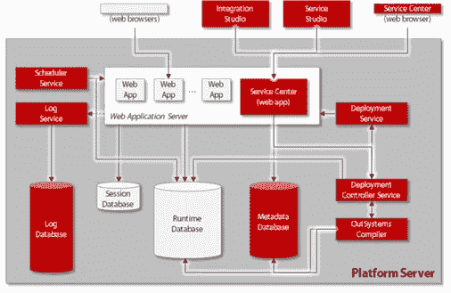
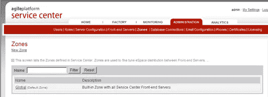

# 外部系统平台的管理:有用还是必要？

> 原文：<https://itnext.io/management-of-the-outsystems-platform-useful-or-necessary-c13de3a6c413?source=collection_archive---------4----------------------->

使用 OutSystems 开发平台的需求比以往任何时候都高。该平台提供了在短时间内制作业务应用程序并将其投入生产的可能性。它还能够为移动设备快速创建应用程序，并释放“旧”数据源。

OutSystems 主要用于使用最新技术开发应用程序。然而，环境的管理往往被忽视。本文展示了是否需要管理外部系统平台。

外部系统开发平台作为现有基础设施之上的一层运行；它可以运行在数据中心内的服务器上，也可以运行在 Azure 和 AWS 等虚拟环境中。这些应用程序是使用。Net 或者 Java。那个平台。Net 应用程序正在运行，在 Windows 上运行 IIS，运行 Java 应用程序的平台可以从 RedHat、CentOS 或 Oracle Linux 中选择，带有 [Wildfly](http://wildfly.org/about/) 或 [WebLogic](http://www.oracle.com/technetwork/middleware/weblogic/overview/index.html) 。

外部系统开发平台使用数据库服务器，SQL 和 Oracle 是最常见的。

改编自 [OutSystems 平台架构](https://www.outsystems.com/platform/development/infrastructure-technote/)

作为一个单独的层，经常被遗忘的外部系统平台的管理是必要的。除了管理基础设施之外，还应该这样做。虽然基础设施管理者认为外部系统的管理是一个应用程序问题，但应用程序开发人员认为这是基础设施管理员的任务。这两种观点都是错误的。外部系统平台的管理包含重要的步骤，需要特定的知识。否则，环境和应用程序会运行得更慢或者出现一些错误。

外部系统平台的管理分为以下几个部分:

1.监控服务中心和“环境健康”中的各种日志

2.将应用程序分发到不同的应用程序池

3.跟踪和删除旧的应用程序和应用程序版本

4.应用分析跟踪(生命周期)

5.使用多个数据库目录

6.在环境中使用多个区域

这种管理如何提供更稳定的平台？通过执行以下建议，这是可能的:

**1。服务中心监控**

平台的整体状态位于服务中心的“监控”选项卡中。

以下日志在那里可用(取决于版本):

错误—系统或应用程序中出现的错误

常规—系统中发生的几个事件，如删除的项目和出现的缓慢查询

集成—所有传入和传出的 API 调用

移动应用程序—此处显示了移动应用程序的所有流量

环境健康——提供平台主要功能的状态

安全—指定已经发生的安全问题

开发人员可以影响日志中显示内容的方式；他们可以指定代码中的错误或信号。他们通常不改变标准，这超出了默认定义的系统。在开发过程中，您应该对此给予足够的重视，以防止大量消息泛滥。例如，您可以关闭登录到应用程序的“日志记录”(默认情况下是打开的)。

环境健康屏幕显示以下内容:

此处显示了平台最重要服务的状态。如果出了问题，**！**或 **X** 都出现在相关服务的旁边。点击“详细信息”,将出现一个屏幕，提供有关该情况的更多信息。

监控的好处如下:

你对环境有敏锐的洞察力

通过在适当的时候采取行动，严重的问题是可以避免的

**2。将应用程序分发到不同的应用程序池**

平台的默认安装只有一个应用程序池:OutSystemsApplications。在[安装清单](http://www.outsystems.com/home/downloadsdetail/104/1920/)中，建议为服务中心和生命周期创建单独的应用程序池。所有其他应用程序都自动放在系统外的应用程序中。如果一个应用程序导致池崩溃或回收，那么所有其他应用程序也将崩溃或回收。

在应用程序中使用计时器(外部系统中的批处理机制)也会导致崩溃或回收；如果计时器占用池中太多的容量，其他应用程序可能会超时。通过创建更多的池，一个应用程序引起的问题不会影响其他应用程序。这使得问题局限于一个或有限数量的应用程序。

应用多个应用程序池的好处是:

应用程序之间的相互影响较小

环境更加稳定

**3。跟踪和删除旧应用程序或应用程序版本**

OutSystems 平台提供了快速制作一些试用应用程序的能力。这可能会导致大量的试用应用程序不再被使用。为了保持概览并尽可能地最小化使用的空间，建议不时地检查应用程序的列表，并清理所有不必要的内容。

开发者对应用程序的每次“发布”都会导致软件的新版本，该版本存储在数据库中。这允许开发人员在需要时返回到旧版本(撤销)。外部系统的数据库中累积的版本会逐渐使数据库变慢。通过清理旧版本，可以减少数据库的大小，一切又可以顺利进行。

定期清洁的好处是:

开发人员的环境性能保持在较高水平

清晰概述使用的应用程序

**4。应用分析跟踪(生命周期)**

生存期提供了分析应用程序细节的可能性。每个应用程序都有一个 APDEX(应用程序性能指数)分数，它表示一个请求需要多长时间。一个请求将被分成客户机时间、网络时间和服务器时间。您可以放大最低的元素，这样您就可以看到应用程序的哪些部分使用了最多的时间。这为开发人员提供了提高应用程序最慢部分的性能的信息。该工具还可用于验证客户体验。

要检查所需时间范围内的性能(增加或减少)，您可以定义一个时间段。性能变化可以与同一时期发生的应用程序变化联系起来。

应用这些步骤，将确保环境保持良好的秩序和性能得到控制。当然，如果系统长时间运行，应用程序的数量会增加，因此对服务器进行更改是必要的。

使用生命周期分析的好处是:

洞察性能较低的应用

洞察应用程序的哪个部分性能下降

**5。使用多个数据库目录**

OutSystems 平台的默认安装使用一个名为 Main 的数据库目录。这个目录保存了关于创建应用程序的信息以及该应用程序的所有数据。

如果数据库出现问题，例如计时器破坏了应用程序的所有用户数据，您必须恢复整个数据库。但是，您在备份后所做的操作不会被恢复所替换。

因此，建议将应用程序的数据保存在不同的目录中。您还可以为应用程序及其生命周期制定优化的维护计划。这些维护计划通常更小，执行速度更快。与外部系统应用程序相关的数据保留在主目录中。通过划分数据库，文件会更小，性能会更好。

现代数据库管理系统(DBMS)可以同时为不同的目录执行不同的任务。因此，使用多个目录来利用 DBMS 的优势会更有效。

使用特定目录的权利可以与其他权利分开授予。允许不同的人访问特定目录中的数据是可能的。当您拥有只有少数人可以访问的特定数据时，这很有用。

当现有数据库中有数据时，也可以切换到新的目录。OutSystems 可以在新目录中创建表，但不会将数据从旧表移到新表中。这必须通过 DBMS 本身的脚本来完成。可以在模块的工序选项卡上更改使用的目录。应用更改后，您只需再次发布模块，应用程序将使用新的目录。

对应用程序数据使用不同目录的好处是:

更小的文件、更快的数据库和更快的维护计划

分离外部系统数据和应用程序数据

使备份和恢复更容易

**6。使用多个区域**

安装外部系统平台后，有一个标准区域；全球区域。当您需要时，可以定义更多的区域，例如，使用非军事区(DMZ)。这些区域在服务中心的“管理”选项卡中定义。

使用基础结构规则，您可以定义谁可以访问特定的前端服务器。前端服务器可以属于多个区域。不能使用对另一个区域中的模块的直接引用。

一个模块只能在一个区域中。可以在服务中心模块的操作标签中进行更改。更改区域后，部署控制器将发布这个模块。它仅发布到属于该区域的前端服务器。如果模块在更多的区域上，那么部署控制器将把它从不在这个区域中的前端服务器上删除。不能使用对另一个区域中的模块的直接引用，因为应用程序在此前端服务器上找不到该模块。

使用多个区域的好处是:

您只能使用该区域必需的应用程序，即内部应用程序不在连接到互联网的服务器上

您可以根据需要定义多个区域

**结论**

外部系统平台的初始安装不足以确保平台保持稳定运行。有必要保持平台保持稳定。否则，性能会慢慢下降，问题会越来越多，最终导致整个 OutSystems 平台的崩溃。

本文中提到的要点强调了维护 OutSystems 平台并使其保持良好状态的绝对必要的步骤。它为最终用户和开发人员提供了一个更稳定的环境，同时性能仍然很高。这使得能够更好地使用平台，并提高所有(最终)用户的满意度。