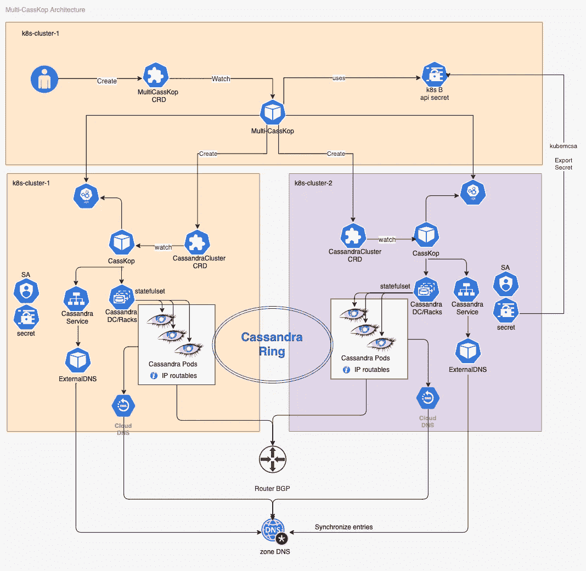

# 使用 CassKop / MultiCassKop 管理多个 Kubernetes 上的多站点 Cassandra 集群

> 原文：<https://itnext.io/managing-a-multi-site-cassandra-cluster-on-multiple-kubernetes-with-casskop-multicasskop-cf407c297701?source=collection_archive---------3----------------------->

[CassKop](https://github.com/Orange-OpenSource/cassandra-k8s-operator) 是一个 Kubernetes 运营商，它使得在 Kubernetes 上运行 Apache Cassandra 变得很容易。它可以创建、配置和管理运行在 Kubernetes 上的 Cassandra 集群。

在之前的帖子中，[约翰·桑达](https://medium.com/@john.sanda)和[西里尔·斯特邦](https://medium.com/@cscetbon)已经谈到了卡斯科普:

*   [https://medium . com/@ John . Sanda/deploying-Cassandra-in-kubernetes-with-cass kop-1f 721586825 b](https://medium.com/@john.sanda/deploying-cassandra-in-kubernetes-with-casskop-1f721586825b)
*   [https://medium . com/@ John . Sanda/create-affinity-between-Cassandra-and-kubernetes-5b 2f 72d 23293](https://medium.com/@john.sanda/create-affinity-between-cassandra-and-kubernetes-5b2f72d23293)
*   [https://medium . com/@ cscetbon/cass kop-a-kubernetes-operator-for-Cassandra-4125 fcb7a 199](https://medium.com/@cscetbon/casskop-a-kubernetes-operator-for-cassandra-4125fcb7a199)

CassKop 引入了一个新的定制资源定义，`CassandraCluster`,它允许您描述想要部署的 Cassandra 集群。
这在单个 Kubernetes 集群中工作得很好，并且允许在单区域多 AZ 拓扑中部署 Cassandra。

但是为了让我们的 Cassandra 集群具有更大的弹性，我们希望能够将它扩展到几个地区。为了用 Kubernetes 做到这一点，我们需要我们的 Cassandra 在不同地区独立部署的不同 Kubernetes 集群之上传播。

今天，我们引入 MultiCassKop，这是一个适合 CassKop 的新操作符。MultiCassKop 是一个新的控制器，它将负责在几个不同的 Kubernetes 集群中创建`CassandraClusters` CRD 对象，并且所有的 Cassandra 节点都将成为同一个环的一部分。

MultiCassKop 使用新的自定义资源定义`[MultiCasskop](https://github.com/Orange-OpenSource/cassandra-k8s-operator/tree/master/multi-casskop)`，它允许指定:

*   CassandraCluster 对象的基
*   为我们要部署的每个 kubernetes 集群覆盖这个基本对象。

概述:
多 CassKop 的目标是在不同地区部署 Cassandra 集群，每个地区运行一个独立的 Kubernetes 集群。
Multi-Casskop 通过
管理来自其自身 Multi-Casskop 自定义资源的 CassandraCluster 对象的一致创建，确保每个本地 Casskop 部署的 Cassandra 节点将成为同一个 Cassandra 环的一部分。

# 假设

这篇文章探讨了如何在两个不同的站点(k8s-cluster1 和 k8s-cluster2)上建立一个 Cassandra 集群。

MultiCasskop 需要每个 Cassandra pod 能够独立地相互对话，它们属于集群 k8s-cluster1 或 k8s-cluster2。为了实现这一目标，我们依靠:

*   [Calico](https://www.projectcalico.org/why-bgp/)
    带有可路由网络池的网络插件，它将通过 BGP 将我们的 pod 地址传播到我们的网络路由器。
*   [带 RFC2136
    的外部 DNS](https://github.com/kubernetes-sigs/external-dns) ，这将使我们能够为我们的每个 pod 提供外部域名解析。

我们已经配置了 kubectl，可以访问我们的两个 kubernetes 集群 k8s-cluster1 和 k8s-cluster2。

该图显示了每个组件的连接方式:



MultiCassKop 从迭代每个传入参数的上下文开始，然后注册控制器。
控制器需要能够与 MultiCasskop 和 CassandraCluster CRD 对象交互。
此外，控制器需要监视 MultiCasskop，因为它需要对给定名称空间的那些对象上发生的任何变化做出反应。

# 装置

# 在每个 k8s 集群上创建名称空间

我们需要为集群 k8s-cluster1 和 k8s-cluster2 分别创建一个命名空间和一个预配置的 Calico `routable-1` IP 池。

k8s-cluster1 的示例:

```
cat <<EOF | kubectl apply -f -
apiVersion: v1
kind: Namespace
metadata:
 name: cassandra-demo
 annotations:
 "cni.projectcalico.org/ipv4pools": '\["routable-1"\]'
 labels:
 app: cassandra
EOF
kubens cassandra-demo
```

# 从 k8s-cluster-1 到 k8s-cluster-2 的引导 API 访问

多 Casskop 将部署在 k8s-cluster-1 中，更改您的 kubectl 上下文以指向该集群。

为了允许我们的多 CassKop 控制器从 k8s-cluster-1 访问 k8s-cluster-2，我们将使用来自 [Admiralty](https://admiralty.io/) 的 [kubemcsa](https://github.com/admiraltyio/multicluster-service-account/releases/tag/v0.6.1) 来将秘密从 k8s-cluster-2 导出到 k8s-cluster1

```
kubemcsa export --context=cluster2 --namespace cassandra-demo cassandra-operator --as k8s-cluster2 | kubectl apply -f -
```

> *这将在当前 k8s 集群(必须是 k8s-cluster-1)中创建与 k8s-cluster2 中的* ***Cassandra-operator****命名空间****Cassandra-demo****服务帐户关联的 k8s 秘密。
> /！\秘密将以名称****k8s-cluster 2****创建，并且在启动多任务 CRD 定义中的多任务和
> 时必须使用该名称，见下文*

# 安装 CassKop

CassKop 必须部署在每个目标 Kubernetes 集群上。

为 CassKop 添加舵库

```
$ helm repo add casskop https://Orange-OpenSource.github.io/cassandra-k8s-operator/helm
$ helm repo update
```

# 安装外部 DNS

[外部 DNS](https://github.com/kubernetes-sigs/external-dns) 必须安装在每个 Kubernetes 集群中。
使用指向您的区域的自定义值配置您的外部 DNS，并将其部署到您的名称空间中

```
helm install -f ~/private/externaldns-values.yaml --name casskop-dns external-dns
```

外部 DNS 的目标是侦听由 CassKop 创建的 Kubernetes 服务，并将在您的区域中为与该服务相关联的每个 pod 创建一个 DNS 条目。
这意味着我们将能够为 CassKop 自动创建的每个 Cassandra pods 拥有一个外部 DNS 条目。

因为我们的 pod 使用 Calico 可路由 IP 地址，所以可以从我们的集群外部访问它们。

# 安装多层机箱

仅当满足先决条件时，才进行多机箱安装。

带舵展开。Multi-CassKop 和 CassKop 共享相同的 GitHub/helm repo 和语义版本。

```
helm install --name multi-casskop casskop/multi-casskop --set k8s.local=k8s-cluster1 --set k8s.remote={k8s-cluster2}
```

> *如果您得到一个报错消息，说 CRD 已经存在，那么用* `*--no-hooks*`重新播放它

启动 Multi-CassKop 时，我们需要给出一些参数:

*   k8s.local 是我们在与这个集群对话时想要引用的 k8s 集群的名称。
*   k8s.remote 是我们想要连接的其他 kubernetes 的列表。

> *此处使用的名称应与 MultiCassKop CRD 定义中使用的名称相映射)* `*k8s.remote*`*中的名称必须与使用 kubemcsa 命令导出的机密名称相匹配*

启动时，我们的 MultiCassKop 控制器应该记录类似如下的内容:

```
time="2019-11-28T14:51:57Z" level=info msg="Configuring Client 1 for local cluster k8s-cluster1 (first in arg list). using local k8s api access"
time="2019-11-28T14:51:57Z" level=info msg="Configuring Client 2 for distant cluster k8s-cluster2\. using imported secret of same name"
time="2019-11-28T14:51:57Z" level=info msg="Creating Controller"
time="2019-11-28T14:51:57Z" level=info msg="Create Client 1 for Cluster k8s-cluster1"
time="2019-11-28T14:51:57Z" level=info msg="Add CRDs to Cluster k8s-cluster1 Scheme"
time="2019-11-28T14:51:57Z" level=info msg="Create Client 2 for Cluster k8s-cluster2"
time="2019-11-28T14:51:58Z" level=info msg="Add CRDs to Cluster k8s-cluster2 Scheme"
time="2019-11-28T14:51:58Z" level=info msg="Configuring Watch for MultiCasskop"
time="2019-11-28T14:51:58Z" level=info msg="Configuring Watch for MultiCasskop"
time="2019-11-28T14:51:58Z" level=info msg="Writing ready file."
time="2019-11-28T14:51:58Z" level=info msg="Starting Manager."
```

# 创建多通道 CRD

Multi-CassKop 引入了一个新的自定义资源，并将负责在每个
k8s 集群中创建 CassandraCluster 资源。

MultiCasskop 的 Spec 字段有一个包含有效 CassandraCluster 对象的`base`参数。
它还有一个`override`部分，允许根据目标集群覆盖 CassandraCluster 基本定义的特定部分
。

你可以在`multi-casskop/samples/multi-casskop.yaml`文件中找到一个 MultiCassKop 的例子:

这是一个多教室的结构:

```
apiVersion: db.orange.com/v1alpha1
kind: MultiCasskop
metadata:
  name: multi-casskop-e2e
spec:
  # Add fields here
  deleteCassandraCluster: **true**
  base:
    <The base of the CassandraCluster object you want Multi-CassKop to create>
    ...
    status: #<!!-- At this time the seedlist must be provided Manually. we know in advance the domain name
            # it's the <pod-name>.<your-external-dns-domain>
      seedlist:
        - cassandra-e2e-dc1-rack1-0.my.zone.dns.net
        - cassandra-e2e-dc1-rack1-1.my.zone.dns.net
        - cassandra-e2e-dc2-rack4-0.my.zone.dns.net
        - cassandra-e2e-dc2-rack4-1.my.zone.dns.net      
  override:
    k8s-cluster1: #<!!-- here is the name which must correspond to the helm argument `k8s.local`
      spec: #<-- Here we defined overrides part for the CassandraCluster for the k8s-cluster1
        pod:
          annotations:
            cni.projectcalico.org/ipv4pools: '["routable"]' #<!-- If using external DNS, change with your current zone
        topology:
          dc:
          ...
    k8s-cluster2: #<!!-- here is the name which must correspond to the helm argument `k8s.remote`
      spec:
        pod:
          annotations:
            cni.projectcalico.org/ipv4pools: '["routable"]' #<!-- If using external DNS, change with your current zone
        imagepullpolicy: IfNotPresent
        topology:
          dc:
          ...
```

您可以通过以下方式创建集群:

```
k apply -f multi-casskop/samples/multi-casskop.yaml
```

然后，您可以看到 MultiCassKop 日志:

```
time="2019-11-28T15:46:19Z" level=info msg="Just Update CassandraCluster, returning for now.." cluster=cassandra-e2e kubernetes=k8s-cluster1 namespace=cassandra-e2e
time="2019-11-28T15:46:19Z" level=info msg="Cluster is not Ready, we requeue [phase= / action= / status=]" cluster=cassandra-e2e kubernetes=k8s-cluster1 namespace=cassandra-e2e
time="2019-11-28T15:46:49Z" level=info msg="Cluster is not Ready, we requeue [phase=Initializing / action=Initializing / status=Ongoing]" cluster=cassandra-e2e kubernetes=k8s-cluster1 namespace=cassandra-e2e
time="2019-11-28T15:47:19Z" level=info msg="Cluster is not Ready, we requeue [phase=Initializing / action=Initializing / status=Ongoing]" cluster=cassandra-e2e kubernetes=k8s-cluster1 namespace=cassandra-e2e
time="2019-11-28T15:47:49Z" level=info msg="Cluster is not Ready, we requeue [phase=Initializing / action=Initializing /status=Ongoing]" cluster=cassandra-e2e kubernetes=k8s-cluster1 namespace=cassandra-e2e
time="2019-11-28T15:47:19Z" level=info msg="Cluster is not Ready, we requeue [phase=Initializing / action=Initializing / status=Ongoing]" cluster=cassandra-e2e kubernetes=k8s-cluster1 namespace=cassandra-e2e
time="2019-11-28T15:47:49Z" level=info msg="Cluster is not Ready, we requeue [phase=Initializing / action=Initializing / status=Ongoing]" cluster=cassandra-e2e kubernetes=k8s-cluster1 namespace=cassandra-e2e
time="2019-11-28T15:48:19Z" level=info msg="Cluster is not Ready, we requeue [phase=Initializing / action=Initializing / status=Ongoing]" cluster=cassandra-e2e kubernetes=k8s-cluster1 namespace=cassandra-e2e
time="2019-11-28T15:48:49Z" level=info msg="Cluster is not Ready, we requeue [phase=Initializing / action=Initializing / status=Ongoing]" cluster=cassandra-e2e kubernetes=k8s-cluster1 namespace=cassandra-e2e
time="2019-11-28T15:49:19Z" level=info msg="Just Update CassandraCluster, returning for now.." cluster=cassandra-e2e kubernetes=k8s-cluster2 namespace=cassandra-e2e
time="2019-11-28T15:49:49Z" level=info msg="Cluster is not Ready, we requeue [phase=Initializing / action=Initializing / status=Ongoing]" cluster=cassandra-e2e kubernetes=k8s-cluster2 namespace=cassandra-e2e
time="2019-11-28T15:50:19Z" level=info msg="Cluster is not Ready, we requeue [phase=Initializing / action=Initializing / status=Ongoing]" cluster=cassandra-e2e kubernetes=k8s-cluster2 namespace=cassandra-e2e
time="2019-11-28T15:50:49Z" level=info msg="Cluster is not Ready, we requeue [phase=Initializing / action=Initializing / status=Ongoing]" cluster=cassandra-e2e kubernetes=k8s-cluster2 namespace=cassandra-e2e
time="2019-11-28T15:51:19Z" level=info msg="Cluster is not Ready, we requeue [phase=Initializing / action=Initializing / status=Ongoing]" cluster=cassandra-e2e kubernetes=k8s-cluster2 namespace=cassandra-e2e
time="2019-11-28T15:51:49Z" level=info msg="Cluster is not Ready, we requeue [phase=Initializing / action=Initializing / status=Ongoing]" cluster=cassandra-e2e kubernetes=k8s-cluster2 namespace=cassandra-e2e
```

操作顺序如下:

*   MultiCassKop 首先在 k8s-cluster1 中创建 CassandraCluster。
*   然后本地 CassKop 开始创建相关的 Cassandra 集群。
*   当 CassKop 结束创建它的集群时，它用 phase=Running 更新 CassandraCluster 状态，这意味着
    一切正常
*   然后 MultiCassKop 开始在 k8s-cluster2 中创建另一个 CassandraCluster
*   然后本地 CassKop 开始创建相关的 Cassandra 集群。
*   由于配置了外部 DNS 名称的可路由种子列表，Cassandra pods 通过连接到 k8s-cluster1 中已经存在的 Cassandra 节点来启动，目标是形成唯一的 Cassandra 环。

在结果中，我们可以看到每个集群都有所需的 pod。

如果我们进入其中一个创建的 pod，我们可以看到 nodetool 看到两个集群的 pod:

```
cassandra@cassandra-e2e-dc1-rack2-0:/$ nodetool status
Datacenter: dc1
===============
Status=Up/Down
|/ State=Normal/Leaving/Joining/Moving
--  Address         Load       Tokens       Owns (effective)  Host ID                               Rack
UN  10.100.146.150  93.95 KiB  256          49.8%             cfabcef2-3f1b-492d-b028-0621eb672ec7  rack2
UN  10.100.146.108  108.65 KiB  256          48.3%             d1185b37-af0a-42f9-ac3f-234e541f14f0  rack1
Datacenter: dc2
===============
Status=Up/Down
|/ State=Normal/Leaving/Joining/Moving
--  Address         Load       Tokens       Owns (effective)  Host ID                               Rack
UN  10.100.151.38   69.89 KiB  256          51.4%             ec9003e0-aa53-4150-b4bb-85193d9fa180  rack5
UN  10.100.150.34   107.89 KiB  256          50.5%             a28c3c59-786f-41b6-8eca-ca7d7d14b6df  rack4cassandra@cassandra-e2e-dc1-rack2-0:/$
```

# 删除卡珊德拉集群 2

如果您已经将`deleteCassandraCluster`键设置为 true，那么当删除`MultiCassKop`对象时，它将级联删除目标 k8s 簇中的`CassandraCluster` 对象。然后每个本地卡斯克普将删除他们的
卡珊德拉集群。

您可以在 MultiCassKop 日志中看到

```
time="2019-11-28T15:44:00Z" level=info msg="Delete CassandraCluster" cluster=cassandra-e2e kubernetes=k8s-cluster1 namespace=cassandra-e2e
time="2019-11-28T15:44:00Z" level=info msg="Delete CassandraCluster" cluster=cassandra-e2e kubernetes=k8s-cluster2 namespace=cassandra-e2e
```