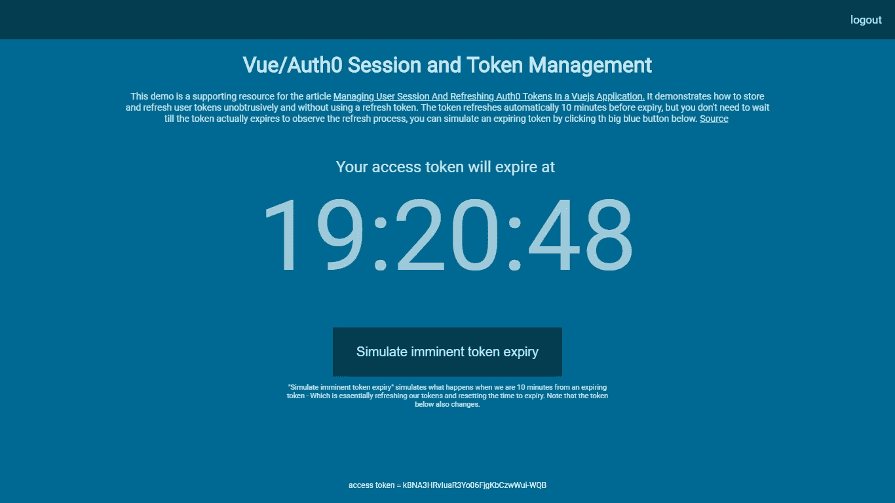
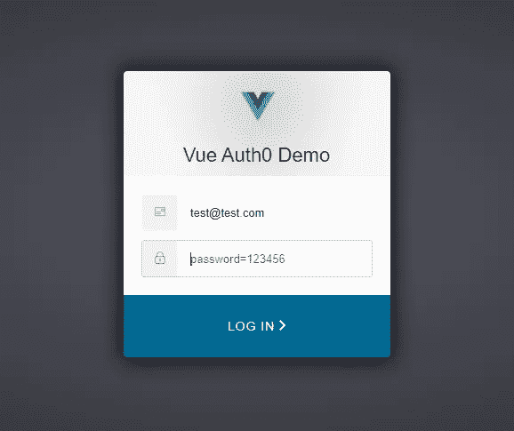

# 在 Vuejs 应用程序中管理和刷新 Auth0 令牌

> 原文：<https://itnext.io/managing-and-refreshing-auth0-tokens-in-a-vuejs-application-65eb29c309bc?source=collection_archive---------1----------------------->

[点击这里在 LinkedIn](https://www.linkedin.com/cws/share?url=https%3A%2F%2Fitnext.io%2Fmanaging-and-refreshing-auth0-tokens-in-a-vuejs-application-65eb29c309bc) 上分享这篇文章

*这里讨论的原理的演示可以在【http://vue-auth0-demo.s3-website.eu-central-1.amazonaws.com】的*T5中找到。此外，为了清楚起见，本文省略了一些细节。更完整的例子的源代码(上面的演示)，可以在[【https://github.com/sellomkantjwa/vue-auth0-demo](https://github.com/sellomkantjwa/vue-auth0-demo)*找到。*

[](http://vue-auth0-demo.s3-website.eu-central-1.amazonaws.com/)

演示

如果您使用 Auth0 来管理您的单页面应用程序的用户，您将很快了解到在浏览器中存储*刷新令牌*作为您的状态的一部分是一种糟糕的做法。这是因为刷新令牌永远不会过期，如果其中一个令牌遭到破坏，那么攻击者可以使用该单个刷新令牌无限期地刷新受害者的访问令牌，这很糟糕。

如果在您的应用程序中，用户不太可能连续在线超过 2 个小时(auth0 访问令牌的默认 TTL)，那么您可能会决定让令牌过期，并要求用户再次登录，以便在 TTL 之后继续他们的会话。我个人不赞成这种方法——想象一个场景，用户登录你的应用，使用 10 分钟，切换到一个新标签，过一会儿返回你的应用，开始四处点击。突然，就在会话进行到一半时，令牌过期了，出现在他们面前的是一个登录屏幕，这可不酷。让我们看看如何确保这种情况永远不会发生。

在浏览器中使用 Auth0 最简单的方法是下载他们的 SDK。

使用 npm:

```
npm i auth0-js -SE 
```

或者在您的页面上包含脚本:

```
<script src=”https://cdn.auth0.com/js/auth0/9.3.1/auth0.min.js"></script>
```

用户会话的管理并不过分复杂，可以总结如下:

1.  当用户第一次登录我们的应用程序时，我们捕获并存储:
    * access_token(为了正确使用 Auth0 和 Oauth，我们需要用它在我们的 API/服务器上验证我们自己)
    * expires_in(它告诉我们离令牌过期还有多长时间)
2.  我们在令牌过期前几分钟安排一个`setTimeout`来刷新令牌。
3.  当用户下一次登陆我们的应用时，我们会检查他们之前是否登录过；如果他们已经过期，我们检查他们的令牌是否已经过期或即将过期，如果是这样，就将他们发送到登录页面。如果令牌尚未到期`&&`也未接近到期，我们就让他们进来，并计划在令牌接近到期时进行刷新。

让我们从创建一个助手模块开始，我们将使用它来管理用户的会话。在其中，我们将实例化并导出一个新的 auth0 实例，我们可以在整个过程中重用它。

*//session-manager.js*

```
*//Irrelevant code omitted for clarity* **import** {WebAuth} **from** "auth0-js";

**const** auth0 = **new** WebAuth({
    responseType: "token id_token",
    domain: process.env.DEMO_AUTH0_DOMAIN,
    clientID: process.env.DEMO_AUTH0_CLIENT_ID,
    redirectUri: "http://localhost:8080/login-callback"
});export{auth0}*//irrelevant code omitted*
```

注意，我们将我们的域和 clientID 存储为可配置变量。如果你愿意，你可以硬编码这些。

现在是登录组件。

登录组件

您将看到我们在这里所做的只是调用`auth0.authorize()`，它将用户重定向到我们的 Auth0 托管页面，用户可以在那里登录。该页面看起来有点像这样:



我们的登录页面

一旦用户登录，他们将被重定向到我们指定的 url，我们可以在那里提取和存储令牌。在上面的设置( *session-manager.js* )中，我们已经指定了 URI[*http://localhost:8080/log in-callback*](http://localhost:8080/login-callback)*)(确保该 url 在 Auth0 中允许的回调 URL 列表中，否则整个事情都会搞砸。)*

*让我们收集用户的令牌并将其存储在指定的重定向 uri 中。*

*login-callback.vue*

*当我们被重定向到[*http://localhost:8080/log in-callback*](http://localhost:8080/login-callback)*，*时，上面的组件被加载。它的唯一目的是收集、解析和存储返回的令牌。当 auth0 返回到回调 url 时，它将必要的令牌和有效期附加到 url 中的*散列*中。整个 url 如下所示:*

```
*[http://localhost:8080/login-callback#access_token=xxxxxxxxxxxxxxxxxxxxxxxxx&expires_in=7200&token_type=Bearer&state=xxxxxxxxxxxxxxxxx&id_token=xxxxxxxxxxxxxxxxxxxxxxxx](http://localhost:8080/login-callback#access_token=xxxxxxxxxxxxxxxxxxxxxxxxx&expires_in=7200&token_type=Bearer&state=lpT0Q4vX2wCKd9HlJjFSivZATph9O2eF&id_token=xxxxxxxxxxxxxxxxxxxxxxxx)*
```

*我们使用 [querystring](https://www.npmjs.com/package/query-string) 模块将令牌数据解析成 JSON 以便于处理，然后将它传递给 Vuex 变量，以便存储在我们的中央状态中。解析后的令牌数据如下所示:*

```
*{
  "access_token":"xxxxxxxxxxxxxxxxx",
  "expires_in":"7200",
  "token_type":"Bearer",
  "state":"xxxxxxxxxxxxxxxxx",
  "id_token":"xxxxxxxxxxxxxx"
}*
```

*在我们的 Vuex 商店中，我们可以将代币保存到我们的中央州和`localstorage`。我们需要将令牌保存到`localstorage`中，这样我们就可以在令牌过期之前，在页面重新加载或连续访问站点时保存它。这样，我们可以重用令牌，而不是每次点击应用程序时都要求用户登录。下面是我们的存储片段，其中我们定义了负责持久化令牌的突变。*

*将令牌保存到我们的状态和本地存储*

*很好，我们现在已经存储了我们的凭证，并且可以设置 *getters* ，这样我们就可以在需要的时候检索它们。以下是完整的商店:*

*现在，我们希望设置令牌刷新，以便用户不会注销活动会话，我们还希望在用户登录应用程序时正确初始化会话。让我们把所有这些逻辑扔进 *session-manager.js.**

*//session-manager.js*

*`initSession`功能执行以下操作:*

1.  *检查我们是否有令牌到期日期，如果没有，这意味着用户从未登录。我们将用户重定向到登录页面。*
2.  *如果有令牌过期日期，我们会检查它是否已过期或将在接下来的 10 分钟内过期。如果上述任何条件为真，那么我们重定向用户登录。这 10 分钟只是一个缓冲，让我们自己刷新令牌。实际上，这可能是令牌到期之前的任何时间。*
3.  *如果 1 和 2 不成立，那么我们知道令牌仍然有效，我们还可以使用它一段时间。此时，我们设置了一个 *setTimeout* 来在令牌实际到期前 10 分钟刷新它。*

*不出所料,`refreshToken`函数实际上刷新了令牌。在 auth0 sdk 中实现这一点的方法被称为`checkSession`，auth0 如何在没有重定向的情况下实现这一点的机制可以在这里找到—有趣的方法。刷新令牌后，我们设置了另一个超时，在它过期前 10 分钟再次刷新按钮。*

*我们需要在应用程序加载时调用`initSession`来设置会话。最好的地方是在我们的根 Vue 组件 App.vue 中:*

*//App.vue*

```
*//*irrelevant code omitted*<script>

    **import** Router **from** "./router";
    **import** Store **from** "./store";
    **import** {initSession} **from** "./session-manager";

    **export default** {
        name: 'app',
        data() {
            **return** {};
        },
        mounted() {
            initSession();  //Initialize our session
        },
        router: Router,
        store: Store
    };

</script>//*irrelevant code omitted**
```

*我将让用户退出应用程序。(提示:调用 Auth0 sdk 的 logout 方法，清除令牌 localstorage，并清除刷新令牌超时)*

*就是这样。我们现在可以确信，我们的用户会话不会被不必要的中断，并且我们不需要存储任何刷新令牌来实现这一点。*