# 使用 Ansible、CloudFormation 和 CodeBuild 将 AWS 基础设施作为代码进行管理

> 原文：<https://itnext.io/managing-aws-infrastructure-as-code-using-ansible-cloudformation-and-codebuild-7edb2e515dff?source=collection_archive---------2----------------------->

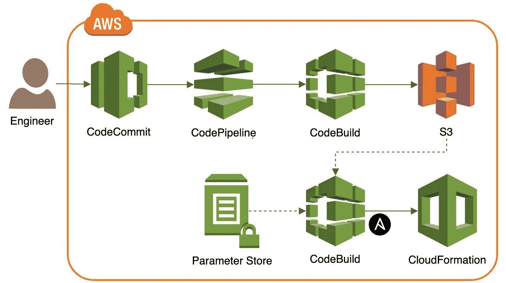

当谈到在 AWS 云平台上供应和配置资源时，有各种各样的服务、工具和工作流可供选择。您可以决定专门使用 AWS 提供的基于云的服务，如 CodeBuild、CodePipeline、CodeStar 和 OpsWorks。或者，您可以选择开源软件(OSS)来提供和配置 AWS 资源，例如社区版的 Jenkins、HashiCorp Terraform、Pulumi、Chef 和 Puppet。您也可以选择使用许可产品，例如 Octopus Deploy、TeamCity、CloudBees Core、Travis CI Enterprise 和 XebiaLabs XL Release。您甚至可能决定用 Python、Go、JavaScript、Bash 或其他常见语言编写自己的定制工具或脚本。

事实上，在我接触过的大多数企业中，团队将 AWS 服务、开源软件、定制脚本和偶尔获得许可的产品相结合，构建完整的端到端基础架构，作为基于代码的工作流，用于供应和配置 AWS 资源。选择通常基于团队经验、供应商关系和企业的特定业务用例。

在接下来的文章中，我们将探索这样一组易于集成的工具，用于供应和配置 AWS 资源。该工具堆栈由 Red Hat Ansible、AWS CloudFormation 和 AWS CodeBuild 以及几项补充性的 AWS 技术组成。使用这些工具，我们将提供一个相对简单的 AWS 环境，然后部署、配置和测试一组高度可用的 Apache HTTP 服务器。该演示类似于上一篇文章[中介绍的 Google 云平台红帽 Ansible 入门](https://programmaticponderings.com/2019/01/30/getting-started-with-red-hat-ansible-for-google-cloud-platform/)中的演示。

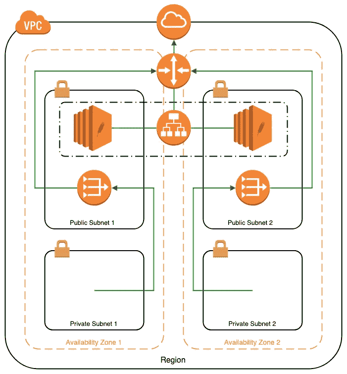

# 为什么是 Ansible？

自 2012 年以来，Ansible 凭借其简单易用、与大多数主流云、数据库、网络、存储和身份提供商以及其他[类别](https://docs.ansible.com/ansible/latest/modules/modules_by_category.html)的广泛兼容性，成为工程团队配置管理的热门选择。鉴于现代企业中使用的多种语言技术，以及多云和混合云架构的优势日益增长，Ansible 提供了一个通用平台，用于支持成熟的开发运维及基础设施作为代码实践。Ansible 很容易与更高级别的编排系统集成，如 AWS CodeBuild、Jenkins 或[红帽 AWX 和 Tower](https://www.redhat.com/en/resources/awx-and-ansible-tower-datasheet) 。

# 技术

本文中使用的主要技术包括。

# 红帽 Ansible

Ansible，[于 2015 年 10 月被 Red Hat 收购](https://www.redhat.com/en/about/press-releases/red-hat-acquire-it-automation-and-devops-leader-ansible)，它在单一平台中无缝地提供了配置管理、供应和应用部署的工作流编排。与类似工具不同，Ansible 的工作流自动化是无代理的，依赖于[安全外壳](https://en.wikipedia.org/wiki/Secure_Shell) (SSH)和 [Windows 远程管理](https://docs.microsoft.com/en-us/windows/desktop/winrm/about-windows-remote-management) (WinRM)。如果您有兴趣了解 Ansible 的更多优势，他们已经发布了一份关于[无代理架构的优势](https://www.ansible.com/hubfs/pdfs/Benefits-of-Agentless-WhitePaper.pdf)的白皮书。

根据 [G2 人群](https://www.g2crowd.com/products/ansible/reviews)的调查，Ansible 在[配置管理软件](https://www.g2crowd.com/categories/configuration-management?segment=all)类别中是一个明显的领导者，排在 [GitLab](https://about.gitlab.com/) 之后。该类别的竞争者包括 GitLab、AWS Config、 [Puppet](https://puppet.com/) 、 [Chef](https://www.chef.io/chef/) 、Codenvy、HashiCorp [Terraform](https://www.terraform.io/) 、 [Octopus Deploy](https://octopus.com/) 和 JetBrains [TeamCity](https://www.jetbrains.com/teamcity/) 。

# 自动气象站云形成

根据 AWS 的说法， [CloudFormation](https://aws.amazon.com/cloudformation/) 提供了一种通用语言来描述和提供基于 AWS 的云环境中的所有基础设施资源。CloudFormation 允许您使用基于 JSON 或 YAML 的模板，以自动化和安全的方式，在所有 AWS 区域和客户中建模和提供应用程序所需的所有资源。

对基础设施进行编码，通常被称为“基础设施即代码”，允许您将基础设施视为代码。您可以使用任何 IDE 创作它，将其签入版本控制系统，并在部署它之前与团队成员一起检查文件。

# AWS 代码构建

根据 AWS 的说法， [CodeBuild](https://aws.amazon.com/codebuild/) 是一个完全托管的持续集成服务，它编译您的源代码，运行测试，并生成可以随时部署的软件包。使用 CodeBuild，您不需要供应、管理和扩展您自己的构建服务器。CodeBuild 不断扩展并同时处理多个构建，因此您的构建不会在队列中等待。

CloudBuild 与其他 AWS 开发人员工具无缝集成，包括 CodeStar、CodeCommit、CodeDeploy 和 CodePipeline。

据 [G2 人群](https://www.g2.com/products/aws-codebuild/competitors/alternatives)介绍，在构建自动化软件类别中，AWS CodeBuild 的主要竞争对手包括 [Jenkins](https://jenkins.io/) 、 [CircleCI](https://circleci.com/) 、[cloud bees](https://www.cloudbees.com/)Core and code ship、 [Travis CI](https://travis-ci.org/) 、JetBrains [TeamCity](https://www.jetbrains.com/teamcity/) 和 Atlassian [Bamboo](https://www.atlassian.com/software/bamboo) 。

# 其他技术

除了上面提到的主要技术之外，在演示中，我们还将在较小的程度上利用以下服务和工具:

*   AWS 代码提交
*   AWS 代码管道
*   AWS 系统管理器参数存储
*   亚马逊简单存储服务(S3)
*   AWS 身份和访问管理(IAM)
*   AWS 命令行界面(CLI)
*   云形成棉绒
*   Apache HTTP 服务器

# 源代码

这篇文章的所有源代码都包含在两个 GitHub 存储库中。CloudFormation 模板和相关文件位于 [ansible-aws-cfn](https://github.com/garystafford/ansible-aws-cfn) GitHub 存储库中。Ansible 角色和相关文件位于[ansi ble-AWS-Roles](https://github.com/garystafford/ansible-aws-roles)GitHub 存储库中。可以使用以下命令克隆这两个存储库。

```
git clone --branch master --single-branch --depth 1 --no-tags \ 
  https://github.com/garystafford/ansible-aws-cfn.git

git clone --branch master --single-branch --depth 1 --no-tags \
  https://github.com/garystafford/ansible-aws-roles.git
```

# 显色法

在本演示中，我们将遵循资源调配和配置的一般流程如下:

*   创建一个 S3 桶来存储经验证的云形成模板
*   为 Ansible 创建一个 Amazon EC2 密钥对
*   创建两个 AWS CodeCommit 存储库来存储项目的源代码
*   将参数放入参数存储中
*   编写并测试云形成模板
*   配置 Ansible 和 AWS 动态清单脚本
*   编写并测试可承担的角色和剧本
*   编写 CodeBuild 构建规范文件
*   为代码构建和代码管道创建 IAM 角色
*   创建和测试代码构建项目和代码管道
*   为 AWS 提供、部署和配置完整的 web 平台
*   测试最终的 web 平台

# 先决条件

对于这个演示，我将假设您已经有了一个 AWS 帐户，本地安装了 AWS CLI、Python 和 [Ansible](https://docs.ansible.com/ansible/latest/installation_guide/intro_installation.html) ，一个用于存储最终 CloudFormation 模板的 S3 桶和一个用于 SSH 的 [Amazon EC2 密钥对](https://docs.aws.amazon.com/AWSEC2/latest/UserGuide/ec2-key-pairs.html)。

# 持续集成和交付概述

在本演示中，我们将使用几个 AWS 服务构建多个 CI/CD 管道，用于向 AWS 调配和配置资源。这些服务包括代码提交、代码构建、代码管道、系统管理器参数存储和亚马逊简单存储服务(S3)。下图显示了我们将使用这些 AWS 服务以及 Ansible 构建的完整 CI/CD 工作流。

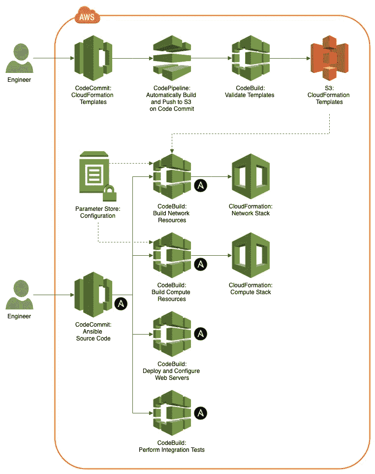

# AWS 代码提交

据亚马逊称， [AWS CodeCommit](https://aws.amazon.com/codecommit/) 是一个完全托管的源代码控制服务，可以轻松托管安全且高度可扩展的私有 Git 库。CodeCommit 消除了操作您自己的源代码控制系统的需要，或者担心扩展它的基础设施。

首先创建两个 AWS CodeCommit 存储库来保存之前克隆的两个 GitHub 项目。将两个项目提交到您自己的 AWS CodeCommit 存储库中。

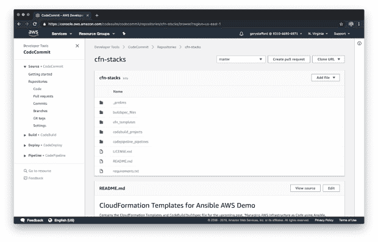

# 结构管理

我们有几个选项来存储在 AWS 上供应和配置资源所必需的配置值。我们可以直接在 CodeBuild 中将配置值设置为环境变量。我们可以在我们的职责范围内设置配置值。我们可以使用 AWS 系统管理器参数存储来存储配置值。在本演示中，我们将使用所有三个选项的组合。

# AWS 系统管理器参数存储

据 Amazon 称， [AWS Systems Manager 参数存储库](https://docs.aws.amazon.com/systems-manager/latest/userguide/systems-manager-parameter-store.html)为配置数据管理和机密管理提供了安全的分层存储。您可以将密码、数据库字符串和许可证代码等数据存储为参数值，以纯文本或加密的形式存储。

这个演示使用了两个 CloudFormation 模板。这两个模板有几个参数。这些参数值中的大部分将存储在参数存储中，由 CloudBuild 检索，并在配置期间注入到 CloudFormation 模板中。


Ansible GitHub 项目包含一个 shell 脚本`parameter_store_values.sh`，用于将必要的参数放入参数存储中。该脚本要求本地安装 [AWS 命令行接口](https://aws.amazon.com/cli/) (CLI)。您需要更改脚本中的`KEY_PATH`键值(显示在下面的*片段)来匹配您的私有密钥的位置，私有密钥是您之前创建的供 Ansible 使用的 Amazon EC2 密钥对的一部分。*

```
**KEY_PATH="/path/to/private/key"** 
# put encrypted parameter to Parameter Store
aws ssm put-parameter \
  --name $PARAMETER_PATH/ansible_private_key \
  --type SecureString \
  --value "file://${KEY_PATH}" \
  --description "Ansible private key for EC2 instances" \
  --overwrite
```

# 安全措施

所有其他参数都以字符串数据类型存储在参数存储中，而私钥则以 [SecureString](https://docs.aws.amazon.com/systems-manager/latest/userguide/sysman-paramstore-securestring.html) 数据类型存储。参数存储使用一个 [AWS 密钥管理服务](https://aws.amazon.com/kms/) (KMS)客户主密钥(CMK)来加密安全参数值。CodeBuild(稍后讨论)使用的 IAM 角色将拥有正确的权限，可以使用 KMS 密钥来检索和解密私钥安全参数值。

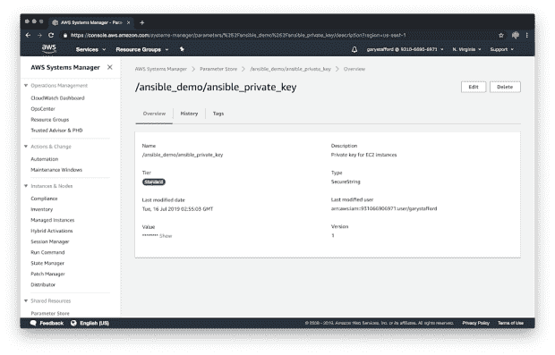

# 云的形成

这个演示使用了两个 CloudFormation 模板。第一个模板`network-stack.template`，包含 AWS 网络栈资源。该模板包括一个 VPC、一个互联网网关、两个 NAT 网关、四个子网、两个弹性 IP 地址以及相关的路由表和安全组。第二个模板`compute-stack.template`包含 web 服务器计算堆栈资源。该模板包括自动扩展组、启动配置、应用程序负载平衡器(ALB)、ALB 侦听器、ALB 目标组和实例安全组。这两个模板都源自 AWS CloudFormation [模板样本库](https://docs.aws.amazon.com/AWSCloudFormation/latest/UserGuide/sample-templates-services-us-west-2.html)，并针对本次演示进行了修改。

这两个模板位于 CloudFormation 项目的`cfn_templates`目录中，如下面的树形视图所示。

```
.
├── LICENSE.md
├── README.md
├── buildspec_files
│   ├── build.sh
│   └── buildspec.yml
**├── cfn_templates**
**│   ├── compute-stack.template**
**│   └── network-stack.template**
├── codebuild_projects
│   ├── build.sh
│   └── cfn-validate-s3.json
├── codepipeline_pipelines
│   ├── build.sh
│   └── cfn-validate-s3.json
└── requirements.txt
```

演示时不需要修改模板。所有参数都在参数存储中或由 Ansible 角色设置，并由 Ansible 剧本通过 CodeBuild 使用。

# Ansible

我们将使用 Red Hat Ansible 通过直接与 CloudFormation 交互来提供网络和计算资源，部署和配置 Apache HTTP Server，最后执行系统的最终集成测试。在我看来，AWS 平台上最接近 Ansible 的等价物是 [AWS OpsWorks](https://aws.amazon.com/opsworks/) 。OpsWorks 允许您使用 Chef 和 Puppet(ansi ble 的直接竞争对手)来自动化如何在 Amazon EC2 实例或内部计算环境中配置、部署和管理服务器。

# 可变配置

要将 Ansible 与 AWS 和 CloudFormation 一起使用，首先需要定制项目的`ansible.cfg`文件，以启用`aws_ec2`库存插件。下面是我的部分配置文件，作为参考。

```
[defaults]
gathering = smart
fact_caching = jsonfile
fact_caching_connection = /tmp
fact_caching_timeout = 300

host_key_checking = False
roles_path = roles
inventory = inventories/hosts
remote_user = ec2-user
private_key_file = ~/.ssh/ansible

**[inventory]** enable_plugins = host_list, script, yaml, ini, auto, **aws_ec2**
```

# 可变角色

根据 Ansible 的说法，[角色](https://docs.ansible.com/ansible/latest/user_guide/playbooks_reuse_roles.html#roles)是基于已知的文件结构自动加载某些变量文件、任务和处理程序的方式。按角色对内容进行分组还允许与其他用户轻松共享角色。为了演示，我编写了四个角色，位于`roles`目录中，如下面的项目树视图所示。默认情况下，本演示中不使用`common`角色。

```
.
├── LICENSE.md
├── README.md
├── ansible.cfg
├── buildspec_files
│   ├── buildspec_compute.yml
│   ├── buildspec_integration_tests.yml
│   ├── buildspec_network.yml
│   └── buildspec_web_config.yml
├── codebuild_projects
│   ├── ansible-test.json
│   ├── ansible-web-config.json
│   ├── build.sh
│   ├── cfn-compute.json
│   ├── cfn-network.json
│   └── notes.md
├── filter_plugins
├── group_vars
├── host_vars
├── inventories
│   ├── aws_ec2.yml
│   ├── ec2.ini
│   ├── ec2.py
│   └── hosts
├── library
├── module_utils
├── notes.md
├── parameter_store_values.sh
├── playbooks
│   ├── 10_cfn_network.yml
│   ├── 20_cfn_compute.yml
│   ├── 30_web_config.yml
│   └── 40_integration_tests.yml
├── production
├── requirements.txt
**├── roles**
**│   ├── cfn_compute**
**│   ├── cfn_network**
│   ├── common
**│   ├── httpd**
**│   └── integration_tests**
├── site.yml
└── staging
```

这四个角色包括一个提供网络的角色，即`cfn_network`角色。用于配置计算资源的角色，即`cfn_compute`角色。部署和配置 Apache 服务器的角色,`httpd`角色。最后，执行平台最终集成测试的角色是`integration_tests`角色。各个角色有助于将项目的主要部分(网络、计算和中间件)分成逻辑代码文件。每个角色最初都是用 [Ansible Galaxy](https://galaxy.ansible.com/docs/contributing/creating_role.html) ( `ansible-galaxy init`)构建的。它们遵循 Galaxy 的标准文件结构，如下面的树视图所示，属于`cfn_network`角色。

```
.
├── README.md
├── defaults
**│   └── main.yml** ├── files
├── handlers
│   └── main.yml
├── meta
│   └── main.yml
├── tasks
**│   ├── create.yml
│   ├── delete.yml
│   └── main.yml** ├── templates
├── tests
**│   ├── inventory
│   └── test.yml** └── vars
    └── main.yml
```

# 测试可行角色

除了在开发过程中检查每个角色以及使用 [Ansible Lint](https://github.com/ansible/ansible-lint) 提交每个代码之外，每个角色还包含一组单元测试，位于`tests`目录中，以确认角色任务的成功或失败。下面我们看到一组针对`cfn_compute`角色的基本测试。首先，我们收集关于已部署 EC2 实例的[事实](https://docs.ansible.com/ansible/2.5/user_guide/playbooks_variables.html#information-discovered-from-systems-facts)。Ansible 可以自动从您的远程系统中获取事实信息。我们检查正在运行的 EC2 实例的预期属性，包括时区、操作系统、主要 OS 版本和用户 ID。注意`failed_when`条件句的使用。这个可行的剧本[错误处理](https://docs.ansible.com/ansible/latest/user_guide/playbooks_error_handling.html)条件用于确认任务的成功或失败。

```
---
- name: Test cfn_compute Ansible role
  gather_facts: True
  hosts: tag_Group_webservers

  pre_tasks:
  - name: List all ansible facts
    debug:
      msg: "{{ ansible_facts }}"

  tasks:
  - name: Check if EC2 instance's timezone is set to 'UTC'
    debug:
      msg: Timezone is UTC
    failed_when: ansible_facts['date_time']['tz'] != 'UTC'

  - name: Check if EC2 instance's OS is 'Amazon'
    debug:
      msg: OS is Amazon
    failed_when: ansible_facts['distribution_file_variety'] != 'Amazon'

  - name: Check if EC2 instance's OS major version is '2018'
    debug:
      msg: OS major version is 2018
    failed_when: ansible_facts['distribution_major_version'] != '2018'

  - name: Check if EC2 instance's UserID is 'ec2-user'
    debug:
      msg: UserID is ec2-user
    failed_when: ansible_facts['user_id'] != 'ec2-user'
```

如果我们在两台正确配置的 EC2 web 服务器上运行测试，我们会看到类似下面的结果。

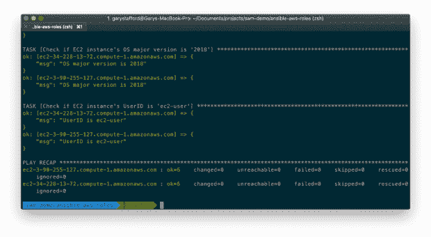

在下面的`cfn_network`角色单元测试中，注意 ansi ble[cloud formation _ facts 模块](https://docs.ansible.com/ansible/latest/modules/cloudformation_facts_module.html)的使用。该模块允许我们获得关于成功完成的 AWS CloudFormation 堆栈的事实。然后，我们可以使用这些事实来推动额外的配置和配置，或测试。在下面的任务中，我们获得了网络 CloudFormation 堆栈的输出。这些值与我们在 AWS CloudFormation 管理控制台的堆栈输出选项卡中看到的值完全相同。

```
---
- name: Test cfn_network Ansible role
  gather_facts: False
  hosts: localhost

  pre_tasks:
    - name: Get facts about the newly created cfn network stack
      **cloudformation_facts**:
        stack_name: "ansible-cfn-demo-network"
      register: cfn_network_stack_facts

    - name: List 'stack_outputs' from cached facts
      debug:
        msg: "{{ cloudformation['ansible-cfn-demo-network'].stack_outputs }}"

  tasks:
  - name: Check if the AWS Region of the VPC is {{ lookup('env','AWS_REGION') }}
    debug:
      msg: "AWS Region of the VPC is {{ lookup('env','AWS_REGION') }}"
    failed_when: cloudformation['ansible-cfn-demo-network'].stack_outputs['VpcRegion'] != lookup('env','AWS_REGION')
```

与 CloudFormation 模板类似，Ansible 角色不需要修改。项目的大多数参数与代码分离，并存储在参数存储或 CodeBuild buildspec 文件中(接下来的将讨论*)。在`defaults/main.yml`文件的角色中找到的几个参数既不是特定于帐户的，也不是特定于环境的。*

# 翻译剧本

这些角色将由我们的翻译剧本来命名。对于`cfn_network`和`cfn_compute`角色，有一组`create`和一组`delete`任务。无论是`create`还是`delete`任务都可以通过角色访问，使用`main.yml`文件并引用`create`或`delete`或[可变标签](https://docs.ansible.com/ansible/latest/user_guide/playbooks_tags.html)。

```
---
- import_tasks: create.yml
  tags:
    - create

- import_tasks: delete.yml
  tags:
    - delete
```

下面，我们看到`cfn_network`角色`create.yml`的`create`任务，在上面由`main.yml`引用。在第一个任务中使用 [cloudcormation 模块](https://docs.ansible.com/ansible/latest/modules/cloudformation_module.html)允许我们创建或删除 AWS CloudFormation 堆栈，并展示了 Ansible 的真正力量——通过模块扩展其核心功能来执行复杂的 AWS 资源供应的能力。通过切换[云模块](https://docs.ansible.com/ansible/latest/modules/list_of_cloud_modules.html#alicloud)，我们可以轻松地在 Google Cloud、Azure、AliCloud、OpenStack 或 VMWare 等平台上配置资源。

```
---
- name: create a stack, pass in the template via an S3 URL
  **cloudformation**:
    stack_name: "{{ stack_name }}"
    state: present
    region: "{{ lookup('env','AWS_REGION') }}"
    disable_rollback: false
    template_url: "{{ lookup('env','TEMPLATE_URL') }}"
    template_parameters:
      VpcCIDR: "{{ lookup('env','VPC_CIDR') }}"
      PublicSubnet1CIDR: "{{ lookup('env','PUBLIC_SUBNET_1_CIDR') }}"
      PublicSubnet2CIDR: "{{ lookup('env','PUBLIC_SUBNET_2_CIDR') }}"
      PrivateSubnet1CIDR: "{{ lookup('env','PRIVATE_SUBNET_1_CIDR') }}"
      PrivateSubnet2CIDR: "{{ lookup('env','PRIVATE_SUBNET_2_CIDR') }}"
      TagEnv: "{{ lookup('env','TAG_ENVIRONMENT') }}"
    tags:
      Stack: "{{ stack_name }}"
```

上述任务中的 CloudFormation 参数主要来自环境变量，其值由 CodeBuild 从参数存储中检索并在环境中设置。我们使用 Ansible 的[查找插件](https://docs.ansible.com/ansible/2.8/plugins/lookup.html)获得这些外部值。`stack_name`变量的值来自角色的`defaults/main.yml`文件。任务[变量](https://docs.ansible.com/ansible/latest/user_guide/playbooks_variables.html)使用 Python [Jinja2 模板系统](http://jinja.pocoo.org/)风格的编码。

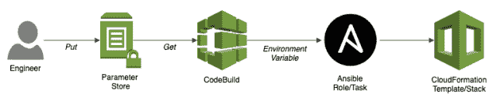

调用任务的相关 Ansible 剧本位于`playbooks`目录中，如之前在树形视图中所示。行动手册定义了一些必需的参数，比如主机列表将从哪里导出，以及调用适当的角色。在我们的简单演示中，每个剧本只调用一个角色。通常，在一个较大的项目中，您会从一个剧本中调用多个角色。下面，我们看到网络剧本，`playbooks/10_cfn_network.yml`，它调用了`cfn_network`角色。

```
---
- name: Provision VPC and Subnets
  hosts: localhost
  connection: local
  gather_facts: False

 **roles:
    - role: cfn_network**
```

# 动态库存

Ansible 的另一个主要特性在 Web 服务器配置手册`playbooks/30_web_config.yml`中演示，如下所示。注意，我们希望部署和配置 Apache HTTP Server 的主机是基于 AWS 标记值的，由对`tag_Group_webservers`的引用来指示。这间接引用了一个名为 Group 的 AWS 标记，其值为`webservers`，由 CloudFormation 应用于我们的 EC2 主机。使用动态外部库存系统生成[动态库存](https://docs.ansible.com/ansible/latest/user_guide/intro_dynamic_inventory.html)的能力是 Ansible 的一个关键特性。

```
---
- name: Configure Apache Web Servers
 **hosts: tag_Group_webservers**  gather_facts: False
  become: yes
  become_method: sudo

  roles:
    - role: httpd
```

为了生成 EC2 主机的动态清单，我们使用 Ansible [AWS EC2 动态清单](https://docs.ansible.com/ansible/latest/user_guide/intro_dynamic_inventory.html#inventory-script-example-aws-ec2)脚本、`inventories/ec2.py`和`inventories/ec2.ini`文件。该脚本动态地向 AWS 查询所有包含特定 AWS 标记的 EC2 主机，这些主机属于特定的安全组、区域、可用性区域等等。

我已经在`inventories/aws_ec2.yml`文件中定制了 AWS EC2 动态清单脚本的配置。在其他配置项中，该文件定义了`keyed_groups`。这指示脚本根据 EC2 主机的唯一 AWS 标记和标记值来清点 EC2 主机。

```
plugin: aws_ec2
remote_user: ec2-user
private_key_file: ~/.ssh/ansible
regions:
  - us-east-1
**keyed_groups:**
 **- key: tags.Name**
 **prefix: tag_Name_**
 **separator: ''**
 **- key: tags.Group**
 **prefix: tag_Group_**
 **separator: ''**
hostnames:
  - dns-name
  - ip-address
  - private-dns-name
  - private-ip-address
compose:
  ansible_host: ip_address
```

在前面的演示部分中构建了 CloudFormation 计算堆栈后，要构建主机的动态 EC2 清单，可以使用以下命令。

```
ansible-inventory -i inventories/aws_ec2.yml --graph
```

然后，您将看到所有 EC2 主机的清单，如下所示。

```
@all:
  |--@aws_ec2:
  |  |--ec2-18-234-137-73.compute-1.amazonaws.com
  |  |--ec2-3-95-215-112.compute-1.amazonaws.com
 **|--@tag_Group_webservers:**
 **|  |--ec2-18-234-137-73.compute-1.amazonaws.com**
 **|  |--ec2-3-95-215-112.compute-1.amazonaws.com**
  |--@tag_Name_Apache_Web_Server:
  |  |--ec2-18-234-137-73.compute-1.amazonaws.com
  |  |--ec2-3-95-215-112.compute-1.amazonaws.com
  |--@ungrouped:
```

注意两个 EC2 web 服务器实例，列在`tag_Group_webservers`下面。它们代表我们将在其上安装 Apache HTTP Server 的目标库存。我们也可以使用带有值`tag_Name_Apache_Web_Server`的标签 Name。

# AWS 代码构建

回想我们的图表，你会注意到 CodeBuild 的使用是我们五个 DevOps 工作流程中每一个的重要部分。CodeBuild 用于 1)验证云信息模板，2)调配网络资源，3)调配计算资源，4)安装和配置 web 服务器，以及 5)运行集成测试。

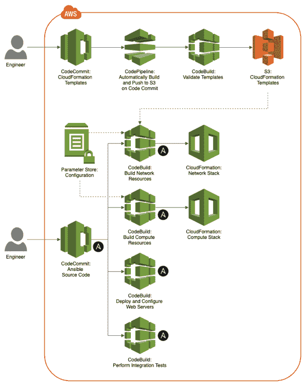

将这些流程分成单独的工作流，我们可以在不影响计算资源的情况下重新部署 web 服务器，或者在不影响网络资源的情况下重新部署计算资源。通常，大型企业中的不同团队负责这些资源类别中的每一个——架构、安全性(IAM)、网络、计算、web 服务器和代码部署。分离关注点使得共享所有权模型更容易管理。

# 构建规范

CodeBuild 项目依赖于构建规范或 buildspec 文件进行配置，如下所示。CodeBuild 的 buildspec 文件与 Jenkins 的 [Jenkinsfile](https://jenkins.io/doc/book/pipeline/jenkinsfile/) 同义。我们的五个工作流程都将使用 CodeBuild。每个 CodeBuild 项目引用一个单独的 buildspec 文件，包含在两个 GitHub 项目中，到目前为止，您已经将该文件推送到两个 CodeCommit 存储库中。


下面我们看到一个 CodeBuild 项目的 buildspec 文件的例子，它部署了我们的 AWS 网络资源，`buildspec_files/buildspec_network.yml`。

```
version: 0.2

**env:
**  variables:
    TEMPLATE_URL: "https://s3.amazonaws.com/garystafford_cloud_formation/cf_demo/network-stack.template"
    AWS_REGION: "us-east-1"
    TAG_ENVIRONMENT: "ansible-cfn-demo"
  parameter-store:
    VPC_CIDR: "/ansible_demo/vpc_cidr"
    PUBLIC_SUBNET_1_CIDR: "/ansible_demo/public_subnet_1_cidr"
    PUBLIC_SUBNET_2_CIDR: "/ansible_demo/public_subnet_2_cidr"
    PRIVATE_SUBNET_1_CIDR: "/ansible_demo/private_subnet_1_cidr"
    PRIVATE_SUBNET_2_CIDR: "/ansible_demo/private_subnet_2_cidr"

**phases:
**  install:
    runtime-versions:
      python: 3.7
    commands:
      - pip install -r requirements.txt -q
  build:
    commands:
      - ansible-playbook -i inventories/aws_ec2.yml playbooks/10_cfn_network.yml --tags create  -v
  post_build:
    commands:
      - ansible-playbook -i inventories/aws_ec2.yml roles/cfn_network/tests/test.yml
```

buildspec 文件有几个不同的部分。首先，在`variables`部分，我们定义变量。它们是从参数存储中检索的三个静态变量值和五个变量值的组合。在构建时，可以使用 AWS CLI、SDK 或从 CodeBuild 管理控制台覆盖其中的任何内容。您将需要更新一些变量来匹配您的特定环境，例如`TEMPLATE_URL`来匹配您的 S3 存储桶路径。

接下来，我们建造的`phases`。同样，如果您熟悉 Jenkins，请将这些视为包含多个步骤的阶段。第一阶段，`install`，构建一个 Docker 容器，在其中执行构建过程。这里我们用的是 Python 3.7。我们还运行一个 pip 命令，从我们的`requirements.txt`文件中安装所需的 Python 包。接下来，我们通过执行一个 Ansible 命令来执行我们的`build`阶段。

```
ansible-playbook \
  -i inventories/aws_ec2.yml \
  playbooks/10_cfn_network.yml --tags create -v
```

指挥部调用我们的战术手册，`playbooks/10_cfn_network.yml`。该命令引用了`create`标签。这导致剧本运行到`cfn_network`角色的创建任务(`roles/cfn_network/tasks/create.yml`)，如`main.yml`文件(`roles/cfn_network/tasks/main.yml`)中所定义的。最后，在我们的`post_build`阶段，我们使用第二个 Ansible 命令执行我们角色的单元测试(`roles/cfn_network/tests/test.yml`)。

# 代码构建项目

接下来，我们需要创建代码构建项目。您可以使用 AWS CLI 或从 CodeBuild 管理控制台(显示在下面的*)完成此操作。我在每个项目中的`codebuild_projects`目录中包含了单独的模板和一个创建脚本，您可以使用 AWS CLI 使用它们来构建项目。您必须修改 JSON 模板，用您自己的模板替换对我的特定的、唯一的 AWS 资源的所有引用。为了进行演示，我建议使用提供的 CodeBuild 项目模板作为指南，在 CodeBuild 管理控制台中手动创建五个项目。*

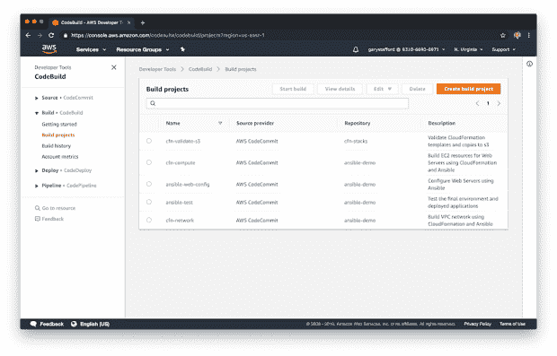

# 代码构建 IAM 角色

要执行我们的 CodeBuild 项目，我们需要一个 IAM 角色或多个角色 CodeBuild，并对 CodeCommit、S3 和 CloudWatch 等资源拥有权限。在本演示中，我选择为所有工作流创建一个 IAM 角色。然后，我允许 CodeBuild 根据需要将所需的策略分配给角色，这是 CodeBuild 的一个特性。

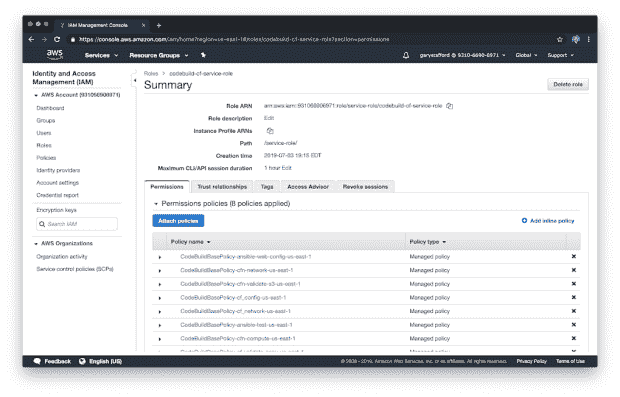

# 代码管道

除了 CodeBuild，我们还将 CodePipeline 用于五个工作流中的第一个。CodePipeline 验证 CloudFormation 模板，并将它们推送到我们的 S3 桶中。管道调用相应的 CodeBuild 项目来验证每个模板，然后将有效的 CloudFormation 模板部署到 S3。

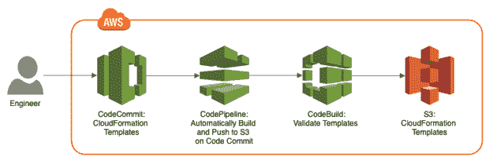

在真正的 CI/CD 方式中，每次 CloudFormation 项目的源代码提交到 CodeCommit 存储库时，都会自动执行管道。

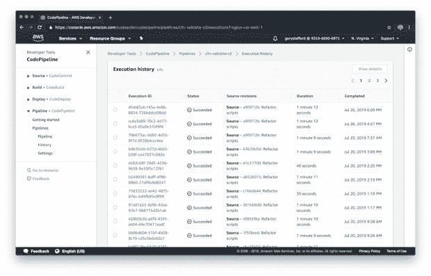

CodePipeline 调用 CodeBuild，code build 根据其 buildspec 文件执行构建。这个特殊的 CodeBuild buildspec 文件还演示了 CodeBuild 的另一个功能，即执行外部脚本。当我们有一个复杂的构建阶段时，我们可以选择调用外部脚本，比如 Bash 或 Python 脚本，而不是将命令嵌入到构建规范中。

```
version: 0.2

phases:
  install:
    runtime-versions:
      python: 3.7
  pre_build:
    commands:
      - pip install -r requirements.txt -q
      - cfn-lint -v
  build:
    commands:
 **- sh buildspec_files/build.sh** 
artifacts:
  files:
    - '**/*'
  base-directory: 'cfn_templates'
  discard-paths: yes
```

下面，我们看到的脚本叫做。这里，我们使用 CloudFormation Linter、`cfn-lint`和`cloudformation validate-template`命令来验证我们的模板，以便进行比较。这两个工具给出了略有不同但相关的林挺结果。

```
#!/usr/bin/env bash

set -e

for filename in cfn_templates/*.*; do
    cfn-lint -t ${filename}
    aws cloudformation validate-template \
      --template-body file://${filename}
done
```

与 CodeBuild 项目模板类似，我在`codepipeline_pipelines`目录中包含了一个 CodePipeline 模板，您可以使用 AWS CLI 修改和创建它。或者，我建议使用 CodePipeline 管理控制台为演示创建管道，使用提供的 CodePipeline 模板作为指南。

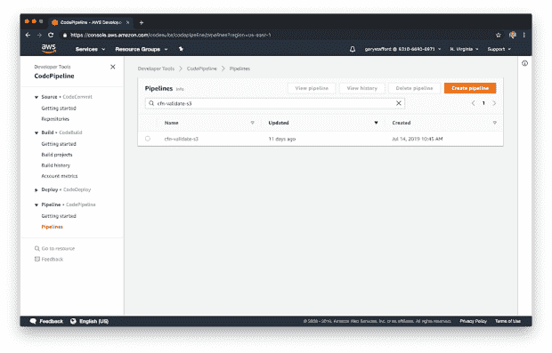

下面是最终 CodePipleine 管道的阶段视图。

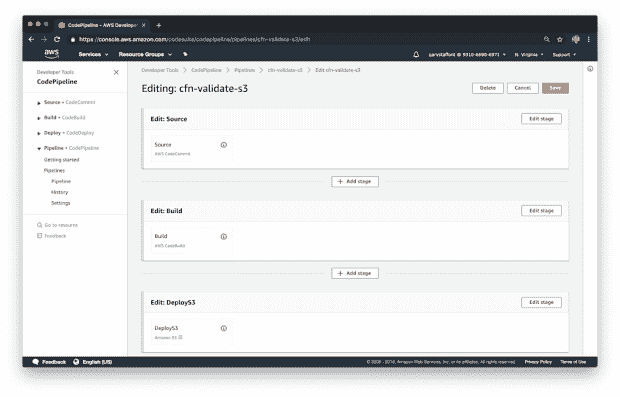

# 搭建平台

有了所有的资源、代码和 DevOps 工作流，我们应该准备好在 AWS 上构建我们的平台。首先是 CodePipeline 项目，以验证 CloudFormation 模板并将其放入您的 S3 桶中。因为您可能没有向 CloudFormation 文件 CodeCommit 存储库提交新代码，这将触发管道，所以您可以使用 AWS CLI(下面显示的*)或通过管理控制台启动管道。*

```
# list names of pipelines
aws codepipeline list-pipelines

# execute the validation pipeline
aws codepipeline start-pipeline-execution --name cfn-validate-s3
```

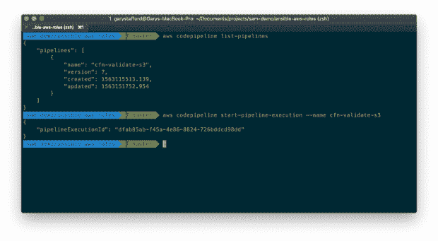

管道应该在几秒钟内完成。

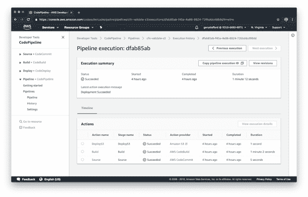

接下来，按以下顺序执行四个 CodeBuild 项目中的每一个。

```
# list the names of the projects
aws codebuild list-projects

# execute the builds in order
aws codebuild start-build --project-name cfn-network
aws codebuild start-build --project-name cfn-compute

# ensure EC2 instance checks are complete before starting
# the ansible-web-config build!
aws codebuild start-build --project-name ansible-web-config
aws codebuild start-build --project-name ansible-test
```

正如上面的代码注释所述，在确认 EC2 实例状态检查已经完成并通过之前，请注意不要启动 ansible-web-config 构建，如下所示。当 CloudFormation 完成构建新的计算堆栈时，之前的`cfn-compute`构建也将完成。然而，CloudFormation 完成的事实并不意味着 EC2 实例已经完全启动并运行。等待失败将导致安装和配置 Apache HTTP 服务器的`ansible-web-config` CodeBuild 项目构建失败。

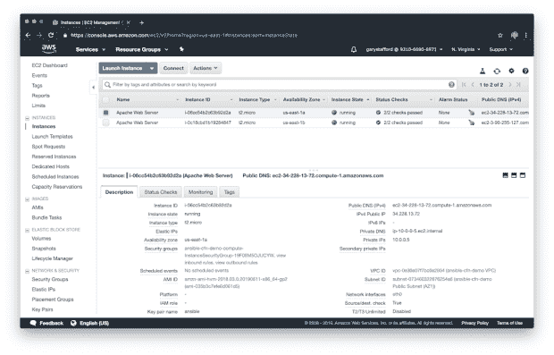

下面，我们看到`cfn_network` CodeBuild 项目首先构建了一个基于 Python 的 Docker 容器，在其中执行构建。每个构建都是在一个全新的、独立的 [Docker 容器](https://docs.aws.amazon.com/codebuild/latest/userguide/build-env-ref-available.html)中执行的，如果您希望在多个构建中持久保存之前缓存的可回答的事实或之前定义的环境变量，这可能会让您出错。

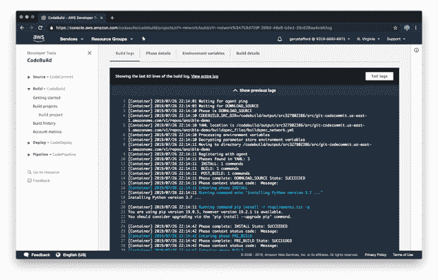

下面，我们看到了两个完整的 CloudFormation 堆栈，这是我们的 CodeBuild 项目和 Ansible 的结果。

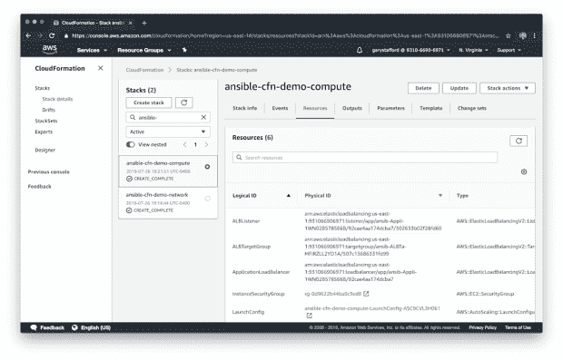

第五个也是最后一个代码构建通过使用应用程序负载平衡器的公共 DNS 名称尝试访问 Apache HTTP 服务器的默认主页来测试我们的平台。

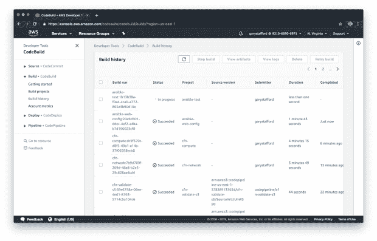

下面，我们看一个构建失败时会发生什么的例子。在这种情况下，最终的集成测试之一未能从 ALB 端点返回预期的结果。

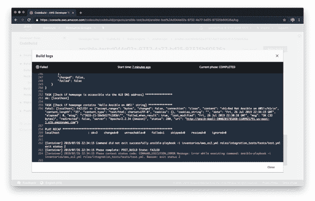

下面，在错误被修复后，我们重新运行构建，成功地重新执行了测试。

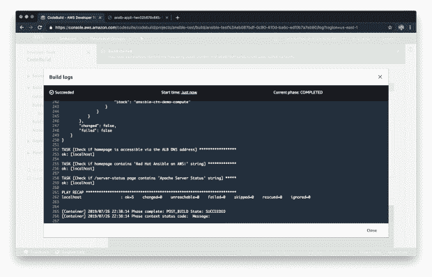

我们可以通过点击与我们在浏览器中的测试相同的 ALB 公共 DNS 名称来手动确认平台正在工作。该请求应该将我们的请求负载平衡到两个正在运行的 web 服务器的默认主页之一。通常，在这一点上，您会使用软件持续部署工具将您的应用程序部署到 Apache，例如 Jenkins、CodeDeploy、Travis CI、TeamCity 或 Bamboo。

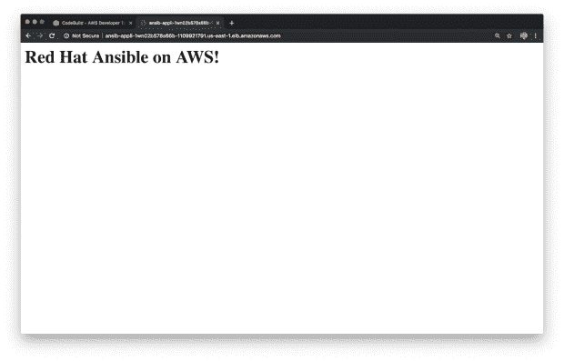

# 清理

要从演示中清理正在运行的 AWS 资源，首先删除 CloudFormation 计算堆栈，然后删除网络堆栈。为此，请执行以下命令，一次一个。这些命令调用与我们创建堆栈时调用的相同的行动手册，只是这次我们使用了`delete`标签，而不是`create`标签。

```
# first delete cfn compute stack
ansible-playbook \ 
  -i inventories/aws_ec2.yml \ 
  playbooks/20_cfn_compute.yml -t delete -v

# then delete cfn network stack
ansible-playbook \ 
  -i inventories/aws_ec2.yml \ 
  playbooks/10_cfn_network.yml -t delete -v
```

您应该观察到以下输出，表明两个 CloudFormation 堆栈都已被删除。

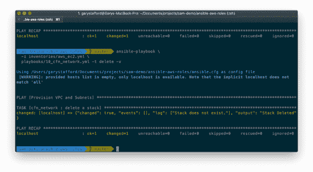

确认堆栈已从 CloudFormation 管理控制台或 AWS CLI 中删除。

*本文表达的所有观点都是我个人的，不一定代表我现在或过去的雇主或他们的客户的观点。*