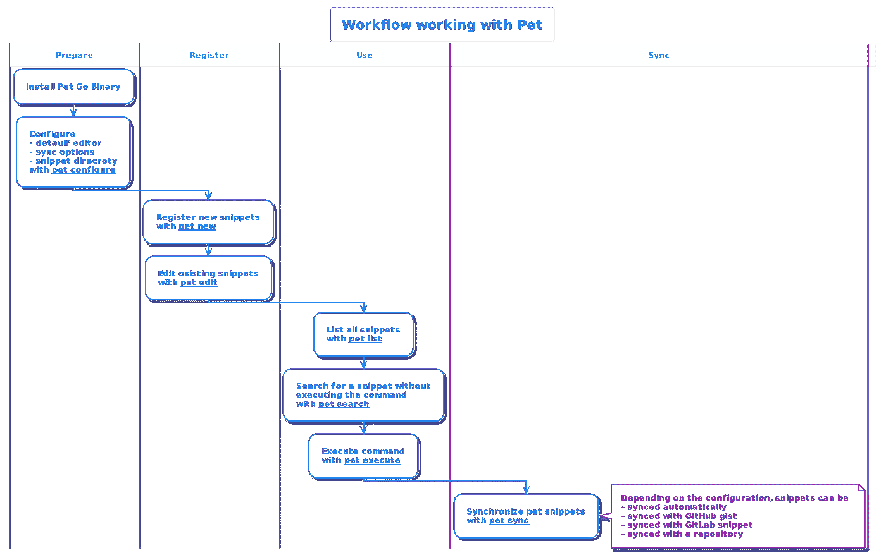

# 管理命令片段很难；但是还是有希望的

> 原文：<https://itnext.io/managing-command-snippets-is-hard-but-there-is-hope-dc6f046759bc?source=collection_archive---------1----------------------->

潘卡杰·帕特尔在 [Unsplash](https://unsplash.com/?utm_source=unsplash&utm_medium=referral&utm_content=creditCopyText) 上的照片

## 介绍

如果你经常通过 [CLIs(命令行界面)](https://en.wikipedia.org/wiki/Command-line_interface)与软件交互，也许你是一名系统管理员、自动化工程师、软件开发人员或者仅仅是超级用户，这篇博客是为你而写的。

使用 CLIs 一段时间后，您将收集到大量代码片段。常用的会在你的*里有别名。巴沙尔或者。zshrc 或. profile.ps1* 文件。那些你不常使用的，嗯，也许可以在历史记录中查看。别名可以被遗忘，历史可以被抹去。一个解决方案是 *grep 或者 select-string* ，但是没有办法通过描述进行搜索。

你知道你*将来可能*需要的命令/片段怎么样？把它们放在一边，需要的时候快速找到。也许创建一个文本文件，或者像我以前做的那样，有一个方便的要点？这是可能的，但是很麻烦，而且必须复制命令才能执行。

也有书签，这将是方便的，能够找到并直接从命令行导航到网页。

## 快速和简约的代码片段管理器

介绍 Pet，用 go 写的 snipper manager。

 [## GitHub - knqyf263/pet:简单的命令行片段管理器，用 Go 编写。

### 简单的命令行代码片段管理器，用 Go 编写，可以在代码片段中使用变量(或)。pet 是用 Go 写的，而且…

github.com](https://github.com/knqyf263/pet) 

请务必阅读宠物文档，一切都解释得很清楚。

总而言之，工作流程非常简单

来源:作者，基于 Pet 文档

如果您想体验宠物，请访问:

 [## Pet，一个 CLI 代码片段管理器| javajon | Katacoda

### 的美在于它的简单。虽然在开源和商业中有其他片段和要点管理器…

katacoda.com](https://katacoda.com/javajon/courses/kubernetes-tools/snippets-pet) 

当你这么做的时候，看看约翰·坦的其他卡塔克达场景，它们的质量是最高的。

## 有用的片段和链接

我的代码片段和书签大多是关于 Kubernetes 和相关技术的。我最近在这个[博客](/tips-tricks-for-cka-ckad-and-cks-exams-cc9dade1f76d)上分享了书签和命令。现在我想和你分享同样的信息，但是这次用 Pet。

您可以在这个库中找到书签和命令片段。这仍然是相当多的 WIP，但我会继续添加新的书签和命令！

还有其他非常有用的命令片段来源。对于我们这些 Kubernetes 爱好者来说，Johnatan 很友好地将所有命令从 [Kubernetes Cheatsheet](https://kubernetes.io/docs/reference/kubectl/cheatsheet/) 移植到了[的 Pet toml 格式中。](https://gist.github.com/javajon/131a7f26c11a03d741e6bcefb857c496)

## 结论

用像 Pet 这样的工具管理命令和书签是我很久以来一直在寻找的东西。我希望您也能发现它的价值，让您的 CLI 工作流程更有成效。