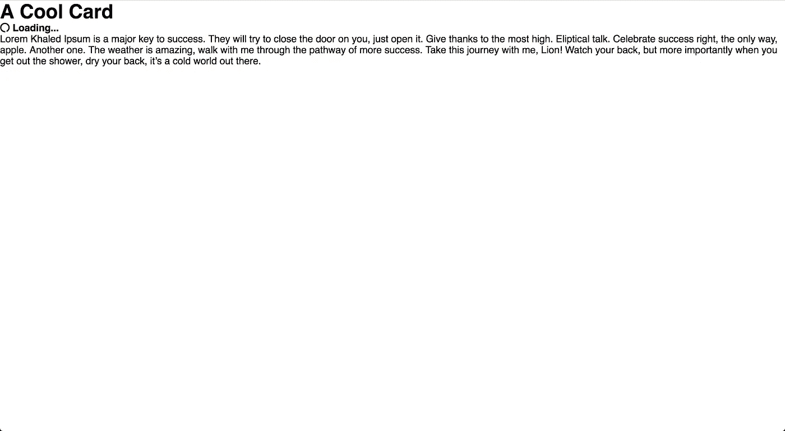
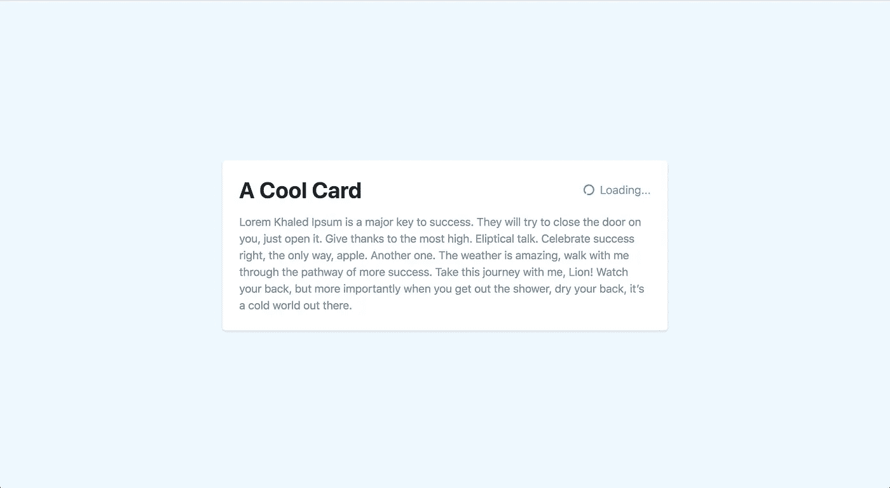

# 管理 Vue.js 组件中的本地状态

> 原文：<https://itnext.io/managing-local-state-in-vue-js-components-d5d92fb432?source=collection_archive---------3----------------------->


> [*点击* k 在 LinkedIn 上分享这篇文章](https://www.linkedin.com/cws/share?url=https%3A%2F%2Fitnext.io%2Fmanaging-local-state-in-vue-js-components-d5d92fb432%3Futm_source%3Dmedium_sharelink%26utm_medium%3Dsocial%26utm_campaign%3Dbuffer)

通常，当我们听到 Vue.js 和状态管理时，我们会立即想到 Vuex 或其他强大的状态管理解决方案。然而，我们大多数的国家管理并没有在如此大的规模上发生。相反，它隐藏在我们的 Vue 组件中。

如果您仍然对我所说的内容感到困惑，那么让我们来看一个地方政府的例子。

```
<template>
    <div>
        <div v-if="state === 'default'">
            <h1>Default State</h1>
        </div>
        <div v-else>
            <h1>Every Other State</h1>        
        </div>
    </div>
</template><script>
    export default {
        data: function () {
            return {
                state: 'default'
            }
        }
    }        
</script>
```

在我们的`data`中，我们有一个`state`属性，我们用它来跟踪组件的不同状态。很简单，对吧？

我注意到，在 Vue 社区中，我们通常用两种不同的模式来管理本地状态。第一个，像上面的例子一样，依赖于一个描述性的字符串。另一种模式依赖于嵌套对象和布尔值，如下所示:

```
<template>
    <div>
        <div v-if="state.visbility">
            <h1>Default State</h1>
        </div>
        <div v-else>
            <h1>Every Other State</h1>        
        </div>
    </div>
</template><script>
    export default {
        data: function () {
            return {
                state: {
                    visiblity: true
                }
            }
        }
    }        
</script>
```

这两种方法都工作得很好，但是让我们更仔细地看看它们，并检查它们的优缺点。

# 该设置

在我们开始之前，让我们为自己设置一个加载通知组件。为了让一切尽可能快地启动和运行，我们将使用 Vue CDN 而不是完整版。

让我们从一个包含我们的 Vue CDN 的空白`index.html`文件开始。

```
<!DOCTYPE html>
<html lang="en">
<head>
    <meta charset="UTF-8">
    <title>Local State Management</title>
</head>
<body>
    <script src="https://cdn.jsdelivr.net/npm/vue@2.5.13/dist/vue.js"></script>
</body>
</html>
```

现在，让我们添加 Tailwind CSS 和 Font Awesome CDNs，这样我们就有了一个更好看的例子。

```
<!DOCTYPE html>
<html lang="en">
<head>
    <meta charset="UTF-8">
    <title>Local State Management</title>
    <link href="https://cdn.jsdelivr.net/npm/tailwindcss/dist/tailwind.min.css" rel="stylesheet">
</head>
<body>
    <script defer src="https://use.fontawesome.com/releases/v5.0.9/js/all.js" integrity="sha384-8iPTk2s/jMVj81dnzb/iFR2sdA7u06vHJyyLlAd4snFpCl/SnyUjRrbdJsw1pGIl" crossorigin="anonymous"></script>
    <script src="https://cdn.jsdelivr.net/npm/vue@2.5.13/dist/vue.js"></script>
</body>
</html>
```

太好了！现在，我们可以搭建一些 HTML。对于这个例子，我们需要一个简单的 UI 卡，在标题中有一个小小的 loader 组件。

```
<!DOCTYPE html>
<html lang="en">
<head>
    <meta charset="UTF-8">
    <title>Local State Management</title>
    <link href="https://cdn.jsdelivr.net/npm/tailwindcss/dist/tailwind.min.css" rel="stylesheet">
</head>
<body>
    <div>
        <div>
          <h1>A Cool Card</h1>
          <h4 id="loader">
            <i class="fas fa-circle-notch fa-spin"></i> Loading...
          </h4>
        </div>
        <div>
          <p>Lorem Khaled Ipsum is a major key to success. They will try to close the door on you, just open it. Give thanks to the most high. Eliptical talk. Celebrate success right, the only way, apple. Another one. The weather is amazing, walk with me through the pathway of more success. Take this journey with me, Lion! Watch your back, but more importantly when you get out the shower, dry your back, it’s a cold world out there.</p>
        </div>
    </div>

    <script defer src="https://use.fontawesome.com/releases/v5.0.9/js/all.js" integrity="sha384-8iPTk2s/jMVj81dnzb/iFR2sdA7u06vHJyyLlAd4snFpCl/SnyUjRrbdJsw1pGIl" crossorigin="anonymous"></script>
    <script src="https://cdn.jsdelivr.net/npm/vue@2.5.13/dist/vue.js"></script>
</body>
</html>
```

如果我们在浏览器中看一下，我们可以看到所有的部分都在那里，但看起来不太好。



让我们添加一些顺风类来使我们的卡片居中，使它更突出，并更好地设计字体。

```
<!DOCTYPE html>
<html lang="en">
<head>
    <meta charset="UTF-8">
    <title>Local State Management</title>
    <link href="https://cdn.jsdelivr.net/npm/tailwindcss/dist/tailwind.min.css" rel="stylesheet">
</head>
<body class="flex item-center justify-center h-screen bg-blue-lightest font-sans">
    <div class="p-6 bg-white rounded shadow max-w-md m-auto">
        <div class="flex justify-between items-center mb-4">
          <h1 class="text-black">A Cool Card</h1>
          <h4 id="loader" class="font-light text-blue">
            <i class="fas fa-circle-notch fa-spin mr-1"></i> Loading...
          </h4>
        </div>
        <div class="text-grey-dark leading-normal">
          <p>Lorem Khaled Ipsum is a major key to success. They will try to close the door on you, just open it. Give thanks to the most high. Eliptical talk. Celebrate success right, the only way, apple. Another one. The weather is amazing, walk with me through the pathway of more success. Take this journey with me, Lion! Watch your back, but more importantly when you get out the shower, dry your back, it’s a cold world out there.</p>
        </div>
    </div> <script defer src="https://use.fontawesome.com/releases/v5.0.9/js/all.js" integrity="sha384-8iPTk2s/jMVj81dnzb/iFR2sdA7u06vHJyyLlAd4snFpCl/SnyUjRrbdJsw1pGIl" crossorigin="anonymous"></script>
    <script src="https://cdn.jsdelivr.net/npm/vue@2.5.13/dist/vue.js"></script>
</body>
</html>
```

一点点 CSS 能为一个 UI 做的事情是惊人的。



最后，让我们搭建出可以在字符串和布尔状态方法之间共享的 Vue.js 代码。

我们将首先初始化一个 Vue 实例，设置`el`，将模板转换为数据驱动，并清除我们需要的`data`和计算属性。

```
<!DOCTYPE html>
<html lang="en">
<head>
    <meta charset="UTF-8">
    <title>Local State Management</title>
    <link href="https://cdn.jsdelivr.net/npm/tailwindcss/dist/tailwind.min.css" rel="stylesheet">
</head>
<body class="flex item-center justify-center h-screen bg-blue-lightest font-sans">
    <div class="p-6 bg-white rounded shadow max-w-md m-auto">
        <div class="flex justify-between items-center mb-4">
          <h1 class="text-black">A Cool Card</h1>
          <h4 v-if="state'" id="loader" class="font-light text-blue">
            <i v-show="state" class="fas fa-circle-notch fa-spin mr-1"></i>
            <i v-show="state" class="far fa-check-circle mr-1"></i>
            {{ header }}
          </h4>
        </div>
        <div class="text-grey-dark leading-normal">
          <p>Lorem Khaled Ipsum is a major key to success. They will try to close the door on you, just open it. Give thanks to the most high. Eliptical talk. Celebrate success right, the only way, apple. Another one. The weather is amazing, walk with me through the pathway of more success. Take this journey with me, Lion! Watch your back, but more importantly when you get out the shower, dry your back, it’s a cold world out there.</p>
        </div>
    </div> <script defer src="https://use.fontawesome.com/releases/v5.0.9/js/all.js" integrity="sha384-8iPTk2s/jMVj81dnzb/iFR2sdA7u06vHJyyLlAd4snFpCl/SnyUjRrbdJsw1pGIl" crossorigin="anonymous"></script>
    <script src="https://cdn.jsdelivr.net/npm/vue@2.5.13/dist/vue.js"></script>
    <script>
      var shoppingList = new Vue({
        el: '#loader',
        data: {
          state: null
        },
        computed: {
          header() { return '';
          }
        }
      })
    </script>
</body>
</html>
```

嘭嘭嘭，我们找到了一个很好的组件。现在让我们看看管理我们国家的不同方式。

# 布尔方法

首先，布尔方法。这是我发现的第一种管理状态的方法，而且很有意义。我发现我通常使用状态来处理 Vue 的条件指令，所以我会经常看到自己切换状态布尔值。

这有点抽象，所以让我们在组件中将它付诸实践。我们首先将`state`属性设置为一个对象，然后为不同的状态添加一些布尔属性。

```
data: {
    state: {
        default: true,
        loading: false,
        done: false
    }
}
```

如您所见，我们明确了想要管理的状态。我认为这是这种方法最大的好处——通过查看状态对象，您可以看到所有可能的组件状态。

如果您正在处理一个大型的复杂组件，这可能会非常有用。但是，如果您发现自己管理了太多的状态属性或嵌套的状态对象，那么这可能是重构为更小的组件的一种代码味道。

让我们完成组件的其余部分，以便它能够响应我们的新状态数据。我们可以向我们的 header computed 属性添加一些逻辑，以便根据状态返回适当的字符串。

```
computed: {
  header() {
       if(this.state.loading) {
      return 'Loading...';
    } if(this.state.done) {
      return 'Done!';
    } return '';
  }
}
```

然后我们可以更新我们的模板来显示相应的图标。

```
<h4 v-if="!state.default" id="loader" class="font-light text-blue">
    <i v-show="state.loading" class="fas fa-circle-notch fa-spin mr-1"></i>
    <i v-show="state.done" class="far fa-check-circle mr-1"></i>
    {{ header }}
</h4>
```

正如你所看到的，通过这个方法，我们非常清楚地知道模板和计算属性应该如何对我们的状态做出反应。正如我前面提到的，这就是使用对象方法的好处。然而，这种方法的缺点是更新我们的状态可能很繁琐。

现在，如果我们想切换一个状态，我们必须重置所有其他状态。想象一下，如果我们希望状态的某些部分被切换，而其他部分应该被重置。突然间，这变得非常棘手，因为我们需要明确我们想要转换到什么状态。

现在，让我们看看字符串方法与对象方法的比较。

# 字符串方法

对于 String 方法，我们不会使用一个对象来维护所有可能状态组合的列表。相反，我们只是将状态设置为一个字符串来跟踪当前状态。

让我们看看如何使用我们的组件来实现这一点。我们首先将数据更新为一个字符串。

```
data: {
    state: 'default',
}
```

使用这种方法，我们可以快速判断组件的当前状态。当我们调试一个问题或者测试我们组件的不同排列时，这是非常有用的。

通过完成我们的组件，让我们更深入地了解一下这一点。同样，我们将从更新我们的计算属性开始。

```
computed: {
  header() {
       if(this.state === 'loading') {
      return 'Loading...';
    } if(this.state === 'done') {
      return 'Done!';
    } return '';
  }
}
```

现在我们可以更新模板了。

```
<h4 v-if="state !== 'default'" id="loader" class="font-light text-blue">
    <i v-show="state === 'loading'" class="fas fa-circle-notch fa-spin mr-1"></i>
    <i v-show="state === 'done'" class="far fa-check-circle mr-1"></i>
    {{ header }}
</h4>
```

我相信您已经发现，与对象方法相比，字符串方法有相反的优点和缺点。它非常擅长显示组件的当前状态，但是很难看到所有可能的状态。

这可以通过添加一个列出所有状态的注释来缓解，但这也不是最好的解决方案。此外，使用 String 方法意味着您只需要担心组件中的一个“活动”状态。

虽然对于像我们的加载器这样的简单组件来说这可能是真的，但情况并不总是这样。如果您想到一个表单组件，我们可能必须独立地跟踪提交和错误状态。这可能很难只用一个字符串来管理。

# 总结

对象和字符串方法都是管理本地状态的可行选项。虽然对象方法很好地为我们提供了很多灵活性和对所有可能状态的可见性，但它可能很难管理和查看任何给定时刻的当前状态。

同时，字符串方法呈现出相反的优点和缺点。它在显示当前状态方面非常出色，并且非常容易更新，但是很难跟踪所有可能的排列。

在我的项目中，我目前的经验是总是从字符串方法开始。这样我就可以快速遍历组件需要的状态。如果我发现自己依赖于许多不同的状态，那么我会考虑对 Object 方法进行重构，或者看看能否将我的组件分成更小的部分。

当你熟悉这些方法时，我相信你会有自己的心流。也许你会想出一个更好的方法！和往常一样，有任何问题可以在 Twitter 上问我。下次再见，祝你研究愉快！