# 管理多语言应用程序

> 原文：<https://itnext.io/managing-multilingual-applications-c97628d54011?source=collection_archive---------4----------------------->

***头注:*** *对不起乡亲们，项目因为资金问题而中止，无法维持。本文将为其他开发人员提供灵感。*

今天我要向大家介绍我们的新服务，叫做 T9N 经理。

BLUF:对个人和开源项目是免费的。在不久的将来，我们还将推出具有扩展功能的付费商业版。

构建一个大规模的应用程序对团队来说很难，对预算低的单个开发人员来说更难，如果应用程序是多语言的，对任何人来说更难。

在我们正在进行的项目中，我们亲身体验了这一点，然后 T9N Manager 诞生了。当它成为我们应用程序中的一个独立模块时，我们希望将其分离出来，并共享给开发人员。

我们主要在前端开发 Vue.js，在后端开发 PHP。所以我们生成的翻译文件应该可以与 [vue-i18n](https://github.com/kazupon/vue-i18n) 一起使用。它基本上需要这样的文件格式:

```
// translations-all.jsexport const messages = {
  en: {
    message: {
      hello: "hello world!"
    }
  },
  tr: {
    message: {
      hello: "merhaba dünya!"
    }
  }
}
```

通过适当的配置，您可以将翻译分成不同的文件:

```
*// en-US.js*export const messages = {
  message: {
    hello: "hello world!"
  }
}*// tr-TR.js*export const messages = {
  message: {
    hello: "merhaba dünya!"
  }
}
```

并删除指定的导出:

```
*// en-US.js*export default {
  hello: "hello world!"
}*// tr-TR.js*export default {
  hello: "merhaba dünya!"
}
```

随着你的密钥数量的增加，保持这些文件同步会变得越来越困难。大多数情况下，vue-i18n 或框架中的其他插件会告诉您文件中的某个键何时丢失，但这并不能减轻每次忘记添加第二个或第三个键(甚至第四个键)时向前两步、向后一步的痛苦。)类翻译文件。

我甚至不想提及当您决定一个键对于它所具有的上下文来说不是非常确定的并且需要被改变时会发生什么。你知道我的意思吧？我打赌是的，你是开发商。现在你回到你所有的翻译文件，找到那个难看的键，换上一个新的。

然后 T9N 经理来帮你。

当您注册并登录 T9N 时，项目屏幕显示空白:

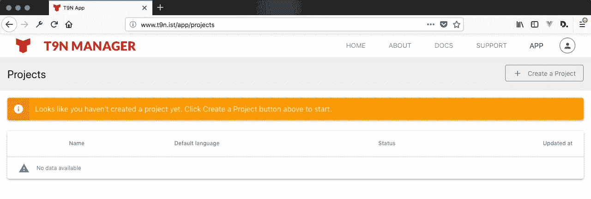

你知道它想要什么。

T9N 与翻译项目合作。您应该首先创建一个项目:

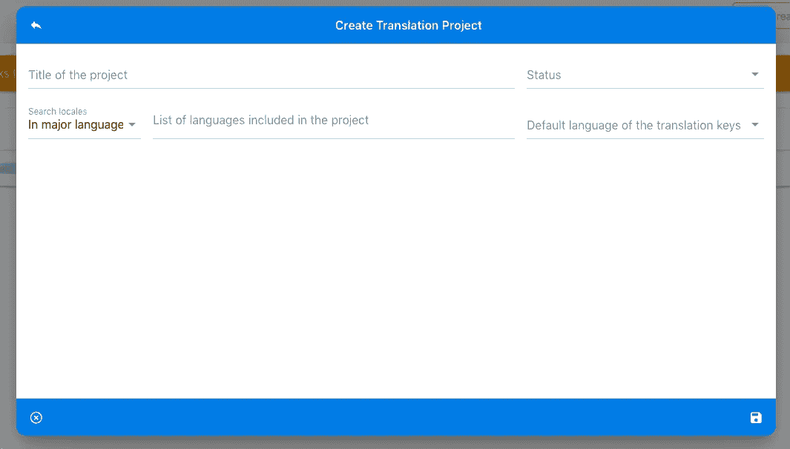

一种奇特的输入模式

多亏了 jacobbubu ，我们的数据库中列出了 700 多个地区。您可以搜索并添加您希望包含在项目中的数量。还有- *目前仅用于提供信息的* - *状态*和*默认语言*选项。默认语言选项**将**允许用户产生这样的文件；

```
*// tr-TR.js*export default {
  "hello world!": "merhaba dünya!"
}
```

因此，如果您使用应用程序的本地语言的翻译来定义您的键，在上面的示例中是英语(美国),您就不需要每次都生成 en-US.js 文件。

创建第一个项目后，它将显示在列表中，如下所示:

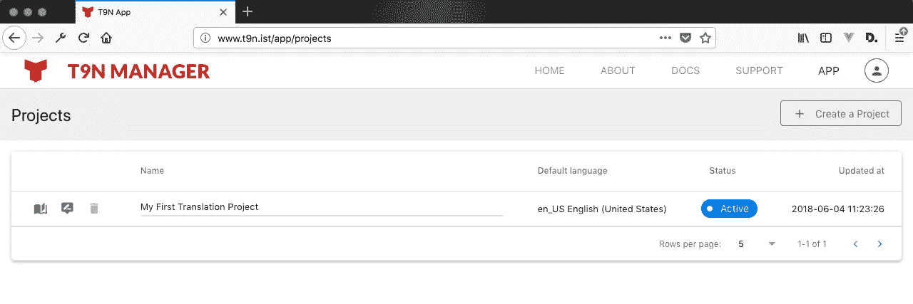

项目名称下面的淡蓝色线条(实际上是一个进度条)以百分比显示了您的键/翻译状态的进度。所以你会知道你走了多远。

当您通过单击列表开头的“打开书本”图标进入项目时，您会看到以下屏幕:

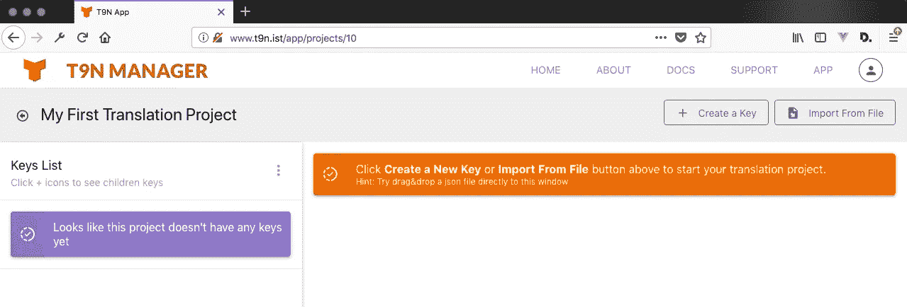

您可以通过点击“创建关键点”按钮来启动项目，或者通过拖放到屏幕上来导入现有的翻译文件。文件导入目前支持 js 和 json 文件，我们计划很快加入 XML 文件。

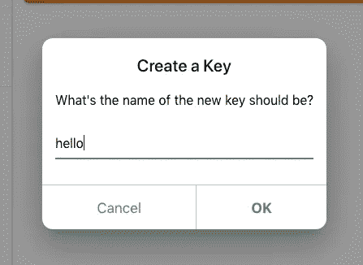

一旦你创建了一个新的密钥，你会在工具条上看到它。

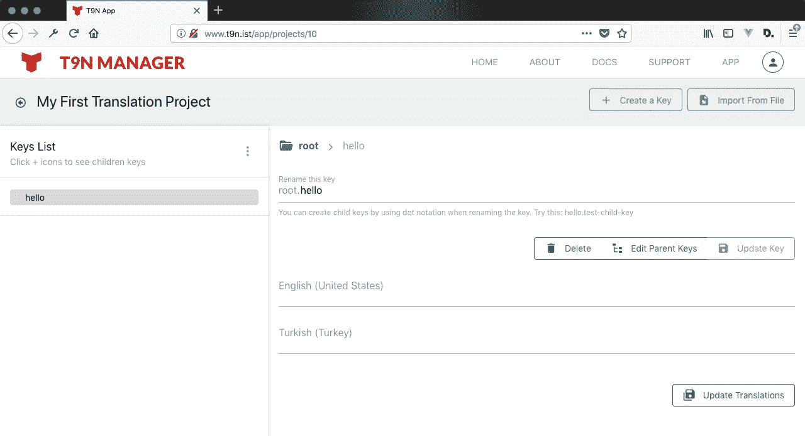

我们的第一把钥匙！

您可以选择和取消选择边栏上列出的键。当你选择一个键时，你会看到上面的屏幕。*重命名此项*字段显示根的前缀，仅供参考。当你需要在你的文件中使用这个键时，例如 vue-i18n 插件的 Vue.js，它应该这样使用:$('hello ')

现在我们来到了精彩的部分。

我们希望 T9N 比在 IDE 上编辑 js 文件更快。为了实现这个想法，我们开发了一种方法，用点符号在父键下创建新的键。

通常，要在另一个键下创建新的键，必须选择该键，然后再次单击“创建键”按钮。对于一个单独的子键来说并不难，但是当你需要创建一个像这样的键树时，这就成了一项令人精疲力竭的工作:

```
export default {
  "modules": {
    "layout": {
      "sidebar": {
        "alerts": {
          "some-alert": "hey yo!",
          "some-negative-alert": "nope dude!"
        }
      }
    }
  }
}
```

要结束像上面这样的嵌套对象，要创建 ***的某个报警*** 键，应该单击创建键按钮五次并按回车键。

为了克服这个问题，我们已经实现了点符号的关键重命名功能。当您更新即将成为父键时，您只需要在新键之间使用点:

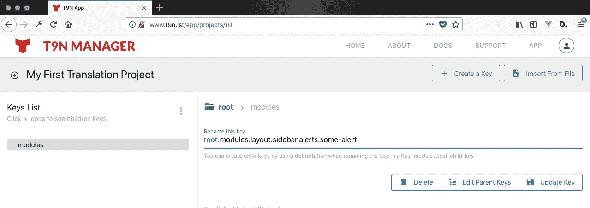

当您点击“更新密钥”按钮时，您会看到您的边栏有了新的外观:

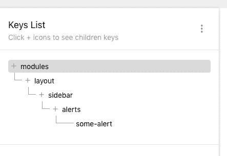

很快，不是吗？

创建键很快。但是重新安置他们呢？我们还开发了一个更快的版本，从那里剪切并粘贴到这里。键列表标题旁边有一个秘密菜单。让我们单击重新定位选定的关键项。

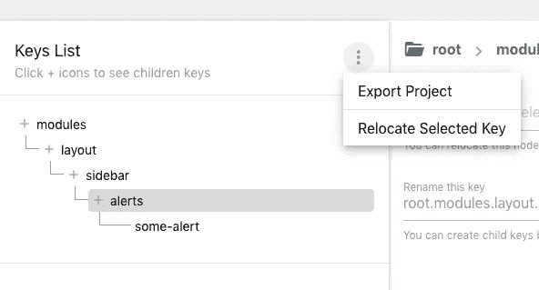

当你点击它，侧边栏变成关键重新定位模式；

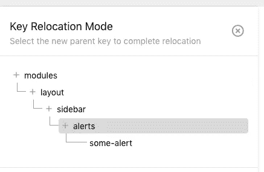

您可以选择一个新的父键，按 Esc 取消或单击取消图标。一旦选择了新的父项，就需要用新的父项结构更新键:

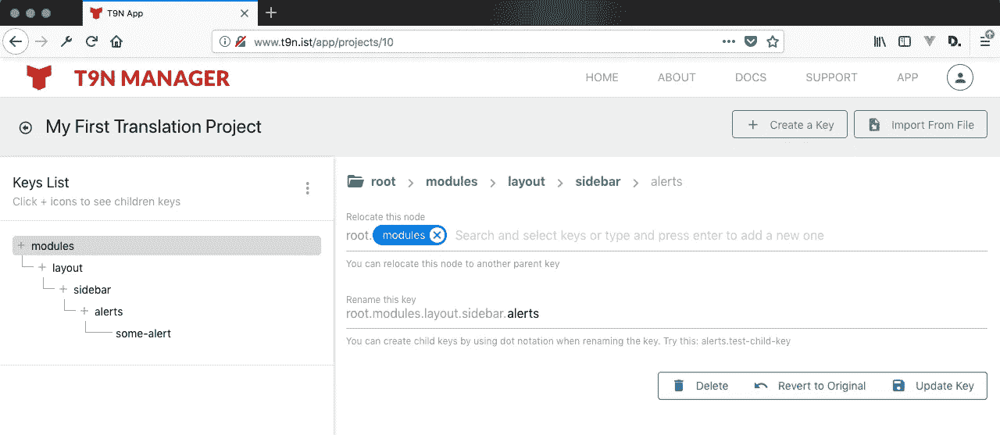

只需点击更新键按钮。

您可以在这里用新的父项更新密钥，或者通过点击“恢复到原始状态”按钮来取消重新定位。

不使用菜单中的重定位链接，您可以随时使用“编辑父项键”按钮将键重定位到另一个父项。

当你在上面这个屏幕上时，你也可以创建新的父键。只需在 *Relocate this node* 字段中键入您的新键名，然后按回车键。

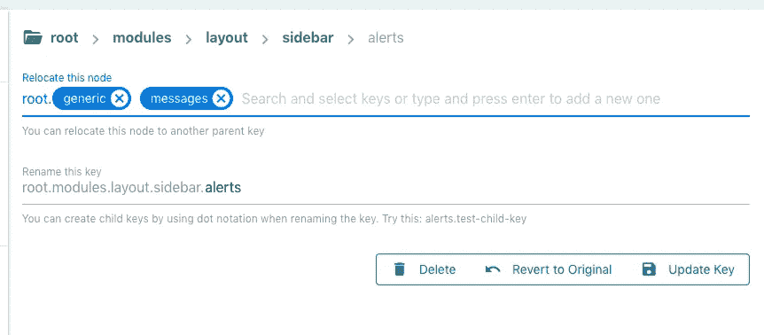

当您更新密钥时，您会在边栏上看到您的新结构:


现在您知道了如何创建和重定位关键点。是时候导出我们的文件了。进入秘密菜单，找到/点击导出项目链接。

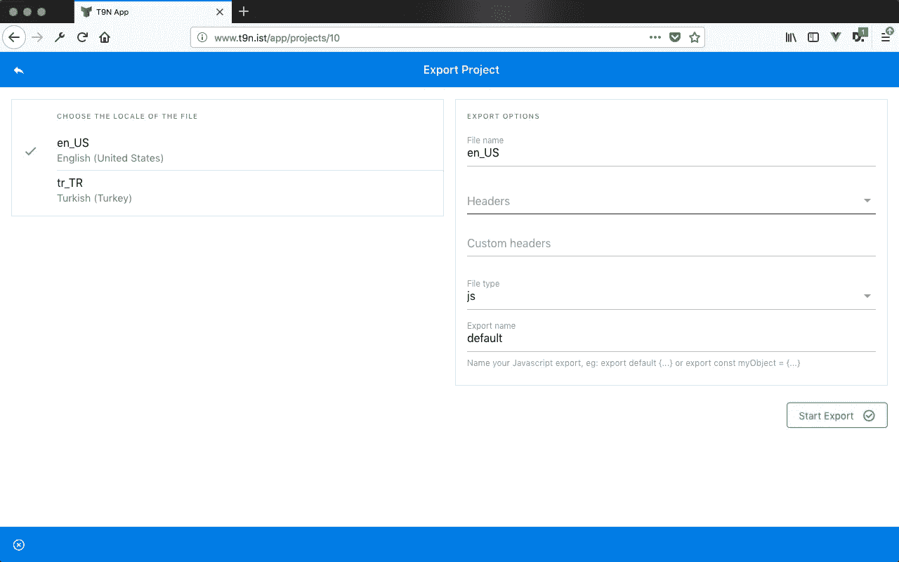

在这个屏幕中，你应该从左边选择区域设置，如果你想的话重命名你的文件名，如果你需要从你的 linters 中排除这个文件的话添加一些标题。您还可以选择导出纯 json 文件或带有默认或自定义导出表达式的 js 文件。如果您将浏览器的下载目标移植到您的语言文件夹，您将不会从您的下载文件夹复制/粘贴下载的文件到您的项目。

关于 T9N 有很多要讲的，但大部分是它的文档内容。

[Vue.js](http://vue-js.org) 和[类星体框架](http://quasar-framework.org)使得创造成为可能，我个人喜欢提到那些为开源宇宙努力工作的人。

如果你想将 T9N 用于你当前或下一个项目，请分享这个帖子，并向我们表示你的支持。