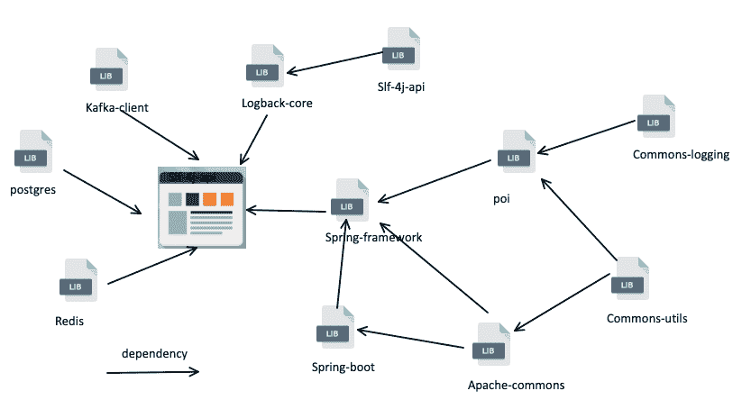
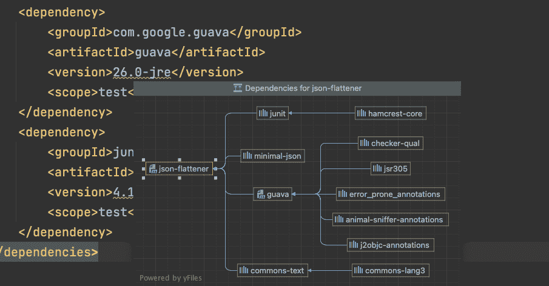
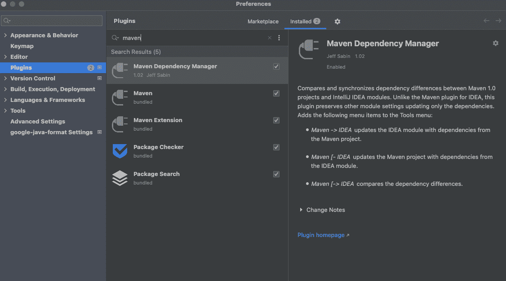
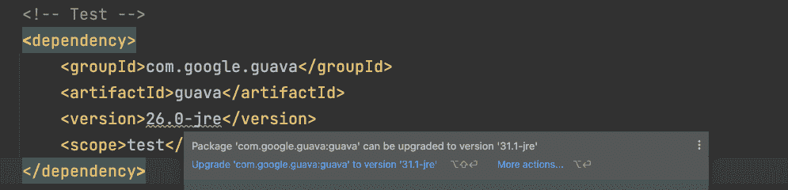
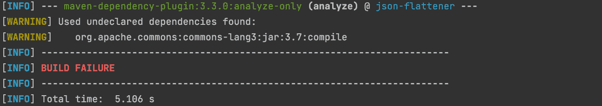

# 通过自动化、安全团队和分叉来管理开源组件

> 原文：<https://itnext.io/managing-open-source-components-with-automation-security-teams-and-forking-31ffe643ec83?source=collection_archive---------3----------------------->



来自:作者

如今，在项目开发中，开源项目提高了我们的工作效率。我们在我们的项目中使用了大量的这类工具来增加各种各样的特性。我们直接或间接地链接到各种开源组件。

构建应用程序就像在云中玩乐高，我们用从 CNCF 的软件供应链中挑选的开源组件一层一层地构建我们的集群。一小部分运营商自建但仍基于 kubebuilder。

# 开源组件的优势

开源组件受欢迎有三个原因。

## **高效**

当我们不需要从头开始时，我们能够更加关注项目的业务需求。

## 高质量的

一个成熟的开源项目，很可能已经在无数的应用中使用过，经历过无数的优化和迭代周期。使用这些是享受那些伟大思想的成果。

## 免费

根据软件许可证，我们有权免费复制、更改和使用代码。

# 管理开源组件的最佳方式

管理开源组件有 3 种最好的方法。

## 自动化工具

帮助[开源库存管理](https://www.mend.io/open-source-inventory/)的工具可以大大减轻你的负担。

首先，这些工具扫描依赖项，以找到安全漏洞、要升级的版本、合规性问题等。然后，他们从其他安全机构获取并更新漏洞和潜在风险，并在之后通知用户。最后，它们与其他流行的 CI/CD 工具协同工作，降低了安全风险，提高了开发人员的工作效率。

## 安全团队

如果您正在处理来自 Java、Go 和 Cloud 的多个场景的许多项目和许多依赖项，那么建立自己的安全团队是必要的。

团队可以谨慎地选择开源依赖项，根据应用程序、用户和维护来确定项目是否可靠。它可以建议公司内其他项目的开源依赖关系。它可以识别恶意项目，剔除低质量的开源项目。

该团队还可以采用开源安全漏洞扫描工具来自动化跟踪哪些依赖库需要升级的过程。

## 分支

免费更新为我们提供了更广阔的视野。我们可以克隆开源项目，并应用更改来避免我们自己的安全风险。

最大的挑战在于分叉后与来自上游的更新合并。我们使用一些开源报告工具来实现一些简单的更新，并从上游发布关于更新的提醒。让我们看看 Intellij 和 Maven 的例子。

Intellij 一直在推进它的 OSS 管理，它默认支持的 maven 依赖管理可以可视化依赖包。例如，我们可以很容易地在分叉的 [json-flattener](https://github.com/PatrickChenSe/json-flattener) 中查看依赖的开源库。



然后，通过社区中的插件，比如 [Maven 依赖插件](https://plugins.jetbrains.com/plugin/697-maven-dependency-manager)，我们可以监控库的更新。

安装此插件。



IDE 提醒我们过时的依赖版本。



在 Java 项目中，Maven 可以将 OSS 管理集成到 CI/CD 中。如果在 maven 验证过程中发现了未声明的依赖项，则构建失败，以确保我们的依赖项更新管理能够跟上。

将以下插件添加到`pom.xml`，并重新运行`mvn verify`。



社区提供了[依赖检查](https://jeremylong.github.io/DependencyCheck/dependency-check-maven/check-mojo.html#versionCheckEnabled)，一个比 apache maven 依赖分析器更强大的工具，支持许多配置。我们可以用一个 xml 文件定制验证策略，这个文件叫做抑制文件。

配置这个插件，然后是 xml。所有依赖于低于特定版本的库的项目都将无法编译。

```
<?xml version="1.0" encoding="UTF-8"?>
<suppressions >
  <suppress>
     <notes><![CDATA[
     file name: some.jar
     ]]></notes>
     <sha1>66734244CE86857018B023A8C56AE0635C56B6A1</sha1>
     <cpe>cpe:/a:apache:struts:2.0.0</cpe>
  </suppress>
</suppressions>
```

进一步用更多的功能定制您自己的分析器，比如如果有过时的依赖项，就失败构建。我的灵感来自 Apahce 的 [maven 依赖分析器](https://github.com/apache/maven-dependency-analyzer)，它的 API 可以用来快速解析`pom.xml`以获得依赖列表。

# 结论

开源文化是现代软件开发花园中最美丽的花朵之一，值得我们精心呵护。随着开源组件的蓬勃发展，如果我们知道如何合理地管理它们，我们可以事半功倍。

在一些工具链的帮助下，我们可以不费吹灰之力地管理开源依赖。从而避免了许多风险。至于用哪个？这取决于你的项目和开发模式。

但无论如何，我们最好不要放弃管理，让风险控制我们。一个全面的 OSS 管理系统需要整个公司的共同努力。这不仅仅是开发人员或安全人员的工作。让互联网变得更美好是所有成员的共同责任。