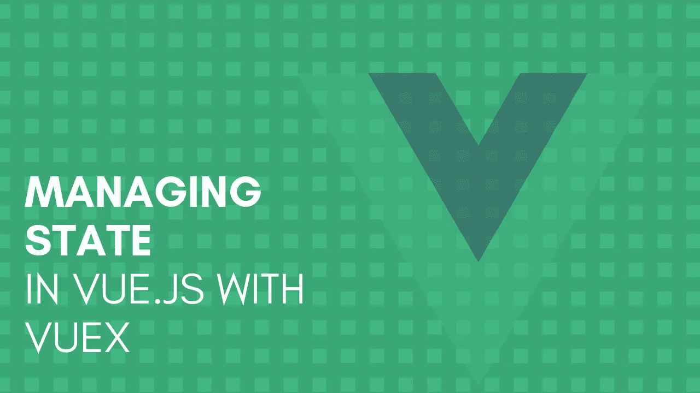
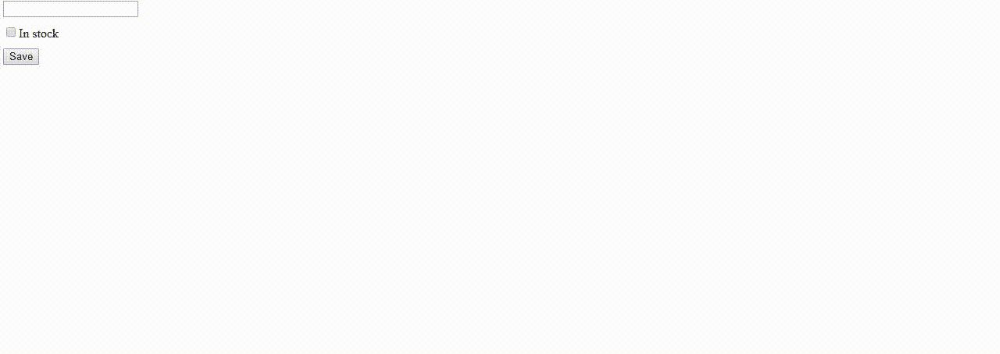
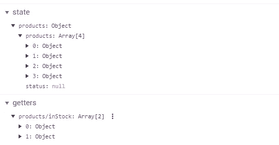

# 用 Vuex 管理 Vue.js 中的状态

> 原文：<https://itnext.io/managing-state-in-vue-js-with-vuex-f036fd71f432?source=collection_archive---------4----------------------->



在大型 Vue 应用程序中，不可避免地会遇到不同组件必须使用相同变量的问题。为了实现这一点，你经常需要在许多组件之间传递相同的变量。变量沿着树从一个组件传递到另一个组件，这使得您的代码一片混乱。如果您继续这样做足够长的时间，您将会到达管理状态变得非常复杂的某个点。

## Vuex

当然，解决方案是 Vuex。Vuex 是 Vue.js 应用程序的状态管理库。每个 Vuex 应用程序的中心是一个商店，它基本上是一个保存应用程序状态的容器。

> 使用 Vuex 时，组件使用相同的数据源。这意味着真理只有一个来源。如果没有 Vuex，组件可能会有自己的状态版本。

在本文中，我将向您展示如何设置 Vuex 商店，以及如何在 Vue 组件中使用这个商店。我将从零开始一个新的 Vue 项目。

## 装置

要在我们的 Vue 应用程序中使用 Vuex，我们必须首先安装它:

```
npm install vuex --save
```

# 创建商店

## 文件夹结构

我们将要创建的存储将有自己的文件夹。所以让我们从在`src`文件夹中创建一个`store` 文件夹开始。一个存储可以包含多个模块，我更喜欢将它们存储在各自的文件夹中。在刚刚创建的`store`文件夹中创建一个名为`modules`的新文件夹。在`modules`文件夹中，我们将创建另一个名为`products`的文件夹，它将管理我们应用程序中产品的状态。

## 商店索引

在`store`文件夹中，我们将创建一个名为`index.js`的文件。这个文件包含了我们商店的定义。如您所见，模块被导入到商店中。

## 模块

Vue 应用程序的所有状态都包含在一个对象中。随着应用程序的增长，这可能会变得非常大。幸运的是，Vuex 允许你将商店分成模块。每个模块都包含自己的状态、获取器、动作和变异。

一个模块包含以下文件:

*   索引. js
*   getters.js
*   actions.js
*   突变. js

## 索引. js

index.js 是定义模块状态的地方。此外，这个文件将 getters、actions 和 mutations 捆绑到一个表示模块的对象中。

比起命名空间，我更喜欢我的模块。默认情况下，模块中的所有内容都注册在全局名称空间下。这允许多个模块对相同的突变或动作做出反应。我不喜欢这种默认行为，所以我在模块中选择了 for `namespaced = true;`。这样模块更加独立。

正如您在示例中看到的，状态只是一个具有产品模块的一些属性的对象。

> 状态只不过是一个需要在应用程序中共享的对象。

## 突变. js

*突变. js* 文件包含了所有的突变函数。突变，顾名思义，就是对状态的突变负责。

> 突变是改变你的状态的唯一方法

在 Vuex 中，变异函数的第一个参数总是状态对象。

## actions.js

*actions.js* 文件包含了所有的动作函数。动作就像突变，但是它们*不会*改变状态。动作提交突变。此外，动作可以包含异步操作。

在这个例子中，我们有两个动作都提交了一个突变。 *addProducts* 动作提交了 *addProduct* 变异，我们稍后会用到它。

在我们将要创建的示例中，我们不会使用 *getProducts* 操作。我创建这个动作作为一个额外的(异步的)例子来展示一个动作可能是什么样子。 *getProducts* 动作向 API 发送请求，并根据响应提交变异。

## getters.js

*getters.js* 包含了所有的 getter 函数。Getters 用于存储，就像计算属性用于组件一样。Getters 也可以通过第一个参数访问状态。

# 在组件中使用存储

在开始使用组件中的存储之前，我们必须将存储注入到根组件的所有子组件中。我们在`main.js`中这样做，在那里我们的 Vue 实例被创建。

*注意:
您可以删除第 4、5 和 7 行，因为在这个例子中您不需要 axios。如果你想使用 axios，你需要安装它:*

```
npm install --save axios vue-axios
```

## 组件

为了演示商店如何使用组件，我们将在`components`文件夹中创建三个组件:

*   产品表单. vue
*   产品列表. vue
*   InStockList.vue

## 产品表单. vue

该组件有一个表单，一旦按钮被点击，该表单将向商店发送一个添加产品的动作。正如您在第 29 行看到的，我们向商店发送了一个动作。因为我们给模块命名了空间，所以我们必须在动作名前面加上模块名。

## 产品列表. vue

*ProductList* 组件包含所有产品的列表，包括库存和非库存产品。只有当产品列表不为空时，才会显示该列表。

注意`products`变量来自状态对象。为此，我们使用了 *mapState* 助手。这个助手为我们生成计算的 getter 函数。

因为我们命名了模块，所以我们需要将模块的名称作为第一个参数传递。第二个参数是我们想要为其创建 getter 函数的属性列表。

我们使用扩展操作符(…)，这样我们就能够将本地计算的属性与 *mapState* 返回的对象混合在一起。

## InStockList.vue

就像*产品列表*组件一样，该组件包含产品列表。不同之处在于，该组件仅显示库存中的产品。为此，它使用了商店中的 *inStock* getter 函数。该功能对处于状态的`*products*` 变量应用过滤器。

请注意， *mapGetters* 函数的使用方式与 *mapState* 函数完全相同。

## 让我们看看它的实际效果吧！

现在我们已经创建了商店和组件，是时候看看我们的代码了。

因为我们对两个列表组件使用相同的 state 属性，所以两个列表组件都应该对`products`属性的变化做出反应。这种变化将通过添加产品来触发。



我们的行动准则！



Vuex 商店中的状态

如上图所示，添加产品会更新状态，这将导致列表组件更新。

就是这样！您刚刚创建了一个 Vue 组件正在使用的 Vuex 商店。我希望这篇文章能帮助你理解和实现 Vuex 商店。一定要看看我的其他职位。如果您有任何反馈、问题或希望我写另一个与 Vue 相关的主题，请随时发表评论。

编码快乐！