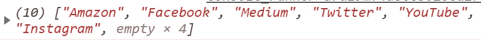

# 操纵 JavaScript 数组:移除键

> 原文：<https://itnext.io/manipulating-javascript-arrays-deleting-keys-61d638bd21b3?source=collection_archive---------3----------------------->

## 我从数组中移除元素的 6 种方法

如果你认为只有一种方法可以删除一个[数组](https://developer.mozilla.org/en-US/docs/Web/JavaScript/Reference/Global_Objects/Array)，也许这就是你需要的帖子。这里我将向你展示我所知道的从 JS 数组中移除元素的所有方法。


# 长度

默认情况下，数组带有属性 [length](https://developer.mozilla.org/en-US/docs/Web/JavaScript/Reference/Global_Objects/Array/length) ，该属性返回数组中元素的数量。幸运的是，这个属性可以改变它的值，但是这样做会导致更新当前数组。如果你使长度大于当前计数，数组将增加，用*空值*填充空间。



值为空的数组

我们不希望这样，所以让我们设置长度小于当前计数，这样数组长度将抛出新值之外的键。不要试图设置负值，顺便说一下，它只会抛出一个错误。

# 变化

对不起，我们应该从头开始，让我们看看这个方法，shift 将删除数组的第一个索引。 [shift](https://developer.mozilla.org/en-US/docs/Web/JavaScript/Reference/Global_Objects/Array/shift) 方法返回被移除元素的值。就这么简单:

# 流行音乐

数组中的方法 [pop](https://developer.mozilla.org/en-US/docs/Web/JavaScript/Reference/Global_Objects/Array/pop) 将执行类似于 shift 的操作，但它实际上将“弹出”最后一个元素，而不是移除第一个键，以及 shift，pop 方法返回他刚刚移除的值:

# 接合

这是一个非常通用的方法，不仅可以删除元素，还可以在其他元素之间添加新的键。但我们这次是来杀人的，不是来创造的。要删除元素 [splice](https://developer.mozilla.org/en-US/docs/Web/JavaScript/Reference/Global_Objects/Array/splice) 至少需要两个参数，我们要寻找的索引和我们要移除的键的数量。除了 *pop* 和 shift， *splice* 将返回修改元素的值:

# 删除运算符

这个[删除操作符](https://developer.mozilla.org/en-US/docs/Web/JavaScript/Reference/Operators/delete)不是我最喜欢的，因为它总是让被删除的键的空间为空，它不会重新索引我们所有的数组，但是我有责任让你知道它的存在。

像示例那样在一个键数组上调用 delete 操作符将导致所选的空间消失。

# 向 Array.prototype 添加方法

JavaScript 非常灵活，我曾在某个地方看到他们直接给 [Array.prototype](https://developer.mozilla.org/es/docs/Web/JavaScript/Referencia/Objetos_globales/Array/prototype) 添加一个新方法，如下所示:

```
Array.prototype.remove = function(value){ /* ... */}
```

但是您应该避免这种情况，因为这是一种不好的做法。向本机 Array.prototype 添加新的自定义属性的正确方法是使用 [Object.defineProperty](https://developer.mozilla.org/en-US/docs/Web/JavaScript/Reference/Global_Objects/Object/defineProperty) ，如下所示:

方法 remove 将删除值等于我们给定的参数的键。此后，您将能够像使用 pop 或 shift 一样使用 like，就像它是一个本机属性一样:

重要的是你可以创造自己的方法，这个矿只是一个不起眼的例子。

# 活生生的例子

如果你想看上面所有的例子，就在这支笔里活生生地看它们吧:

【https://codepen.io/adrian-legaspi/pen/PowJVdw 

# 结论

管理数组数据非常重要，更重要的是有不止一种方法来解决这个删除问题。现在轮到您实现更适合您编程的那个了。

> 参考:
> 
> stack overflow*→*[https://stack overflow . com/questions/948358/adding-custom-functions-into-array-prototype](https://stackoverflow.com/questions/948358/adding-custom-functions-into-array-prototype)
> 
> MDN 网络文档*→*[https://developer.mozilla.org/](https://developer.mozilla.org/)
> 
> 本人*→*[*https://twitter.com/ImLuyou*](https://twitter.com/ImLuyou)