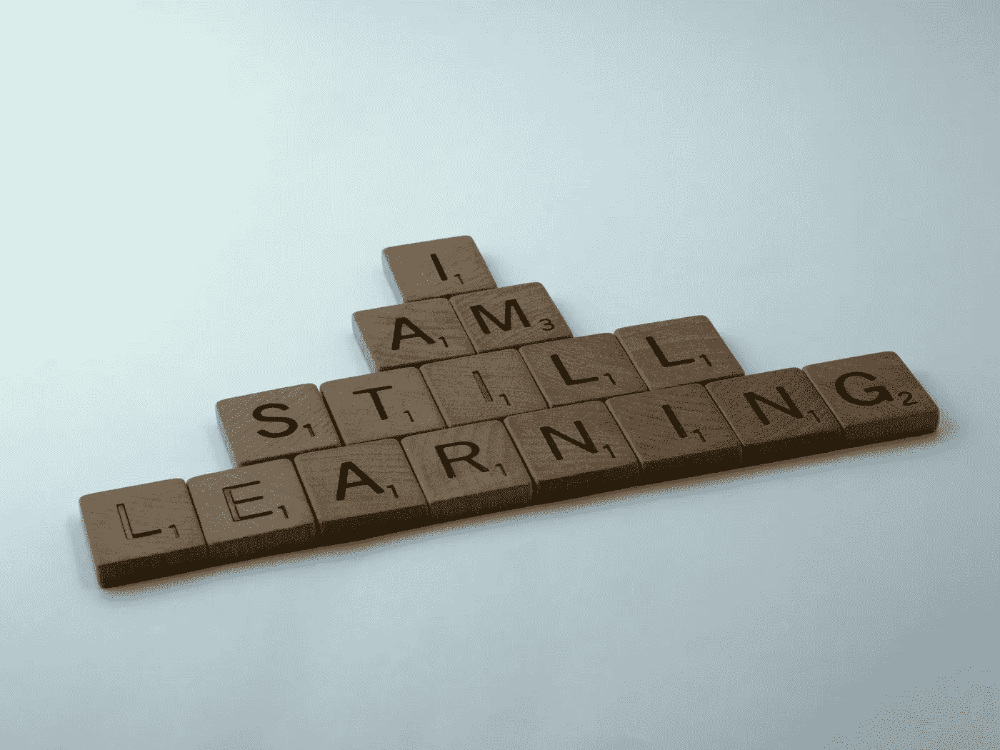
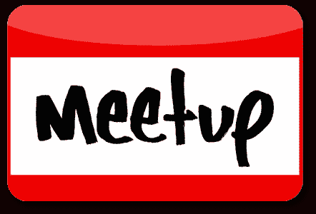
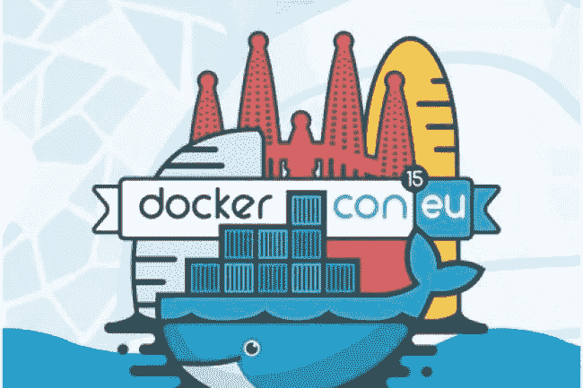

# 许多技术发展的机会

> 原文：<https://itnext.io/many-opportunities-to-evolve-in-tech-77345cbeeabd?source=collection_archive---------7----------------------->

## 学习，分享，提高，重复…

尼克·莫里森在 [Unsplash](https://unsplash.com/s/photos/learn?utm_source=unsplash&utm_medium=referral&utm_content=creditCopyText) 上拍摄的照片

在这个瞬息万变的世界里，你需要为充满惊喜的未来做好准备(有些好，有些不太好，有些真的很糟糕):

*   有一天，你的雇主可能不再需要你，要求你离开
*   你研究了多年的技术可能在你意识到之前就过时了
*   你变老了(虽然这并不奇怪…)，需要与更年轻、更时尚的专业人士竞争

从这个角度来看，持续改进非常重要，这样当你遇到困难时，你就能更容易地克服它。

这篇文章举例说明了几个可以让你的知识更上一层楼的项目。他们每个人都在某些方面改变了我的职业生涯…

## 永远不要停止学习

照片由[布雷特·乔丹](https://unsplash.com/@brett_jordan?utm_source=unsplash&utm_medium=referral&utm_content=creditCopyText)在 [Unsplash](https://unsplash.com/s/photos/learn?utm_source=unsplash&utm_medium=referral&utm_content=creditCopyText) 拍摄

首先，也可能是最重要的一点:保持好奇心，永远不要停止学习。再一次没有。停下来。学习。这会给你所需的武器来克服你将来可能不得不面对的许多情况。

有很多可以学习的来源(其中一些我们将在接下来的项目中考虑):博客、书籍、在线课程、聚会(IRL 或在线)、会议……此外，当学习一个特定的主题时，我发现同时从不同的来源学习以获得不同的观点和交叉引用信息是非常强大的。让我们用一些个人真实生活的例子来说明这一切。

## 辅助项目

尼克·莫里森在 Unsplash 上拍摄的照片

兼职项目是测试事物和边做边学的好方法。即使一些公司和成功的产品是从一个副业项目开始的，但是大多数副业项目不会是一个巨大的成功故事。

即使你的副业项目不是你一开始预想的大项目，而是以存档的 GitHub 库结束，这也不是一件坏事，因为你可能在这个过程中学到了很多。辅助项目可以帮助您:

*   获得动力的提升(这会影响你生活的其他部分)
*   结识与你有相同兴趣的人，他们可以在很多方面为你的项目做出贡献
*   学习新技术或在你已经使用的技术上变得更好
*   如果你和其他人一起工作，也可以提高你的合作技能

第一个副业项目之一是使用 Ruby 和 RoR 的 Rest API，这些技术在当时正蓬勃发展…是的，我老了😃。我和一个和我在同一家公司的人一起做那个项目。这很有趣，让我们开始使用协作工具(GitHub 当时是全新的)和第一批 PaaS(平台即服务)之一的 Heroku(T1)，以及许多其他东西。

我做的最后一个兼职项目是一个移动应用程序，目的是帮助当地商店通过推送通知与客户沟通。这是一个有趣的项目，以隐私为基础，关注现实生活中的交流。我和一些我认识的人谈论了这个项目，他们中的一些人主动提出为这个项目做贡献。我们一起工作了几个月，享受了 Python / Flask、ReactNative、NATS、Kubernetes、云架构等技术，还做了一点营销工作来制作传单……我们按计划发布了一切:生产级集群、后端微服务应用程序和移动客户端(都在 App Store 和 Google Play 上)。当然，这并不完美，但我们对这个 MVP 很满意，并为接下来的工作制定了许多计划。技术部分工作得很好，但我们对营销方面的东西太差了，所以…这个名为 DealyShop 的项目现在存档在 GitLab +我桌上的许多传单中。显然我们希望它成功，但我和我的朋友们都不后悔，因为我们在它身上学到了很多东西。这些事情将有助于我们在各自的工作/自由活动中的其他一些项目。

在这两个项目之间有许多辅助项目开始和结束。他们都没有帮助获得数百万美元(甚至数千美元:)。不过，他们所有人无疑都在技术和协作方面学到了很多东西。

## 聚会

在现实生活中，聚会可能是结识和你有着相同爱好和兴趣的人的最简单的方式。只要去 https://meetup.com 的，选择你感兴趣的东西，开始寻找你身边的事件。在等待 IRL meetup 回归的时候，在线 meetup 也是一个学习东西的好方法(即使它们通常不那么互动和自发)。

还记得我和同事一起开发的基于 Ruby 的 Rest API 吗？开始这个项目后，我们一起去了当地的聚会，遇到了一个正在创业的人(一家能源效率领域的初创企业)。他需要一个他正在开发的移动客户端的 API。你猜怎么着？我们的 API 非常适合他的需求。我们作为自由职业者开始为他工作后不久。该公司当时处于早期阶段，没有太多的现金，很快我们就获得了该公司的一些股份来参与该项目。就这样，我们成为了这家初创公司的联合创始人(顺便说一句，这家公司现在仍然存在)。一次聚会改变了我们两个人和公司未来的许多事情(至少在某种程度上)。

## 会议

巴塞罗那 2015 年欧洲码头博览会

聚会很棒，但是会议……嗯……几乎比任何事情都重要:

*   你能遇到的人的数量和你能进行的讨论
*   你可以听的演讲的数量和多样性
*   你能接触到的公司数量，因为许多公司都有几个代表和技术人员
*   课间可以抓的食物:)
*   外部活动和观光

会议可能相当昂贵(旅行、酒店、会议门票)，但你可以在那里学到的东西和获得的联系往往超过了要付出的代价(即使这不容易评估)。如果你的雇主看到公司的一些利益，他可能会同意支付你参加会议的费用。因此，如果你想去参加一个会议，不要犹豫，告诉你的经理，你可能会得到一张免费票👍

巴塞罗那的 2015 年欧洲 DockerCon 是我的第一次国际会议，我必须说它确实改变了我工作生活和自由职业活动中的许多事情。我和许多人交谈过，其中有几个为 Docker 工作的人。会议结束后，我成了我们当地 Docker meetup(法国南部尼斯地区)的组织者，并真正享受了几年。这也让我在几个月后成为了 Docker Captains 项目的一员，并更加接近我真正热爱的 Docker 生态系统。

## 捐助

[法托斯 Bytyqi](https://unsplash.com/@fatosi?utm_source=unsplash&utm_medium=referral&utm_content=creditCopyText) 在 [Unsplash](https://unsplash.com/s/photos/code?utm_source=unsplash&utm_medium=referral&utm_content=creditCopyText) 上的照片

毫无疑问，在某方面做得更好的一个方法就是练习。我所说的贡献并不是指你需要检查你所选择的技术的代码并试图改进它。贡献可以比这更广泛，它可以包括修复文档中的一些元素，帮助第一次使用 slack 频道的用户，…任何你想要并且能够做的事情。贡献的方式有很多种，不管是哪种方式，在这个过程中你肯定会学到很多东西:在技术本身及其生态系统的许多工具中。

我对 Golang 不太熟悉，Golang 是一种用来开发我现在正在使用的许多技术的语言，所以我几乎没有对源代码做出过贡献(但是我发誓，我很快就会了！).我通常通过其他方式做出贡献，如写博客文章、创建练习、研讨会内容、在技术活动中展示技术……许多东西都可以在我的 [GitLab 资源库](https://gitlab.com/lucj)中找到。

## 写

由[格伦·卡斯滕斯-彼得斯](https://unsplash.com/@glenncarstenspeters?utm_source=unsplash&utm_medium=referral&utm_content=creditCopyText)在 [Unsplash](https://unsplash.com/s/photos/blog?utm_source=unsplash&utm_medium=referral&utm_content=creditCopyText) 上拍摄的照片

对于你学到的一切，不要犹豫，创建一个博客帖子。它会帮助你理清自己的知识，让别人向你学习。随着时间的推移，你创造的内容将成为未来的某种投资组合，这样人们可以更好地了解你的能力范围和你喜欢什么。你写的一些文章有助于招聘人员识别你的个人资料，这也很常见。

对于你要写的每一篇文章，你都需要做一些研究，从不同的来源获取信息，还要组织好整篇文章，使其易于阅读和理解。所有这些都是学习的好方法。开始的时候你可能会不舒服，我也是，但是在你写了几篇文章之后，你会喜欢这个过程。

我定期在 Medium 上写博客，这是一个非常容易使用的平台。根据你想写的主题，你可以把你的文章发表在特定的出版物上，这样可以增加它们的知名度。

## 讨论

照片由 NeONBRAND 在 Unsplash 上拍摄

公开演讲可能是最可怕的事情之一，但也是一种很好的锻炼。

一天，我的一个朋友主持了一个有数百人参加的本地会议，他请我谈谈 Node.js，这在当时是一项相当新的技术。我知道我不能拒绝，因为这是一个谈论我热爱的技术的好机会，在许多人面前讲话也是一个我想接受的巨大挑战。

然后，我有机会在几个技术活动中发言，并组织了其中的一些活动。即使每次都很紧张，我也从不后悔做这个练习。演示的准备总是让我们自己澄清事情，组织我们的思维。还有，观众提的问题总是很有趣，有时很有挑战性。

每当你在公开演讲前感到有压力时，记住观众总是很友好的，他们不是来让你尴尬的，而是来学习和友好地与你互动的。

## 教

照片由 NeONBRAND 在 Unsplash 上拍摄

当你熟悉一个特定的主题时，教学可能是使你的活动多样化和继续进步的好方法。作为一名教师，你需要跟上你所教的技术和它的生态系统，如果你想觉得自己是合法的，这是一件真正需要不断改进的好事。

2017 年初，我开始向专业人士教授 Docker。这很有挑战性，因为我以前没有这样做过，但也很有激励性。几年后，我开始学习 Kubernetes 课程，现在，我以直播或自定进度(通过 Udemy 平台)的方式教授这两门课程(法语)。

作为一名自由职业培训师，当我提供培训时，我总是学到很多东西，因为这些是与专业人士交流的好方法，他们有自己的，有时非常具体的用例，因此有许多相关的问题。

## 坚持练习

Josh Hild 在 Unsplash 上拍摄的照片

> 慢慢来。每一个。单身。日。

主要的想法是保持势头，以免失去重点。通过每天思考你选择的主题，你的大脑会保持联系，第二天再回到这个话题是很容易的。停下来几天，故事将会不同…

## 善良谦逊

[卡尔·约翰逊](https://unsplash.com/@kylejeffreys?utm_source=unsplash&utm_medium=referral&utm_content=creditCopyText)在 [Unsplash](https://unsplash.com/s/photos/humble?utm_source=unsplash&utm_medium=referral&utm_content=creditCopyText) 上拍照

即使你擅长某件事，也不要忘记在这个特定领域总有很多人比你更好。请不要传播你的知识来炫耀和打动人。乐于讨论，准备好质疑你的知识，友善并带着真诚的微笑帮助他人。

## 挑战

照片由 [Jukan Tateisi](https://unsplash.com/@tateisimikito?utm_source=unsplash&utm_medium=referral&utm_content=creditCopyText) 在 [Unsplash](https://unsplash.com/s/photos/challenge?utm_source=unsplash&utm_medium=referral&utm_content=creditCopyText) 上拍摄

让我们一起迎接以下挑战:

*   选择你感兴趣的话题。可能是学习一门新的语言，提高你对新兴技术的认识，从事你一直想开始的副业项目……顺便说一句，它不一定与计算机相关。
*   每天花 15 分钟学习一点这方面的知识！每一个。单身。日。

你会失去什么？一天 15 分钟？来吧…如果你认为自己坚持不到 15 分钟，可以从每天 10 分钟开始😏。当然，在你有更多时间并且想加快学习进程的日子里，你可以做得更多。

从短期来看，你会养成一个很好的学习习惯，你也会发现，有规律地循序渐进会产生巨大的长期影响。

## 关键外卖

这篇文章我真正想强调的是，投资自己是多么重要。积极主动，永远不要停止学习和提高自己，以便为下一个机遇和挑战做好准备。

通过在你的领域不断学习，你一定会变得更好。每天的小步骤最终一定会有回报的！另外会增加你的动力。

准备好迎接全新的你👍