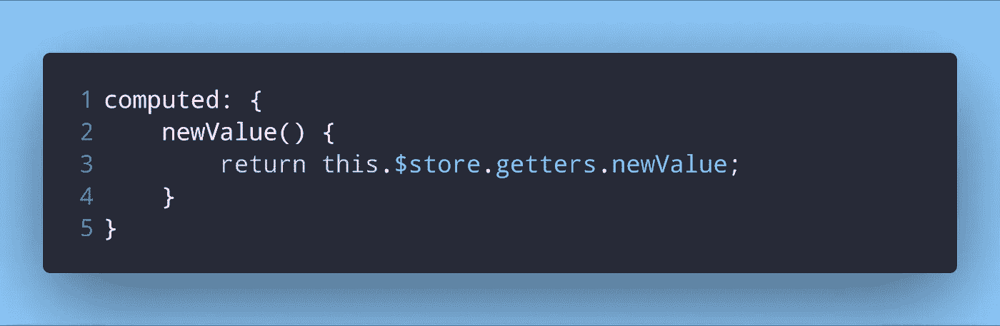
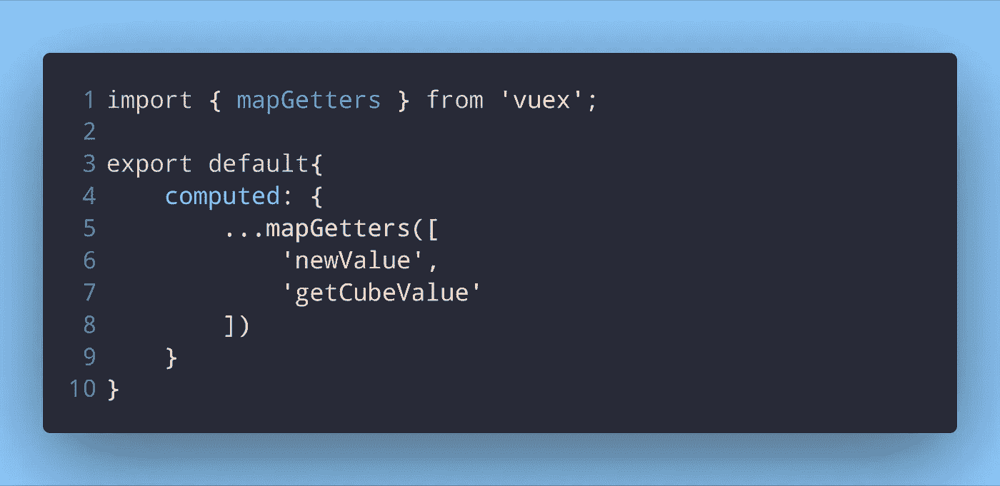
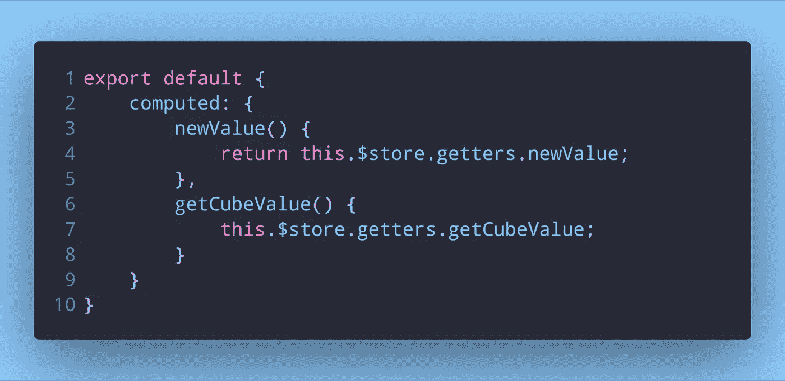
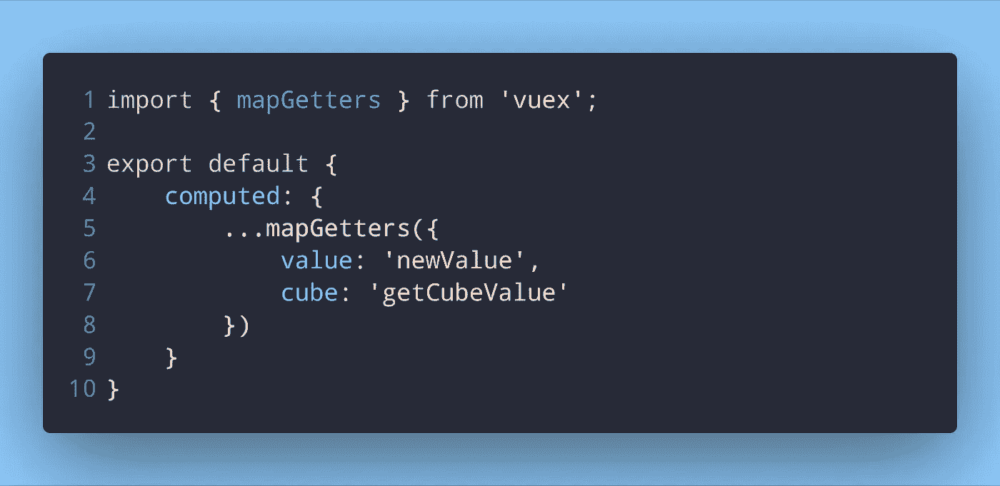
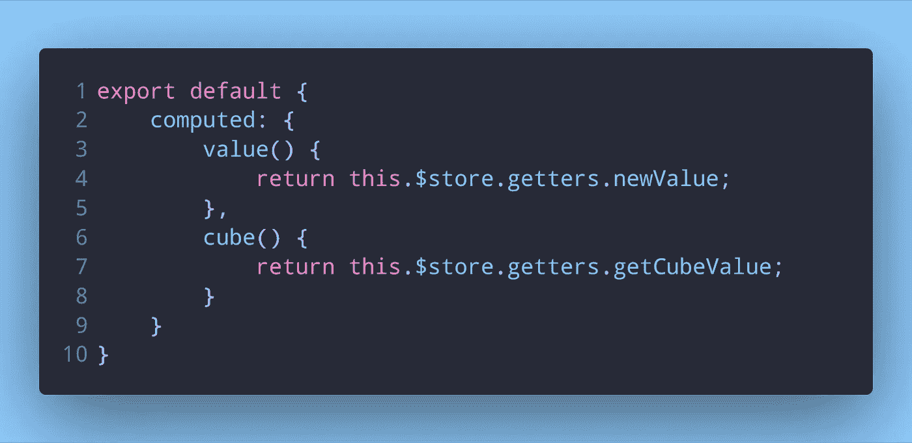
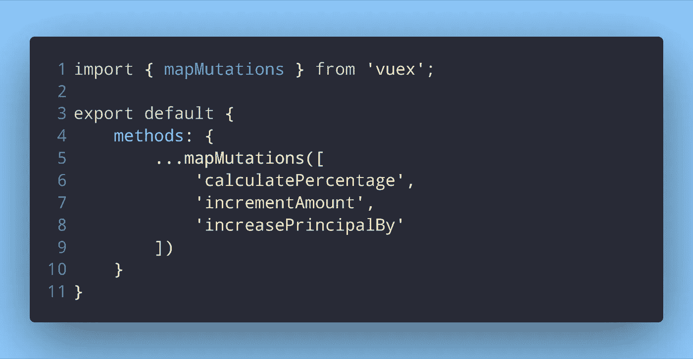
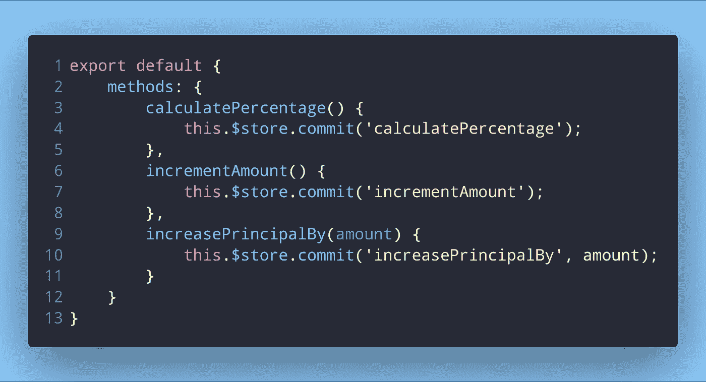
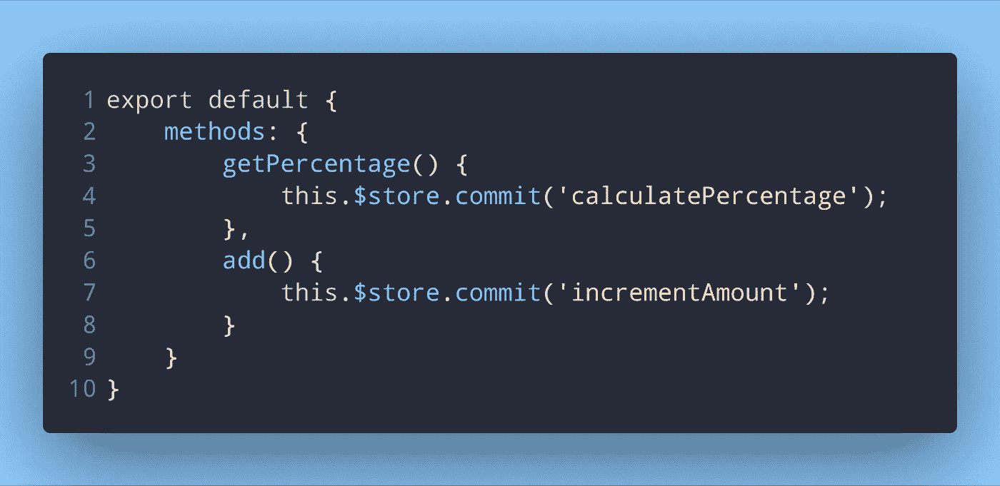
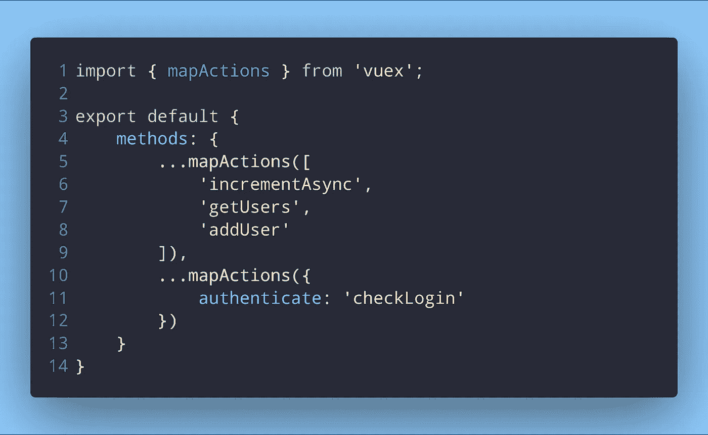
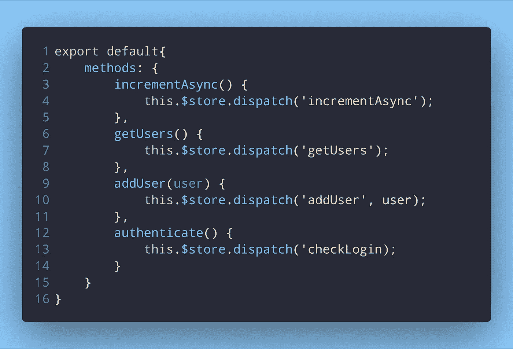

# Vuex 初学者的映射

> 原文：<https://itnext.io/mapping-for-vuex-beginners-43656ac41de9?source=collection_archive---------2----------------------->

这是我之前发表的关于第一次使用 Vuex 的文章[的延续。我将只讨论将 Vuex 存储中的 getters、mutations 和 actions 映射到 Vue 组件中的属性。](https://dev.to/napoleon039/understanding-and-using-vuex-for-the-first-time-2ngi)

# 我为什么要映射它们？

使用 Vuex 一段时间后，你可能会想——“我可以使用一个突变或者一个动作。我为什么要绘制它们的地图？”。如果你要使用多个 getters、突变或动作，映射它们是非常有用的。

# 映射 Getters

我们以这种方式在计算属性中使用 getter:

吸气剂的常用用法

现在为 5 个吸气剂或 10 个吸气剂做这个怎么样？占用了很多行，更不用说还得写很多代码。你可以使用 Vuex 的`mapGetters`助手来缩短这个。如果你想格式化一个 getter 的返回值或者用它执行一些其他的操作，你可能需要像上面写的那样编写 getter。但是如果 computed 属性只是从 getter 返回值，那么最好使用`mapGetters`助手:

使用 mapGetters 助手映射 getters

这与写下:

这是在不使用 mapGetters 助手的情况下编写它们的方式

我们将一个数组传递给`mapGetters`，并在其中写入 getters 的名字。您只需要写下 getters 的名字，然后在您的模板中使用它们。不用写别的了。如果您想使用不同名称的 getter，那么您可以传递一个对象，而不是传递一个数组给`mapGetters`:

将一个对象传递给 mapGetters 助手以使用别名而不是 getter 名称

如果不使用`mapGetters`，这些 getters 可以这样写:

映射时的别名仅仅意味着计算属性的不同名称

# 绘制突变图

就像我们对 getters 所做的一样，我们也可以对突变做同样的事情。类似于`mapGetters`，我们有`mapMutations`助手来绘制我们的突变。

使用地图突变助手

`mapMutations`助手也支持传递有效载荷。最后一个突变，`increasePrincipalBy`接受一个有效载荷。将我们的突变`calculatePercentage`、`increasePrincipalBy`和`incrementAmount`映射到 methods 属性会给出与显式提交突变相同的结果:

我们在不映射它们的时候提交每个突变

我们还可以像对待`mapGetters`一样，将一个对象传递给`mapMutations`助手:

使用别名时将对象传递给 mapMutations 辅助程序

这就是我们如何在不映射它们的情况下编写上述映射的突变:

与 getters 一样，alias 只是意味着一个名称与突变不同的方法

# 映射操作

到目前为止，您一定已经理解了映射 getters、mutations 和 actions 在语法上非常相似。当您将突变和动作映射到方法时，您将 getters 映射到计算属性。映射动作类似于映射突变，只是使用的辅助器不同。

虽然我已经展示了将对象和数组分别传递给助手的例子，但是我们可以同时使用两者:

使用 mapActions 帮助器映射操作

这里，`addUser`动作是一个接受有效载荷的动作。现在，如果我们不使用`mapActions`助手来编写这些代码，它们将被写成这样:

没有映射它们，像 getters 和 mutations，我们调度动作

正如我提到的，您可以在同一个方法属性中使用传递对象和传递数组的两种方式。我用动作助手展示了这一点，但它也可以用于突变。

# 包扎

这就是这篇文章的内容。映射您的动作、getters 和突变将使您的代码更小，并节省一些编写时间。一如既往，你可以从 [Vuex 文档](https://vuex.vuejs.org/guide/)中学到更多。如果你有任何问题或建议，请在下面的评论中留下。

*最初发布于*[*dev . to*](https://dev.to/napoleon039/mapping-for-a-vuex-beginner-4i74)*。*