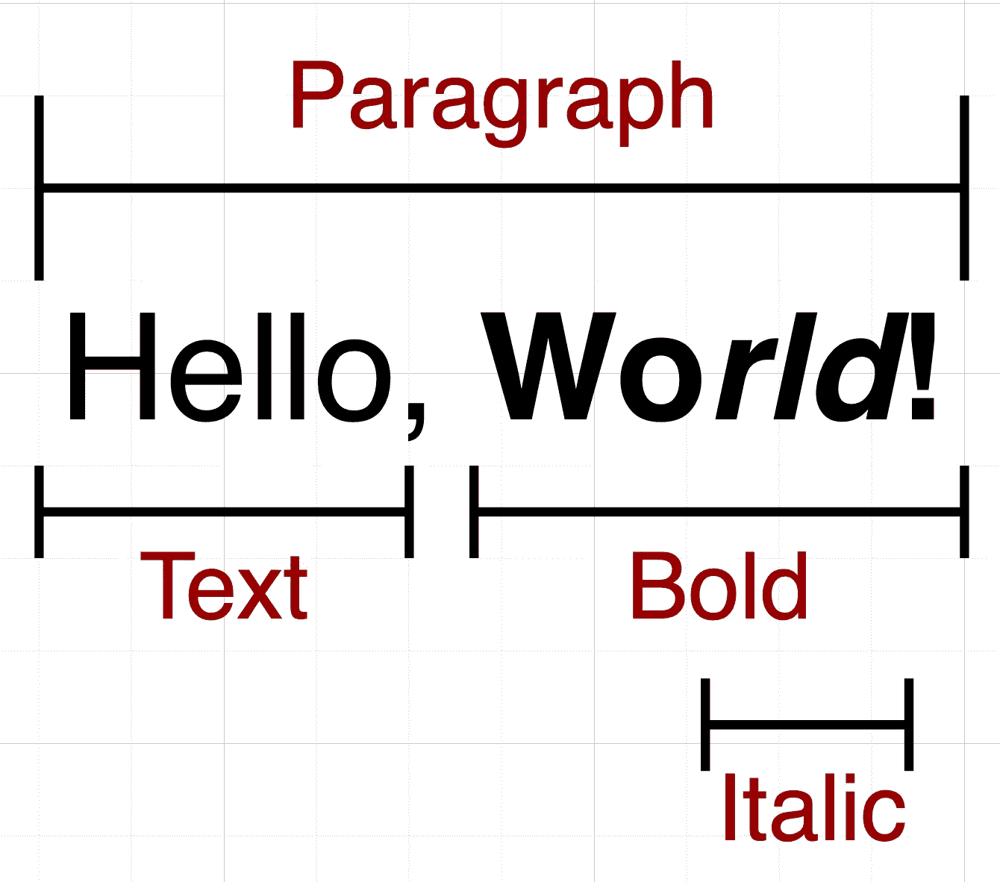
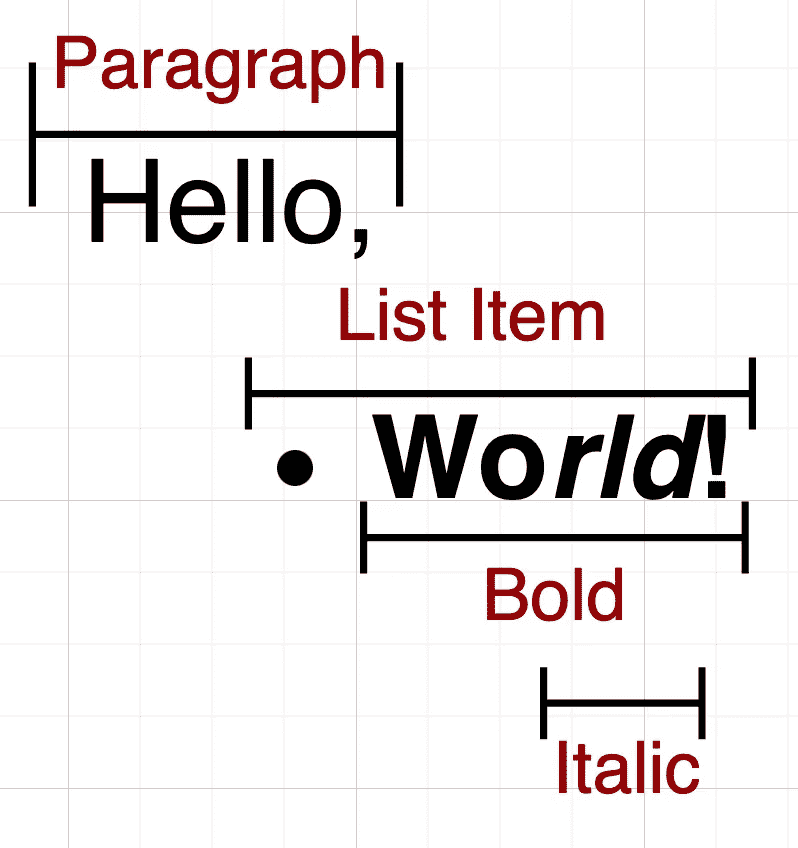
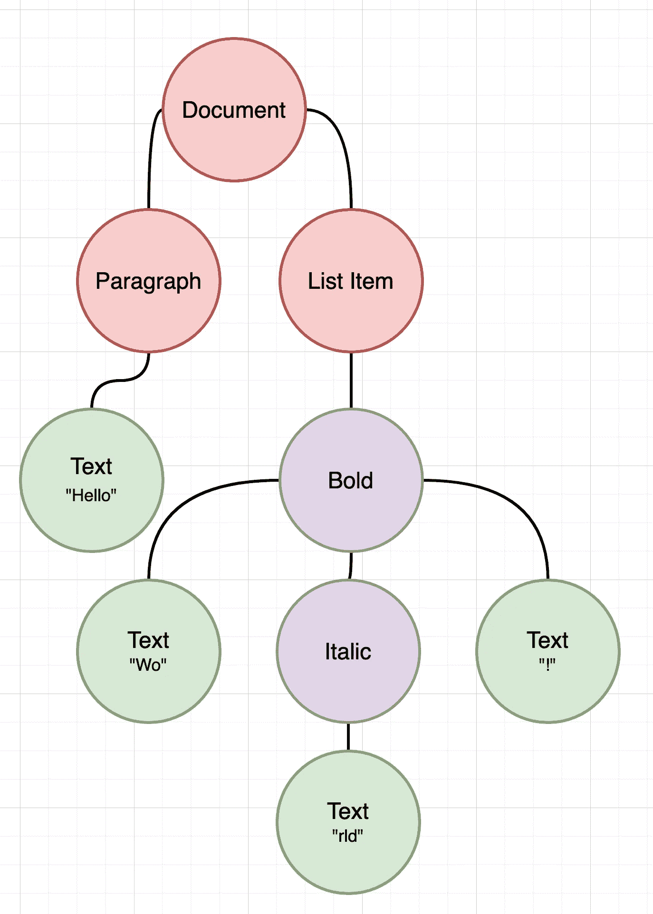
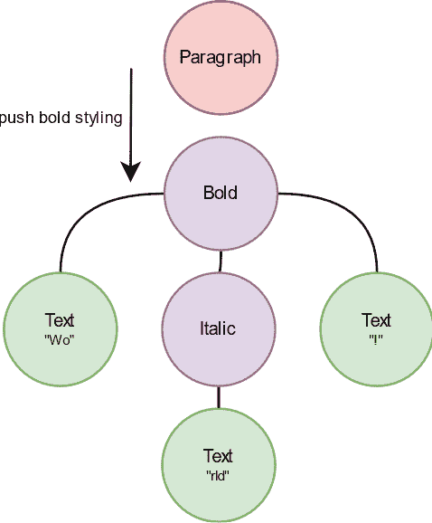

# 降价渲染和递归合成

> 原文：<https://itnext.io/markdown-rendering-and-recursive-composition-e76cca3631e8?source=collection_archive---------4----------------------->

你有没有想过这篇文章在你的屏幕上是怎么渲染的？我们都知道字体、字体大小、粗体/斜体/下划线样式、段落、要点，但是你真的想过这个过程背后的步骤吗？文本的一部分可以是粗体、斜体或 T2 斜体，但是这些信息存储在哪里呢？虽然文本本身没有指示符，但是这句话让我们想起了我们最喜欢的一种标记语言。

您可能很熟悉 Markdown，它是格式化文本和纯文本两个世界之间的桥梁。它让你在一个纯文本编辑器中风格化你的文本，任何兼容的渲染器会把它变成一个漂亮的风格化文档。Github 自述文件、slack 聊天消息、Reddit 评论，都支持一个版本的 Markdown。尽管 WYISWYG 编辑器通常输出适合机器阅读的 XML 或 JSON 格式的文档，但 Markdown 在方便人们阅读方面更有优势。

在这篇文章中，我想专门讨论 Markdown 如何帮助将可样式化的文本转换成纯文本，以及像 Compose 这样的 UI 框架如何将纯文本转换成美观的、有样式的文档。

# 降价分析

减价文件没有经过预处理，这意味着它们是按原样编写、存储和传输的。降价呈现器直接接收纯文本内容。然后，呈现器将负责将文本转换成结构化文档。对于本节的其余部分，我将基于 [Commonmark](https://github.com/commonmark/commonmark-java) 库进行解析。

> 你好，* *世界！**

上面的文字是一个明显的 Markdown 可读的人。然而，对于文字处理人员来说，理解这些(*)号的含义并不是一蹴而就的。中级呈现器必须知道所有降价规则，以便以结构化的方式解释文本，从而使文本呈现器风格化。当这个文本被提供给 Commommark 解析器时，输出如下所示


我们当然可以更进一步，把它混合一点

> 你好，**Wo_rld_！**

那么，这将对应于



我们开始了解文本块内部是如何风格化的。粗体、斜体、删除线、下划线、链接、内嵌图像等。应用时都遵循相同的方法。另一方面，段落不是内联样式，而是被视为文本块。文本块包括但不限于:项目符号、代码块、引号和编号列表。最后，在继续分析解析结果背后的数据结构之前，让我们给示例添加一个要点。

> 你好，
> 
> - **Wo_rld_！**



最后，我们有两个文本块，其中一个还包括内联样式。

所以，最后一个问题是解析器如何输出结果？这实际上取决于消费者打算用它做什么。如果我们只考虑解析和存储结果以备将来使用，那么输出可以是类似 HTML 文档的 JSON 或 XML。然而，Commonmark 是一个多用途的解析器，可以在不同的语言中使用。我们将讨论 Java 版本。将 JSON 或 XML 作为输出是一种浪费，因为它们需要进一步解析才能在我们工作的任何 UI 框架中使用。相反，Commonmark 给了我们一个并不令人惊讶的树。看最后一个例子，我们很容易把它想象成一棵树



虽然看起来很复杂，但是这个树很容易推理。它从一个文档标签开始。它的子对象应该是包含文本的块。第一段有一个孩子说“你好”，没有任何样式，非常简单。第二个子元素声明自己是一个列表项，所以我们假设在这个块的左侧会有一个项目符号。它下面的独生子是造型性质的。“粗体”树节点声明它的所有子节点都需要使用粗体规则进行样式化。所以，“我”，不管“斜体”下面是什么，还有“！”都是需要大胆的。同样的情况也适用于“Italic”节点的子节点，这意味着“rld”将同时是粗体和斜体。

# 树，递归，遍历

任何使用过 UI 框架的人都会告诉你，所有的 UI 实际上都是一个组件树。Compose 也不例外，实际上使它变得非常明显。更进一步，Compose 被分成两个部分，其中一个抽象的动态树用最新的状态更新，另一个部分根据这个树中的变化输出 UI。这里有一些资源供好奇的人了解更多

[](https://jakewharton.com/a-jetpack-compose-by-any-other-name/) [## 由任何其他名字组成喷气背包——杰克·沃顿

### 我非常喜欢 Jetpack Compose。在工作和个人事务之间，我有三个项目，每个都建立在它的基础上…

jakewharton.com](https://jakewharton.com/a-jetpack-compose-by-any-other-name/) 

我们之前的降价树与 Compose 配合得非常好。我们唯一需要做的就是遍历树，同时发出相应的组件。这种对应可能非常简单，因为我们应该为接受包含子元素的内容参数的文本块提供组件。我还没有提到这一点，但是在 Markdown 规范中，文本块可以包含其他文本块。

让我们从一些代码示例开始

这个要点显示了在我们的降价例子中，我们期望什么样的可组合树。在这一点上，函数名和调用顺序完全是任意的。稍后我们将使用 [compose-richtext](https://github.com/zach-klippenstein/compose-richtext) 库来构建模块。现在，我们的注意力应该放在如何在发出 Composables 的同时遍历一个解析过的 Markdown 树。

当在复杂系统上工作以定义一些边界时，公理是有用的。因此，在一个可靠的实现计划的开始就确定这些原则是一个好主意。

*   每个文档都以一个文档节点开始。
*   文本和样式节点总是位于文本块下，例如段落、引用、列表项等。
*   文本是一个终端节点。文本不能有子级。
*   样式不会泄漏到其他文本块。样式节点不能将文本块作为子节点。
*   所有文本块必须将段落作为第一个子块，例如块引用->段落->内容

减价节点的一般视图如下:

```
Node:
  - leftChild
  - rightChild
  - next
  - previous
```

在我们的例子中，我们也将有一个从最左边的孩子到最右边的`children` iterable。

可以预见的是，递归遍历这棵树，同时发出文本块组件将是一种可行的方式。下面给出了一个几乎是伪代码的例子

Node 应该是一个密封类，在我们的 Markdown 文档中包含所有已定义文本块的子类型。考虑到我们从 compose-richtext 中获得了迭代助手和文本块，这看起来几乎太容易了。从根节点调用`render`就足够了，剩下的应该会解决。不幸的是，段落中的文本可能被定义为树，但不能以递归方式计算。请参考第一个代码示例，其中`Text`块被单独调用。Compose 将这些文本调用视为独立的`Text`组件，因此输出实际上将是一系列独立的`Text`布局。

相反，我们的公理告诉我们，一旦我们遇到一个段落，我们可以安全地假设其余的子节点将是文本或样式节点。从那里开始，我们可以计算出一个风格化的不可分割的文本块。

虽然递归不起作用，但我们可以在构建跨区文本时进行前序遍历。这个过程的完整代码可以在[这里](https://github.com/zach-klippenstein/compose-richtext/blob/main/richtext-commonmark/src/main/java/com/zachklipp/richtext/markdown/MarkdownRichText.kt#L55)找到

[](https://github.com/zach-klippenstein/compose-richtext/blob/main/richtext-commonmark/src/main/java/com/zachklipp/richtext/markdown/MarkdownRichText.kt#L55) [## 扎克-克利彭斯坦/撰写-richtext

### 用于高级文本格式和替代显示类型的合成库集合。…

github.com](https://github.com/zach-klippenstein/compose-richtext/blob/main/richtext-commonmark/src/main/java/com/zachklipp/richtext/markdown/MarkdownRichText.kt#L55) 

上面的 gif 解释了构建一个生成字符串的前序遍历。样式节点将一个跨度推入正在进行的构建器，文本节点将其内容追加到构建器。最后，一个 spanned 或 RichText 就可以用一个节点`Text`调用了。对于其余的，我们可以继续使用递归方法。

# 结论

我必须承认，在试图简化这个话题时，我跳过了很多步骤。我引起了他们的注意，并且可能点燃了他们对此类主题的兴趣的任何人都可以查看整个 compose-richtext 库。

[](https://github.com/zach-klippenstein/compose-richtext) [## 扎克-克利彭斯坦/撰写-richtext

### 用于处理富文本格式和文档的合成库集合。这个回购目前非常…

github.com](https://github.com/zach-klippenstein/compose-richtext) 

这个 Markdown 渲染器的完整实现可以在 richtext-commonmark 模块下面找到。这是一个非常粗略的实现，所以欢迎投稿。