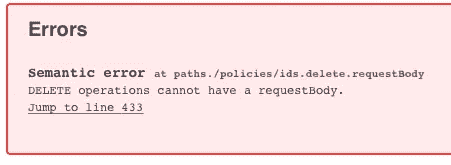

# 通过 HTTP/Rest 批量删除怎么做？

> 原文：<https://itnext.io/mass-delete-via-http-rest-how-do-you-do-it-1bff0f5eb72d?source=collection_archive---------1----------------------->

在我正在做的项目中，我们有时需要一次删除几个项目。UI 将发送一个删除请求，后端必须处理它并让 UI 知道结果。到目前为止很简单。


垃圾桶。来自 Pixabay 的[图片的修改版本](https://pixabay.com/de/photos/papierkorb-bin-müll-recyceln-4358272/)

现在棘手的部分开始了——如何为此创建一个好的 REST-API。

# 对单个 URI 使用 HTTP DELETE

HTTP 有一个删除动词，看起来适合这个任务，因为它清楚地表达了所需的操作。这在 [RFC 7231](https://tools.ietf.org/html/rfc7231#section-4.3.5) 中有所描述。要删除的对象将位于 URI 内，并返回一个 2xx 代码来描述结果。

```
curl -X DELETE http://localhost/some/object/1
```

这种方法的优点很明显，它是 RESTful 的，语义也很容易理解。
不幸的是，对于批量删除的用例来说，这意味着客户端(例如 UI)将需要发送几十或几百个请求

# 对查询字符串使用 HTTP DELETE

像上面一样，我们发出一个删除请求，但是在一个查询字符串中编码单个的 object-id

```
curl -X DELETE [http://localhost/some/object?objectIds=1,2,3](http://localhost/some/object?objectIds=1,2,3)1
3
```

这种方法的好处是客户端可以一次发送多个 id，从而减少往返次数。

对于要删除的大量条目，以及我们使用的 36 个字符长的 UUIDs，查询字符串可能会在途中的代理或网关上被截断(然后客户端应该会得到一个 [414 响应](https://tools.ietf.org/html/rfc7231#section-6.5.12)，并且可以用列表中较少的条目重新发送)。响应代码将是通用的 200 ok，表示请求已被接收，主体将是被删除(或删除失败)的 id 列表。

# 对正文使用 HTTP DELETE

这与前面的方法类似，但是要删除的对象列表(实际上是它们的 id)将在请求的有效负载中。URI 将是这种对象的基本 uri，结果将是一个被删除(或删除失败)的 id 列表，如前一种情况:

```
curl -X DELETE http://localhost/some/object -d @- << **-EOF-
1
2
3
-EOF-** 1
3
```

在上面的例子中，我们请求删除/some/object/1、…2、…3，得到的回复是…1 和…3 被删除。

现在 RFC 7231 说:

> 删除请求消息中的负载没有定义的语义；
> 在删除请求上发送有效负载主体可能会导致一些现有的
> 实现拒绝请求。

有些人认为这是有问题的。我不认为这是一个问题，因为我们自己编写服务器端的实现。不幸的是，OpenAPI/Swagger 不喜欢 DELETE 上的有效负载:



editor.swagger.io 上的错误消息

这是一个问题，因为它似乎阻止了在一些语言或框架中创建一些客户端。

# 使用 HTTP 补丁(通过 JsonPatch)

HTTP 有另一个动词 PATCH，它没有在 RFC 7231 中列出，但是有自己的 [RFC 5789](https://tools.ietf.org/html/rfc5789) ，它遵循了 Unix patch(1)命令的思想。最上面是 [RFC 6902](https://tools.ietf.org/html/rfc6902) ，它为有效负载定义了一种 Json 格式，允许一次性修改多个 Json 对象。

```
curl -X PATCH -HContent-Type:application/json-patch+json \
    http://localhost/ -d @- << **-EOF-
[
  {"op": "remove", "path": "/some/object/1"},
  {"op": "remove", "path": "/some/object/3"},
  {"op": "remove", "path": "/some/object/2"}
]    
-EOF-**
```

正文看起来有点冗长，但是由于有多种操作可用(添加、复制、移动、替换、测试和前面提到的删除)，这种格式是有意义的。
单个操作将自顶向下运行，如果所有操作成功，结果将是“正常”,如果其中一个操作失败，结果将是“失败”,没有删除操作发生。这是因为 RFC5789 要求补丁必须是原子的。

虽然 RFC5789 建议响应包含足够的数据供客户端找出问题，但 RFC6902 中没有建议响应体。

就我个人而言，我发现原子性对于我的批量删除用例来说有点问题。当一个大文档应该在单个块中修改时，就更有意义了——比如通过 patch(1)应用 diff。

# 使用 HTTP POST

所以我们现在使用 POST 作为动词，带有用户定义的有效负载(可能是上面的 JsonPatch)和用户定义的语义，然后产生用户定义的响应格式。虽然 POST 是 HTTP 动词的瑞士军刀，但它也没有向客户机传达任何(明显的)语义。

## 回什么？

这里的一个挑战也是 http 返回代码。它应该是一个 200 ok，并有一个像上面的删除方法那样详细描述结果的主体吗？或者甚至是来自 [RFC 4918](https://tools.ietf.org/html/rfc4918#section-13) 的代码 207‘Multi status ’,其中返回的主体是描述每个请求状态的 XML 文档。

# 还有什么？

我在上面没有提到 WebDAV，因为这对于这个问题来说完全是矫枉过正。

您使用什么解决方案来应对这一挑战？以上你会选哪个？请留言评论。