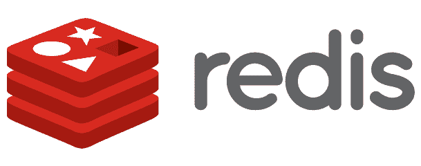
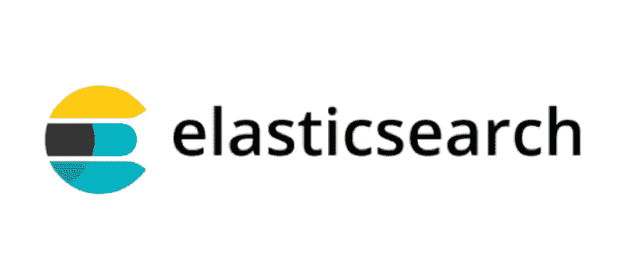
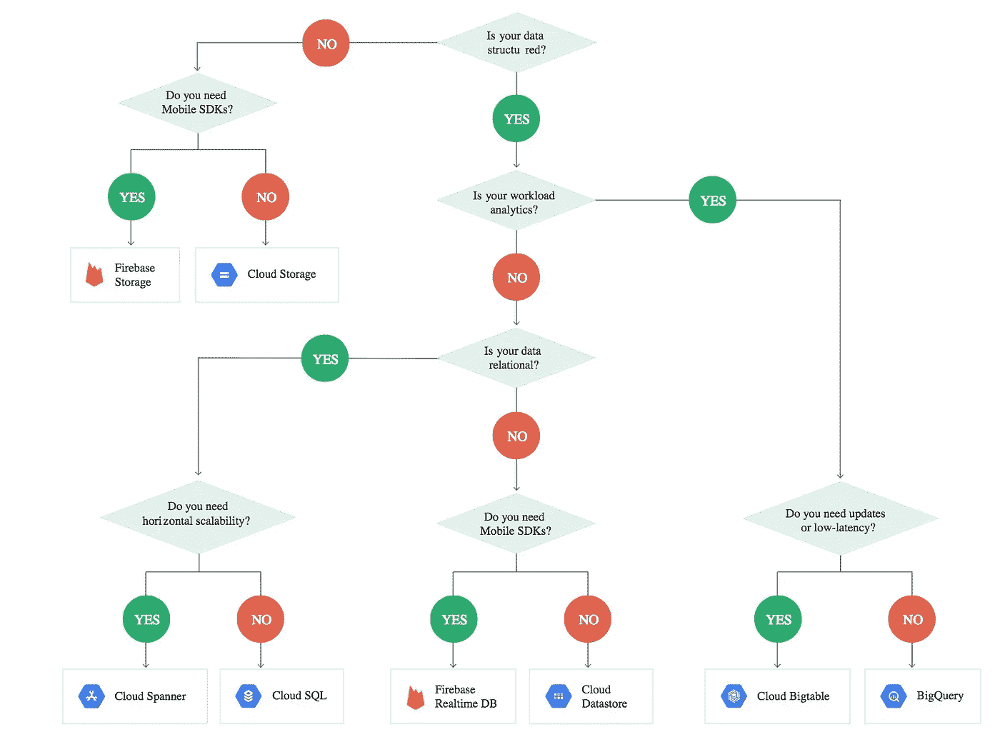

# 大规模数据库

> 原文：<https://itnext.io/massive-scale-databases-5b5917ed94e5?source=collection_archive---------3----------------------->

# 介绍

数据是新的石油，它无处不在。只有真正了解、管理和控制自己行业数据的公司才会成功。**一家公司的价值在于其理解和处理数据以推动商业决策的能力**。

在本文中，我将回顾最近的**大规模可扩展数据库**来存储和处理**大数据**，讨论其利弊；并提供了一些用例；但首先；让我们看看我们是如何来到这里的…

# 历史

将信息传递给后代的能力推动了数百万年的进化，在过去几十年中，数据呈指数级增长，催生了 [**大数据**](https://medium.com/@javier.ramos1/introduction-to-big-data-5b2e64f96e23) 。企业已经意识到**信息就是力量**收集和存储信息必须是重中之重。定义**数据策略是关键。**

## OLTP 与 OLAP

几年前，企业使用由关系数据库支持的在线应用程序，该数据库用于存储用户和其他结构化数据( [**OLTP**](https://en.wikipedia.org/wiki/Online_transaction_processing) )。一夜之间，这些数据通过复杂的作业归档到一个**数据仓库**，该数据仓库针对数据分析和商业智能进行了优化(**)。历史数据被复制到数据仓库，并用于生成用于制定业务决策的报告。**

## **数据仓库与数据湖**

**随着数据的增长，数据仓库变得昂贵且难以管理。此外，公司开始存储和处理非结构化数据，如图像或日志。有了大数据，公司开始创建 [**数据湖**](https://medium.com/@javier.ramos1/introduction-to-data-lakes-afec9e1500ad) 来集中他们的结构化和非结构化数据，创建一个包含所有数据的存储库。**

****

**简而言之，数据湖只是一组将数据存储在 **HA** **文件系统**中的计算机节点和一组[工具](http://www.bmc.com/guides/hadoop-ecosystem.html) 来处理数据并从中获得洞察力。基于 [Map Reduce](https://en.wikipedia.org/wiki/MapReduce) 创建了一个庞大的工具生态系统，如 [Spark](https://spark.apache.org/) 来使用更具成本效益的商用硬件处理任何类型的数据。**

**因此，从数据仓库到数据湖的转变主要是由经济原因驱动的，因为数据湖更具成本效益；尽管数据湖和数据仓库过去和现在都是，但通常**和**结合在一起使用。比如数据仓库可以用于 BI，数据湖可以用于机器学习。像 AWS 这样的许多云提供商提供了将数据仓库扩展到您的数据湖的方法，为您的所有分析需求提供了单一视图。要了解更多信息，请查看这篇比较数据湖和数据仓库的文章。**

**对于 **OLTP** ，有一个向 [**NoSQL**](https://en.wikipedia.org/wiki/NoSQL) 的转变，使用像 **MongoDB** 这样的数据库，它们可以扩展到 SQL 数据库的限制之外。**

**如今，多亏了云提供商，计算，尤其是存储变得非常经济高效。这为许多公司提供了新的可能性，这些公司针对不同的使用情形使用不同的存储选项(SQL、NoSQL、数据仓库、数据湖……)来克服各自的局限性。**

****最新的数据库可以处理用于 OLTP 和 OLAP 的大量数据**，并且以较低的成本处理流和批处理。拥有许多系统、应用程序、数据源和数据类型的大型组织需要一个数据仓库和/或数据湖来满足他们的分析需求，但是如果您的公司没有太多的信息渠道，一个大规模的数据库就足够了**简化您的架构并大幅降低成本**。在本文中，我们将讨论其中的一些数据库，尽管我们将把重点放在 OLTP 上，因为数据湖和数据仓库本身就是一个主题。******

# ****考虑****

****在开始比较这些数据库之前，让我们回顾一些注意事项。****

## ****NoSQL vs SQL****

****这个话题在很多[篇](https://www.geeksforgeeks.org/difference-between-sql-and-nosql/)里都有涉及。重要的是，NoSQL 的出现克服了关系数据库面临的可伸缩性问题和应用程序类型的转变。关键是 SQL 是一种强大的通用查询语言，但它需要一个定义好的模式。另一方面，NoSQL 不强制执行模式，它更具体，这意味着**你需要提前考虑和优化查询**。这是非常重要的，如果你知道你的数据将如何被访问，你希望大量的查询和强烈的一致性不是一个问题，那么 NoSQL 是一个伟大的选择；这是许多应用的情况。****

******NoSQL 类型******

****NoSQL 是一个广泛的话题，它由许多类型的数据库组成，这些数据库使用不同的方法来存储和访问数据。这个想法是，根据您的使用情况，一些数据库比其他的更适合您，此外，您可能想要组合几个数据库来满足不同的需求。我的建议是分析数据是如何被使用的，并选择能解决你特定需求的最佳模型；而不是选择技术，然后尝试将您的需求融入数据库模型。****

********

****例如，如果您正在使用 SQL，并且发现您自己在做大量的连接，因为您关心关系，那么图数据库可能是一个更合适的解决方案。****

****其中一些类型包括**文档、时间序列、键值、图表** …您需要**选择更好地处理应用程序使用类型的数据库**。在许多情况下，您需要运行多个数据库，每个数据库都针对特定的查询或访问模式进行了优化。****

## ****开源与云提供商****

****几乎所有云提供商都提供现成的托管或无服务器数据库解决方案。这是一个游戏改变者，它为您提供了一个简单且经济高效的方法来存储不同类型的数据。云提供商提供的服务各不相同，并详细研究了他们的不同选择。例如，谷歌云提供了其他云提供商没有的大规模数据库，所以如果你需要这种规模，选择正确的云提供商非常重要。****

****随着规模的扩大，基于云的数据库可能会变得非常昂贵。另一种选择是使用开源数据库。有许多选项可供选择，其中许多可以非常便宜地在云上运行，甚至可以在 Kubernetes 上运行。云中的一个好方法是从托管解决方案开始，如果成本太高，再考虑开源数据库。****

## ****OLAP vs OLTP****

****我们已经讨论过这一点，想想 **OLTP** 您的正常应用和微服务；你关心**潜伏期**。您通常存储结构化数据，行的大小只有几千字节。****

****另一方面，对于 **OLAP** ，您关心的是**并行度**和**吞吐量**。查询可能需要更长的时间，并将扫描大量数据。最常见的方法是将数据移动到针对这些类型的查询进行了优化的数据湖和/或数据仓库中。****

****我们将要讨论的一些数据库可以支持这两种类型的查询，但是建议您为 OLAP 和 OLTP 使用不同的集群，尽管有些数据库在同一个集群上支持这两种类型。****

# ****数据库****

****让我们看看数据库，并讨论其利弊。请注意，这不是一个详尽的列表。****

****我不会提及专门为 OLAP 构建的数据仓库，如[红移](https://aws.amazon.com/redshift/)或 [BigQuery，](https://cloud.google.com/bigquery/)查看本文以获得[详细对比](https://hevodata.com/blog/redshift-vs-bigquery/)。****

## ****卡桑德拉****

****[**Apache Cassandra**](https://cassandra.apache.org/)是最成熟的可扩展海量数据库。它是一个**开源 NoSQL** 键-值数据库，提供低延迟，它是容错的(使用副本)，可伸缩的和分散的；这意味着它不遵循主从模式来提供高可用性。它针对 **OLTP** 进行了优化，但也可以进行调整以支持 OLAP 查询，但它对于这些类型的使用非常有限，并且它通常需要具有不同设置的复制集群。它可以在使用有状态集的 Kubernetes 上运行，并且可以存储大量数据。****

********

****它被广泛采用，可以用于许多用例，包括 web 应用程序数据库、缓存、事件存储等等。****

## ****ScyllaDB****

****[**ScyllaDB**](https://www.scylladb.com/) 是一个用 C++重写的 **Cassandra 兼容**数据库，它提供了**更好的性能和超低延迟**。它可能是市场上最快的数据库。它是开源的，但是一些特性需要企业版。它可以在本地或云中运行。动态调度器为同一个集群中的 OLAP 和 OLTP 查询提供了优化，使其成为适用于所有类型查询和任务的伟大数据库。****

********

## ****YugaByteDB****

****[**yugabytdb**](https://www.yugabyte.com/)是一个高性能分布式海量 SQL 数据库。它是唯一一个可以在全球范围内扩展的关系型开源数据库，为事务提供了 ACID 语义。它提供低延迟、大规模、高可用性的数据存储。它有云产品和企业版。****

********

****它是用 C/C++编写的，可以存储任意规模的任意数量的数据。它可以部署在任何云提供商、Kubernetes 或本地。它提供了一个 Cassandra 语言兼容 API 和一个 SQL 兼容 API。****

****它是**最通用的开源数据库**。****

## ****Neo4j****

****[**Neo4J**](https://neo4j.com/) 是最流行的**图形**数据库。就是**成熟可靠快速**。它是本地图形数据库，而不是建立在另一个之上。它可以免费用于开发，但你需要一个生产许可证；他们确实为初创企业提供了免费的企业版。****

********

****它具有高可用性、安全性、可扩展性和出色的性能。****

****[**ArangoDB**](https://www.arangodb.com/) 是另一个很棒的替代品。 [**JanusGraph**](https://janusgraph.org/) 是一个非原生 GraphDB，可以运行在 Cassandra 等其他 DB 之上。****

## ****MongoDB****

****[**MongoDB**](https://www.mongodb.com/) 是最著名的 NoSQL 数据库，它使 NoSQL 数据库闻名遐迩。它将数据存储在**文件**中。非常受可伸缩网站和移动应用程序的欢迎。它针对 OLTP 进行了优化。它有**免费** [社区版](https://www.mongodb.com/download-center/community)和企业版。它还提供云产品。****

********

## ****DynamoDB****

****[**DynamoDB**](https://aws.amazon.com/dynamodb/) 是 **AWS** 专有 NoSQL **无服务器**云数据库。您完全不需要管理任何东西，并且可以**自动缩放**来处理任何流量需求。它针对 **OLTP** 进行了优化，可以处理许多用例，包括微服务、web 应用、移动应用等。它与 AWS 无服务器生态系统(如 AWS Lambda、Amplify、Kinesis 等)集成得很好，这使它成为 AWS 用户的一个很好的选择。相对便宜，非常容易上手。行大小限制为 400kb。它支持严格或最终一致性读取。****

## ****雷迪斯****

****[**Redis**](https://redis.io/) 是一个开源的、内存中的数据结构存储，用作数据库、缓存和消息代理。它非常受欢迎，可以用于许多用例，包括管理无状态应用程序的状态、web 缓存、数据库缓存、会话管理等等。****

********

****它提供了非常低的延迟和高性能。许多云提供商将其作为托管解决方案，但您可以在内部或在 Kubernetes 中运行它。它提供了一个简单的 API，使得它非常容易使用。Redis 有内置的复制功能。****

## ****InfluxDB****

****[**InfluxDB**](https://www.influxdata.com/products/influxdb-overview/) 是一个流行的[时间序列数据库](https://en.wikipedia.org/wiki/Time_series_database)。它提供开源、企业或云版本。存储日志和遥测数据非常受欢迎，并与其他工具集成，如 [Prometheus](https://prometheus.io/docs/introduction/overview/) 和 [Grafana](https://grafana.com/) 。被 SREs 广泛用于监控系统，但也可用于许多使用案例。****

****这是一个快速可伸缩的 NoSQL 数据库，提供了类似 SQL 的查询语言。这对于分析非常有用。****

## ****弹性搜索****

****[**elastic search**](https://www.elastic.co/elasticsearch/)是一种特殊的存储，at 是核心，它是一个分布式的[倒排索引](https://en.wikipedia.org/wiki/Inverted_index)用于真正快速的搜索。它是 Apache Lucene 的分布式增强版本，Apache Lucene 是一个流行的搜索软件。****

****它将数据存储在 JSON **文档**中，并提供丰富的[查询 DSL](https://www.elastic.co/guide/en/elasticsearch/reference/current/query-dsl.html) 来使用 REST 接口执行快速搜索。它是一个高度可用、冗余、可靠的数据存储，可以在云、Kubernetes 或本地运行。它提供非常快速的查找。它有一个**开源**和企业版。****

********

****ElasticSearch 非常受欢迎，多年来，它已经不仅仅是一个涵盖许多用例的搜索引擎。作为 [ELK 堆栈](https://www.elastic.co/what-is/elk-stack)的一部分，它在日志聚合方面非常流行，为 sre 提供了一种简单的方法来搜索和分析单个数据存储中的大量日志数据。随着时间的推移，一些工具和聚合被添加进来，创建了一个巨大的生态系统，现在可以用于搜索、日志分析、可视化、机器学习等等。****

****虽然它可以用作主数据存储，但它通常用于优化搜索和查找，并且只存储可搜索的数据。这是因为 ElasticSearch 不提供高一致性，并且处理可变数据，而可变数据在主数据存储中非常重要。ElasticSearch 经常与 NoSQL 数据库结合使用，因为它提供了非常丰富的、甚至比 SQL 更丰富的查询语言，支持连接和复杂的嵌套查询。****

## ****大表格****

****我[已经谈过](/google-cloud-advantages-over-aws-28751469e570)谷歌云相对于其他提供商的优势。GCP 提供了很棒的数据库，其中之一是 BigTable 可用于大型分析和运营工作负载的大型 NoSQL 数据库。它在托管环境中提供了非常低的延迟、复制、高耐用性等。它可以线性扩展以处理任何数量的数据。****

****它非常容易使用，提供了一个非常简单的 API，但是查询语言是有限的，所以一个好的模式设计是至关重要的。由于它提供了非常低的延迟，并且没有模式，因此可用于各种各样的使用情形，包括数据流、大数据工作负载、时序数据、事件存储、图形数据等等。它可以用作其他图形或时间序列数据库的后端。****

## ****扳手****

****[**Spanner**](https://cloud.google.com/spanner/) 是 Google 内部的大型跨国关系数据库，现在是 GCP 的一部分。它提供了 ACID 事务和大规模的强一致性。它具有高可用性和可靠性。****

****它不是超级快，但在全球范围内具有很强的一致性。您可以安排 OLTP 和 OLAP 查询。当您需要大型 SQL 数据库时，这是一个很好的选择。****

## ****云 Firestore****

****[**云火石**](https://firebase.google.com/docs/firestore/) 是一款灵活的 NoSQL，专注于移动和 web 应用的可扩展数据库。它可以提供与移动设备的实时同步，包括离线同步。****

****它将数据存储在**文档**中，并拥有丰富的查询语言。这对上市时间非常有利，因为它非常**易于使用**并且完全**无服务器**。它用于 **OLTP** ，可以处理大量数据，但不能处理海量数据，因为像 DynamoDB 一样，行大小是有限的。****

********

****GCP 数据库****

# ****摘要****

****下表总结了所有数据库选项。****

****[https://gist . github . com/javiramos 1/852133 f 230 a 6352434 a02a 267 C1 ccea 8](https://gist.github.com/javiramos1/852133f230a6352434a02a267c1ccea8)****

******选择一个或多个储物选项，满足您的业务需求**。要点是，BigTable、YugaByteDB 或 ScyllaDB 等数据库允许您运行 OLAP 和 OLTP 查询，而无需创建数据湖或数据仓库来进行分析。同样，这并不意味着您必须将它们用于 OLAP，如果您有其他数据源，并且希望以较低的成本集中所有数据，则需要一个数据湖。****

# ****用例****

****在这一部分中，让我们回顾一些用例，并根据您的需求提出一些选项。****

## ****什么时候应该使用传统的关系数据库****

*   ******您的数据本质上是关系型的**。它有一个可以被规范化以避免重复的结构。您可以使用由列组成的表轻松定义您的模式。****
*   ****您需要一致的读取和 ACID 事务。****
*   ****您事先不知道访问模式或查询。****
*   ****您不需要您的数据库进行全球扩展。****
*   ****你不需要很低的延迟。****
*   ******不需要存储大数据**。不超过几兆字节。****
*   ****您不需要存储复杂的图表、层次结构、时间序列数据、文档等。专用 NoSQL 是为那些特定的用例而构建的。****
*   ****您不确定要存储或访问模式的数据量，并且您的团队不熟悉 NoSQL****

*******如果你需要大规模存储大量数据…*******

## ****大规模数据库用例****

*   ****你需要**ACID****transactions**，本质上是全局的并且你需要一致的读取:使用**yugabytdb**或者如果你在 GCP **扳手。******
*   ****我需要一个完全兼容的 **SQL** 数据库:使用**yugabytdb**或者如果你在 GCP **扳手。******
*   ****我需要一个可以部署在任何地方的**基于开源 SQL** 和**低延迟**的数据库:使用 **YugabyteDB。******
*   ****我需要在 GCP 为全球规模的 SQL 查询托管云解决方案:使用 GCP **扳手******

*   ****我需要一个大型 web 应用程序的数据存储，我不需要连接，也不想使用任何云提供商:使用 MongoDB。****
*   ****我需要在 **AWS** 上构建一个大的 **web 应用**，我不在乎供应商锁定。我还想建立**移动**应用程序，并与其他 AWS 服务整合，特别是 **AWS** **Lambda** :使用 **DynamoDB** 。****
*   ****我需要一个支持离线****同步**的富移动和网络应用的**实时数据库**:使用 AWS 中的 **DynamoDB** 和 Amplify 或者 GCP 的 **Firestore** 。******
*   ****我需要一个基于**无服务器** **云**的解决方案来为我的富应用程序将我的数据存储在 **NoSQL** 数据库中。使用 GCP 的 **DynamoDB** 或 **Firestore** 。****
*   ****我需要一个超快的**缓存**用于我的数据库或网络应用。使用 **Redis** ，如果您在云中使用托管解决方案。****
*   ****我需要**为我的无状态微服务**存储状态:使用 **Redis。******

*   ****我的数据主要包含使用关系系统难以定义的**关系**:使用像 **Neo4J** 这样的图形数据库，如果你已经使用 BigTable 或 Cassandra，考虑一下 **JanusGraph** 。****
*   ****我需要在 **规模**下存储像社交媒体关注者**这样的图表关系:使用 **Neo4J** 或 **JanusGraph** 。******
*   **我需要存储**时间序列数据**:使用 **InfluxDB** 或者如果你使用 BigTable 已经考虑 [**OpenTSB**](http://opentsdb.net/overview.html) 。**
*   **我需要存储一个在关系系统中难以定义的复杂层次结构:使用 **Neo4J。****

*   **我需要以非常低的**延迟、**存储**大数据**，我不需要复杂的连接和**最终一致性**对我来说足够了:使用 **Cassandra** 、 **ScyllaDB** 或 **BigTable** 。还要考虑的是**yugabytdb**您还需要一致的读取(以性能为代价)。**
*   **同上，但没有供应商锁定:使用 **Cassandra** 或 **ScyllaDB。**使用 Cassandra 获得完整的开源解决方案。**
*   **我需要轻松地支持 **OLTP** 和 **OLAP** 查询**。**使用 **Cassandra** 、 **ScyllaDB** 或 **BigTable** 。**
*   **我需要轻松地支持 **OLTP** 和 **OLAP** 在**同一个集群**中的访问模式，而不降低性能:使用 **ScyllaDB** 。**
*   **我需要一个用于事件源的**事件存储，例如用于 Akka 持久性:使用 **Cassandra** 或 **ScyllaDB** 。****
*   **我需要一个用于**实时快速流处理**的数据库，例如使用 Apache Flink、Spark 流或数据流:使用 **Cassandra、ScyllaDB 或 Bigtable****
*   **我需要**执行** **分析**使用 SparkSQL 或其他能够处理该负载的引擎:使用 **Cassandra** 、 **ScyllaDB** 或 **BigTable****
*   **我需要一个**托管解决方案，用于需要极低延迟的多种用例**，作为流处理的一部分，例如存储时序数据、缓存、一次写入多次读取等。:使用 **BigTable。****
*   **我需要一个全球规模的数据库，这是灵活的，并支持 Cassandra 查询语言的低延迟查询使用或 SQL 查询的酸交易在一个单一的数据库:使用 **YugabyteDB。****

*   **我需要存储**非结构化文本**并能够搜索其内容:使用 **ElasticSearch** 。**
*   **我需要存储**日志数据**用于分析:使用 **ElasticSearch** 或 **InfluxDB** 。**
*   **我需要存储文档并支持低延迟的复杂查询:使用 **ElasticSearch** 。**
*   **我需要加快我的网站上的搜索速度，并支持自动完成，我还需要模糊逻辑来处理打字错误和其他与用户输入相关的问题:使用 **ElasticSearch** 。**
*   **我将我的数据存储在大规模的键值数据库中，该数据库提供非常低延迟的查询，如 Cassandra、ScyllaDB 或 BigTable，但我需要执行复杂的查询:使用 **ElasticSearch** ，作为可搜索内容的辅助数据存储。您将向 ElasticSearch 发出查询，它将返回要返回的商品的 id，然后使用您的主数据存储来检索数据。**

# **结论**

**在这篇文章中，我回顾了一些市场上可用的大规模数据库，这只是一些可用的选项；我鼓励你自己做研究，寻找替代方案。**

****从小处着手**，如果你事先不知道用户数据访问模式或者你不知道你的增长预测，那么从 MySQL 或者 PostgreSQL 开始，如果你有 structure data 或者 Firebase，DynamoDB 或者 MongoDB for NoSQL。Firebase 是启动您的网站或移动应用程序的一个很好的 BaaS 选项。对于分析，首先为您的数据库创建读取副本，以便在单独的环境中执行查询。随着您的增长，您可能需要迁移到 Cassandra 这样的大型数据库，如果您的分析需求进一步增长，您可能需要开始将数据迁移到数据仓库或数据湖。关键是不需要一开始就做。**

****针对不同的用例使用多个数据库**。在微服务领域，没有放之四海而皆准的方法。不要试图在关系系统中拟合图形关系。在事件驱动架构中，复制数据、使用 [CDC](https://en.wikipedia.org/wiki/Change_data_capture) 和其他同步机制来传播事件是可以的。云提供商的无服务器选项使得事件驱动应用程序的开发变得非常容易。此外，您可以针对不同的用例使用相同的技术。例如，ElasticSearch 可以用来存储你的日志，也可以用来搜索你的网站。**

**首先回答大问题，缩小你的选择范围。**决定您是要与给定的云提供商合作，还是希望避免供应商锁定**。如果选择云提供商，明智选择；如果你是一家数据公司，考虑 AWS 上的 GCP，因为它有更多的存储选项和更多的数据库，包括无服务器的数据仓库；对 AI/ML 也很棒。如果你想避免厂商锁定和/或使用 Kubernetes，考虑开源选项，如 Cassandra、MongoDB、YugaByteDB 等。对于希望在本地或多个云提供商处运行工作负载的公司来说，有许多选择。**

**我希望你喜欢这篇文章。欢迎发表评论或分享这篇文章。跟随[***me***](https://twitter.com/JavierRamosRod7)*进行未来的帖子。***