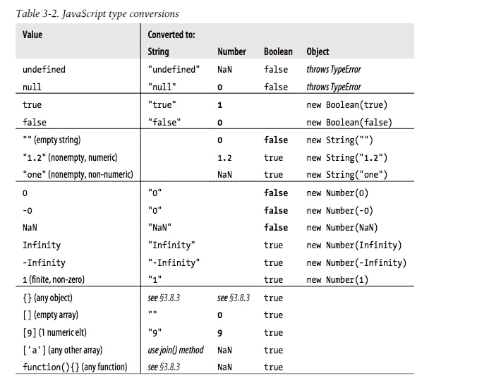

# 掌握 JavaScript 隐式类型转换

> 原文：<https://itnext.io/master-javascript-implicit-type-conversion-573d0c90a3bf?source=collection_archive---------5----------------------->


*青城山的顶峰*

完整阅读体验，欢迎访问我的[原创文章](https://terry-su.github.io/blog/detail/master-javascript-implicit-type-conversion.html)。

在开始这篇用英语写的文章之前，我想感谢 [@l3l_aze](https://www.reddit.com/user/l3l_aze) 指出了我之前的技术文章的问题，并就如何用英语写得更好给了我宝贵的建议。经过一段时间的准备，我再次开始用英语写文章，并将继续写更多。

隐式类型转换是 JavaScript 最热门也是最重要的特性之一。为了完全掌握它，我搜索了大量相关文章，查阅了《JavaScript:权威指南，第 6 版》一书，并将这些概念、想法和示例总结到本文中。

> *学习一个新的知识点，我们通常会在网上搜索、阅读大量的相关资料(博客、StackOverflow 等)。但是，要彻底掌握它，我们最好从 MDN 这样的权威资料或者权威书籍中寻找它的出处，以保证它的正确性。*

# 什么是隐式类型转换？

JavaScript 非常灵活，它会根据需要自动转换值的类型。例如:

```
'' + 1 *// '1'*
```

# 什么时候会发生隐式类型转换？

这里列出了常用的情况:

**表达式(带运算符)**
*算术*

*   `+`

```
*/* unary +, converse x to number */*
+ x+ 1 *// 1*
+ '1' *// 1*
+ true *// 1*
+ new Date() *// (a numeric value)* */* two operands */*
a + b*// 1\. if either is an object, converse it to a primitive first*
{} + {} *// '[object object][object object]'*
[] + [] *// ''*
[] + new Date() *// (A date string)**// 2\. if one is a string, converse the other to a string*
1 + '' *// '1'*
'' + 1 *// '1'*
'' + true *// 'true'**// 3\. otherwise, converse both to numbers*
1 + true *// 2*
true + true *// 2*
```

*   `-`、`*`、`/`、`++`、`--`

```
*/* Converse value or values to number */*
- '1' *// -1*
[] - 1 *// -1*
[] - {} *// NaN*
```

*关系*

*   `==`，`!=`

```
*/* two operands */*
a == b*// 1\. if one is `null` and the other is `undefined`, they are equal*
null == undefined *// true**// 2\. if one is a number and the other is a string, convert the string to a number, compare again*
1 == '1' *// true**// 3\. if either is boolean, convert it to a number, compare again*
true == 1 *// true*
false == 0 *// true**// 4\. if one is an object, and the other is a number or a string, convert the object to a primitive, compare again*
[ 1 ] == 1 *// true*
[ '1' ] == '1' *// true*
```

*   `>`、`>=`、`<`、`<=`

```
*/* two operands */*
a > b*// 1\. if either is an object, convert it to a primitive, compare again*
[ 2 ] > 1 *// true**// 2\. if both are strings, compare them using alphabetical order*
'b' > 'a' *// true**// 3\. if either is a number, convert one or two not number to number*
'2' > 1 *// true*
```

*   `in`

```
*/* if left operand isn't a string, convert it to a string  */*
a in b'1' in { 1: '' } *// true*
1 in { 1: 'a' } *// true*
1 in [ 'a', 'b' ] *// true*
```

*逻辑*

*   `&&`、`||`、`!`

```
*/* if either isn't booelan, convert it to a boolean value */*
Boolean( null || undefined || 0 || -0 || NaN || '' ) *// false*
Boolean( 1 && 'a' && {} && [] && [0] && function(){} ) *// true*
```

注意`?:``if``else if``while``do/while``for`后面的**使用与`&&``||``!`(逻辑表达式)相同的**隐式类型转换方式**。**

*有条件的*

*   `?:`

**报表**
*条件*

*   `if`，`else if`

*循环*

*   `while`、`do/while`、`for`

# 显式类型转换怎么样

显式类型转换使类型转换代码变得清晰。
虽然有很多方法来执行显式类型转换，例如`toString()`和`parseInt()`，但是推荐使用`Boolean()`、`Number()`、`String()`或`Object()`函数。

```
Boolean( 1 ) *// true*
Boolean( 0 ) *// false*Number( '1' ) *// 1*String( 1 ) *// '1'*Object( 1 ) *// new Number(1)*
```

# 通用 JavaScript 类型转换

下面的参考表来自《JavaScript:权威指南，第 6 版》，对于查找 JavaScript 中常见的类型转换非常方便



*《JavaScript-权威指南第六版》3.8.0*

# 结论

隐式类型转换有时非常有用，例如简化我们的代码。但是我们最好也注意潜在的风险，如果有人不太熟悉隐式类型转换的规则，转换的值可能是意外的。若要避免这种情况，请改用显式类型转换。

好了，就这些。如果这篇文章对你有帮助，那是我的荣幸。如果你有任何问题或建议，请在底部评论。望各位真知灼见。