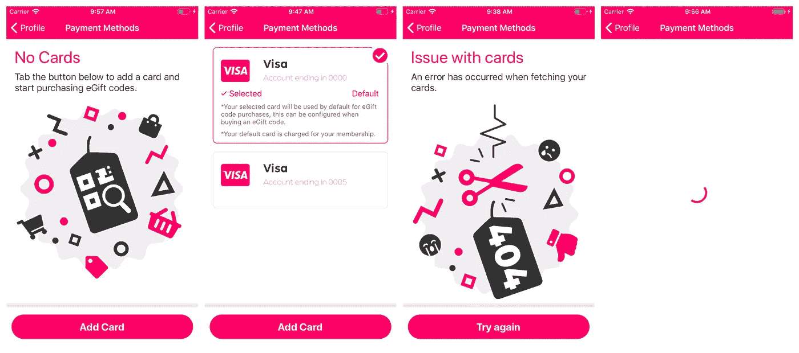
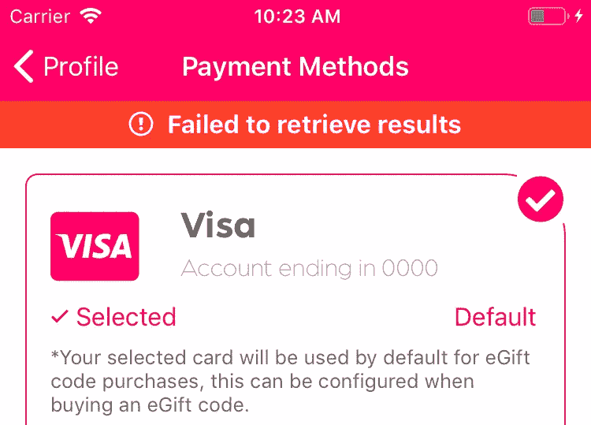
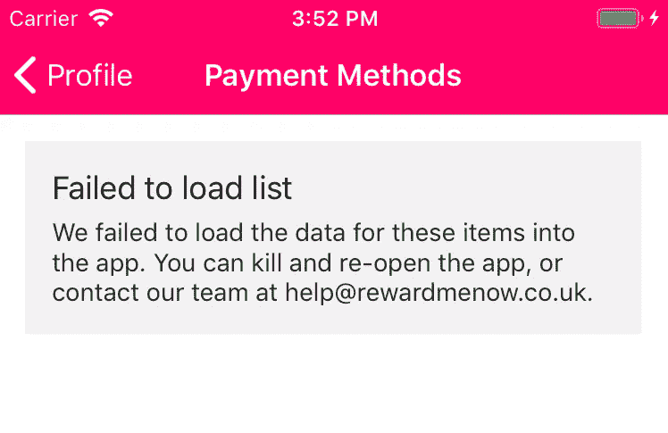
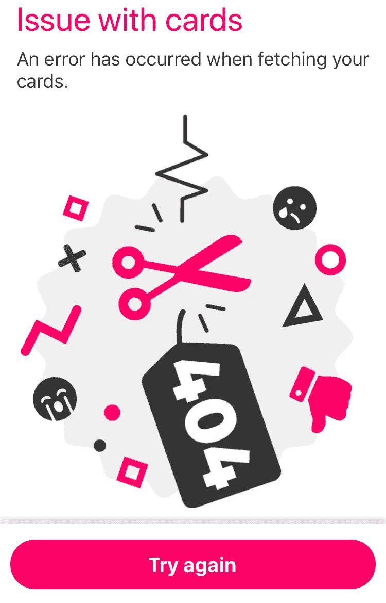
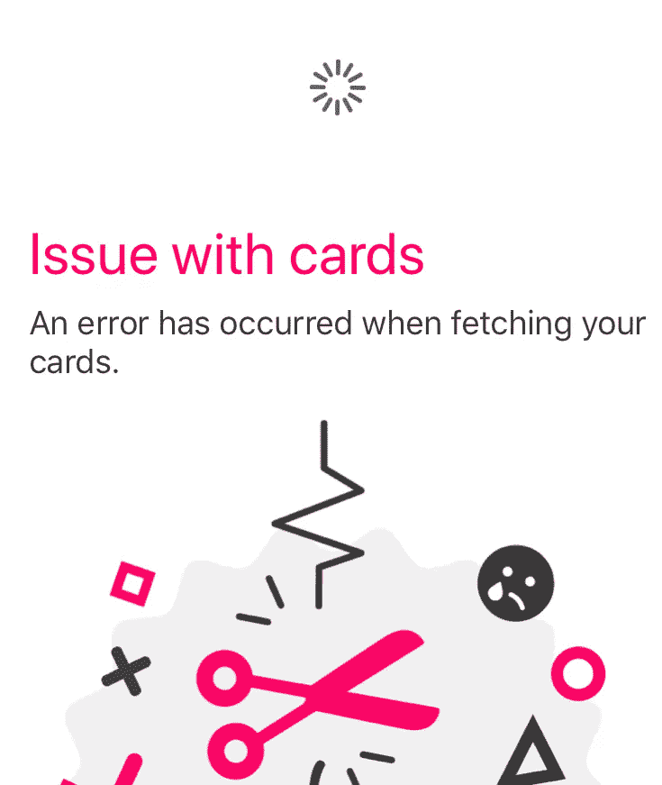

# React Native 中的主列表:新的希望

> 原文：<https://itnext.io/master-lists-in-react-native-54b485de56f5?source=collection_archive---------4----------------------->

年轻的程序员…初级工程师，欢迎来到列表圣殿，在这里你将学习如何为你的应用程序建立完美的列表。要成为一名反应原生艺人，你必须掌握两件事:*列表*和*形式*。今天你将掌握列表。

列表就像一只九头蛇，它们起初看起来很容易掌握，你甚至相信你可以用几行代码来创建一个列表，但是不要被欺骗了，它们可以长很多个头，并且有不可预见的状态要处理。

今天你将学习列表的方式，列表可以转换成的各种状态，你如何从概念上模拟这些不同的状态来构建处理不确定数据的抗错列表，并在你的应用中达到平衡。


照片由[谢尔盖·阿库利奇](https://unsplash.com/@sakulich?utm_source=unsplash&utm_medium=referral&utm_content=creditCopyText)在 [Unsplash](https://unsplash.com/search/photos/snake-monument?utm_source=unsplash&utm_medium=referral&utm_content=creditCopyText) 上拍摄

# 列表的状态

当我们在构建我们的列表时，四种状态浮现在脑海中；*空*、*数据*、*错误*和*加载*，但是当我们进一步调解这些状态时，我们发现我们的列表有一个更好的模型。

下图显示了列表的传统模型。



在“[立即奖励我](https://rewardmenow.co.uk/)”中的常规列表状态

一个列表需要所有这些状态是正确的，但是我们思考这些状态的方式导致了问题；我们认为这些状态都属于同一抽象层次。


事实是，一个列表只有两个状态，还有多个子状态。列表的两个顶级状态是**数据** *(数据可用)* 和**空** *(数据不可用)* **。**

我们只有这两种状态，而没有混合的*错误*和*加载*状态，因为首先我们不希望错误和加载超过我们的数据。其次，在我们的列表中有多种类型的*错误*和*加载*状态，根据我们的数据是否可用，我们以不同的方式处理错误和加载。


传统模式与开明模式

* *本条中的* ***数据*** *是指数据可用时的列表状态。*本条中的* ***空*** *一词是指当* ***数据不可用*** *时列表的状态。*

# **数据(有数据可查)**

顶级数据状态具有最高优先级，如果其数据可用，它将始终显示在列表中。

您的代码可能如下所示:

```
if(!_.isEmpty(data)){ // We have data, always display the list
   // Display List 
   <FlatList ... />
} else {
   // Handle errors, loading when our list is empty
```

我们不希望分页、刷新和交互的错误停止列表中的数据显示，扰乱用户体验…那将是不好的因果报应。


列表中的项目(数据可用)

## **错误**

在我们的数据列表中可能会出现两种类型的错误；**网络错误**和**处理错误**。这些错误可能发生在多个维度上，它们可能发生在整个列表上，例如刷新错误，也可能发生在单个列表项上，例如删除了单个项目并导致网络错误。

**网络错误**

网络错误意味着某个 API 级别出现了问题；API 中存在语法错误，没有网络连接，存在服务器错误。等等。

当数据存在于我们的列表中时，我们不希望网络错误中断数据的显示，在这种情况下，我们需要向用户显示警告，通知他们他们与列表或项目的交互导致了错误，而不会中断列表。



数据时出现网络错误

**加工错误**

当列表或条目中的计算出错并导致我们的应用程序崩溃时，就会发生处理错误，这是因为来自 API 的数据可能是不确定的，任何带有不确定数据的计算都可能失败。

为了解决这个问题，我们用一个 [ErrorBoundary](https://reactjs.org/docs/error-boundaries.html) 包装列表，并提供一个回退 UI 来防止应用程序崩溃。



列表处理错误

不处理这些错误会使你的应用程序崩溃，破坏你精心制作的用户体验，并破坏你的应用程序的平衡。


我们项目中的例外

处理错误也可能发生在我们的列表项中，作为完美用户体验的大师，我们不希望这些错误破坏我们的完整列表。我们还必须将每个列表项包装在一个 [ErrorBoundary](https://reactjs.org/docs/error-boundaries.html) 中，这样做的好处是允许每个列表项独立处理错误。


我们的两个项目已经崩溃的列表

## **装载**

当数据在我们的列表中可用时，网络请求的状态不应该影响数据的显示，我们不能在每次用户刷新或分页我们的列表时都显示全屏加载指示器。在这种情况下，我们可能希望列表在数据旁边显示一个加载指示器。


刷新列表

这可以是整个列表的加载指示符，也可以是单个项目的加载指示符，这取决于用户所做的动作类型。

使用该模型可以从现有数据中导出`isRefreshing`变量(其中`isLoading`是表示 X 网络请求正在进行中的布尔值):

```
const isRefreshing = !_.isEmpty(data) && isLoading;
```

重要的是，我们的加载状态不会破坏我们的数据。

> **显示数据永远是重中之重**。

您可以随意向这个模型添加更多的状态，最重要的是要注意到*数据*(数据可用)是所有这些子状态的顶级状态。其中 *empty* (数据不可用)将有它自己的子状态，接下来您会发现。

# 空(数据不可用)

当没有可用数据时，我们可以更加灵活地处理页面并显示给用户。这通常包括显示一个回退，提示用户采取行动。吸引用户在这些*空*状态下采取行动是一个很好的模式。


没有可用的卡(*空*状态)

需要注意的是，对于*空*状态，错误*需要优先于我们的*空*状态，就像网络请求中发生了错误一样，我们不能假设用户没有 X 资源。*

## **错误**

在*空的*顶级状态中，列表级没有计算，所以唯一可用的错误是网络错误，这可能有很多种；API 问题(500)、无权限(422)或无互联网连接等。

您可以实现基于错误类型显示不同用户界面的逻辑；422 ->提示用户登录，500 ->重试请求，没有互联网->提示连接到互联网等。



我们可以在这个*错误*状态中添加子状态，例如一个刷新控件，这样用户就可以下拉这个页面并尝试刷新，就好像它是一个列表一样。该子状态将是*空- >错误- >加载。*



使用这个模型，我们可以添加子状态到我们的状态中，并构建一个更有深度的用户体验。

## **装载**

这是列表的初始加载状态，列表为*空*，列表为*加载*。我们可以安全地显示列表的全尺寸加载器，因为还没有发生任何有趣的事情。


装载指示器

这个模型可以以各种方式扩展，主要的一点是，如果我们想提供优雅的用户体验，激发用户的喜悦，现在是时候停止在平面状态下考虑列表，并转向多维状态模型。

喜欢这些想法吗？[检验部分 2](/master-lists-in-react-native-beyond-the-list-3a80dcd85522) 。