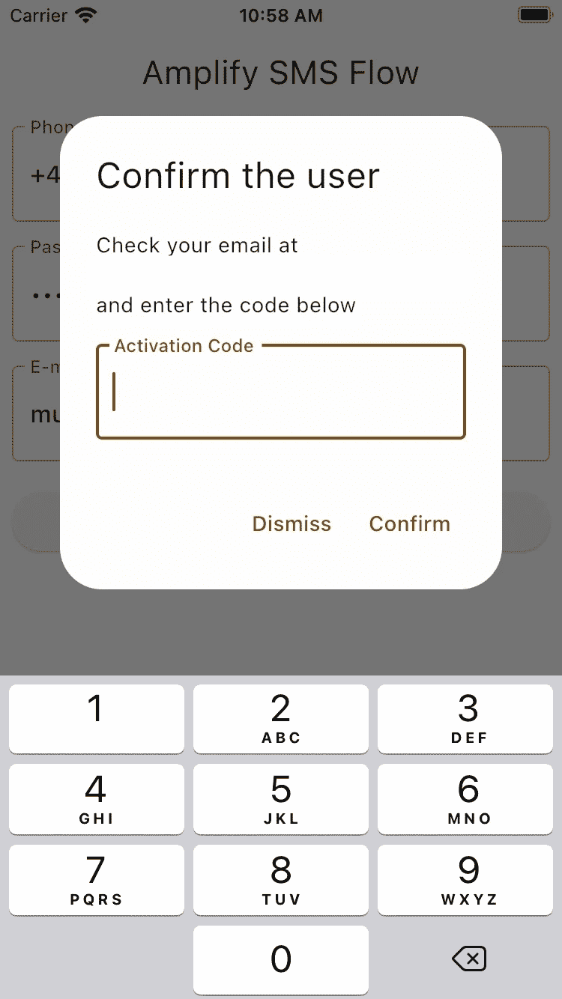
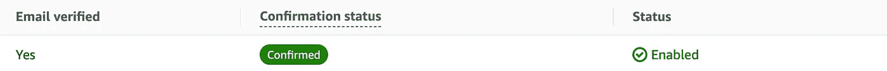
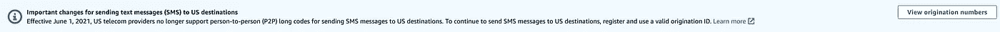
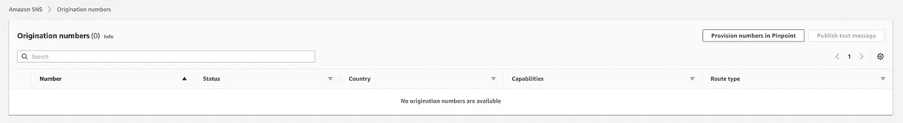
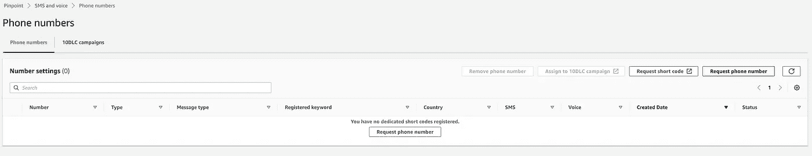
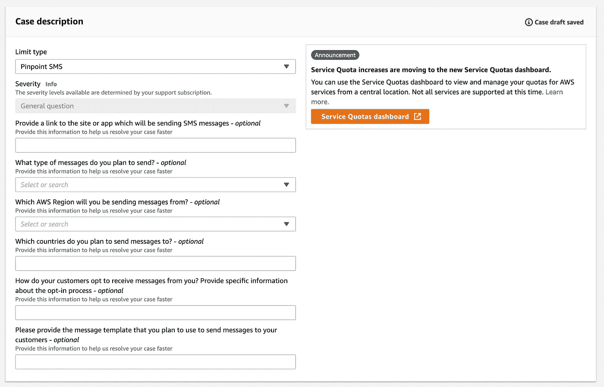
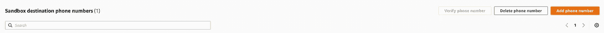
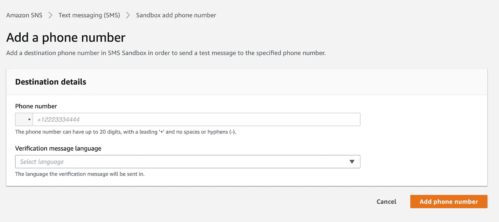
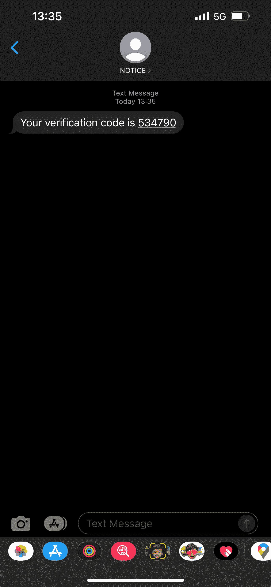
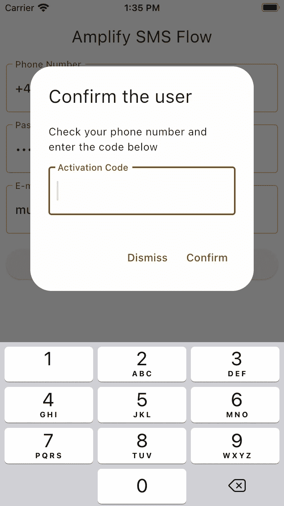

# 使用 Amplify Flutter 注册 SMS

> 原文：<https://itnext.io/mastering-aws-amplifys-sms-flows-in-flutter-part-3-sign-up-flow-d62858f9ebc7?source=collection_archive---------2----------------------->


在这个博客文章系列的前几部分中，您学习了如何创建一个 AWS 帐户、创建一个 Flutter 项目以及为您的 Flutter 项目设置 AWS Amplify。

现在是实现注册流程的时候了！

在这一系列博客文章中，您将了解到:

*   [创建 AWS 账户](https://medium.com/@muhammedsalihguler/mastering-aws-amplifys-sms-flows-in-flutter-part-1-aws-setup-ef748798fdbf)
*   [在您的机器上设置 Amplify CLI](https://medium.com/@muhammedsalihguler/mastering-aws-amplifys-sms-flows-in-flutter-part-1-aws-setup-ef748798fdbf)
*   [从 Flutter CLI 工具创建一个新的 Flutter 项目](https://medium.com/@muhammedsalihguler/mastering-aws-amplifys-sms-flows-in-flutter-part-2-project-setup-5197b77317a6)
*   通过使用 Amplify CLI 将 AWS Amplify 项目初始化到您的颤振项目中
*   [实施电话号码为](https://medium.com/@muhammedsalihguler/mastering-aws-amplifys-sms-flows-in-flutter-part-3-sign-up-flow-d62858f9ebc7)的注册流程(当前职位)
*   [用电话号码实现签到流程](https://medium.com/@muhammedsalihguler/mastering-aws-amplifys-sms-flows-in-flutter-part-4-sign-in-flow-18012bb6fb18)

# 用电话号码和电子邮件确认注册用户

在`onPressed`方法中，您将调用`Amplify.Auth.signUp`方法。这将有助于您注册用户，但需要记住一些规则:

*   默认情况下，所有情况下都启用电子邮件验证(除非另有选择)，因此在这种情况下，您需要提供电子邮件地址
*   如果您不想进行电子邮件验证，您需要启用电话验证
*   在这种情况下，电话号码将作为用户名传递。

```
Future<void> _signUpUser(String phoneNumber, String password, String email) async {
    final result = await Amplify.Auth.signUp(
        username: phoneNumber,
        password: password,
        options: CognitoSignUpOptions(
        userAttributes: {
            CognitoUserAttributeKey.email: email,
        },
        ),
    );
    if (result.isSignUpComplete) {
        //TODO: Add Sign In flow
        debugPrint('Sign up is done.');
    } else {
        //TODO: Add confirmation flow
        debugPrint('Confirmation time! Check your email!');
    }
}
```

该方法将检查用户是否:

*   作为用户名的电话号码，
*   电话号码旁边应该有国家代码
*   一个合适的电子邮件地址，
*   长密码(最少 8 个字符)

否则，它不会让用户注册。因此，让用户了解这些要求是一个好的做法。

当帐户需要确认时，用户将会看到一个对话框来输入他们的确认码。代码将被发送到这个迭代的电子邮件地址。



现在添加确认流程:

```
// Add next to the other controllers at the top of the class
late final TextEditingController _activationCodeController;// Add next to the other controllers at the initState method
_activationCodeController = TextEditingController();// Add next to the other controllers at the dispose method
_activationCodeController.dispose();...showDialog<void>(
    context: context,
    builder: (context) => AlertDialog(
        title: const Text('Confirm the user'),
        content: Column(
        mainAxisSize: MainAxisSize.min,
        children: [
            Text('Check your email at $email and enter the code below'),
            OutlinedAutomatedNextFocusableTextFormField(
                controller: _activationCodeController,
                padding: const EdgeInsets.only(top: 16),
                labelText: 'Activation Code',
                inputType: TextInputType.number,
            ),
        ],
        ),
        actions: <Widget>[
        TextButton(
            child: const Text('Dismiss'),
            onPressed: () => Navigator.of(context).pop(),
        ),
        TextButton(
            child: const Text('Confirm'),
            onPressed: () {
                Amplify.Auth.confirmSignUp(
                    username: phoneNumber,
                    confirmationCode: _activationCodeController.text,
                ).then((result) {
                    if (result.isSignUpComplete) {
                        Navigator.of(context).pop();
                    }
                });
            },
        ),
        ],
    ),
);
```

输入代码后，您可以通过向终端写入`amplify console auth`来检查您的用户控制台，并查看确认状态，如下所示:



现在您已经创建了完整的注册流程，是时候使用电话号码进行确认了！

# 用电话号码和电话号码确认注册用户

首先，从删除电子邮件地址验证和添加电话号码验证开始:

```
$ amplify update auth 
Using service: Cognito, provided by: awscloudformation
$ What do you want to do? 
  Apply default configuration with Social Provider (Federation) 
❯ Walkthrough all the auth configurations 
  Create or update Cognito user pool groups 
  Create or update Admin queries API

$ Select the authentication/authorization services that you want to use: (Use arrow
 keys)
❯ User Sign-Up, Sign-In, connected with AWS IAM controls (Enables per-user Storage
 features for images or other content, Analytics, and more) 
  User Sign-Up & Sign-In only (Best used with a cloud API only) 
  I want to learn more.  

$ Allow unauthenticated logins? (Provides scoped down permissions that you can cont
rol via AWS IAM) (Use arrow keys)
  Yes 
❯ No 
  I want to learn more. 

$ Do you want to enable 3rd party authentication providers in your identity pool? 
  Yes 
❯ No 
  I want to learn more. 

$ Do you want to add User Pool Groups? 
  Yes 
❯ No 
  I want to learn more. 

$ Do you want to add an admin queries API? 
  Yes 
❯ No 
  I want to learn more.   

$ Multifactor authentication (MFA) user login options: (Use arrow keys)
❯ OFF 
  - ON (Required for all logins, can not be enabled later) (Disabled)
  OPTIONAL (Individual users can use MFA) 
  I want to learn more.

$ Email based user registration/forgot password: 
  Enabled (Requires per-user email entry at registration) 
❯ Disabled (Uses SMS/TOTP as an alternative)$ Please specify an SMS verification message: (Your verification code is {####})$ Do you want to override the default password policy for this User Pool? (y/N)$ Specify the app's refresh token expiration period (in days): (30)$ Do you want to specify the user attributes this app can read and write? (y/N)$ Do you want to enable any of the following capabilities? (Press <space> to select, 
<a> to toggle all, <i> to invert selection)
❯◯ Add Google reCaptcha Challenge
 ◯ Email Verification Link with Redirect
 ◯ Add User to Group
 ◯ Email Domain Filtering (denylist)
 ◯ Email Domain Filtering (allowlist)
 ◯ Custom Auth Challenge Flow (basic scaffolding - not for production)
 ◯ Override ID Token Claims

$ Do you want to use an OAuth flow? 
  Yes 
❯ No 
  I want to learn more.  

$ Do you want to configure Lambda Triggers for Cognito? (Y/n)
```

现在通过`amplify push`将你的改变推送到云端，然后回到你的代码。

```
showDialog<void>(
    context: context,
    builder: (context) => AlertDialog(
        title: const Text('Confirm the user'),
        content: Column(
        mainAxisSize: MainAxisSize.min,
        children: [
            const Text('Check your phone number and enter the code below'),
            OutlinedAutomatedNextFocusableTextFormField(
                controller: _activationCodeController,
                padding: const EdgeInsets.only(top: 16),
                labelText: 'Activation Code',
                inputType: TextInputType.number,
            ),
        ],
        ),
        actions: <Widget>[
            TextButton(
                child: const Text('Dismiss'),
                onPressed: () => Navigator.of(context).pop(),
            ),
            TextButton(
                child: const Text('Confirm'),
                onPressed: () {
                    Amplify.Auth.confirmSignUp(
                        username: phoneNumber,
                        confirmationCode: _activationCodeController.text,
                    ).then((result) {
                        if (result.isSignUpComplete) {
                        Navigator.of(context).pop();
                        }
                    });
                },
            ),
        ],
    ),
);
```

> *请注意，这并不意味着你不需要电子邮件地址。为了验证用户信息，Amplify 会要求提供电子邮件地址或一系列个人信息，如姓名等。为了简单起见，您将在这里继续使用电子邮件。*

如果您再次运行应用程序并注册用户，现在您将不会收到电子邮件。但是您还不会收到短信，因为您还没有设置发送信息的系统。

一旦您启用了基于 SMS 的身份验证工作流，如果您仔细查看调试控制台，您可能会记得看到如下所示的错误消息:

```
⚠️ You have enabled SMS based auth workflow. Verify your SNS account mode in the SNS console: [https://console.aws.amazon.com/sns/v3/home#/mobile/text-messaging](https://console.aws.amazon.com/sns/v3/home#/mobile/text-messaging)
If your account is in "Sandbox" mode, you can only send SMS messages to verified recipient phone numbers.
```

Amplify 使用**简单通知服务(SNS)** 提供从发布者到订阅者的消息传递服务。要发送 SMS 消息，需要在 Amazon SNS 上拥有一个帐户。

## 注册特殊请求国家的电话号码

转到[亚马逊社交网络信息页面](https://console.aws.amazon.com/sns/v3/home#/mobile/text-messaging)，在你做任何其他事情之前，检查你是否在页面顶部有如下警告:



如果你这样做了，这意味着在某些国家，你需要拨打号码来发送消息，但如果你没有，这对你来说是个好消息，你可以跳到**注册沙盒目的地的电话号码**部分。

现在点击**查看始发号码**按钮。它将引导您进入[始发号码控制台](https://eu-west-3.console.aws.amazon.com/sns/v3/home#/mobile/origination-identities)。您可以检查您已有的号码，或者通过点击**精确定位**按钮中的供应号码来创建一个新号码。



这将带你到亚马逊精确定位页面添加数字。如果您的国家不支持发件人 id，您必须购买一个始发号码。在精确定位中，点击**请求电话号码**。这将把你带到一个页面，在那里你可以获得一个免费号码发送短信。选择您将发送短信的国家，然后按照提示请求新号码。成功申请免费号码后，您可以返回 SNS 验证您的电话号码，如下一节所述。



## 为特殊请求国家注册发件人 id

如果您支持的国家/地区不在电话号码列表中，那么您可以在此处查看[国家/地区列表](https://docs.aws.amazon.com/pinpoint/latest/userguide/channels-sms-countries.html)以了解相关要求。例如，像土耳其这样的一些国家要求发送者注册。要求发件人使用预先注册的字母发件人 ID。在 SMS 消息中，*发送者 ID* 是在接收者的设备上显示为消息发送者的名称。对发件人 id 的支持因国家而异。比如美国的运营商根本不支持发件人 id，但是印度的运营商要求发件人使用发件人 id。

> *如果您需要在印度注册发件人 ID，请在*您在支持中心打开案例之前，完成* [*印度特殊要求*](https://docs.aws.amazon.com/pinpoint/latest/userguide/channels-sms-senderid-india.html) 中的程序。*

进入[服务限制增加支持页面](https://us-east-1.console.aws.amazon.com/support/home#/case/create?issueType=service-limit-increase):



*   对于**限制类型**，选择**精确定位短信**。
*   (可选)对于**，提供发送短信的网站或应用程序的链接**，提供发送短信的网站、应用程序或服务的信息。
*   (可选)对于**您计划发送什么类型的消息**，选择您计划使用长码发送的消息类型:
*   **一次性密码** —提供密码的消息，您的客户使用这些密码来验证您的网站或应用程序。
*   **促销**——宣传你的业务或服务的非关键信息，如特价或公告。
*   **交易** —支持客户交易的重要信息消息，如订单确认或账户提醒。交易消息不得包含促销或营销内容。
*   (可选)对于**您将从哪个 AWS 地区发送消息**，选择您将从哪个地区发送消息。
*   (可选)对于**您计划向哪些国家发送消息**，输入您想要购买短代码的国家或地区。
*   (可选)在**您的客户如何选择接收来自您的消息**中，提供有关您选择加入流程的详细信息。
*   (可选)在**请提供您计划用于向客户发送消息的消息模板**字段中，包括您将使用的模板。

之后，填写如下请求信息(您可以根据自己喜欢的地区选择**地区**):


最后，按如下方式填写案例描述，并提交您的请求:

```
Sender id: <SENDER-ID>
SMS Template: <YOUR-MESSAGE> e.g. Your confirmation code is: ####
Planned message count: <ESTIMATED-NUMBER-OF-MESSAGES-TO-SEND>  
User opt-in: <TEXT-TO-EXPLAIN-HOW-USERS-OPT-IN>
Organization name: <NAME>
Organization address: <Address>
Organization country: <Country>
Organization phone number: <PHONE-NUMBER>
Organization website: <URL>
```

收到请求后，将在 24 小时内提供初步答复。

获取发件人 ID 的过程完成后，您将会收到通知。当您收到此通知时，请完成本节中的步骤，将 Amazon Pinpoint 配置为使用您的发件人 ID。

*   登录 AWS 管理控制台，打开[亚马逊针尖控制台](https://console.aws.amazon.com/pinpoint/)。
*   在**所有项目**页面上，选择一个使用短信频道的项目。
*   在导航窗格中的**设置**下，选择**短信和语音**。
*   在**短信设置**旁边，选择**编辑**。
*   在**帐户级别设置**下，对于**默认发件人 ID** ，键入您的发件人 ID。
*   选择**保存更改**。

## 注册沙盒目的地的电话号码

如果您的帐户处于沙盒模式，您需要添加一个电话号码并进行验证。转到**沙盒目的地电话号码**部分，点击**添加电话号码**按钮。



之后，添加一个新的电话号码，并用一条消息验证该号码。



验证您的号码和验证状态为“已验证”后。现在，您可以从您的应用程序发送消息。再次运行您的应用程序，并尝试创建一个帐户。您现在将收到一个可以使用的验证码。



将其添加到您的确认对话框中以确认用户:



现在，您应该已经设置好电话验证了！

下一步是用电话号码连接登录流。

有关 AWS Amplify 认证库的更多信息，您可以查看[官方文档](https://docs.amplify.aws/lib/auth/getting-started/q/platform/flutter/)，在 [Amplify Discord](https://t.co/KE3BsVI4eb) 提出您的问题。您也可以通过 [GitHub](https://github.com/salihgueler/amplify_sms_test) 查看源代码，如果您对放大和抖动主题有任何疑问，请通过 DM 在 [Twitter](https://twitter.com/salihgueler) 上发送给我！

下期帖子再见！