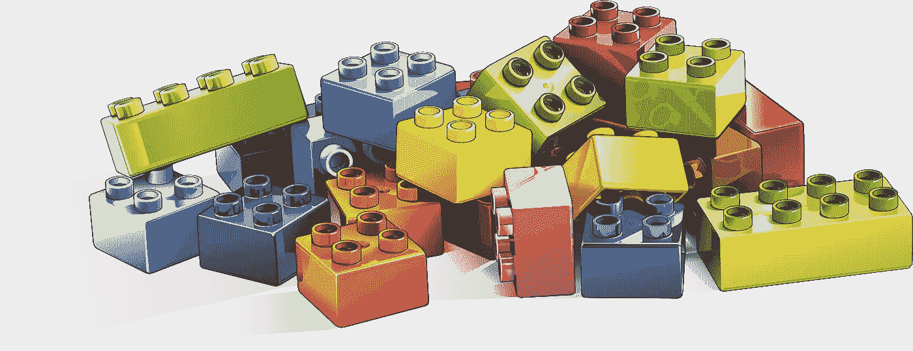

# 在 Swift 中掌握编码

> 原文：<https://itnext.io/mastering-codable-in-swift-part-1-81de0b824c51?source=collection_archive---------3----------------------->



[https://pix abay . com/illustrations/Lego-building-game-toy-drawing-3388163/](https://pixabay.com/illustrations/lego-building-game-toy-drawing-3388163/)

Codable 是 Apple 提供的一个漂亮的工具，它以(主要)声明的方式执行值的序列化和反序列化。

使用 Codable，您可以

*   将 JSON 转换成某种类型的实例
*   使用某种类型的实例生成 JSON

在这篇面向初学者的文章中，您将学习如何在 5 个简单的场景中使用 Codable:

1.  解码简单的 JSON
2.  添加一个类型为 *Double* 的字段
3.  将 *snake_case* JSON 映射到 *camelCase* swift 类型
4.  解码元素列表
5.  可选值

# 场景 1:解码简单的 JSON

让我们从一个非常简单的场景开始，你有一个像这样的 JSON

```
let json = """
{
    "name": "Enterprise D",
    "captain": "Jean Luc Picard"
}
"""
```

你有一个这样的结构

```
struct Ship: Codable {
    let name: String
    let captain: String
}
```

您可以简单地编写一个 Ship 实例

```
guard let data = json.data(using: String.Encoding.utf8) else { fatalError("☠️") }do {
    let ship = try JSONDecoder().decode(Ship.self, from: data)
    print(ship)
} catch {
    print(error)
}
```

结果将会是

```
Ship(name: “Enterprise D”, captain: “Jean Luc Picard”)
```


[https://en . Wikipedia . org/wiki/USS _ Enterprise _(NCC-1701-D)#/media/File:Enterprise _ forward . jpg](https://en.wikipedia.org/wiki/USS_Enterprise_(NCC-1701-D)#/media/File:Enterprise_Forward.jpg)

它是如何工作的？

自动解码机制起作用是因为:

1.  **船**符合**编码**
2.  JSON **键名**和 Ship struct **属性名**确实匹配
3.  JSON **键类型**和 Ship struct **属性匹配**匹配

这是声明式编程的一个很好的例子，我们刚刚描述了 *Ship* 类型是怎样的，剩下来的是对所有无聊的东西进行编码。

# 场景 2:添加 Double 类型的字段

这很简单，现在让我们假设我们的 JSON 有另一个类型为 *Double* 的属性

```
let json = """
{
    "name": "Enterprise D",
    "captain": "Jean Luc Picard",
    "max_warp_speed": 9.6
}
"""
```

让我们更新我们的结构

```
struct Ship: Codable {
    let name: String
    let captain: String
    let max_warp_speed: Double
}
```

并运行解码指令

```
guard let data = json.data(using: String.Encoding.utf8) else { fatalError("☠️") }do {
    let ship = try JSONDecoder().decode(Ship.self, from: data)
    print(ship)
} catch {
    print(error)
}
```

我们再次得到一个新的实例*船*

```
Ship(name: “Enterprise D”, captain: “Jean Luc Picard”, max_warp_speed: 9.6)
```

# 场景 3:将 snake_case JSON 映射到 camelCase 结构

前面场景中使用的 *max_warp_speed* 属性不是很“迅捷”对吧？我们应该使用*驼峰*符号

```
struct Ship: Codable {
    let name: String
    let captain: String
    let maxWarpSpeed: Double
}
```

但是现在属性 maxWarpSpeed 的名称不再匹配 JSON max_warp_speed 中的键。

好消息是，我们可以告诉 Codable 自动将名称从 *snake_case_notation* (在 JSON 中使用)转换为 *camelCase* (在 Struct 中使用)。

```
struct Ship: Codable {
    let name: String
    let captain: String
    let maxWarpSpeed: Double
}guard let data = json.data(using: String.Encoding.utf8) else { fatalError("☠️") }do {
    let decoder = JSONDecoder()
    decoder.keyDecodingStrategy = .convertFromSnakeCase // 👈
    let ship = try decoder.decode(Ship.self, from: data)
    print(ship)
} catch {
    print(error)
}
```

# 场景 4:元素列表

现在让我们考虑一个带有元素列表的 JSON

```
let json = """
[
    {
        "name": "Enterprise D",
        "captain": "Jean Luc Picard",
        "max_warp_speed": 9.6
    },
    {
        "name": "Defiant",
        "captain": "Benjamin Sisko",
        "max_warp_speed": 9.2
    },
    {
        "name": "Voyager",
        "captain": "Captain Kathryn Janeway",
        "max_warp_speed": 9.975
     }
]
"""
```

我们可以将这个 JSON 解码成一个由*Ship*组成的数组。

```
struct Ship: Codable {
    let name: String
    let captain: String
    let maxWarpSpeed: Double
}guard let data = json.data(using: String.Encoding.utf8) else { fatalError("☠️") }do {
    let decoder = JSONDecoder()
    decoder.keyDecodingStrategy = .convertFromSnakeCase
    let ships = try decoder.decode([Ship].self, from: data) // 👈
    print(ships)
} catch {
    print(error)
}
```

我们替换了这条线

```
let ship = try decoder.decode(Ship.self, from: data)
```

用这条线

```
let ships = try decoder.decode([Ship].self, from: data)
```

# 场景 5:可选值

现在我们想给我们的 JSON 添加一个*位置*键

```
let json = """
[
    {
        "name": "Enterprise D",
        "captain": "Jean Luc Picard",
        "max_warp_speed": 9.6,
        "position": "Alpha quadrant"
    },
    {
        "name": "Defiant",
        "captain": "Benjamin Sisko",
        "max_warp_speed": 9.2,
        "position": "Alpha quadrant"
    },
    {
        "name": "Voyager",
        "captain": "Captain Kathryn Janeway",
        "max_warp_speed": 9.975,
        "position": null
    }
]
"""
```

如您所见，position 属性仅填充了前两个元素(我们不知道 Voyager 的位置)。

让我们更新我们的结构

```
struct Ship: Codable {
    let name: String
    let captain: String
    let maxWarpSpeed: Double
    let position: String
}
```

让我们再次运行代码

```
guard let data = json.data(using: String.Encoding.utf8) else { fatalError("☠️") }do {
    let decoder = JSONDecoder()
    decoder.keyDecodingStrategy = .convertFromSnakeCase
    let ships = try decoder.decode([Ship].self, from: data)
    print(ships)
} catch {
    print(error)
}
```

结果我们得到了这个错误

```
valueNotFound(Swift.String, Swift.DecodingError.Context(codingPath: [_JSONKey(stringValue: “Index 2”, intValue: 2), CodingKeys(stringValue: “position”, intValue: nil)], debugDescription: “Expected String value but found null instead.”, underlyingError: nil))
```

Codable 告诉我们，position 在我们的结构中被定义为强制的，但在 JSON 的第 3 个元素中没有找到。

我们可以修复它，使“位置”成为结构中的可选值

```
struct Ship: Codable {
    let name: String
    let captain: String
    let maxWarpSpeed: Double
    let position: String? // 👈
}
```

让我们再试一次，现在问题已经解决了，因此，我们的*船*阵列已经被正确填充了。

# 结论

在本文中，您了解了使用可编码协议可以完成的基本操作。然而，这个工具更强大，可以做更多的事情。我将在[未来的文章](https://medium.com/@lucaangeletti/mastering-codable-in-swift-part-2-876e646e0844)中讨论这个问题。