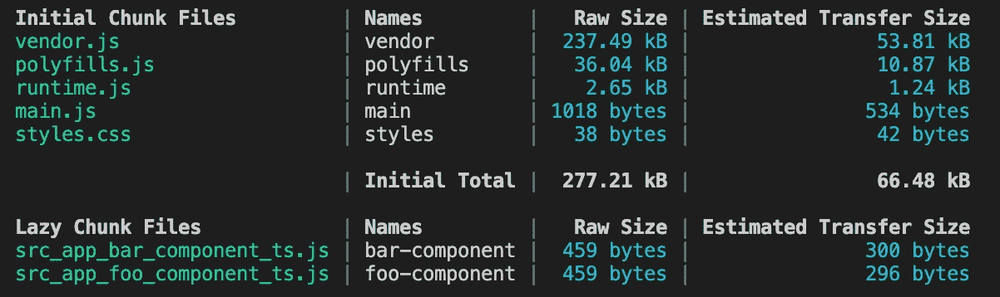
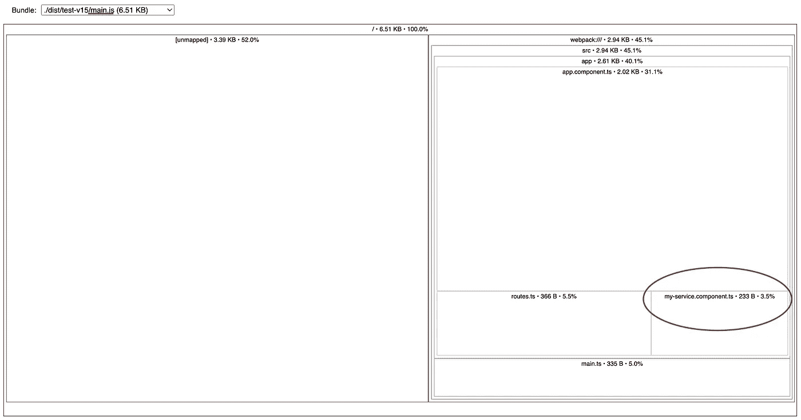
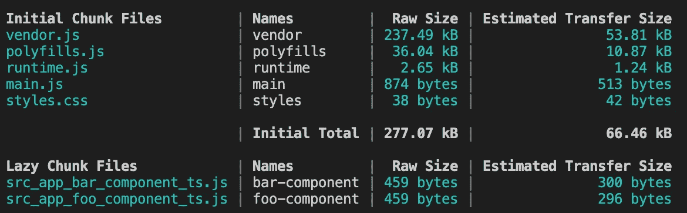
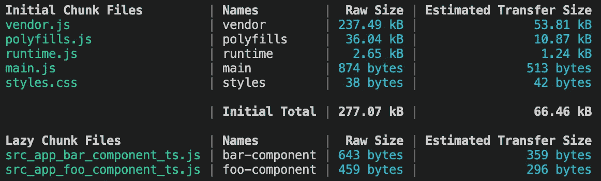
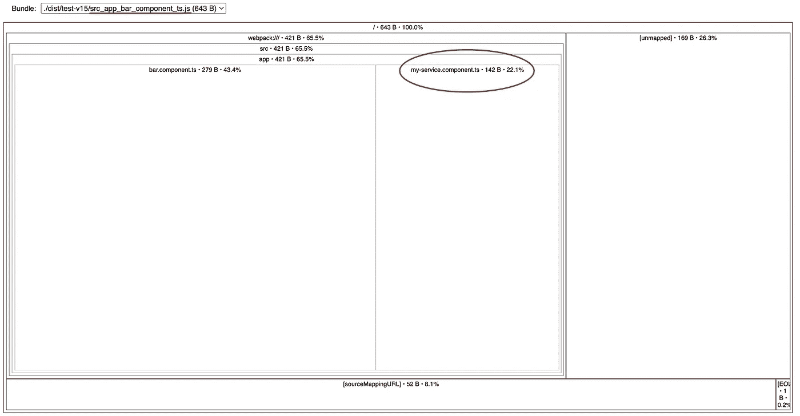
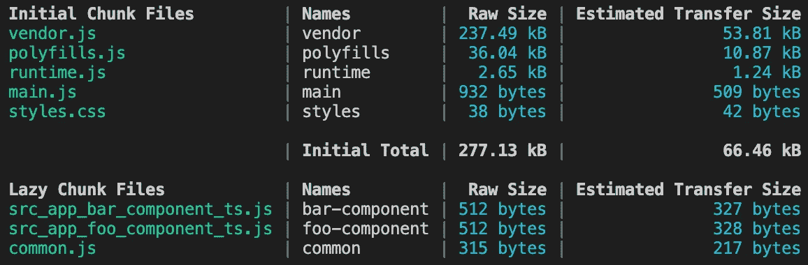
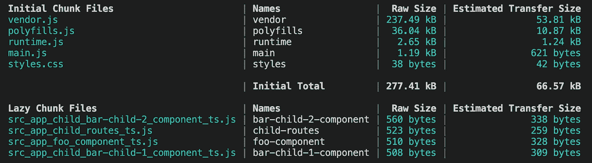
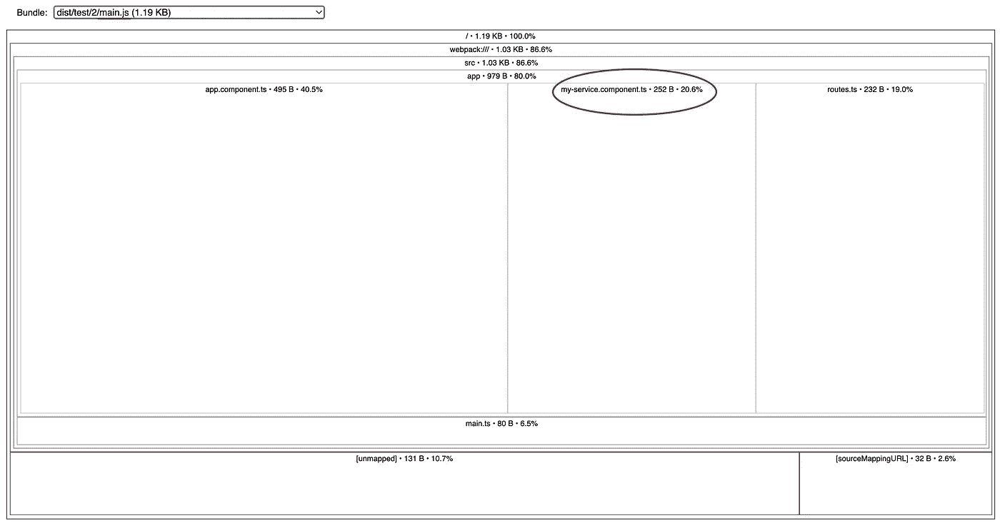

# 掌握注射服务:综合指南

> 原文：<https://itnext.io/mastering-injectable-services-a-comprehensive-guide-6c2c0f5f48a2?source=collection_archive---------1----------------------->


在 Angular 中，`@Injectable` decorator 用于创建服务，这些服务可以通过 Angular 的依赖注入系统提供给其他组件。然后，这些服务可以将依赖注入系统 *(DI)* 提供的其他服务注入到它们的类中。

要声明一个可注入的服务，我们只需在类的顶部添加装饰器:

```
@Injectable()
class MyService {
}
```

然而，仅仅添加`@Injectable`装饰器并不能在 Angular 的 DI 系统中自动提供该服务。让我们探索 Angular 中提供服务的各种方式。

# provided in:“root”与在引导提供程序阵列中提供服务。

> 对于仍在使用 NgModule 的开发人员来说，位于`main.ts`中的引导提供者数组类似于您的`AppModule`中的提供者数组。

在这两个场景中，我们的服务都是单例的，这意味着在我们的整个应用程序中只有一个服务实例。我们可以在任何地方注入相同的实例。

主要区别在于 Angular 如何以及在哪里捆绑我们的服务。我们将在 5 个场景中设想这一点。

*   服务未使用的引导提供程序阵列
*   在一个组件中使用服务的引导提供程序阵列
*   向“root”提供未使用的服务
*   为“根”提供在一个组件中使用的服务
*   为“根”提供在多个组件中使用的服务

出于演示的目的，我们创建了 3 个组件`AppComponent`、`FooComponent`和`BarComponent`。`FooComponent`和`BarComponent`懒加载在路线导航上。Angular 将创建 3 个不同的包，我们将使用[*source-map-explorer*](https://www.npmjs.com/package/source-map-explorer)*来查看哪个包`MyService`在其中。*

```
*export const routes: Routes = [
  {
    path: 'foo',
    loadComponent: () => import('./foo.component').then((x) => x.FooComponent),
  },
  {
    path: 'bar',
    loadComponent: () => import('./bar.component').then((x) => x.BarComponent),
  },
];*
```

*目标是可视化 Angular 编译器如何动摇我们的服务。*

> ***树摇动**是从一个包中移除死代码以将其大小减到最小的过程。*

## *1-在引导提供程序阵列中提供服务，即使它未被使用*

*让我们从在我们的引导应用程序提供者阵列中提供服务开始。*(我们的服务不会被使用)**

```
*bootstrapApplication(AppComponent, {
  providers: [
    MyService, 
    provideRouter(routes)
  ],
});*
```

*要使用 *source-map-explorer* ，我们需要通过构建我们的应用程序来创建我们的 sourceMap 文件:*

```
*ng build -c development*
```

**

*我们可以看到我们构建的结果，它显示 Angular 为 web 应用程序创建了两个惰性块和一个经典构建块。我们的重点将放在两个懒惰块和`main.js`*

*让我们用 *source-map-explorer* 更近距离地观察我们的包:*

```
*source-map-explorer ./dist/[my-application-name]/*.js*
```

**

*我们可以看到，我们的服务嵌入在我们的主包中，即使该服务未被使用。这导致了用户将下载但从不使用的代码。*

## *2-在引导提供者阵列中提供服务，并在一个延迟加载的组件中使用该服务*

*我们得到和以前一样的结果。该服务被捆绑在我们的主捆绑包中，即使我们只在一个惰性加载的组件中使用它。*

## *3-为“根”提供未使用的服务*

*我们可以使用`@Injectable`装饰器中的`ProvidedIn`属性来指定哪个注入器将提供我们的服务..*

```
*@Injectable({ providedIn: 'root' })
export class MyService {}*
```

*设置`providedIn: 'root'`将在应用程序的根级别提供我们的服务。这可能看起来与前面的例子相似，但是 Angular 编译器能够根据注入的位置来改变我们的服务。*

**

*如果我们将这个构建结果与前一个进行比较，我们可以看到`main.js`包从 1018B 下降到 874B，而`bar.js`和`foo.js`包没有变化。由于没有注入`MyService`，Angular 编译器没有将它包含在任何包中。*

## *4-为“根”提供在一个组件中使用的服务*

*让我们在`BarComponent`中注入我们的服务，然后重新运行我们的构建。*

```
*@Component({
  selector: 'app-bar',
  standalone: true,
  imports: [],
  template: `bar`,
})
export class BarComponent {
    service = inject(MyService)
}*
```

**

*我们可以看到`bar.js` bundle 的大小增加了，说明由于`MyService`只被`BarComponent`使用，编译器已经把服务和组件捆绑在一起了。*

*我们也可以用*地图资源管理器*来可视化它。*

**

## *5-为“根”提供在多个惰性加载组件中使用的服务*

*如果我们在多个延迟加载的组件中使用我们的服务会发生什么。让我们也在`FooComponent`中注入服务。*

**

*Angular 已经创建了第三个块`common.js`，其中包含了我们的服务。这确保了没有重复的代码。在我们的应用程序中调用的第一个组件将下载`common.js`。*

> *块大小有点大，因为我们现在在编译的 js 文件中添加了构造函数声明。*

## ***结论:***

*对于每个单例服务，总是使用`ProvidedIn: 'root'`。更容易维护，Angular 编译器在幕后做了一项了不起的工作，以最佳方式树摇我们的包。*

# *非单一服务*

*如果我们想要同一个服务的多个实例，我们必须将`ProvidedIn`属性设置为未定义的*(或者移除它)*，并在组件`providers`数组中提供服务。*

```
*@Component({
  selector: 'app-bar',
  standalone: true,
  imports: [],
  providers: [MyService], // provide a service
  template: `bar`,
})
export class BarComponent {
  service = inject(MyService)
}*
```

*我们的服务实例现在连接到了组件的生命周期。当我们的组件被实例化或销毁时，我们的服务也将被实例化或销毁。如果创建了两个组件，那么就会创建两个单独的`MyService`实例。*

## *小挑战:*

***挑战 1:***

```
*@Injectable()
export class MyService {
  title = 'No Title';

  setTitle = (title: string) => (this.title = title);
}

@Component({
  selector: 'child',
  standalone: true,
  template: `<div>{{ myService.title }}</div>`,
})
export class ChildComponent {
  myService = inject(MyService);
}

@Component({
  selector: 'parent',
  standalone: true,
  imports: [ChildComponent],
  providers: [MyService],
  template: `<child></child>`,
})
export class ParentComponent {
  myService = inject(MyService).setTitle('Parent Title');
}*
```

***问题:**你的屏幕上会显示什么？*

***解:**父题*

***解释:**如果我们在父组件的`providers`数组中声明服务，那么它的所有子组件都将获得服务的相同实例。这对于在一组组件之间共享信息非常有用。*

***挑战二:***

```
*@Injectable()
export class MyService {
  title = 'No Title';

  setTitle = (title: string) => (this.title = title);
}

@Component({
  selector: 'child',
  standalone: true,
  providers: [MyService], // provide MyService in child component
  template: `<div>{{ myService.title }}</div>`,
})
export class ChildComponent {
  myService = inject(MyService);
}

@Component({
  selector: 'parent',
  standalone: true,
  imports: [ChildComponent],
  providers: [MyService],
  template: `<child></child>`,
})
export class ParentComponent {
  myService = inject(MyService).setTitle('Parent Title');
}*
```

*问题:你的屏幕上会显示什么？*

***解决方案:**没有标题*

***解释:**如果我们在父组件和子组件中都提供了`MyService`，那么`MyService`将会有两个不同的实例。*(我将在另一篇文章中更详细地解释 DI 是如何工作的)**

# *提供内部路由提供程序数组*

*另一种提供服务的方式是在 route 的`providers`数组中。*

> *这类似于在惰性加载的 NgModule 中提供它。*

```
*export const routes: Routes = [
  {
    path: 'bar',
    providers: [MyService],
    loadChildren: () => import('./child/routes').then((r) => r.childRoutes),
  },
  {
    path: 'foo',
    loadComponent: () => import('./foo.component').then((x) => x.FooComponent),
  },
];*
```

*其中`childRoutes`是路由的子集。*

```
*export const childRoutes: Routes = [
  { path: '', pathMatch: 'full', redirectTo: 'bar-1' },
  {
    path: 'bar-1',
    loadComponent: () =>
      import('./bar-child-1.component').then((x) => x.BarChild1Component),
  },
  {
    path: 'bar-2',
    loadComponent: () =>
      import('./bar-child-2.component').then((x) => x.BarChild2Component),
  },
];*
```

*这种行为可能有点令人困惑。当我们第一次导航到`bar-child`路线中的一条路线时，`MyService`将被实例化。如果我们离开，服务不会被破坏。如果我们导航回该路由，该服务将不会被再次实例化，这意味着在内存中将只有一个`MyService`实例。*

*然而，不是该路线的子组件的其他组件将不能访问`MyService`。*

*在构建时，`MyService`将位于`main.js`内部。*(而不是在我认为它会在的一个懒惰加载的块中)。*请注意，这与在父组件或子组件中提供`MyService`不同，在父组件或子组件中，它将与那些组件一起被实例化和销毁。*

****

***额外提示:**如果我们想要创建一个在导航到特定路线时被实例化并在导航离开时被销毁的服务，我们可以将前面两个部分中所学的内容结合起来。*

*要销毁服务，需要在组件装饰器中提供服务。但是要在路线导航上实例化它，必须在路线级别提供服务。解决方案是创建一个父组件来保存我们服务的实例。*

```
*{
  path: 'bar',
  loadComponent: () =>
    import('./my-service.component').then((x) => x.MyServiceComponent),
  loadChildren: () => import('./child/routes').then((r) => r.childRoutes),
},*
```

```
*@Component({
  standalone: true,
  imports: [RouterOutlet],
  providers: [MyService],
  template: `<router-outlet></router-outlet>`,
})
export class MyServiceComponent {}*
```

*在这个例子中，`MyServiceComponent`被提供了一个`MyService`的实例。当我们导航到`bar`时，子组件被创建，它将被提供相同的`MyService`实例。当我们离开时，子组件被销毁，`MyService`的实例也将被销毁。*

*本文到此为止！您现在应该掌握并优化 Angular 中的注入服务。*

*如果你觉得这篇文章有用，请考虑支持我的工作，为它鼓掌👏👏帮助它接触到更广泛的受众。非常感谢你的支持。*

*我希望你学到了新的角度概念。你可以在 [Medium](https://medium.com/@thomas.laforge) 、 [Twitter](https://twitter.com/laforge_toma) 或者 [Github](https://github.com/tomalaforge) 上找到我。如果你有更多的问题，不要犹豫来找我*

> **👉而如果你想加速你的角度学习之旅，快来看看* [*角度挑战*](https://github.com/tomalaforge/angular-challenges) *。**