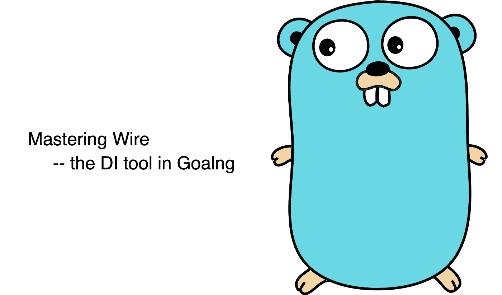

# 母带电线

> 原文：<https://itnext.io/mastering-wire-f1226717bbac?source=collection_archive---------0----------------------->



# 这是什么？

[Wire](https://github.com/google/wire) 是 Golang 中的一个轻量级依赖注入工具，由 Go Cloud 团队开发。它自动生成代码，然后在编译时注入依赖。

[依赖注入](https://en.wikipedia.org/wiki/Dependency_injection)是保持软件“松耦合和易于维护”的最重要的设计原则之一。

这一原则广泛应用于各种开发平台，并且有许多优秀的相关工具。

在所有这些工具中，最著名的是 [Spring](https://spring.io/projects/spring-framework) ，Spring 作为 IOC 框架的基础对其今天的主导地位起到了决定性的作用。

实际上，软件开发的 [S.O.L.I.D](https://en.wikipedia.org/wiki/SOLID) 原则中的“D”就是特指这个话题。

# 为什么电线不一样？

依赖注入是如此重要，以至于 Golang 社区中已经有相当多的解决方案，例如来自优步的 [dig](https://github.com/uber-go/dig) 和来自脸书的 [inject](https://github.com/facebookgo/inject) 。两者都通过[反射机制](https://golang.org/pkg/reflect/)实现运行时依赖注入。

为什么 Go Cloud 团队要重新发明轮子？因为在他们看来，上面的库都不符合 Go 的哲学:

> [*清晰胜过巧妙*](https://www.youtube.com/watch?v=PAAkCSZUG1c&t=14m35s) *，* [*反思永远不清晰。*](https://www.youtube.com/watch?v=PAAkCSZUG1c&t=15m22s)
> 
> *—抢派克*

Wire 作为代码生成工具，可以在编译时生成源代码，实现依赖注入。它不需要反射或[服务定位器](https://en.wikipedia.org/wiki/Service_locator_pattern)。后面你会看到，Wire 生成的代码和手写的代码没有区别。这种方法带来了一些好处:

1.  易于调试。如果缺少任何依赖项，编译期间将会报告错误
2.  因为不需要服务定位器，所以对命名没有特殊要求
3.  避免依赖性膨胀。生成的代码将只导入您需要的依赖项，而运行时依赖项注入直到运行时才能识别未使用的依赖项。
4.  依赖图静态地存储在源代码中，这使得工具化和可视化更加容易

设计电线的详细权衡可以在 [Go 博客](https://blog.golang.org/wire)上找到。

虽然 Wire 最新发布的版本只是 v0.4.0，但已经实现了团队设定的目标，相当成熟。预计未来不会有大的变化。这一点可以从团队的声明中看出:

> *对于它被设计用来执行的任务来说，它工作得很好，我们希望它尽可能简单。*
> 
> *我们目前不会接受新功能，但会很乐意接受错误报告和修复。*
> 
> *—* [*钢丝队*](https://github.com/google/wire#project-status)

# 入门指南

安装电线很容易，只要运行

```
 go get github.com/google/wire/cmd/wire 
```

你将在`$GOPATH/bin`安装`wire`命令行工具，确保`$GOPATH/bin`在`$PATH`中，然后你可以在任何目录下运行`wire`。

在继续之前，我们需要解释 Wire 中的两个核心概念:**提供者**和**注入者**。

**提供者**:创建组件的普通函数。这些方法将所需的依赖项作为参数，创建一个组件并返回它。

组件可以是对象或函数，事实上它可以是任何类型。唯一的限制是:在整个依赖图中，一个类型只能有一个提供者。所以提供者返回`int`不是一个好主意。在这种情况下，您可以通过定义类型别名来解决它。例如，首先定义`type Category int`，然后让提供者返回`Category`类型

以下是典型的提供商示例:

```
// DefaultConnectionOpt provide default connection option
func DefaultConnectionOpt()*ConnectionOpt{...}// NewDb provide an Db object
func NewDb(opt *ConnectionOpt)(*Db, error){...}// NewUserLoadFunc provide a function which can load user
func NewUserLoadFunc(db *Db)(func(int) *User, error){...}
```

在实践中，一组相关的提供者通常被放在一起并组织成一个提供者集，以便于维护和切换。

```
var DbSet = wire.NewSet(DefaultConnectionOpt, NewDb)
```

**注入器**:由 wire 生成的函数，按照依赖顺序调用提供者。

为了生成注入器，我们在 **wire.go** 中定义了注入器函数签名(文件名不是强制的，但一般都是这样)。然后在以 provider 为参数的函数体中调用`wire.Build`(不分先后)。

由于`wire.go`中的函数并不真正返回值，为了避免编译器错误，简单地用`panic`函数包装它们。不要担心运行时错误，因为它不会实际执行，它只是生成真正代码的提示。一个简单的`wire.go`例子:

```
// ***+build*** wireinject

package main

import "github.com/google/wire"

func UserLoader()(func(int)*User, error){
   panic(wire.Build(NewUserLoadFunc, DbSet))
}

var DbSet = wire.NewSet(DefaultConnectionOpt, NewDb)
```

完成这些代码后，运行命令`wire`将生成文件`wire_gen.go`，该文件保存了注射器功能的实际实现。`wire.go`中的任何非注射器代码将被原样复制到`wire_gen.go`(虽然技术上允许，但不建议这样做)。生成的代码如下:

```
// Code generated by Wire. DO NOT EDIT.

//***go:generate*** wire
//***+build*** !wireinject

package main

import (
   "github.com/google/wire"
)

// Injectors from wire.go:

func UserLoader() (func(int) *User, error) {
   connectionOpt := DefaultConnectionOpt()
   db, err := NewDb(connectionOpt)
   if err != nil {
      return nil, err
   }
   v, err := NewUserLoadFunc(db)
   if err != nil {
      return nil, err
   }
   return v, nil
}

// wire.go:

var DbSet = wire.NewSet(DefaultConnectionOpt, NewDb)
```

上述代码中有两个有趣的地方:

1.  **wire.go** 而反观 **wire_gen.go** 的第 4 行`// + build! Wireinject`。这两组相反的构建标签保证了在任何情况下，只有 **wire.go** 和 **wire_gen.go** 的一个文件生效，避免了编译错误“函数 UserLoader 已经定义”
2.  自动生成的函数`UserLoader`包含错误处理。和手写代码差不多。对于这样一个简单的初始化过程，手写是可以接受的，但是当组件数量达到几十个、几百个甚至更多的时候，自动生成的优势就显现出来了。

有两种方式触发“生成”动作:`go generate`或`wire`。

前者只有在 **wire_gen.go** 已经存在的情况下才有效(因为 **wire_gen.go** `// **go: generate** wire`的第三行)。

而后者可以在任何时候执行。而后者支持更多的参数来微调生成行为，所以建议总是使用`wire`命令。

然后我们可以使用真正的注射器，例如:

```
package main

import "log"

func main() {
   fn, err := **UserLoader()**
   if err != nil {
      log.Fatal(err)
   }
   user := fn(123)
   ...
}
```

如果您不小心忘记了某个提供者，wire 将报告特定的错误，以帮助开发人员快速解决问题。例如，我们修改**线。转到**以移除`NewDb`

```
// ***+build*** wireinject

package main

import "github.com/google/wire"

func UserLoader()(func(int)*User, error){
   panic(wire.Build(NewUserLoadFunc, DbSet))
}

var DbSet = wire.NewSet(DefaultConnectionOpt) //forgot add Db provider
```

执行`wire`命令，然后会报告一个明确的错误:“`no provider found for * example.Db`

```
wire: /usr/example/wire.go:7:1: inject UserLoader: no provider found for *example.Db
      needed by func(int) *example.User in provider "NewUserLoadFunc" (/usr/example/provider.go:24:6)
wire: example: generate failed
wire: at least one generate failure
```

同样，如果在 **wire.go** 中写入未使用的提供者，也会有明确的错误消息。

# 高级功能

谈完基本用法后，我们来看看高级功能

## 绑定接口

有时候我们需要注入一个接口。对此有两种选择:

1.  更直接的方法是在 provider 中创建一个类，然后返回接口类型。但这不符合 [Go 最佳实践](https://github.com/golang/go/wiki/CodeReviewComments#interfaces)。不推荐
2.  让提供者返回类，然后在 injector 中声明一个接口绑定，例如:

```
// FooInf, an interface
// FooClass, an class which implements FooInf 
// fooClassProvider, a provider function that provider *FooClassvar set = wire.NewSet(
    fooClassProvider, 
 **wire.Bind(new(FooInf), new(*FooClass)** // bind class to interface
)
```

## 结构提供程序

有时我们不需要任何特定的初始化工作，我们只需创建一个 struct 实例，为指定的字段赋值，然后返回。当有许多领域时，这种工作可能会很乏味。

```
// provider.go
type App struct {
    Foo *Foo
    Bar *Bar
}func DefaultApp(**foo *Foo, bar *Bar**)*App{
    return &App{**Foo: foo, Bar: bar**}
}
// wire.go
...
wire.Build(provideFoo, provideBar, DefaultApp)
...
```

在这种情况下，`wire.Struct`提供了帮助，通过指定字段名称来注入字段:

```
wire.Build(provideFoo, provideBar, **wire.Struct(new(App),"Foo","Bar"**)
```

如果你想注入所有字段，有一个更简化的方法:

```
wire.Build(provideFoo, provideBar, **wire.Struct(new(App), "*"**)
```

如果要忽略结构中的某些字段，可以修改结构定义:

```
type App struct {
    Foo *Foo
    Bar *Bar
    **NoInject int `wire:"-"`**
}
```

那么`NoInject`将被忽略。与常规的提供者相比，`wire.Struct`提供了额外的灵活性:它可以适应指针和非指针类型，并根据需要自动调整生成的代码。

而`wire.Struct`确实提供了一些便利。但是它要求注入的字段是公共可访问的，这导致 struct 公开了本来可以隐藏的细节。

幸运的是，这个问题可以通过上面提到的“绑定接口”来解决。用`wire.Struct`构造一个对象，将类绑定到接口。至于如何在方便性和封装性之间做出取舍，就看你的具体情况了。

## 绑定值

有时，您需要将基本值绑定到一个字段。在这种情况下，可以使用`wire.Value`:

```
// provider.go
type Foo struct {
    X int
}// wire.go
...
wire.Build(**wire.Value**(Foo{X: 42}))
...
```

对于接口值，使用`wire.InterfaceValue`

```
wire.Build(**wire.InterfaceValue**(new(io.Reader), os.Stdin))
```

## 使用结构的字段作为提供者

有时我们需要使用结构的字段作为提供者，例如:

```
// provider
func provideBar(foo Foo)*Bar{
    return foo.Bar
}
// injector
...
wire.Build(provideFoo, provideBar)
...
```

在这种情况下，你可以使用`wire.FieldsOf`来简化它，避免繁琐的提供者定义:

```
wire.Build(provideFoo, **wire.FieldsOf**(new(Foo), “Bar”))
```

与`wire.Struct`类似，`wire.FieldsOf`也自动适应指针/非指针注入请求

## 清理功能

如前所述，如果 provider 和 injector 函数返回错误，Wire 会自动处理它们。此外，Wire 还有另一个自动处理能力:清理功能。

所谓的清理函数是指带有签名`func()`的闭包。它从 provider 返回，以确保 provider 中分配的资源可以被清理。

清理功能的典型应用场景是文件资源和网络连接资源管理，例如:

```
type App struct {
   File *os.File
   Conn net.Conn
}

func provideFile() (*os.File, **func()**, error) {
   f, err := os.Open("foo.txt")
   if err != nil {
      return nil, nil, err
   }
   **cleanup** := func() {
      if err := f.Close(); err != nil {
         log.Println(err)
      }
   }
   return f, **cleanup**, nil
}

func provideNetConn() (net.Conn, **func()**, error) {
   conn, err := net.Dial("tcp", "foo.com:80")
   if err != nil {
      return nil, nil, err
   }
   **cleanup** := func() {
      if err := conn.Close(); err != nil {
         log.Println(err)
      }
   }
   return conn, **cleanup**, nil
}
```

上面的代码定义了两个提供者，分别提供文件资源和网络连接资源。

钢丝.走

```
// ***+build*** wireinject

package main

import "github.com/google/wire"

func NewApp() (*App, func(), error) {
   panic(wire.Build(
      provideFile,
      provideNetConn,
      wire.Struct(new(App), "*"),
   ))
}
```

请注意，因为提供程序返回一个清理函数，所以注入器函数也必须返回它，否则将会发生错误

wire_gen.go

```
// Code generated by Wire. DO NOT EDIT.

//***go:generate*** wire
//***+build*** !wireinject

package main

// Injectors from wire.go:

func NewApp() (*App, func(), error) {
   file, cleanup, err := provideFile()
   if err != nil {
      return nil, nil, err
   }
   conn, cleanup2, err := provideNetConn()
   if err != nil {
      **cleanup()**
      return nil, nil, err
   }
   app := &App{
      File: file,
      Conn: conn,
   }
   return app, func() {
      **cleanup2()
      cleanup()**
   }, nil
}
```

在生成的代码中有两件事值得注意:

1.  `cleanup()`在`provideNetConn`失败时被调用，保证后续的处理错误不会影响之前分配的资源的清理。
2.  最终返回的闭包自动组合`cleanup2()`和`cleanup()`。这意味着无论分配多少资源，只要调用进程成功，它们的清理工作都会在一个清理函数中处理。注射器的呼叫者将负责最后的清理工作

可想而知，当几十个清理功能组合在一起时，手动处理上述两个问题是非常繁琐且容易出错的。电线的优点再次显示出来。

然后我们可以使用它:

```
func main() {
   app, cleanup, err := NewApp()
   if err != nil {
      log.Fatal(err)
   }
 **defer cleanup()**
   ...
}
```

注`defer cleanup()`，保证所有资源最终回收。

# 摘要

在本文中，我们详细介绍了 Wire 的概念、基本用法和各种高级功能。希望能帮助你掌握这个小巧而强大的工具。

又及:新年快乐！