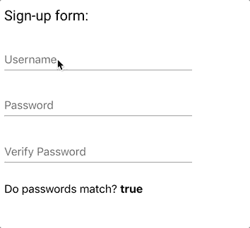
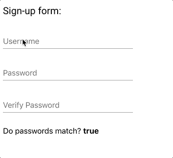
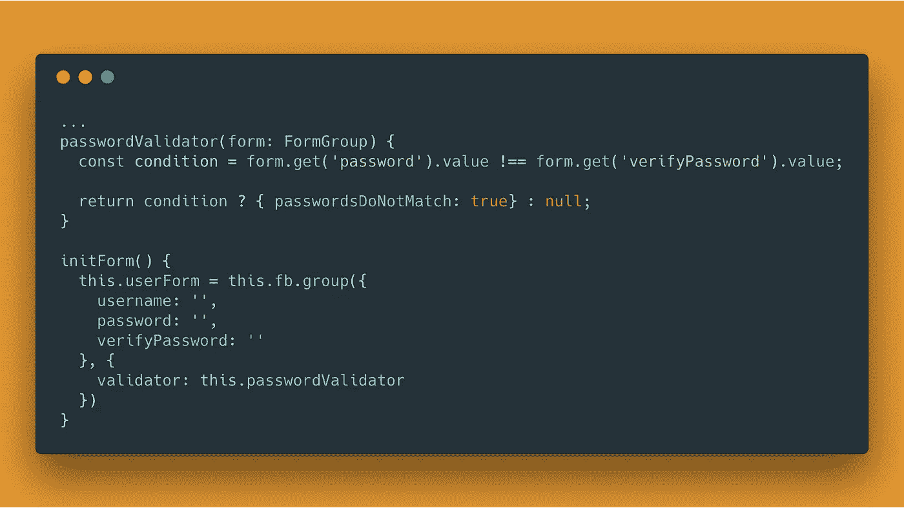
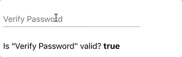
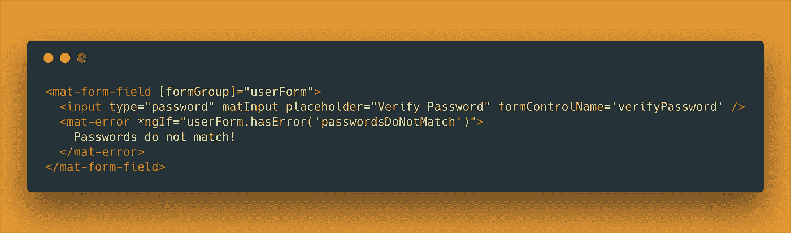
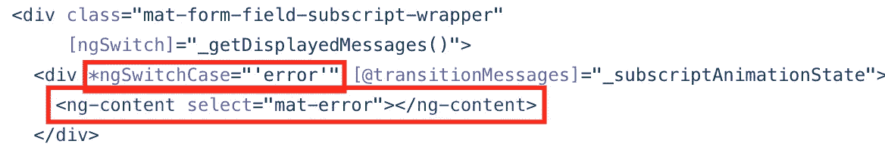
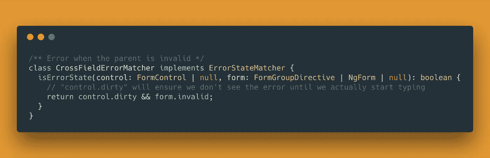
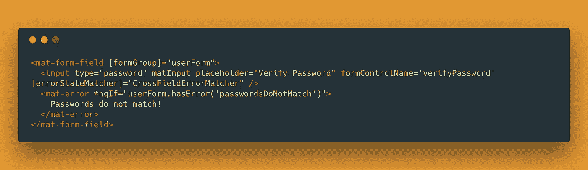

# 角度材料 7 中的 MatError 和交叉场验证器

> 原文：<https://itnext.io/materror-cross-field-validators-in-angular-material-7-97053b2ed0cf?source=collection_archive---------0----------------------->

***注*** *:内容与* ***角材 2+相关。*** *标题说的是* ***棱角分明的素材 7*** *，既然是最新版本出来的，也是为了吸引眼球(我们总想读到最新的信息)。*

能够通过表单中当前的数据来验证表单似乎是一种基本的需要。
举一个最基本、最常见的例子:注册表单中的*验证密码*字段。

假设你正在使用[有角的材料](https://material.angular.io/)来创建一个类似上面的形状，你可能会遇到以下情况:

为什么我看不到错误？！

你别担心，这不是 bug，这只是有角材料的工作方式。让我们了解一下，然后看看我们如何找到一个可行的解决方案。

注意:这篇文章假设你熟悉角度的一些概念。我不会在这里教你。不过，我会给你一个链接供你学习。

## 匹配密码验证器

我们首先要创建一个带有所谓的[“跨字段”验证](https://angular.io/guide/form-validation#cross-field-validation)的表单。
这意味着我们希望根据同一表单中的其他数据来验证表单中的数据。

为此，我将使用[反应式表单](https://angular.io/guide/reactive-forms)(是的，我喜欢它)，使用开箱即用的实用程序[表单生成器](https://angular.io/guide/reactive-forms#generating-form-controls-with-formbuilder)。然后我将创建密码验证器。

initForm()将从构造函数中调用

看最后一行。看到我们把验证器放在**表单层次**中，而不是**控件层次**中了吗？

这就是我们如何进行跨字段验证。它们适用于**表单**，而不适用于**控件**。

这意味着..

我们的控制总是有效的！

## mat-错误未显示

让我们来看看我们用于输入的 html

现在，我在想，一旦密码不匹配，我们**应该**会看到 mat-error。正确吗？
如果我们使用跨字段验证，那就不是这种状态——我们确实是这样做的。

为什么我看不到错误？！(重新运行)

**为什么会这样？**

让我们来看一段来自`mat-form-field.`的[官方代码](https://github.com/angular/material2/blob/master/src/lib/form-field/form-field.html#L75)的片段

我们从中可以了解到，只有当表单域(控件)说它有错误时，它才使用一个 [transclusion](https://scotch.io/tutorials/angular-2-transclusion-using-ng-content) 来显示`mat-error`。

因此，即使我们试图将`mat-error`无任何条件，它也不会显示，直到控件声明它有问题(有效性或精神上😅)

## ErrorStateMatcher 来救援了！

根据[官方文档](https://material.angular.io/components/input/overview#changing-when-error-messages-are-shown)并查看[源代码](https://github.com/angular/material2/blob/master/src/lib/core/error/error-options.ts#L24)确认，如果**控件**为**无效**且**触摸**或**表单提交**则显示控件错误。

为了实现这一点，如果表单本身无效，我们需要显示错误(因为我们讨论的是表单级别的验证)。

在这种情况下，我们需要为控件定义自己的`ErrorStateMatcher`。

一个`ErrorStateMatcher`是为表单域定义何时显示错误消息的类。

创建一个很简单。它将迫使我们创建一个`isErrorState`方法，该方法接收一个`FormControl`和`FormGroupDirective`(反应式)/ `NgForm`(模板驱动)参数。这些都是由表单域本身提供的，所以我们需要做的就是使用它们。

我们现在说——如果我们开始在输入中键入一些东西，而表单本身是无效的，则声明控件有错误。

让我们将这个`ErrorStateMatcher`添加到输入中:

现在，如果我们键入不匹配的密码，我们应该会立即看到错误！

最终结果(重新运行)

# 演示

这是这个的演示。

去玩吧。

我希望我教了你们一些新东西:)

Angular 是一个大框架，我认为你对它及其子框架的了解是没有止境的。

*如果你喜欢这个帖子，欢迎你在* [*中*](https://medium.com/@amir.tugi) *和* [*推特*](https://twitter.com/@amirtugi) 中关注我