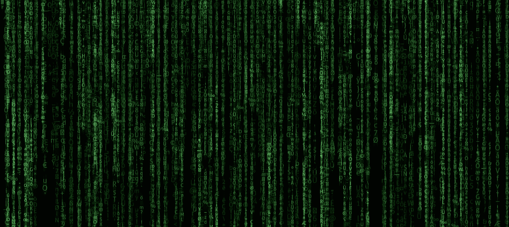

# React 中的矩阵代码动画

> 原文：<https://itnext.io/matrix-code-animation-in-react-96daeee65d3e?source=collection_archive---------2----------------------->

## 一个简单的基于 React 的动画《黑客帝国》三部曲中的代码雨



这是我的第一篇博文，我想让它与众不同，就像初吻通常不一样。

自从第一个绿色符号出现在老式屏幕上，我就一直是《黑客帝国》电影的粉丝。这也是我想测试 React 和 push 的渲染速度，看看极限在哪里的原因之一。此外，创建自己感兴趣的东西总是很有趣的。比如乐高房子，或者枕头城堡。

我用过的 React 版本是 16，因为我使用的是集合，所以当然是 Lodash (v4)

TL；博士->如果你像我一样懒，请看这里的完整代码:[github.com/jasofalcon/matrix](https://github.com/jasofalcon/matrix)

# 字体部分

首先，我们希望这看起来专业。此外，来自锡安的某个人可能正在阅读这篇文章。我开玩笑的，我知道锡安不是真的。总之，我用过 ***矩阵式字体 NFI*** ，看看这里— [matrix-font-nfi](https://www.dafont.com/matrix-code-nfi.font) 。在我看来很像母系。
我做的另一件事是定义应用程序将使用的一组字符，因为字体只为一些字母提供符号。像这样:

```
const chars = [
 'a',
 'b',
 'c',
 // ... many more symbols...
 '0',
 '~',
 '!',
 '#',
 '$'
];export default chars;
```

# 有趣的部分

好吧，安德森先生，让我们吃下红色药丸，潜入可怕的粘液深渊。
app 结构相当简单，只有 3 个组件。*符号*、*代码*、**、*矩阵*、**！
我想让它原子化，所以一个符号组件代表一个单独的字符和与之相连的所有表示逻辑。一个代码组件只不过是一个符号数组，基本上是一行代码。您可以很容易地假设矩阵组件只不过是一组代码组件，也就是符号列表。所以我们有一个符号列表，通过数学定义形成一个……..**矩阵**的符号。

# 标志

一个简单的角色。自然，它包含一个 char 作为它的状态。

```
constructor(props) {
    super(props);
    this.state = { char: this.getRandomChar() };
}
```

您注意到了一个 getRandomChar 方法。它只是从我们之前定义的符号列表中获取一个随机字符。

```
import chars from "../chars/chars";
// ...
getRandomChar() {
  return chars[Math.floor(Math.random() * chars.length)];
}
```

现在，你可能已经注意到在看电影的时候，一些符号在落在屏幕上的时候会发生变化。更具体地说，最后一个符号(让我们称之为前导符号，或主要符号)总是在变化，其他一些符号也随机变化。也就是说，让我们使主要符号可变，而只有“一些”其他的。

```
componentWillMount() {
  if (this.props.primary || Math.random() > 0.95) {
    this.makeSymbolDynamic();
  }
}makeSymbolDynamic() {
  setInterval(() => {
    this.setState({ char: this.getRandomChar() });
  }, 500);
}
```

这可能会导致一些性能问题，因为我们注册了一个每 500 毫秒触发一次的处理程序。这就是为什么我们只在符号是主要符号的情况下才这么做，其他符号只占 5%。Math.rand 返回值介于 0 和 1 之间。

我发现另一个重要的细节是不透明性。每条线到最后都会变淡，所以还有另外一个道具我要发给符号组件，那就是不透明度。这是我们如何渲染一个符号:

```
render() {
    const { primary, opacity } = this.props;
    return (
        <div className={"symbol " + (primary ? "primary" : "")}
          style={{ opacity }} >
            {this.state.char}
        </div>
    );
}
```

只是有一些小的 css 定义那个`primary`符号更闪亮一点，就是这样。

# 密码

这是我们举重的地方。如前所述，代码组件是符号的集合。我们有几条关于这条线符号的相关信息。它们是位置(x，y)、符号数、过渡(下降)速度和缩放比例(有些更近，有些更远)。

```
constructor(props, state) {
  super(props);this.state = {
    codeLength: 0,
    yPosition: 0,
    xPosition: 0,
    transition: "",
    transform: ""
  };
}
```

在组件安装之前，我们需要设置好一切。这可能看起来有点复杂，但是一旦你单独看每一行，它是非常简单的。顺便说一句，这些值大部分是根据经验计算的。

```
const SYMBOL_HEIGHT = 30; // Empirically :)
const SYMBOL_WIDTH = 18;componentWillMount() {
    // Some lines are zoomed-in, some zoomed-out
    const scaleRatio = _.random(0.8, 1.4); // Empirically chosen numbers//Min code height is height of screen. No good reason but - why not
    const minCodeHeight = _.round(window.innerHeight / SYMBOL_HEIGHT);
    //This should calculate how much pixels does line take
    const codeLength = _.random(minCodeHeight, minCodeHeight * 2);//Hacky solution to get the line above top=0 at start (hide it)
    const yPosition = (codeLength + 1) * SYMBOL_HEIGHT * scaleRatio;// we don't want to have partially overlaping lines - make columns
    // it basically mean line can only fall in descrete positions
    const stepCount = _.round((window.innerWidth - 20) / SYMBOL_WIDTH);
    const xPosition = _.random(0, stepCount) * SYMBOL_WIDTH;// we divide by scale ratio because if it is small it is probably far => thus slower :)
    const transition = ` top linear ${_.random(5, 10) / scaleRatio}s`; //different speed
    const transform = `scale(${scaleRatio})`;this.setState({ codeLength, yPosition, xPosition, transition, transform });
  }
```

接下来我们需要做的是组织秋天。我们不希望所有人都在同一时间倒下，所以对于一条线，我们将设置随机的开始时间。setTimeout 确保它将在某个伪随机时间启动

```
componentDidMount() {
  const startTime = _.random(300, 10000); // each starts in different timesetTimeout(() => {
    const newHeight = window.innerHeight + this.state.yPosition;
    this.setState({ yPosition: -newHeight }); //must be - b/c of start
  }, startTime);
}
```

现在我们需要做的就是渲染组件。有一个很好的技巧，我们如何为最后 5 个符号创建不同的不透明外观。

```
render() {
  const code = _.times(this.state.codeLength).map((x, i) => (
    // Set opacity to small for last 5
    // last one will have least opacity, 5th from last will have almost full
    <Symbol key={i} opacity={i <= 5 ? i / 5 : 1} />
  ));

  const { yPosition, xPosition, transition, transform } = this.state;
  const styles = {
    left: xPosition,
    top: -yPosition,
    transition,
    transform
  };// here we render list of symbols and one more - primary
  return (
    <div className="code" style={styles}>
    {code}
    <Symbol primary="true" />
    </div>
  );
}
```

# [数]矩阵

别担心，这是最容易的部分。假设我们希望总共有 100 行。

```
const CODE_LINES_COUNT = 100;render() {
    const codes = _.times(CODE_LINES_COUNT).map((x, i) => <Code key={i} />);
    return <div className="Matrix">{codes}</div>;
}
```

这就是你如何得到-> [演示](https://jasofalcon.github.io/matrix/)

# 有趣的事实

在测试渲染性能时，发现对于给定的行数(~100)，可能会有一些延迟。然而，我不得不承认，Chrome 是唯一一个能够没有任何明显滞后的浏览器。而 Safari、Edge 甚至新的超高速 Firefox 都在苦苦挣扎。因此，至少 Chrome 消耗的内存不是没有用的。

**感谢你的阅读，如果你喜欢，请分享一些掌声:**

对于任何类型的反馈，请随意写