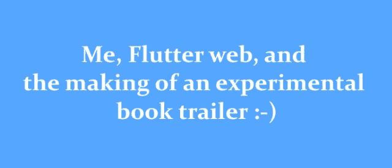

# 我，flutter web，和实验性图书预告片的制作:-)

> 原文：<https://itnext.io/me-flutter-web-and-the-making-of-an-experimental-book-trailer-8f1625173759?source=collection_archive---------5----------------------->



> **简介**

在这最后的日子里，我终于有时间和 Flutter web 在一起了，所以我不能错过测试它的能力的机会。我开始玩几个月前用 flutter 做的一些实验性动画，但我想做一些不同的东西。然后我有了一个想法，为我十月份出版的小说《最后的星期天》(意大利语为“L'ultima domenica”)制作一个书籍预告片。

我对结果很满意，即使，说实话，这没什么特别的，但我真的很喜欢建造它，所以我决定写一篇文章来分享这本书预告片的制作。这将是很长的时间，也许我可能错过了一些重要的点，所以如果有什么需要澄清的，或者如果你有任何建议，或者发现一些错误，请随时评论这篇文章(我肯定有！).

在这里可以看到现场:[https://frideosapps.github.io/booktrailer](https://frideosapps.github.io/booktrailer)

> **图片**

对于预告片，我用了十张图片。为了处理它们，我创建了`AssetsImages`枚举和映射`imagesFilenames,`,用于为 AssetsImage 的每个值分配一个文件路径。

```
enum **AssetsImages** {
  cover,
  black,
  rain,
  smoke,
  city,
  man,
  alone,
  tunnel,
  eyes,
  coverPhoto,
}final **imageFilenames** = {
  AssetsImages.cover: 'assets/images/cover.png',
  AssetsImages.black: 'assets/images/black.png',
  AssetsImages.rain: 'assets/images/rain.png',
  AssetsImages.smoke: 'assets/images/smoke.png',
  AssetsImages.alone: 'assets/images/alone.png',
  AssetsImages.city: 'assets/images/city.png',
  AssetsImages.eyes: 'assets/images/eyes.png',
  AssetsImages.man: 'assets/images/man.png',
  AssetsImages.tunnel: 'assets/images/tunnel.png',
  AssetsImages.coverPhoto: 'assets/images/cover_photo.png',
};
```

从现在开始，为了展示一幅图像，我们将这样使用`Image.assets`小部件:

```
// Show the image of the first scene
Image.asset(**imageFilenames[AssetsImages.city]**);
```

> **预缓存，加载 widget**

为了避免在图像加载之前开始播放场景(并错过一些帧)，我们将预先缓存在这个预告片中使用的图像，并使用 FutureBuilder 显示一个显示加载文本和进度条的小部件，或者显示播放预告片的小部件。

让我们来看看**setup assets**State 小部件的 State 类。我们可以看到三个属性:

```
final List<Image> images = [];
Future<bool> precache;
int loadingProgress = 0;
```

在 **initState** 方法中，通过迭代 AssetsImages 的值，将所有图像添加到图像列表中:

```
@override
void initState() {
  super.initState();for (var img in AssetsImages.values) {
    images.add(Image.asset(imageFilenames[img]));
  }
}
```

然后我创建了 **precachingImages** 异步方法来预缓存每个图像:

```
**Future<bool>** **precachingImages**(BuildContext context) async {
  for (var image in images) {
    await **precacheImage**(image.image, context);setState(() {
       **loadingProgress++**;
    });
  }return true;
}
```

在 for 循环的每一次迭代中， **loadingProgress** 增加 1，它将用于驱动 **LoadingWidget** 小部件中的加载栏。

在 **didChangeDependencies** 中，用 **precachingImages** 方法的结果初始化 **precache** future。

```
@override
void didChangeDependencies() {
  super.didChangeDependencies();
  **precache** = **precachingImages(context)**;
}
```

在**构建**方法中，这个 future 将与 FutureBuilder 一起使用，以显示未完成的 **LoadingWidget** 。未来一旦完成， **snapshot.hasData** 变为真，就会显示出**菜单/PlayScenes** 小部件。

```
@override
Widget build(BuildContext context) {
  return **FutureBuilder**<bool>(
    future: **precache**,
    builder: (context, snapshot) {
      if (!**snapshot.hasData**) {
        return **LoadingWidget**(
          progress: loadingProgress / (images.length - 1),
        );
    } else {
      return ValueBuilder<bool>(
        streamed: appState.isPlaying,
        builder: (context, snapshot) {
          if (snapshot.data) {
            return PlayScenes(
              key: Key(appState.playScenesKey),
              language: appState.lang,
            );
          } else {
            return Menu();
          }
         },
       );
      }
    },
  );
}
```

> **装上车**

加载小部件显示一个文本，指示拖车正在加载，并使用传递给其**进度**参数的参数来构建进度条。

为了给文本的不透明度设置动画，我们将使用我的 [frideos 包](https://pub.dev/packages/frideos)中的 **AnimationCreate** 小部件。想法是在循环模式下，将其不透明度从 0.1 更改为 1.0，然后返回 0.1。为此，只需将**真**传递给微件的参数**重复**和**反转**。**持续时间**参数告诉小部件该值从 0.1 到 1.0 需要多少毫秒(反向也是同样的时间)。

```
**AnimationCreate**<double>(
  **begin**: 0.1,
  **end**: 1.0,
  **curve**: Curves.easeIn,
  **duration**: 1000,
  **repeat**: true,
  **reverse**: true,
  **builder**: (context, anim) {
    return Column(
     mainAxisAlignment: MainAxisAlignment.center,
     children: [
       Opacity(
         opacity: **anim.value**,
         child: Text(
           'Loading...',
           style: TextStyle(
             color: Colors.white,
             fontSize: 26.0,
           ),
         ),
       ),
```

> **应用状态**

让我们来看看 **_SetupAssetsState** 类的构建方法的第二部分:

```
return **ValueBuilder**<bool>(
  streamed: **appState.isPlaying**,
  builder: (context, snapshot) {
    if (snapshot.data) {
      return **PlayScenes**(
        **key**: Key(**appState.playScenesKey**),
        **language**: **appState.lang**,
      );
    } else {
      return **Menu()**;
    }
  },
);
```

`ValueBuilder`是一个小部件，它以`StreamedValue`对象作为参数，并在每次有新事件发送到流中时重建其构建器。在这种情况下， **appState** (全局 singleton)是 **AppState** 类的一个实例，和 **isPlaying** 是在该类中声明的 **StreamedValue** 类型的 bool 。 **isPlaying** 对象将用于重建 ValueBuilder，根据发送到流中的值显示 **PlayScenes** 或 **Menu** 小部件。

让我们来看看 **AppState** 类:

```
class **AppState** extends **AppStateModel** {
  factory AppState() => _singletonAppState; AppState._internal();
  static final AppState _singletonAppState = AppState._internal(); // STREAM
  final **isPlaying** = **StreamedValue<bool>**(initialData: false); // PlayingScenes widget key
  **String playScenesKey** = DateTime.now().toString(); Language lang = Language.english; final particlesSystem = ParticlesSystem();
  bool isParticlesSystemInitialized = false; void **goToMenu()** {
    isPlaying.value = false;
  } void **play()** {
     playScenesKey = DateTime.now().toString(); 
     isPlaying.value = true;
  } @override
  void init() {} @override
  void dispose() {
    isPlaying.dispose();
  }
}**final appState** **=** **AppState()**;
```

*   **isPlaying** 以 **false** 作为 initialData 初始化，因此当应用程序启动时，它将显示**菜单**。
*   **playScenesKey** 是用作 **PlayScenes** 小部件的键的字符串。在 **play** 方法中，每次调用都会给它分配一个新的日期时间，以便更改小部件的键。当点击**重放**按钮时，这对于强制重建小部件是必要的，从而使场景从头开始再次播放。
*   **lang:** 用于存储用户选择的语言。
*   **goToMenu()** :一旦到达预告片的两端，用户可以选择返回菜单或再次播放预告片。通过点击菜单按钮，调用 **goToMenu** 方法，**正在显示** StreamedValue 被赋予 **false** 值，导致 **ValueBuilder** 的重新构建，由于 **snapshot.data** 为 false，将显示**菜单**小部件。
*   **Play()** :在这个方法中 **playSceneKey** 将被赋予一个新的值，与 goToMenu 方法类似，**正在播放**被赋予一个新的值， **true** 这次，重新启动预告片。
*   **particlesystem**和**isparticlesysteminitialized**:见下一段。

> **菜单**

这个小部件显示在**栈**小部件中，一个粒子系统在后台，一个**列**有我小说的封面，两个按钮选择预告片的语言，底部还有一段文字。

重点强调 **initState** 方法是很重要的:

```
@override
void initState() {
  super.initState(); WidgetsBinding.instance.**addPostFrameCallback**((_) { **appState.particlesSystem.init**(
      totalParticles: 150,
      width: context.size.width,
      height: context.size.height,
    ); setState(() {
      **appState.isParticlesSystemInitialized = true**;
    });
  });
}
```

为了初始化粒子系统，使用了 **addPostFrameCallback** 方法的回调，这里上下文已经准备好用于获取**粒子系统**类的 **init** 方法所需的小部件的大小。然后**isparticlesysteminitialized**标志被设置为 true，这样小部件就可以在 build 方法中显示。

```
GestureDetector(
  onTap: () {
    **appState.lang** = **Language.english**;
    **appState.play();**
  },
  child: LanguageWidget(
    text: 'English',
  ),
),
```

当用户点击 **LanguageWidget** (一个显示语言的简单框)时，属性 **lang** 的值被赋予所选择的语言，并调用方法 **play** 开始播放预告片。

> **粒子系统**

为了展示一种雪的效果，我创建了一个非常简单的粒子系统。粒子类处理单个粒子的信息。

使用 **ParticlesSystem** 类，我们可以定义一个粒子系统，其中包含数量可变的项目，具有随机的初始位置和特征( **init** 方法)，并在每个新帧上移动它们( **update** 方法)。

ParticlesSystemPlayer 小部件只是将 ParticlesSystem 类的一个实例作为参数，然后在每次重建时更新粒子的位置，并在堆栈小部件中显示它们。

> **PlayScenes 页面:FadeInWidget，ScenesWidget，场景**

一旦菜单出现，用户点击语言框，预告片就开始了。在 **PlayScenes** 小部件中有一个持续时间为 2500ms 的 **FadeInWidget** 和一个作为孩子的**scene create**。这个小部件来自我的包，只播放传递给它的**场景**参数的场景。

每个场景都是**场景**类的一个实例。

```
class **Scene** {
  Scene({this.widget, this.time, this.onShow});Widget **widget**;
  int **time**; // milliseconds
  Function **onShow**;
}
```

它基本上处理关于每个场景的信息，要显示的小部件，以毫秒为单位的持续时间，以及当场景显示时将被调用的回调。

正如我们在要点中看到的，向**scene create**传递了一个场景列表，在它们的小部件参数中传递了一个 **BuildScene** 小部件，每个场景都有不同的设置。省略 **onShow** 参数，因为在这种情况下不需要。

```
**ScenesCreate**(
  **scenes**: [
    **Scene**(
      widget: **BuildScene**(
        **key**: Key('1'),
        texts: textsScenes[TrailerScene.first][language],
        image: imageFilenames[AssetsImages.city],
        transitionType: TransitionType.circular,
        textAnimationType: TextAnimationType.scale,
        duration: 11500,
      ),
      time: 11500,
    ),
    Scene(
      widget: BuildScene(
        key: Key('2'),
        texts: textsScenes[TrailerScene.second][language],
        image: imageFilenames[AssetsImages.man],
        transitionType: TransitionType.vertical,
        textAnimationType: TextAnimationType.split,
        duration: 11500,
        blur: true,
        blink: true,
      ),
      time: 11500,
     ),
```

给 **BuildScene** 小部件的**键**参数一个不同的键，告诉 Flutter 它们不是同一个小部件，强制重新构建小部件。

> **BuildScene widget**

为了避免为每个场景创建不同的小部件，我创建了 BuildScene 小部件，它将一些标志作为参数来改变其行为。这样，用一个小部件我们就可以处理不同的场景，而不需要一遍又一遍地写同样的代码。

基本上，这些场景都有一个共同的背景(有或没有模糊效果)，一个粒子系统，一个动画文本(有两种类型的动画)，以及一个场景结尾的过渡效果。

让我们检查一下 **BuildScene** 小部件的签名:

```
class BuildScene extends StatefulWidget {
  const BuildScene({
    Key key,
    @required this.**texts**,
    @required this.**image**,
    this.**boxFit** = BoxFit.cover,
    this.**blink** = false,
    this.**textAnimationReverse** = false,
    this.**textAnimationType** = TextAnimationType.split,
    this.**transitionType** = TransitionType.circular,
    this.**duration** = 10000,
    this.**blur** = false,
}) : super(key: key);
```

*   **文本**:该参数告诉小工具要显示的文本。这是一个字符串列表，其中每个字符串都是一个列小部件的子部件。
*   **图像**:显示为背景的图像。
*   **boxFit**
*   **闪烁**:在文字动画过程中，使图像闪烁
*   **textAnimationReverse:** 如果为真，文本动画将反向播放。
*   **textAnimationType** :文本动画的类型。
*   **持续时间**:场景持续时间，将设置为等于场景持续时间。
*   **模糊**:如果为真，背景将被动画化和模糊化。

让我们来看看 **initState** 方法:

```
@override
void initState() {
  super.initState();**particlesAnim** = **AnimationCurved**<double>(
    duration: Duration(milliseconds: 3500),
    setState: setState,
    tickerProvider: this,
    begin: -1.0,
    end: 1.0,
    onAnimating: _onAnimating,
    curve: Curves.easeIn,
  );
}
```

一个**动画曲线**类的实例被初始化。AnimationCurved 是我为我的 frideos 软件包制作的一个助手，可以更容易地处理动画。这个动画将驱动粒子系统。

> **复合创建，复合项目，动画类型**

**composite create**widget**是我的 frideos 包的另一个助手，用来处理复杂的动画。**

```
class **CompositeCreate** extends StatefulWidget {
  const CompositeCreate({
    Key key,
    this.**duration** = 1000,
    this.**compositeMap**,
    this.**repeat** = false,
    this.**onAnimating**,
    this.**onStart**,
    this.**onCompleted**,
    this.**builder**,
}) : super(key: key);
```

**参数的含义很简单，值得花些时间来解释一下 **compositeMap** 参数:传递一个值是 **CompositeItem** 的实例的 Map，然后就可以通过使用它的键来获得动画的值。这样，就有可能以一种非常简单的方式制作交错/复合动画。**

**让我们检查一下**_ buildscestate**小部件的构建方法:**

```
@override
Widget **build**(BuildContext context) {
  return **CompositeCreate**(
    duration: widget.duration,
    **compositeMap**: {
      **AnimationType.fadeIn**: **CompositeItem<double>**(
        begin: 0.2,
        end: 1.0,
        curve: const Interval(
          0.6,
          0.8,
          curve: Curves.easeIn,
        ),
      ),
      AnimationType.transition: CompositeItem<double>(
        begin: 0.0,
        end: 100.0,
        curve: const Interval(
          0.75,
          1.0,
          curve: Curves.easeIn,
        ),
      ),
     },
     repeat: false,
     builder: (context, **comp**) {
```

**在这种情况下，向 duration 参数传递了 **BuildScene** 小部件的 **duration** 属性(该值为 11500 ms，您可以在 **PlayScenes** 小部件中看到)。这意味着合成动画将持续 11.5 秒。记住这个值，我们可以组成一个动画地图，给每个动画一个持续时间间隔。**

**向 **compositeMap** 参数传递类型为`Map<AnimationType, CompositeItem>`的映射。**

```
enum AnimationType {
  fadeOut,
  fadeIn,
  mov,
  scale,
  grow,
  color,
  transition,
}
```

**获取单个动画的值真的很简单，只需要使用动画的键(例如。 **AnimationType.fadeIn** 为第一个)，带有 **CompositeAnimation** 类的 getter **值**，在 **CompositeCreate 小工具的构建器中传递一个实例。****

```
**comp.value(AnimationType.fadeIn)**
```

**第一个动画以动画的 0.6–0.8 的间隔播放，而第二个动画以 0.75 到 1.0 的间隔播放。这两个动画在 0.75–0.8 的区间内重叠。**

```
**Opacity**(
  opacity: _calcOpacity(
    isOverlay,
    **comp.value(AnimationType.fadeIn)**,
  ),
  child: **ParticlesSystemPlayer**(    
    particlesSystem: particlesSystem,
  ),
),
```

**这里我们将动画中**淡入的值传递给 **_calcOpacity** 方法，以便计算给予 **ParticleSystemPlayer** 小部件的不透明度。****

> ****动画文本****

**这个小部件以两种形式显示预告片的动画文本:一种简单的缩放动画，一种更复杂的动画，其中文本被分解成单词，每个单词都单独制作动画。**

```
**AnimatedText**(
  **textAnimationType**: widget.textAnimationType,
  width: width,
  texts: !isOverlay ? widget.texts : [''],
  reverse: widget.textAnimationReverse,
  onAnimating: (progress) {
    if (widget.blink) {
      if (progress >= 30 && progress <= 34 ||
          progress >= 46 && progress <= 50) {
        isOverlay = true;
      } else {
        isOverlay = false;
      }
    }
  },
),
```

**使用参数 **textAnimationType** 改变动画的类型:缩放或分割。**

```
enum **TextAnimationType** { scale, split }
```

**texts 参数接受一系列字符串。 **isOverlay** 标志用于在显示叠加图像时隐藏文本。**反转**改变动画的行为，如果反转为真，文本的大小从最小值开始并随时间增加。**

****动画文本尺度****

**查看**合成图**我们可以看到，该动画由三个子动画组成。**

```
CompositeCreate(
  duration: duration,
  repeat: false,
  **compositeMap**: {
    **AnimationType.fadeIn**: CompositeItem<double>(
      begin: 0.2,
      end: 1.0,
      curve: const Interval(
        0.0,
        0.2,
        curve: Curves.linear,
      ),
     ),
     **AnimationType.scale**: CompositeItem<double>(
       begin: **reverse** ? 0.8 : 1.0,
       end: **reverse** ? 1.0 : 0.8,
       curve: const Interval(
         0.2,
         0.6,
        curve: Curves.linear,
       ),
     ),
     **AnimationType.fadeOut**: CompositeItem<double>(
       begin: 1.0,
       end: 0.0,
       curve: Interval(
         **isLastScene** ? 0.8 : 0.7,
         **isLastScene** ? 1.0 : 0.8,
         curve: Curves.linear,
       ),
     ),
   },
   onCompleted: onCompleted,
   builder: (context, **comp**) {
```

*   **一开始，从 0.0-0.2 文本淡入**
*   **从 0.2 到 0.6，文本变大或变小(取决于**反转**参数)**
*   **然后淡出。如果场景是最后一个，此处的间隔会有所不同，为 0.8–1.0，而在其他场景中，文本会从 0.7–0.8 淡出，因为从 0.8 开始过渡动画。**

```
return **Transform.scale**(
  scale: **comp.value(AnimationType.scale)** * _scale(width),
  child: Column(
    mainAxisAlignment: MainAxisAlignment.center,
    children: [
      for (var i = 0; i <= texts.length - 1; i++)
      **Opacity**(
        opacity: opacity: comp.progress <= 0.2
            ? comp.value(AnimationType.fadeIn)
            : comp.value(AnimationType.fadeOut),
        child: Text(
          **texts[i]**,            
        ),
      ),       
    ],
  ),
);
```

**在不透明度小部件的不透明度参数中，您可以看到如何使用 CompositeCreate 小部件的生成器中传递的动画的**进度**属性，来选择分配值给**淡入**(从 0.0 到 0.2)或**淡出**动画(取决于 **isLastScene** 标志，其间隔为 0.8–1.0 或 0.7–0.8)。这样，当 **comp.progress** 小于 0.2 时，我们处于动画淡入的区间，否则处于淡出。**

****动画文本分割**:**

**这里的动画有点复杂:**

```
return **CompositeAnimationWidget**(
  duration: widget.duration,
  repeat: false,
  **compositeMap**: {
    **AnimationType.fadeIn**: CompositeItem<double>(
      begin: 0.0,
      end: 1.0,
      curve: const Interval(
        0.0,
        0.4,
        curve: Curves.linear,
      ),
     ),
     **AnimationType.mov**: CompositeItem<double>(
       begin: 0.5,
       end: 0.0,
       curve: const Interval(
         0.0,
         0.5,
         curve: Curves.linearToEaseOut,
       ),
     ),
     **AnimationType.grow**: CompositeItem<double>(
       begin: 1.5,
       end: 1.0,
       curve: const Interval(
         0.2,
         0.6,
         curve: Curves.linearToEaseOut,
       ),
     ),
     **AnimationType.color**: CompositeItem<int>(
       begin: 255,
       end: 170,
       curve: const Interval(
         0.3,
         0.6,
         curve: Curves.linear,
       ),
      ),
      **AnimationType.fadeOut**: CompositeItem<double>(
        begin: 1.0,
        end: 0.0,
        curve: Interval(
          0.6,
          0.8,
          curve: Curves.linear,
        ),
      ),
   },
   onCompleted: widget.onCompleted,
   builder: (context, comp) {
```

*   **从 0.0 到 0.4，单词淡入**
*   **0.0–0.5:分解的单词移动**
*   **0.2–0.6:文字缩小尺寸**
*   **0.3–0.6:一些单词的颜色逐渐由黄色变为白色**
*   **0.6–0.8:单词淡出**

> ****过渡小工具****

**在场景(或动画，它们具有相同的持续时间)的 0.75 到 1.0 的间隔中，**过渡**小部件显示一种过渡效果，以跳转到另一个场景。**

**这里最重要的参数是 **transitionType** ，用于改变要使用的过渡类型。它将一个**转换类型**作为输入:**

```
enum TransitionType { horizontal, vertical, circular }
```

**它的值将在构建方法中使用，以在运行时选择使用哪种过渡小部件。**

```
@override
Widget build(BuildContext context) {
  Widget **child**;

  switch (transitionType) {
    case **TransitionType.vertical**:
      **child = TransitionVertical**(
        height: height,
        width: width,
        transition: transition,
        image: image,
        fit: fit,
      );
      break;
    case **TransitionType.circular**:
       **child** = **TransitionCircular**(
         height: height,
         width: width,
         transition: transition,
         image: image,
         fit: fit,
       );
       break;
    **default**:
       child = **TransitionHorizontal**(
         height: height,
         width: width,
         transition: transition,
         image: image,
         fit: fit,
       );
  }if (!**blur**) return **child**;return **AnimatedBlurWeb**(
    strength: 12.0,
    duration: 4000,
    child: child,
  );
}
```

****过渡垂直**:**

****过渡水平**:**

****过渡通告**:**

> ****最后一幕****

**最后一个场景与菜单非常相似。它显示了这本书的图片和两个按钮:第一个是去菜单，另一个是重播预告片。**

**点击菜单按钮将触发 **appState** 对象的 **goToMenu** 方法的调用，向**isplay**streamed value 对象的流发送“false”事件，并且**_ setupassetstate**的 build 方法的 **ValueBuilder** 将重新构建，显示菜单:**

```
GestureDetector(
  onTap: **appState.goToMenu**,
  child: Container(
  padding: EdgeInsets.all(10.0),
  child: Text('Menu',
```

**相反，重放按钮，像菜单上的播放按钮，将调用**播放**方法:**

```
GestureDetector(
  onTap: **appState.play**,
  child: Container(
    padding: EdgeInsets.all(10.0),
    child: Text('Replay',
```

> ****结论****

**正如我在介绍中所说，我真的很喜欢制作这个实验性的图书预告片。但是，我也发现了一些问题。例如，但我不确定这是不是 flutter web 的问题，或者是我做错了什么，有时图像的堆栈小部件会有奇怪的行为，就像图像并不总是遵守堆栈顺序。另一件事，我找不到用 ImageFilter 类制作一个真正的模糊效果的方法，所以我最终制作了一个“假”模糊，用一堆不同偏移量和不透明度的三张图像。此外，我想添加一些音乐和音效，但我仍然没有找到一个简单的方法来做到这一点。**

**我用我为制作这个预告片而创建的一些助手更新了我的[frid IOs 包](https://pub.dev/packages/frideos)。现在它是 0.10.0 版本，但是我想我会在接下来的几周/几个月增加一些 fx 的东西。**

**你可以在 GitHub 上我的[资源库中找到预告片的源代码。](https://github.com/frideosapps/booktrailer)**