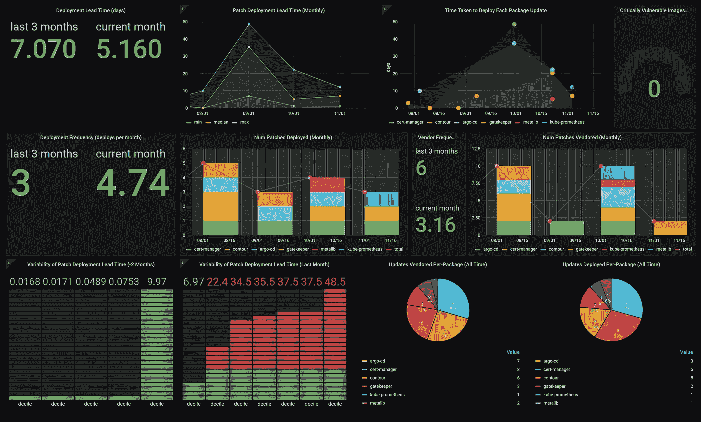
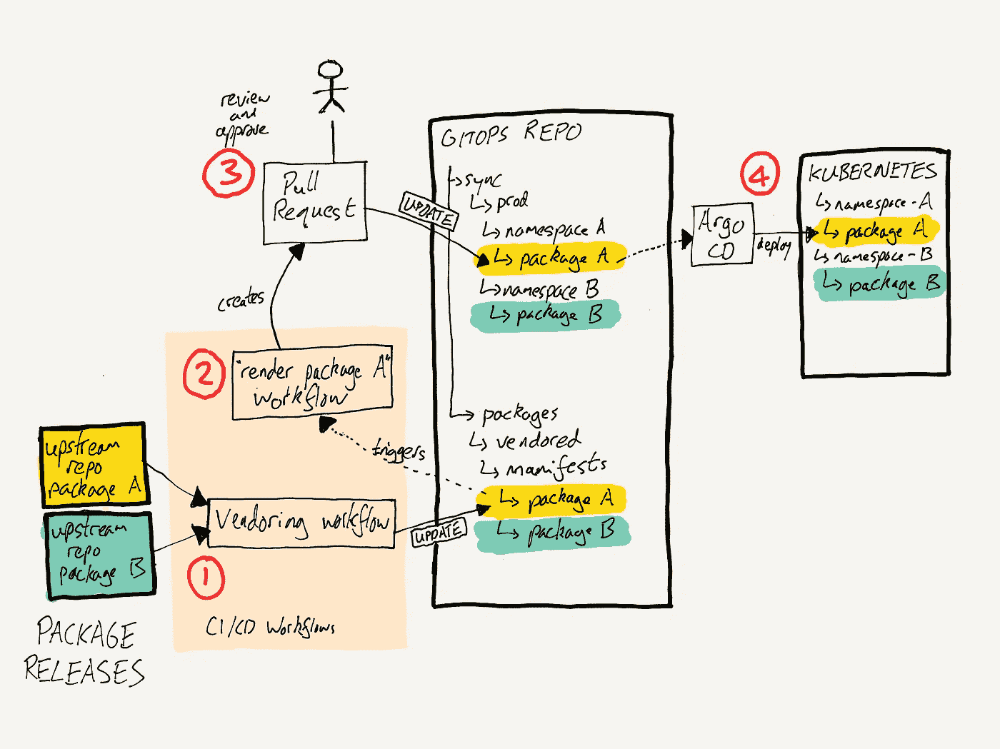
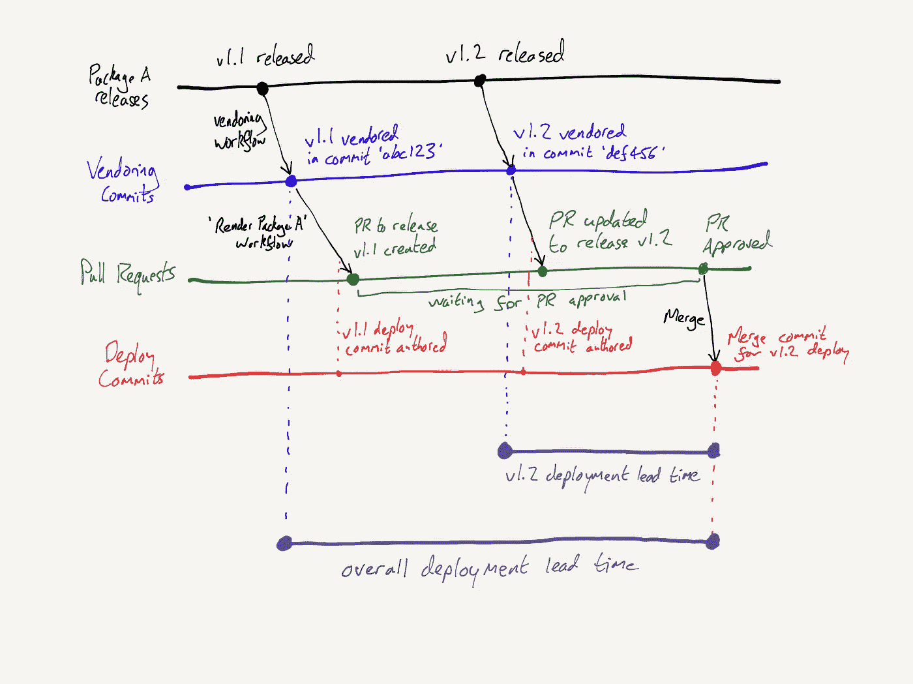
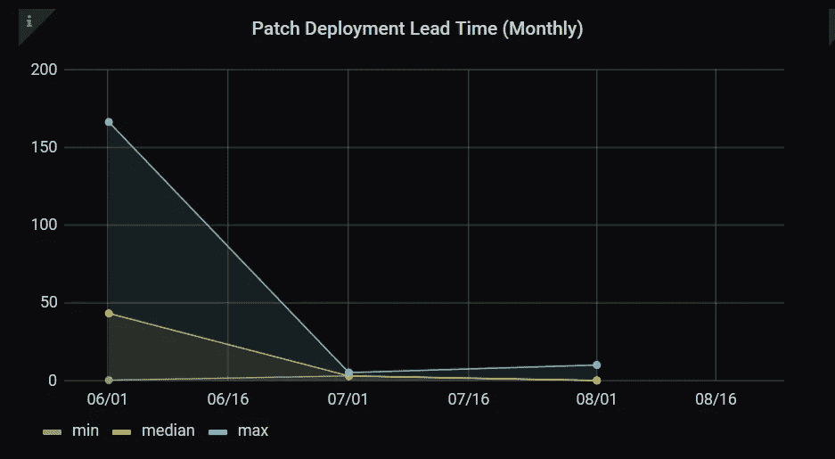
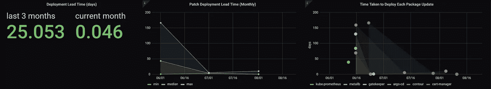
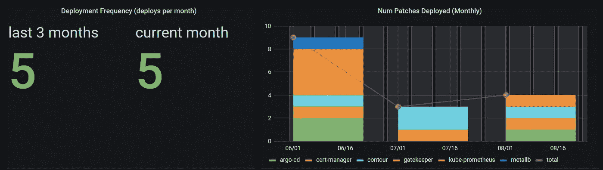
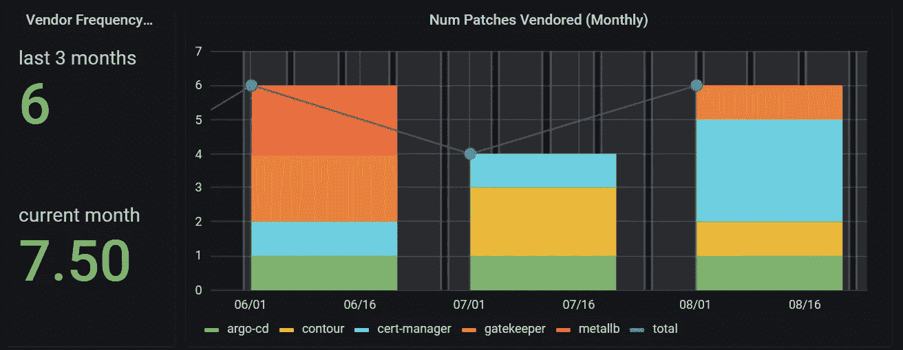
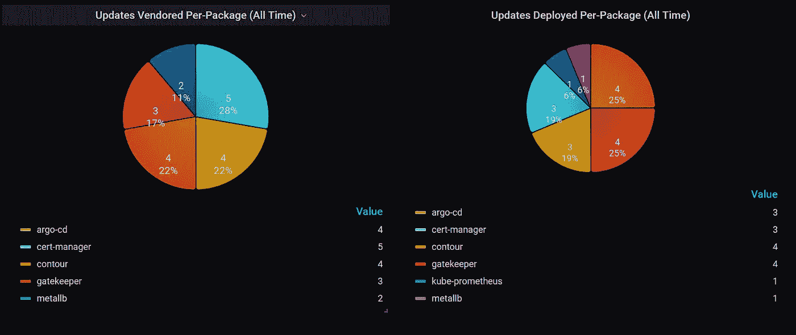

# 使用 GitOps 测量 Kubernetes 上的修补节奏

> 原文：<https://itnext.io/measuring-patching-cadence-on-kubernetes-with-gitops-353bc4a1d25?source=collection_archive---------3----------------------->



关于 GitOps 和类似流程如何产生更易观察的部署管道，已经说了很多，但同样重要的是如何从已经观察到的数据中获得洞察力。在这篇文章中，我将分享在管理安装在 Kubernetes 上的第三方软件的背景下，如何使用这些数据来保持修补过程的正常进行。

# 平台“包”

运营 Kubernetes 不仅仅是关于 etcd、API 服务器和 Kubelets。它也是关于在那之上运行的东西。我在家里操作一个 Kubernetes 集群，运行在 Raspberry Pi 上，其中托管了各种应用程序。为了增强平台的功能，许多支持性的第三方扩展服务也在其上运行，例如:

*   编织网络插件
*   金属 LB
*   证书管理器
*   普罗米修斯-格拉法纳公司
*   看门人

尽管从某种意义上来说，它们是平台的一部分，但它们也是安装在基础平台之上的独立组件。将每个组件视为 YAML 清单的一个单独的“包”会很有帮助，它可以独立地更新或重新配置。

# 更新的需要

当您运行软件包时，与所有软件一样，您还必须担心保持最新，原因如下:

*   久而久之，越来越多的旧软件 CVE 被发现，增加了被黑客攻击的风险。对于可从公共互联网访问的系统来说，这尤其危险，我运行的一些服务就是如此。
*   即使是不容易受到攻击的软件也可能会出现问题。如果围绕未更改的软件升级其他(易受攻击的)组件，新版本可能与旧 API 不兼容，集成可能会中断。
*   大多数软件在某种程度上都有问题。您经常会遇到 bug 和特性缺口——您的用例与作者预期的不同。软件更新中修复了许多此类问题。

由于这些原因，不仅安装软件很重要，保持软件更新也很重要。

# 更新设计

不幸的是，将您的系统设计成可更新的需要更多的关注，而不仅仅是安装一个软件包。您应该:

*   使用基础设施作为代码，也就是签入 git 的包清单 YAML 文件，跟踪基础设施的当前状态
*   跟踪从哪里提取包，也可以定义一个升级过程。像 [Vendir](https://carvel.dev/vendir/docs/latest/) 这样的工具可以用于此。
*   跟踪您对包所做的任何定制，并为应用它们定义一个可重复的过程
*   定义一些过程来保持机密与已部署的包同步
*   如果您有多个环境，请定义一个过程，将更新按顺序部署到这些环境中，并给出适当的特定于环境的参数

所有这些都不是免费的——每个方面都需要一些工程上的努力。当事情变得更加复杂时，很容易忽略大局。重要的是要确保我们不仅仅是货物养殖实践。我们不想为了自动化而自动化——我们想用它们来实现某些目标。也就是说，当升级可用时，可以更快地应用升级。因此，我们应该*确定我们想要改进的指标*，并且*测量它们的趋势*。

# 衡量绩效

为了选择合适的度量标准，我们可以参考连续交付的概念。对于开发和部署软件的团队来说，在这个领域已经做了很多关于良好实践的研究。即使我们不是自己开发这个软件，我们也可以借鉴相同的想法。

特别是，所谓的 [DORA (DevOps 研究和评估)度量](https://www.blueoptima.com/blog/how-to-measure-devops-success-why-dora-metrics-are-important)是团队寻求提高软件开发性能的顶级度量。在我们寻求改进修补的过程中，跟踪这些指标也很重要:

*   (增加)部署频率
*   交货提前期(减少)
*   (递减)平均恢复时间(MTTR)
*   (增加)成功发布的比例

重要的是，这些是我们可以定量测量的精确的东西。在高层次上，您会这样计算它们:

*   *频率* = `(number of deployments) / (time period)`
*   *提前期* = `(time of production deployment) - (time of associated code commit)`
*   *MTTR* = `(time an incident began) - (time an incident ended)`
*   *更改故障率* = `(number of releases triggering incidents) / (number of releases) = 1 - proportion of successful releases`

从广义上讲，这四个指标与(1)部署事件的计数和收集时间(部署频率和交付时间)以及(2)将这些部署事件与服务事件的计数和时间(MTTR 和变更失败率)相关联。

使用 GitOps repo，您可以完全基于 Git 历史来测量*部署频率*和*交付周期*。这是我们将在这篇文章的后续部分深入探讨的内容。

在此之前，先给你提个醒。在连续交付模型中，我们希望自动化交付不仅要快速，而且要消除错误。试图优化这些指标以提高速度，而不关注更安全的发布，可能会导致*更差的*可靠性。因此，为了对您的交付绩效有一个*完整的*了解，我们始终建议*同时*通过 MTTR 和变更失败率指标来跟踪部署风险的度量。这些将使用来自您的事故管理系统的数据进行测量。

也就是说，让我们深入了解 git 能够告诉我们的部署性能。为了帮助我们，我们将使用`mergestat`。

# 介绍`[mergestat](https://github.com/askgitdev/askgit)`

`mergestat`是一个通过 SQL 查询 git 回购历史的 CLI 工具。这将为我们提供一种方法来访问 GitOps repo 编码的关于部署历史的信息。

您可以根据[安装文件](https://docs.mergestat.com/getting-started-cli/installation)进行安装。我确实遇到了一些基于包的安装的小问题——安装预构建的二进制文件似乎是最简单的方法。

在 git 历史中公开数据意味着您可以提出各种不同的问题。有一个`commits`表，所以我们可以请求一个所有提交的列表，类似于用`git log`得到的列表:

```
mergestat 'select * from commits'
```

为了添加每次提交中更改的文件的详细信息，我们将交叉引用`stats`表。这将允许我们识别发现和获取新包的提交(即“vendored”)。获取新包的工作流将创建一个包含更改的提交，将包签入到`packages/vendored`目录。这使我们能够识别供应商提供的包的更新:

```
mergestat "select * from commits, stats('', commits.hash) where file_path like 'packages/vendored/%'"
```

类似地，当提交包括代表生产的期望状态的变更文件时，我们将获得生产部署事件——这些文件在`sync/prod`下:

```
mergestat "select * from commits, stats('', commits.hash) where file_path like 'sync/prod/%'"
```

像 ArgoCD 这样的 GitOps 工具的出现确保了对 Git repo 的这些更新产生实际的部署事件。

`mergestat`的另一个便利特性是能够将数据导出到 SQLite 数据库，命令如下:

```
mergestat export askgit-commits-stats-db.sqlite3 -e commits -e "select * from commits" -e stats -e "select * from commits,stats('', commits.hash)"
```

由于 mergestat 中随着时间的推移发生了一些模式更改，我们需要添加一些列重新映射，以便仪表板查询稍后能够正常工作:

```
mergestat export askgit-commits-stats-db.sqlite3 -e commits -e "select hash as id,* from commits;" -e stats -e "SELECT commits.hash as "commit_id", stats.file_path as "file", stats.additions, stats.deletions FROM commits, stats('', commits.hash)"
```

许多工具都很好地支持 SQLite，所以一旦有了 SQLite 数据库，就有许多工具可以进一步处理数据。我使用`pgloader`将数据加载到 Postgres 中，以便我们能够从 Grafana 查询它。您可以按照这些说明进行安装。

将[数据加载配置](https://github.com/benjvi/measuring-patching-cadence/blob/main/askgit-sqlite-to-postgres.txt)下载到文件`askgit-sqlite-to-postgres.txt`中。这指定了如何将数据加载到 Postgres 中，以便我们能够从 Grafana 查询它。

您需要一个已经设置好的 Postgres 服务器来连接。使用服务器的连接详细信息自定义此配置文件。这不包含凭据。相反，导出`PGUSER`和`PGPASSWORD`环境变量供`pgloader`读取。

设置完成后，要加载数据，您将运行:

```
pgloader askgit-sqlite-to-postgres.txt
```

我还创建了一个 KubernetesT5 】,您可以运行它来不断地从您的 repo 加载最新的数据(确保您更新它以指向您的 repo！).

# 包更新流程

我的包的端到端更新过程如下所示:



1.  有一个每天安排的售货工作流程，它运行`vendir sync`并检查结果。这将根据`vendir.yml`中的包规范将任何新的包版本添加到`packages/vendored/`文件夹中
2.  在这之后，会触发额外的工作流，将清单签入到`sync/prod`文件夹，然后将更改推送到一个分支，最后提交一个 PR
3.  我手动审核 PR 并批准，合并到主分支。这将触发变更的自动部署
4.  ArgoCD 在`sync/prod`文件夹中部署更新的包(通过它的连续协调循环)

考虑到这一点，我们可以继续根据*提前期*和*频率*来衡量该流程的节奏。

# 测量提前期

交付周期是衡量这一更新过程需要多长时间的指标。这是补丁优化中最重要的指标，因为它将告诉我们我们部署的版本落后于我们想要的版本多长时间。如果我们的交付时间超过几天，我们可能会开始承担运行过时软件的风险。总交付周期是从第一次发现一个更新包到它被部署到产品中的时间间隔。

让我们将它应用到上一节描述的实际部署工作流中。我们将假设 ArgoCD 工作得相当快，所以它在部署上的滞后可以忽略不计。因此，查询变成了:“从`packages/vendored`到`sync/prod`的变化需要多长时间？为了找到答案，我们应该查看每一对提交。我们首先考虑每个包的销售承诺。对于每个提交，我们可以搜索下一个相关的部署提交。



实际上，这在 Postgres 中变成了两个物化视图:

*   `[package_folder_commits](https://github.com/benjvi/measuring-patching-cadence/blob/d569177967bf4f583a44e9f66eee709f4c603981/create-package-deploy-view.sql#L4)`按包和目的(销售、部署等)对提交的文件更改进行分类
*   `[package_commit_pair_cause_to_deploy](https://github.com/benjvi/measuring-patching-cadence/blob/d569177967bf4f583a44e9f66eee709f4c603981/create-package-deploy-view.sql#L46)`将销售包更改与后续的包部署配对，并计算两次提交之间的时间差作为`days_between_vendor_and_deploy`列

通过下载这个 SQL 文件创建视图，为 Postgres 设置环境变量，并运行:

```
psql -f "create-package-deploy-view.sql"
```

基于此，我们可以通过查询视图获得每个包更新的部署延迟:

```
select deploy_commit_package, cause_commit_id, deploy_commit_id, days_between_vendor_and_deploy from package_commit_pair_cause_to_deploy;
```

定义这些视图确实有一些棘手的部分，并且有可能在数据中发现异常:

*   在我的工作流中，作为触发的工作流的一部分，在所提供的更改之后，立即对部署文件夹进行提交(在分支上)。视图必须排除这个提交，而是只查看部署 PR 的时间戳。为此，我们需要*强制合并提交*，并且只使用那些提交来标识部署时间
*   当部署过程发生变化时，很难始终如一地比较结果。我通过在几个月的查询中保留旧的和新的名字，设法解决了一些文件夹重组的问题。然而，一般来说，包含重构变更的提交很难处理。我发现的唯一真正的答案是单独分析任何异常提交。

我们需要做的最后一件事是创建这些数据的聚合，以便我们可以跟踪一段时间内的趋势，但首先，让我们看看如何从这些视图中获得部署数量。

# 测量部署频率

部署频率有助于我们了解正在进行的部署工作量，也就是说，部署更新包的次数。在打补丁的情况下，部署越多不一定越好，因为如果软件不需要打补丁也不是坏事。也就是说，我工作过的大多数团队总是在修补上落后，至少，这个指标应该显示至少*一些*修补正在进行。

具体来说，这里我们只想测量那些与包更新相关的部署。可能存在与其他事件(如配置更改)相关联的部署。因为我们已经必须将部署提交与供应商提交进行匹配以找到交付周期，所以我们将只考虑与供应商提交相匹配的部署提交。这可确保只计算与软件包更新相关的部署。

过滤数据后，计算唯一部署提交的数量。我们可以基于上一节中定义的视图，使用以下查询来完成此操作:

```
select count(*) from package_commit_pair_cause_to_deploy;
```

为了获得部署频率，我们需要选择一个时间段来测量这个计数。我们将在下一部分构建仪表板时完成这项工作。

我们现在已经有了所有需要的原始数据，所以我们可以开始构建一个 Grafana 仪表板，以便于跟踪趋势。作为 dashboard 安装的先决条件，您需要设置 Postgres 数据源，以便 dashboard 可以查询数据。

# 包装交付时间

为了得到总的交付时间，我们将计算所有已部署包的平均延迟时间。我们将每月计算一次。这将提供足够的数据来聚合，同时足够短以捕捉性能的变化。与 SLO 一样，通常在 28 天的时间窗口内汇总指标，这样做的目的是从高层次了解流程的运行情况，以及是否需要额外的努力来改进它。使用这些类型的指标，我们感兴趣的是跟踪几周和几个月的性能，而不是几小时和几天。

获取每月提前期趋势的查询将是:

```
select
  date_trunc('month',deploy_commit_author_when) as "time",
  max(days_between_vendor_and_deploy),
  percentile_cont(0.5) WITHIN GROUP (ORDER BY 
      days_between_vendor_and_deploy) as "median",
  max(days_between_vendor_and_deploy) 
from package_commit_pair_cause_to_deploy
WHERE $__timeFilter(deploy_commit_author_when)
group by 1
```

这给了我们每个月的最大、最小和中间交货时间。请注意，这是计算每个日历月的值，而不是窗口期的值。如果不依赖于[的 timescaledb 扩展](https://docs.timescale.com/api/latest/hyperfunctions/time_bucket/)，在普通 Postgres 中不可能实现后者。但这种更简单的方式无论如何都符合我们的需求。有时候简单是一种美德——日历月份很容易理解。因此，相应的 Grafana 面板将如下所示:



还有一个单独的面板给出:最重要的数字，本月的交货时间和过去 3 个月的平均值。

我发现绘制原始数据也很有帮助，因此我们可以看到哪些包是异常值。因此，仪表板上有几个与交付周期相关的不同面板:



这是我们的前置时间！令人高兴的是，我的包裹交付时间似乎在下降。让我们看看频率。

# 包部署频率

与交付周期类似，我们将计算每个日历月的部署频率，计算不同包部署的数量:

```
select
  date_trunc('month',deploy_commit_author_when) as "time",
  count(distinct (deploy_commit_id || deploy_commit_package))
      as "total"
from package_commit_pair_cause_to_deploy
WHERE 
  $__timeFilter(deploy_commit_author_when)
  and deploy_commit_parent_folder='prod'
group by 1
order by 1
```

和以前一样，也有数字显示本月和过去三个月的部署频率。在这种情况下，我还发现引入第二个查询很有用，它按包划分部署数量:



对于其他上下文，仪表板还包括销售流程的相同频率统计数据:



它包括所有软件包更新的计数，按软件包分类:



现在，我们有了一套很好的仪表板来分析部署频率。这些数字显示，每个月都在持续进行修补，由于需要“弥补”前几个月未应用的一些补丁，6 月份又部署了一些补丁。

# 概述

为了启动和运行控制面板，我们现在有:

*   修改了文件`[askgit-sqlite-to-postgres.txt](https://github.com/benjvi/measuring-patching-cadence/blob/main/askgit-sqlite-to-postgres.txt)`和/或`[cronjob.yml](https://github.com/benjvi/measuring-patching-cadence/blob/main/cronjob.yml)`中要分析的 Postgres 和 git repo 的详细信息
*   然后将数据加载到 Postgres 中—通过运行以下命令手动提取和加载数据:

```
askgit export askgit-commits-stats-db.sqlite3 -e commits -e "select hash as id,* from commits;" -e stats -e "SELECT commits.hash as "commit_id", stats.file_path as "file", stats.additions, stats.deletions FROM commits, stats('', commits.hash)"pgloader askgit-sqlite-to-postgres.txtpsql -f "create-package-deploy-view.sql"
```

*   或者通过应用 Kubernetes CronJob: `kubectl apply -f cronjob.yml`定期提取和加载数据，并等待它至少运行一次

我们现在可以在 Grafana 中设置一个`askgit` Postgres 数据源，并导入[仪表板](https://grafana.com/grafana/dashboards/14970)

这个仪表板包含我们想要测量的主要指标，因此现在我们可以考虑我们测量的局限性，以及它们如何适应更广泛的监控策略。

# 建议的补充指标

这里，我们只测量通过定义的自动化流程部署或修补的软件包。在此过程之外部署的任何包都不会被考虑。因此，监控运行时系统上所有项目的特定属性的工具可以成为这些度量的有用补充，为版本新鲜度、CVE 数量等属性提供保证，并允许对整体漏洞做出一些判断。为了突出这一点，仪表板包括一个使用 Prometheus 和 [kube-trivy-exporter](https://github.com/kaidotdev/kube-trivy-exporter) 的面板，以显示具有关键 cv 的图像数量。

如前所述，跟踪和考虑与部署风险相关的度量标准作为这些与速度相关的度量标准的另一个补充也是明智的。

# 结论

我们现在有了一个控制面板，可以显示我们的自动修补流程运行得有多好！至少，就节奏而言,*的表现如何。*

该仪表板涵盖了部署交付周期和部署频率，构成了 DORA 指标的一半。因此，我们现在知道了我们部署的节奏，并且能够随着时间的推移跟踪改进或恶化。在我使用 dashboard 的几个月里，它确实提醒了我，每当我忽略补丁部署时，就要更加注意它们。