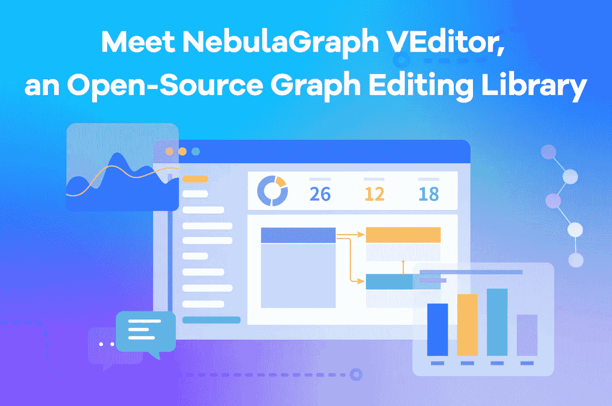
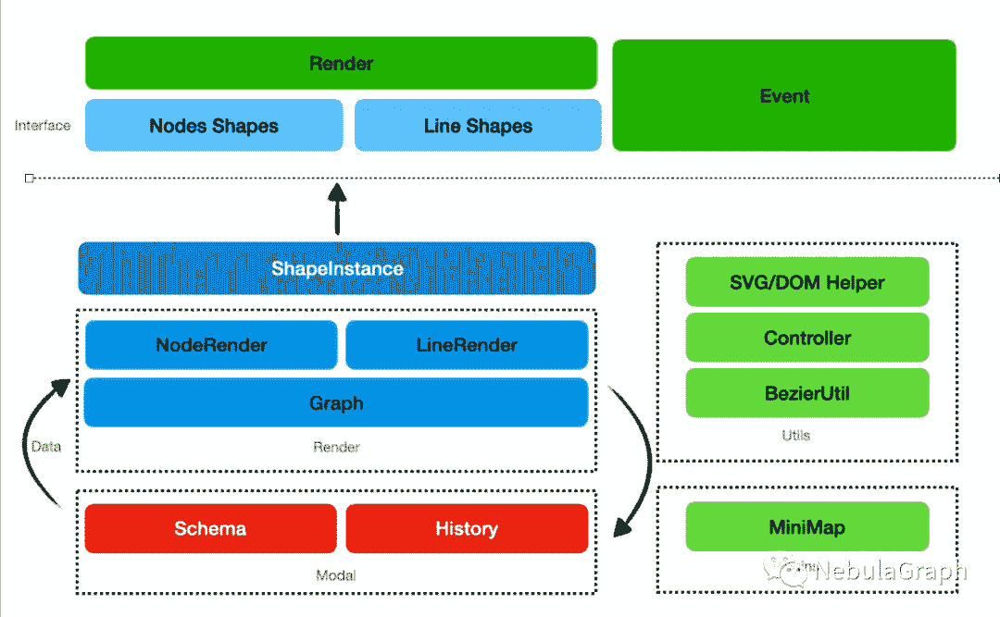
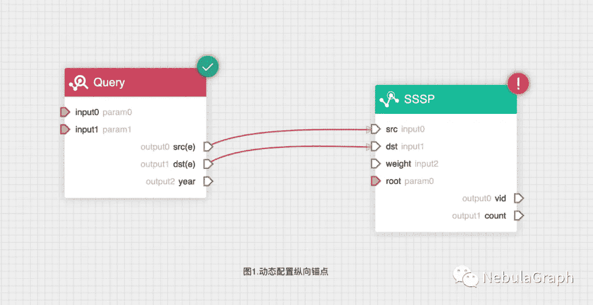
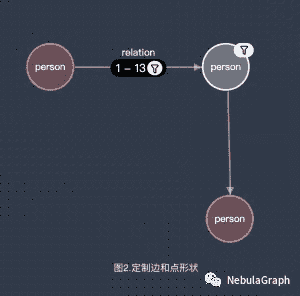
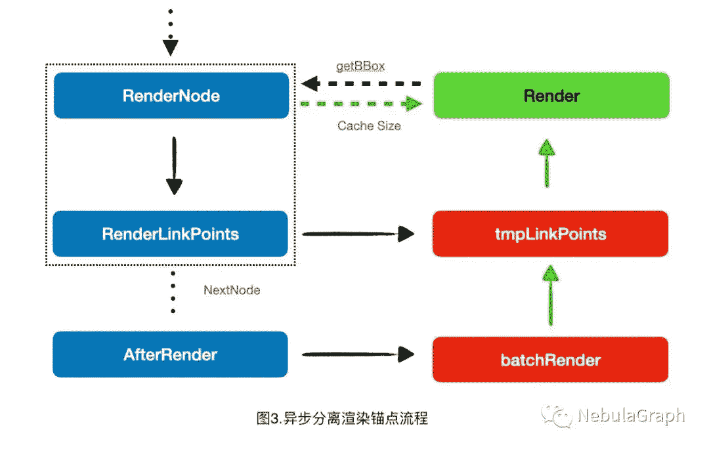

# 见见 NebulaGraph VEditor，一个开源的图形编辑库

> 原文：<https://itnext.io/meet-nebulagraph-veditor-an-open-source-graph-editing-library-626521549ffb?source=collection_archive---------2----------------------->

NebulaGraph VEditor 是一个高性能、高度可定制的所见即所得可视化编辑前端库，由 NebulaGraph 数据库团队开发。NebulaGraph VEditor 基于 SVG 绘图，通过合理抽象代码结构，易于开发和定制绘图。它非常适合 WYSIWYG 编辑和预览场景，如审批流、工作流、亲属关系、ETL 处理和图形查询。您可以使用 VEditor 可视化地查询、编辑和建模图形。

经过不断的迭代和打磨，VEditor 已经相对完善，现在其代码已经开源。在这个话题中，我想分享一些关于它的设计的想法和思考。

# 基本特征

*   可定制的节点和边缘样式。
*   扁平、简单、清晰的代码结构。
*   小地图和磁力线。
*   常见操作的快捷方式。
*   历史管理。
*   轻量级，压缩前大小只有 160 KB。

# 设计理念

当我第一次碰到图形编辑器库的时候，我只是想找一个用于定制和动画的。用了很多流程图库，发现大部分设计都有臃肿的接口和复杂的类。作为一名前端开发人员，这违背了我编写简单、精简、低耦合代码的理念。所以我决定自己写一个轻量级的库来满足我的需求。

VEditor 的设计理念是让开发者使用起来更轻便，减少学习 API，减少对基于可定制性和可理解性的各种库的依赖。

# 体系结构

整体架构主要是通过事件来做实体间的依赖管理，也建议主要通过事件来获取整个流程图的状态变化。

其中渲染过程为半自动渲染，更改流程图数据后需要手动触发渲染。画布上的其他状态操作将触发用户定义的形状渲染函数来渲染节点和线条。

# 渲染过程

VEditor 使用 SVG 来渲染画布。SVG 的声明式使用使得内部结构对外可见，方便开发者自定义渲染。用户可以在外部直接重写相关的 SVG 样式，并可以直接使用 SVG DOM(文档对象模型)来操纵鼠标事件和动画节点。

在形状渲染方面，用户自定义的渲染函数主要通过暴露的形状接口进行注册。从这个角度来看，VEditor 可以基于任何呈现技术执行呈现，只要呈现接口返回一个 SVGDOM，它可以是 SVGElement 或 ForeignObject。我强烈推荐通过 DOM 框架管理 SVC 渲染，比如 React 和 Vue。在某些情况下，您甚至可以包装画布来呈现 WebGL 节点，这极大地扩展了可定制性。

除了节点之外，节点锚点和线也支持相应的接口注册为 Shape 后的对象渲染。在实际的业务场景中，我们使用这个特性来实现算法参数锚的动态添加、删除和更改，OLTP 查询的输入和输出锚(图 1)，图形可视化中的边过滤，以及步骤呈现(图 2)。欢迎您申请 Explorer 免费试用。只需点击[这里](https://nebula-graph.com.cn/products/explorer/)。

# 数据结构设计

VEditor 的数据结构与大多数库类似，但不会破坏用户的对象引用，即当用户将相关数据挂载到节点或线对象时，会对其进行对齐和保留，这样在配置完顶点或边后，将方便用户将相关数据挂载到顶点。因此，重做、撤消等。对历史的操作会将用户的数据存储为快照。

# 性能设计

众所周知，对于小分辨率的渲染，SVG 的性能比 Canvas 差得多，这是随着易用性的提高而带来的一个缺点。这在初始化大量更复杂或动画节点时尤其明显。为了解决这种情况，VEditor 的数据呈现部分使用异步过程，将锚点的呈现放入下一个事件循环中，以避免在同步过程中获取大量边界框导致的浏览器强制重绘。绘制完成后，缓存相应的节点，避免重复取数。

在添加节点或线条时，SVG 的 DOM 特性会让浏览器自动做脏渲染，所以增量渲染的性能和 Canvas 差别不大，主要是交互和动画时比较慢，导致大量的 DOM 重绘。当前的设计性能目标是 1000 个具有复杂形状的节点以实现平滑渲染，这在流程图编辑场景中很容易实现。

# 交互设计

默认情况下，VEdtior 提供基于 Dagre 的有向图布局。在优化和调用 Dagre 后，它会自动将所有节点居中。同时，它提供了一个自适应的大小函数。与其他库不同，当前节点的坐标会被重置到自适应位置，用户保存当前数据后可以直接恢复自适应位置。

VEditor 的小地图采用画布渲染，直接将 SVG 转换为画布，在保证小地图精度的同时降低了性能损失。在交互方面，VEditor 允许你放大和缩小画布，拖放元素。

# 未来计划

通过扩展它可以使用的场景，VEditor 有望成为任何领域的数据编辑器和渲染器。此外，我们将继续改进 VEditor 的性能和用户体验，同时在未来支持以下功能。

*   框选择器和多选操作。
*   无向图和双箭头
*   进一步的性能优化

👉GitHub 开源地址:[https://github.com/vesoft-inc/nebulagraph-veditor](https://github.com/vesoft-inc/nebulagraph-veditor)

# 你可能也喜欢

[图形数据库可视化:星云图探索者](https://www.nebula-graph.io/products/explorer)