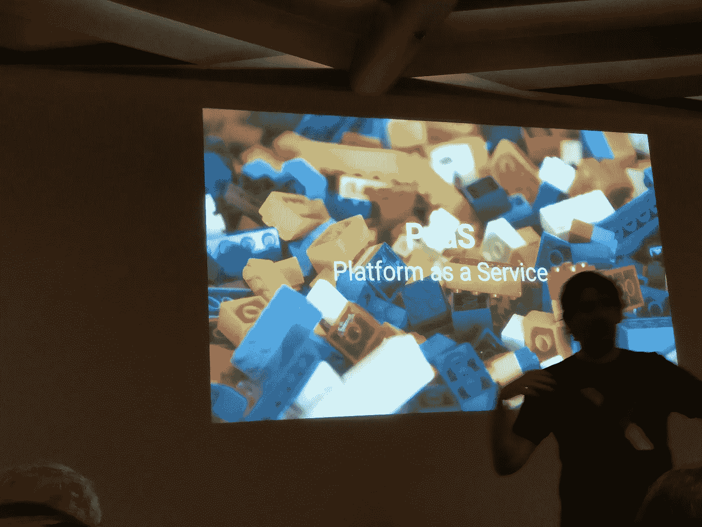

# 一个初学者对 OpenShift 的看法

> 原文：<https://itnext.io/meetup-openshift-shows-redhats-power-unleashed-on-kubernetes-docker-171c3ff7a514?source=collection_archive---------0----------------------->

我参加了一个 OpenShift 研讨会，会上展示了 Kubernetes & Docker 如何为 RedHat 的工具提供支持！我们可以从下面这些开始: [OpenShift](https://en.wikipedia.org/wiki/OpenShift) 是一件严肃的事情。

如果你不是一个喜欢玩 [Docker](https://en.wikipedia.org/wiki/Docker_(software)) 、 [Infra as a Service](https://en.wikipedia.org/wiki/Cloud_computing#Infrastructure_as_a_service_.28IaaS.29) 、&云部署的 IT 专业人士，那么 [OpenShift](https://www.openshift.com/) 不是你的茶。OpenShift 也不适合初学者软件工程师。

当您习惯于在企业环境中使用企业软件时，您希望安装和集成配置是现成的。如果这是你的情况，希望一个部署工具支持[自动缩放](https://en.wikipedia.org/wiki/Autoscaling)和[集成 CI 设置](https://about.gitlab.com/2016/12/14/continuous-delivery-of-a-spring-boot-application-with-gitlab-ci-and-kubernetes/)，那么 OpenShift 就是你的工具。

4 月 5 日， [LINKIT](https://www.linkit.nl) 组织了一次很棒的 [Meetup](https://www.meetup.com/ITNEXT/events/236632211/) 在 OpenShift 上用 RedHat 搭建的车间里。

## 为什么是 OpenShift 研讨会？

OpenShift 是 RedHat 开发的一个很棒的工具，它现在获得了一些支持，而它的底层技术在企业领域获得了更多的支持。

## 在工具中自动扩展高可用性容器 web 解决方案自动部署

IT 创业公司和小型 IT 公司(SME)正在全力以赴地使用 Docker 容器进行打包应用。这些小容器与使用集群技术的高可用性解决方案结合在一起，如 Kubernetes/Mesos/Swarm。当公司变得更加成熟时，你会看到[地形](https://medium.com/quick-mobile/terraform-would-it-be-the-best-iac-solution-878224bf1a9c) / [游侠](https://www.slideshare.net/SkeltonThatcher/using-rancher-for-highly-available-deployment-services-with-gocd-and-teamcity)被用于自动缩放。所有这些功能都应该在一个完全自动化的管道中实现。每个话题本身都很复杂。这些主题结合在一起，对大多数开发人员来说超出了他们的能力范围。

## 什么是 OpenShift？

OpenShift 将 Docker 和 Kubernetes 的强大功能与企业就绪控制系统相结合。它使您能够创建一个[持续部署管道](https://blog.openshift.com/create-build-pipelines-openshift-3-3/)，提供从测试到自动扩展所需的一切。RedHat 向您保证，所有这些都集成在一起，并且能够以适合大型企业的方式进行控制。

这解释了 OpenShift 和集成工具概念受到的关注。此外，这些工具非常复杂，仅仅在一个下午尝试一下它们是不够的。

这就是我去这个聚会的原因。没有什么比一屋子经验丰富的 IT 专业人员和提供[研讨会](http://labs.openshift3roadshow.com/#/workshop/roadshow/module/environment)的 RedHat 高级专家的学习曲线更好的了。

## OpenShift 在应用程序开发和部署(DevOps)领域的定位

在过去的六个月里，我研究了 CI/CD 解决方案。到目前为止，结论是我们有两个选择。一方面是詹金斯，你可以定制一切。Jenkins 可以用插件扩展，你可以编码/管理和操作任何你需要的东西。

另一方面，您有专门的解决方案，可以读取 YML 文件，然后为特定类型的架构/技术提供惊人的价值。很好的例子是 Travis-CI 的一站式托管 CI 和 GoCD 的成熟 CI 解决方案。

介于詹金斯和特拉维斯之间的是 GitLab。GitLab 集成了从代码编辑器到部署的所有开发需求。

人们告诉我 OpenShift 是一个很棒的 CI/CD 工具，但是同样是这些人告诉我你也可以在 OpenShift 上安装 Jenkins。我认为我询问的人不知道 OpenShift 或 CI 是什么。因为他们给出了使用 OpenShift 作为 CI 管理器的参数，它可以用于安装 Jenkins，这是另一个 CI 管理器。这是我自己去做一些研究的动机。

好吧，看来 OpenShift 不仅仅是一个 CI/CD 工具。它或多或少是 IaaS 层之上的一个框架或管理器。

OpenShift =平台即服务

## meetup 传递了什么？

对我来说，meetup 是一个很好的机会来移除我待办事项列表中的 OpenShift。每次我和别人谈论 OpenShift 时，他们都只看过一个演示。进入一个网站，开始免费试用，并下载它从来没有被做过。这个聚会很棒。在以前的聚会中，有一个演示来传达该工具的价值，现在你可以自己安装和部署它。太棒了。

缺点是速度相当快，没有时间去理解/讨论某个东西是如何工作的或者为什么会工作:)

我意识到我一开始的假设是正确的。如果您是一家企业，并且有资源让两名 DevOps 工程师了解该工具并成为它的专家，那么 OpenShift 是一个非常好的工具。这可能需要几个月的时间。但是您知道您的部署和管理架构已经准备就绪。此外，RedHat 将继续随着市场的最新发展而发展，因为它是一个开源项目。

因此，如果你在一个企业环境中，想要使用现在强制集成的 docker、cluster、autoscaling、全自动 CI，我建议看看 OpenShift，并将其与其他工具进行比较。

[http://www . fayestardust . com/2012/04/done-is-better-than-perfect/](http://www.fayestardust.com/2012/04/done-is-better-than-perfect/)

## 自己做

这是研讨会[演练](http://labs.openshift3roadshow.com/#/workshop/roadshow/module/environment)文本的[链接](https://t.co/N5xYqV1V56)。

## 谢谢你的鱼

感谢 [LINKIT](http://linkit.nl) 的主持，感谢 [Samuel Terburg](https://www.linkedin.com/in/samuelterburg/) (RedHat)的这次精彩聚会。

meetup open shift 2017 04 red hat & LinkIT