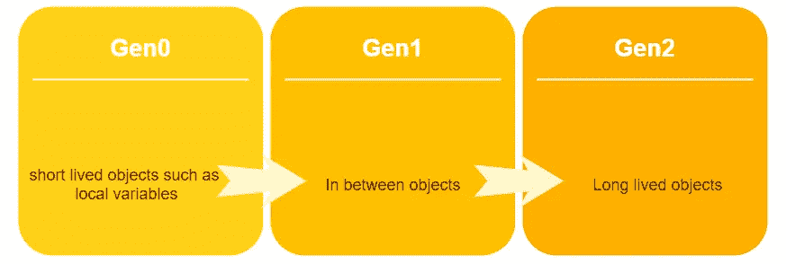
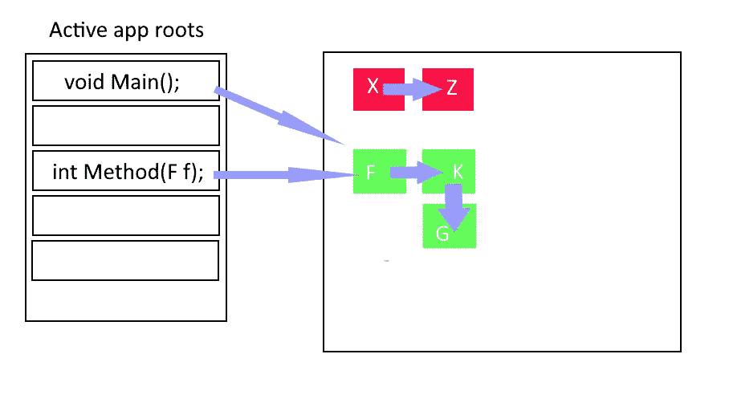

# 使用 C#的内存型应用程序。网

> 原文：<https://itnext.io/memory-wise-apps-with-c-net-50b6379ed86?source=collection_archive---------1----------------------->


计算机内存芯片由[彼得·克拉托奇维尔](https://www.publicdomainpictures.net/nl/view-image.php?image=18192&picture=geheugen-van-de-computer-chips)

每个应用程序都由两部分组成:**代码**和**数据**存储应用程序在执行过程中的**状态。当一个. NET 应用程序运行时，幕后有一堆魔法，而**内存管理**就是其中之一。在我看来，要编写一个智能内存的应用程序，你需要知道内存管理背后发生了什么。**

## 1)术语

在讨论内存管理之前，需要描述几个术语:

📒*如果你已经知道 GC、堆、代、代码等术语。跳过这一部分。*

*   **垃圾收集器(GC):** 是的一部分。NET 内存管理，为你的应用程序释放内存。
*   **堆:一个**堆是一个专门的基于树的数据。在**中有不同的类型。NET、**如**代码堆**、**小对象堆(SOH)** 、**大对象堆(LOH)** 和**进程堆**。
*   **托管堆**:是[引用类型化](https://docs.microsoft.com/en-us/dotnet/csharp/language-reference/keywords/reference-types)对象存储的内存的一部分。
*   **代:**为了 GC 更好的释放内存性能，从**零**开始将堆分成不同的代索引(例如 **Gen0** ， **Gen1** 等等)。
*   **栈**:在计算机科学中，栈是一种抽象的数据类型，作为元素的集合，有两个主要操作 push 用于添加到顶部，pop 用于从顶部检索和移除。元素从堆栈中出来的顺序产生了它的另一个名字， **LIFO** (后进先出)

## 2)变量在哪里，堆还是栈？

。NET 将变量数据存储在**堆**或**堆栈中。**如何**。NET** 根据声明它的上下文来处理它。我们使用变量在内存中存储数据，但这意味着什么呢？

```
int variable1 = 1;
object variable2 = new Object();
object variable3 = null;
```

众所周知，我们使用变量将一个名字(在编码中)与一个包含它的值的内存槽相关联。但是对于一个**引用类型的**变量(例如`new Object()`)，变量的值是对对象的**引用**，而不是对象本身。

你有没有问过自己为什么不能给一个**值类型化的**变量赋一个 **null** 值？

```
int number = null; // Why this isn't correct?
object myObject = null; // Why this is correct?
```

将 **null** 存储到一个**值类型的**变量中有意义吗？它应该存储一个值，比如一个数字，对吗？😉

但是将 null 赋值给被引用类型是可以的(但是在使用 null 之前，请阅读[一个十亿美元的错误](https://en.wikipedia.org/wiki/Tony_Hoare#Apologies_and_retractions))。因为你声明了一个没有引用任何对象的变量，所以你把它赋值为 null。

现在让我们回到堆和栈的主题！

*   中的**堆**或**托管堆**。NET 是对象存在的地方。
*   每个**局部变量**都存储在堆栈中，即使是引用类型的。我知道看起来不是很清楚。但是要记住， ***对象本身存在于*** 堆中，而 ***变量值只是对对象本身*** 的引用。
*   静态变量总是存储在**堆中，**当然，它们只有一个内存槽。

总有例外:方法参数被认为是局部变量，但是当用`ref`修饰符声明它们时，它们共享调用方法变量的槽。

## 3)内存管理

所以。NET 将引用类型变量的值存储到**小对象堆(SOH)** 和**大对象堆(LOH)** 中，并将它们分成代。那么，什么是世代？

*   当一个新对象**刚刚被创建**时，它将在 **Gen0 中。**当 **Gen0** 满时，GC 执行扫描并尝试从堆中移除**不可到达的**对象，它会将**已到达的对象**重定位到 **Gen1** 。
*   在第二次迭代中，当 **Gen1** 已满并且执行 GC 时，所有幸存的对象将提升到 **Gen2** 。(第 0 代收集也发生在这里)
*   当 Gen2 也满时，GC 执行一个**完全垃圾收集:**首先是 Gen2，然后是 Gen1 和 Gen0。如果没有剩余内存，GC 将抛出一个 [OutOfMemory](https://docs.microsoft.com/en-us/dotnet/api/system.outofmemoryexception?view=netframework-4.8) 异常。



为了获得更好的性能，。NET 在 LOH 中存储大于 85Kb (85，000 千字节)的对象，在 SOH 中存储较小的对象。随着时间的推移，LOH 中幸存的对象将遭受碎片化。

我们知道堆、栈和代，但是 GC 是如何工作的。

## 4)垃圾收集器

在 GC 过程中，它从应用程序不再使用的对象中释放内存。想象一下，你在一个方法中声明了几个变量，在执行之后，它们就不再需要了。

GC 检查应用程序根以确定该对象是否仍在使用。对于每个根，GC 将构建一个图，通过这个图，它可以找到未使用的对象。下面的照片试图展示活动根的图形和对象的关系。



红色插槽是需要删除的无法访问的对象。

别忘了 GC 永远不会收集 GC 根。静态变量也被认为是 GC 根。

## 5)智能内存应用程序！

当你用完每一个[一次性物品](https://docs.microsoft.com/en-us/dotnet/api/system.idisposable.dispose?view=netframework-4.8)后，将处理掉。位图对象、SQL 连接或任何其他可任意处理的对象。

这可以通过使用如下语句来实现:

```
using(var sqlCon = new SqlConnection()
{
} // sqlCon will be disposed here
```

或者手动调用 dispose 方法:

```
var bitMap = Bitmap.FromFile();
// ..
// rest of code ...
// ..
if(bitMap != null) bitMap.Dispose();
```

避免使用静态成员

一些程序员认为使用静态成员是一种不好的做法，而且有代码味道。GC 将静态变量视为 GC 根，它不会收集它们。

```
public class Cache
{
 static List<Object> _internalCache = new List<Object>(); 
 public void Add(obj) => _internalCache.Add(obj);
}
```

在上面的例子中，静态成员`internalCache`是一个 GC 根，永远不会被收集。想象一下，向它添加对象不仅会导致应用程序内存泄漏，还会对 GC 隐藏大量对象！

**不要**串联长字符串，改用[**StringBuilder**](https://docs.microsoft.com/en-us/dotnet/api/system.text.stringbuilder?view=netframework-4.8)！

字符串是[对象](https://docs.microsoft.com/en-us/dotnet/api/system.string?view=netframework-4.8)，字符串是不可变的。所以通过连接它们，每次你创建另一个更大字符串。

如果使用了 **StringBuilder** ，程序只消耗**141，140字节。但是用加号运算符将它们连接起来将使用大约 666，632 个字节，是原来的 6 倍😲！**

避免在匿名方法中捕获成员

看看这个例子:

**EnqueueJob** 中的匿名方法捕获了`_uniqueId`这导致了`Foo`引用的实例！

1.  Foo 引用了作业队列。
2.  JobQueue 在匿名方法中引用了 Foo 实例。

所以只要 JobQueue 存在，Foo 也会存在，因为 GC 总是在它们之间找到一个引用！

**解决方案？本地复制变量可以解决这个问题。**

```
public void Foo()
{
 var uniqueId = _uniqueId;_jobQueue.EnqueueJob(() =>
 {
  Logger.Log($"Executing job {uniqueId}");
 });
}
```

😲事件处理程序可能会带来与匿名相同的问题

*   完成后取消订阅
*   如果可能的话，用匿名方法重写它们，不要捕获！

使用**武器参考**

可以收集被引用的对象。 **WeakReference** 可以用来允许访问对象，直到它们被 GC 收集。

我将 **StringBuilder** 定义为 **WeakReference。因为这是一个弱引用，所以它每次都可以通过 GC 收集。所以我们需要检查它是否还活着。通过执行上面的代码，输出将是:**

```
Alive
Sad, it's collected.
```

所以 GC 是不可预测的，每次都可以收集，但是有时你需要缓存那些最终需要过期的东西，在这种情况下使用 WeakReference。

📒总是用你能得到的任何内存分析器来分析你的应用程序！**内存泄漏**是你无法避免的。即使您将代码写得非常干净，也很有可能会发生内存泄漏。档案可以帮助你了解记忆中发生了什么。

## 结论

垃圾收集是一项非常繁重的操作。让你的应用程序变得更有内存智慧不仅会阻止任何内存泄漏，还会对你的整个应用程序产生重大影响。因此，一个内存明智的应用程序是速度明智的！

## 参考资料:

*   [记忆在。乔恩·斯基特](https://jonskeet.uk/csharp/memory.html)
*   在…的罩下。克里斯·法雷尔和尼克·哈里森的《网络内存管理》
*   [微软文档垃圾收集基础](https://docs.microsoft.com/en-us/dotnet/standard/garbage-collection/fundamentals)