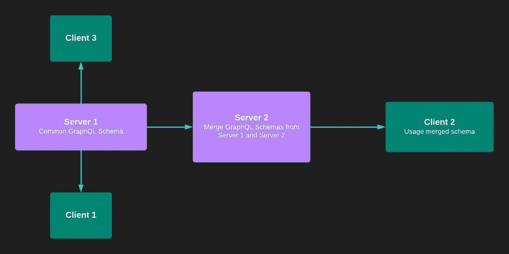
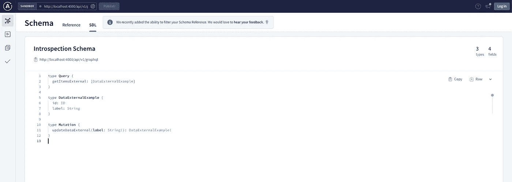
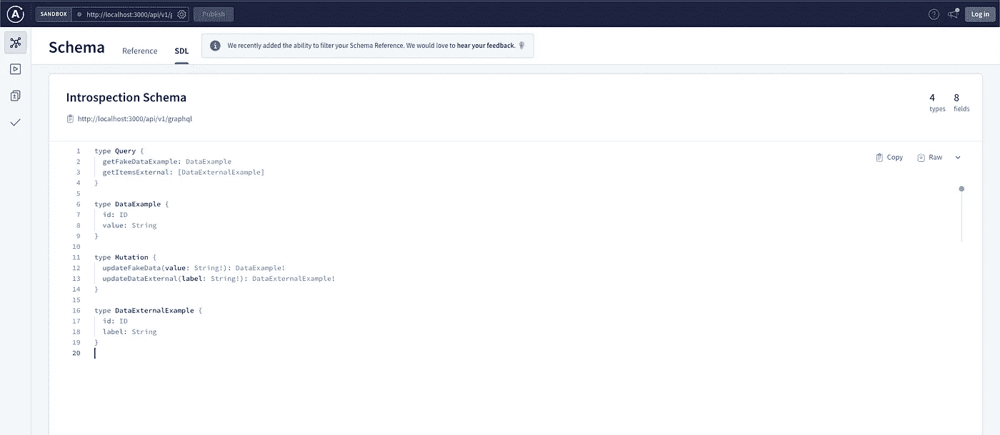

# 使用 Apollo 服务器和 Koa 合并 GraphQL 模式

> 原文：<https://itnext.io/merge-graphql-schemas-using-apollo-server-and-koa-346019e6945f?source=collection_archive---------2----------------------->


今天，在我们现代的开发人员世界中，完全无法想象没有 React、Node JS、GraphQL 等技术的生活。他们拥有坚实的队伍，在数据交付方面处于领先地位。我遇到的 70%的案例都是与 GraphQL 集成或者即将迁移到它的项目。越来越多的公司倾向于使用 Graphql 数据查询语法，如今它已经成为必备知识。

[**GraphQL**](https://graphql.org/) 是一种针对 API 的查询型语言，广泛用于从服务器端向客户端请求数据的优化素材。客户端使用类型化模式准确地请求它们需要的内容。它允许您只发送所请求的内容，而不是固定的数据集。

[**Apollo Server**](https://www.apollographql.com/docs/apollo-server/) 为您提供了发送客户端请求响应的工具。Apollo 客户端提供了使用 Graphql API 的能力，包括缓存和链接。

## 是关于什么的？

我们将创建两个 Apollo 服务器来处理 Graphql 模式合并。在这种情况下，一些外部服务器使用 Graphql API 进行响应，而其他一些服务使用自己的 Graphql 模式，包括外部模式。在节点层，我们将把来自外部服务器的结果打包到一个模式中，并发送给客户端。实际上，我们将把两个模式合并成一个并发送给客户端。

## 让我们深入研究代码

对于实现，我们将使用 Node JS 环境、Koa 中间件和带有 GraphQL 工具的 Apollo 服务器。

我们必须运行两台服务器。两者都必须有一个 GraphQL 阿波罗服务器。这是图表。



图表模式合并

是时候创建样板文件并运行它们了。为此，我们需要创建两个文件夹，并将其中一个文件夹命名为:`boilerplate-raphql-koa-server-external`，将第二个文件夹命名为:`boilerplate-graphql-koa-server`

开始之前，请看看两个项目中的文件夹结构。很简单。这两个回购协议的区别在于代码。

```
├── package.json
└── src
    ├── index.js
    ├── resolvers.js
    └── schema.js
```

## 外部 GraphQL 服务器

现在，让我们设置一下`boilerplate-graphql-koa-server-external`

`boilerplate-graphql-koa-server-external`的 package.json

然后让我们创建服务器本身。在`src`文件夹的`index.js`中添加服务器设置:

`boilerplate-graphql-koa-server-external`的 index.js

异步函数`server`将负责 koa 应用程序本身，我们将创建带有可执行模式的 apollo 服务器，其中我们必须提供来自模式和解析器的类型。从[正式文件](https://www.apollographql.com/docs/apollo-server/integrations/middleware/#apollo-server-koa)来看，我们必须在`apolloServer.applyMiddleware`之前提前调用`apopServer.start()`。它允许识别潜在的问题，并在 Apollo 服务器启动过程崩溃的情况下采取行动，而不是开始服务请求。

第二部分是`boilerplate-graphql-koa-server-external`让我们建立模式和解析器。

`boilerplate-graphql-koa-server-external`的 schema.js

架构的解析器。

`boilerplate-graphql-koa-server-external`的 resolvers.js

现在是检查服务器响应的时候了。在此之前，不要忘记安装软件包:`npm i`，然后运行命令`npm run start`，并在 Chrome 浏览器中放置 URL: `[http://localhost:4000/api/v1/graphql](http://localhost:4000/api/v1/graphql.)`。点击“查询你的服务器”按钮，就可以得到 apollographql 的界面。它允许您查看来自服务器的请求模式。打开[自检模式](https://studio.apollographql.com/sandbox/schema/sdl)页面。你会看到我们的模式:



Apollo GraphQL Studio 中的自省模式视图

如果您能够自省模式，那么这意味着我们完成了我们的`boilerplate-graphql-koa-server-external`

## 用于合并模式的 GraphQL 服务器

现在让我们转到`boilerplate-graphql-koa-server`设置。在`package.json`和`external`中几乎所有的东西都是一样的，除了附加的包和不同的`PORT`，名称和描述。

`boilerplate-graphql-koa-server`的 package.json

让我们马上建立新的模式。模式中有很多相同但稍有不同的数据。

`boilerplate-graphql-koa-server`的 schema.json

和解析器:

`boilerplate-graphql-koa-server`的 resolvers.js

现在我们来看看服务器文件。你会发现除了几行代码之外，其他都差不多。首先，我们使用`loadSchema`是为了通过来自`EXTERNAL_ENDPOINT`的请求获得外部模式，T1 是我们第一个启动的服务器，也是模式`UrlLoader`的加载器。

最重要是，我们必须确保我们的模式已经被加载，且外部服务器没有抛出任何错误。我们必须抓住这种情况。正如您在代码中看到的，我们得到的只是一个模式数组。默认情况下，我们只有自己的`internalSchema`，然后，如果有外部服务器可用，我们会将数据推送到那个数组`externalSchema`，然后使用工具`mergeSchemas`，它有助于将合并的模式直接提供给`ApolloServer`

合并模式的 Apollo 服务器设置

安装所有软件包并运行将在`PORT=3000`上可用的服务器。让我们转到 apollographql 的同一个接口，但是 URL 必须使用正确的端口:`[http://localhost:3000/api/v1/graphql](http://localhost:4000/api/v1/graphql.)`。现在，如果我们打开[自省模式](https://studio.apollographql.com/sandbox/schema/sdl)页面，我们将能够看到合并的模式。一个来自外部，另一个来自最后创建的服务器。



Apollo GraphQL Studio 中的自省模式视图

请记住，如果您的一些服务器将获得相同的字段，GraphQL 服务器将产生如下错误:

```
Error: Unable to merge GraphQL type “Query”: Field “getFakeDataExample” already defined with a different type. Declared as “DataExample”, but you tried to override with “DataExternalExample”
```

这意味着在 GraphQL 模式中，我们必须非常小心我们的字段和类型定义，以免在类型或字段已经存在时陷入尴尬的境地。

**GitHub Repos**
[https://GitHub . com/Anton kalik/boilerplate-graph QL-KOA-server](https://github.com/antonkalik/boilerplate-graphql-koa-server)
[https://GitHub . com/Anton kalik/boilerplate-graph QL-KOA-server-external](https://github.com/antonkalik/boilerplate-graphql-koa-server-external)

**模式加载文档**【https://www.graphql-tools.com/docs/schema-loading】

## 结论

许多公司正在转向微服务架构，并试图隔离数据流的逻辑。我在上面描述的这种方法适用于公司中的微服务之间的通信情况，此时存在某种具有默认模式的全局服务和具有附加字段的小型微服务，这些字段将来会被客户端使用。

感谢您的关注。