# 合并具有不同定义属性的数组中的 JavaScript 对象

> 原文：<https://itnext.io/merge-javascript-objects-in-an-array-with-different-defined-properties-5c1e2c3ca634?source=collection_archive---------1----------------------->

## Array.reduce()是组合共享一个键但不一定是属性的对象的解决方案。

# 介绍

在最近的工作中，我遇到了一个有趣的问题:我需要根据匹配的键将多个 JavaScript 对象合并到一个数组中。

起初，这听起来相对简单，但是还有更多故事阻止我使用 [**扩展操作符**](https://developer.mozilla.org/en-US/docs/Web/JavaScript/Reference/Operators/Spread_syntax#spread_in_object_literals) 或`[**Object.assign()**](https://developer.mozilla.org/en-US/docs/Web/JavaScript/Reference/Global_Objects/Object/assign)`来组合这些对象。

1.  这些对象*中的每一个都可能*共享一个公共密钥——这是没有保证的，并且
2.  尽管它们在每个对象中都有相同的属性，但并不是所有这些属性都在每个对象中定义——对象可以有`property: value`或`property: undefined`。

我需要将共享一个公共键的对象的所有属性以及它们的定义值组合成一个新的单个对象。为了让它更难一点，我需要它在打字稿中工作。😅

**所以今天，我将向您展示如何使用 JavaScript 的** `**reduce()**` **函数合并一个数组中两个(或更多)具有不同定义属性的对象。**

# 背景:`motion.qo`和`air.qo`事件

对于那些对这种事情在现实生活中什么时候出现感到好奇的人，这里有一些关于我的情况的背景。

我在一家名为 [**蓝调无线**](https://blues.io/?&utm_source=medium&utm_medium=web&utm_campaign=sparrow-accelerator&utm_content=merge-js-objects) 的物联网(IoT)初创公司担任软件工程师。我们的主要使命是让物联网开发变得更简单，不管是否有可靠的互联网连接。Blues 通过[**note cards**](https://blues.io/products/notecard/?&utm_source=medium&utm_medium=web&utm_campaign=sparrow-accelerator&utm_content=merge-js-objects)**实现这一点——可以嵌入任何“边缘”物联网设备的预付费蜂窝设备，以 JSON 的形式将传感器数据传输到安全云: [**Notehub**](https://blues.io/products/notehub/?&utm_source=medium&utm_medium=web&utm_campaign=sparrow-accelerator&utm_content=merge-js-objects) 。**

**除了生产这种硬件并提供安全的云连接来发送物联网数据，我们还构建了软件应用程序，用户可以将他们的设备连接到这些应用程序，并以图表和图形的形式查看传感器数据。**

**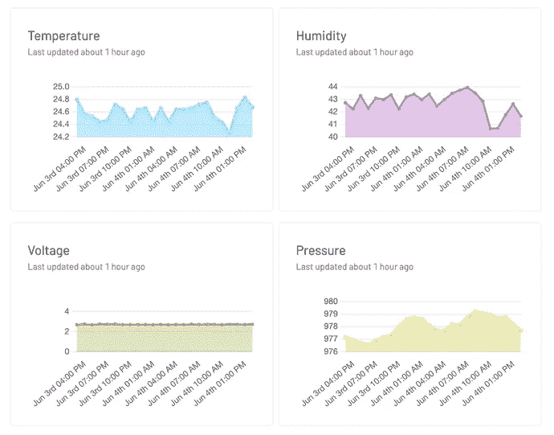**

**以下是显示各种传感器数据的图表示例。**

**我们正在构建的一个 web 应用程序涉及报告两种类型数据的传感器:**

*   ****空气质量**温度、湿度、传感器电压和压力等读数，以及**
*   ****运动**读数，如当前检测到的运动计数和一段时间内检测到的运动总数。**

**因此，单个传感器生成两个不同的 JSON 有效载荷，从 Notecard 发送到 Notehub，然后 Notehub 将它们路由到我们的 web 应用程序，以在图表中呈现。**

**下面是一些交付给应用程序的事件的示例。**

****传感器事件示例****

**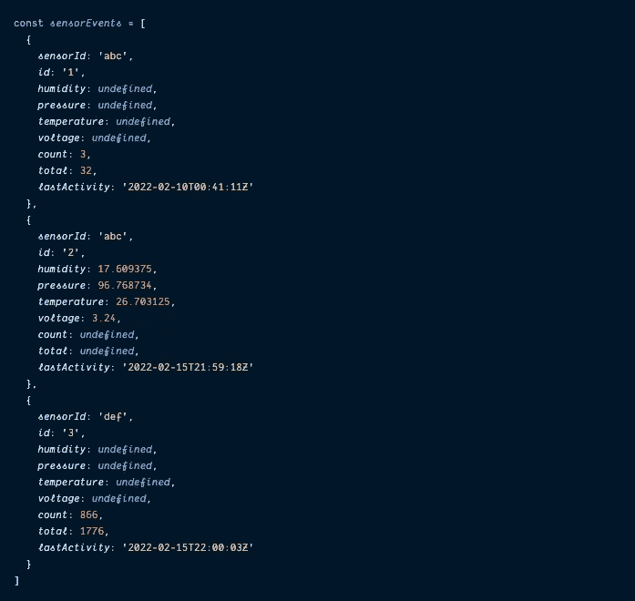**

**如您所见，数组中的前两个对象共享同一个`abc`的`sensorId`，但是它们有不同的定义属性。**

**第一个对象有`motion`属性(和未定义的`air quality`属性)，第二个对象有定义的`air quality`属性(和未定义的`motion`属性)，第三个对象有完全不同的`sensorId`；这是来自另一个传感器的`motion`读数。**

**这让我想到了我的问题:如何组合具有相同`sensorId` *和*的对象，并从每个对象中获取所有已定义的属性。**

**所以，让我们开始吧。**

## **用`mergeObject()`函数和`reduce()`合并相似的对象**

**鉴于我在这篇文章中多次提到“合并”和“组合”，你可能已经想到 JavaScript 数组函数`[**reduce()**](https://developer.mozilla.org/en-US/docs/Web/JavaScript/Reference/Global_Objects/Array/reduce)`可能会在这里发挥作用，而且确实如此。**

**最基本的是，`reduce()`遍历**数组中的每个元素**，并将其添加到其前面所有值的**累加器**中，直到最后只返回一个值。同样的事情可以用一组对象来完成，只需要多一点逻辑。**

> ***如果你想对* `*reduce()*` *有更透彻的解释，我鼓励你查阅一下* [*Mozilla 文档*](https://developer.mozilla.org/en-US/docs/Web/JavaScript/Reference/Global_Objects/Array/reduce) *。***
> 
> **他们的例子很棒，我仍然定期访问它，讨论各种话题。**

**下面是我想出的具有 TypeScript 风格的解决方案，它获取一个对象数组，找到共享一个公共键的对象，然后返回一个包含这些对象的新数组。**

**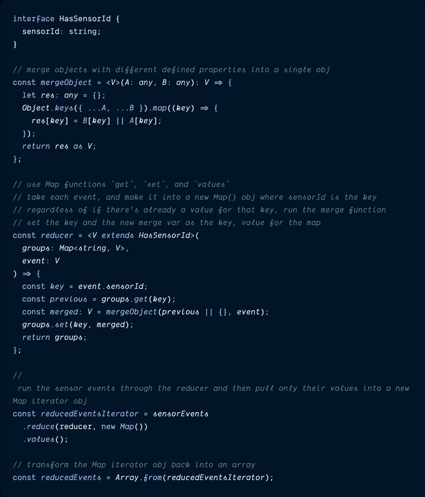**

**好吧，我意识到上面有相当多的功能，所以有必要解释一下。**

## **HasSensorId**

**`HasSensorId`接口非常直接:这意味着只要引用这个接口，对象的属性中就必须有一串`sensorId`。**

**现在，让我们一个接一个地检查这些函数的其余部分。**

## **mergeObject()**

**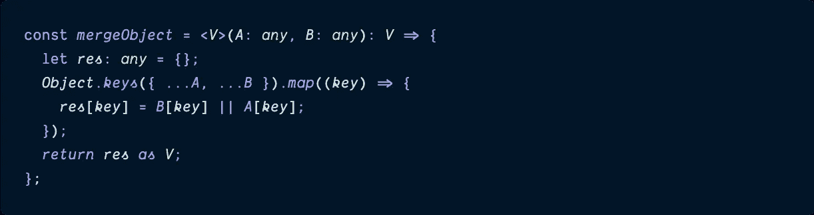**

**这个`mergeObject()`函数实际上是合并对象的函数。**

**该函数接受的`A`和`B`对象是具有共同`sensorId`属性的两个对象，`res`变量将是它们的属性(和值)组合后新返回的对象。**

**发生的第一件事是使用[扩展操作符](https://developer.mozilla.org/en-US/docs/Web/JavaScript/Reference/Operators/Spread_syntax#spread_in_object_literals)将两个对象组合在一起，然后使用`[Object.keys()](https://developer.mozilla.org/en-US/docs/Web/JavaScript/Reference/Global_Objects/Object/assign)`将它们的键提取到自己的数组中。如果您将样本`sensorEvents`数组传递给这个函数，`Object.keys()`数组将如下所示:**

**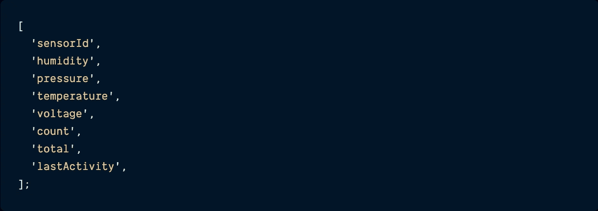**

**提取关键点后，每个关键点作为一个关键点添加到新的`res`对象中，如果`B`对象在该关键点的值存在(`B[key]`，则作为`res`对象的值添加，否则，添加`A`对象的值(即使是`undefined`)。**

**最终返回的`res`对象如下所示:**

**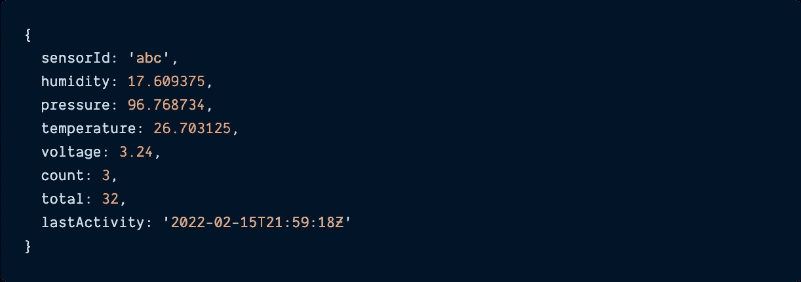**

**最后，`V`和`any`引用是 TypeScript 实现的一部分。通过查看剩余的代码，我们可以看到`V`是`HasSensorId`接口的扩展，这意味着任何事件对象都将`sensorId`作为属性。而`any`意味着传递给函数的对象可以有任何属性(或者没有)，所以很灵活。**

**好了，进入下一个功能！**

## **减速器()**

**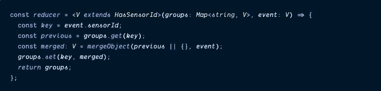**

**`reducer()`函数很好地利用了 JavaScript 中真正的`[**Map**](https://developer.mozilla.org/en-US/docs/Web/JavaScript/Reference/Global_Objects/Map)` [**对象**](https://developer.mozilla.org/en-US/docs/Web/JavaScript/Reference/Global_Objects/Map) 。它还使用了`HasSensorId`接口，确保每个对象都有一个`sensorId`属性。**

**每个传递到函数中的`event`对象，其`sensorId`都变成了一个`key`变量。`previous`变量依赖于 Map 的`[get()](https://developer.mozilla.org/en-US/docs/Web/JavaScript/Reference/Global_Objects/Map/get)` [函数](https://developer.mozilla.org/en-US/docs/Web/JavaScript/Reference/Global_Objects/Map/get)来获取具有相同`sensorId`键的任何其他 Map 对象，如果找到另一个对象，则在调用`mergeObject()`函数时，新的`event`将与它组合。如果没有匹配的`previous`对象，一个空对象被传递给`mergeObject()`，一个新的`merged`变量仍然被返回。**

**最后，地图`[set()](https://developer.mozilla.org/en-US/docs/Web/JavaScript/Reference/Global_Objects/Map/set)` [函数](https://developer.mozilla.org/en-US/docs/Web/JavaScript/Reference/Global_Objects/Map/set)将`key`和`merged`变量添加到`groups`地图对象中。**

**如果我们的三个`sensorEvents`通过这个函数运行，最终出现的`groups`对象看起来像这样:**

**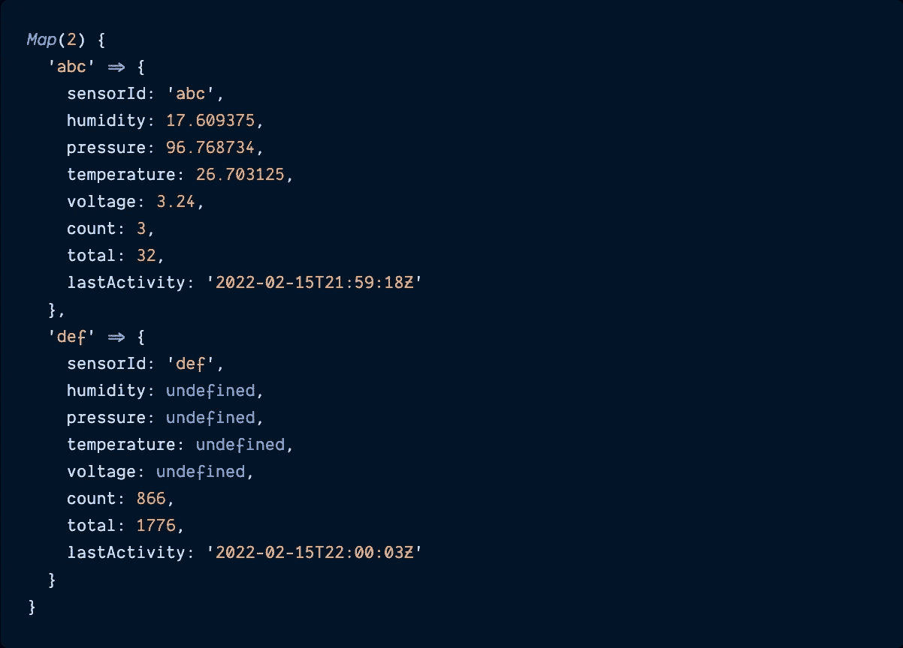**

**所以我们继续这个代码示例的倒数第二部分，`reducedEventsIterator`。**

## **reducedEventsIterator**

****

**`reducedEventsIterator`变量是我们在`sensorEvents`数组上调用`reduce()`的地方。`reducer()`函数作为数组中每个事件必须运行的第一个参数被传递，一个新的`Map()`对象作为累加器对象被传递，它们最终将被聚集在一起。**

**在`[Object.values()](https://developer.mozilla.org/en-US/docs/Web/JavaScript/Reference/Global_objects/Object/values)`方法被链接到末尾之前，数组看起来像这样:**

**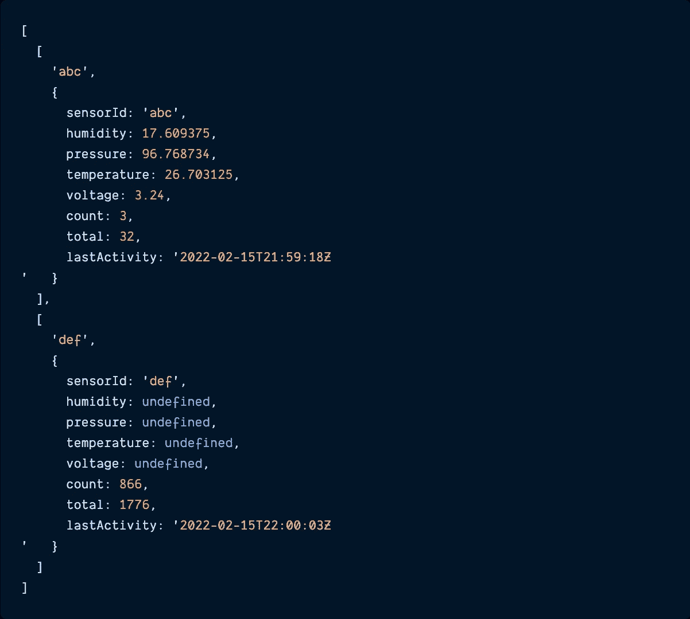**

**在调用了`.values()`之后，最终的`reducedEventsIterator`看起来更像这样:**

**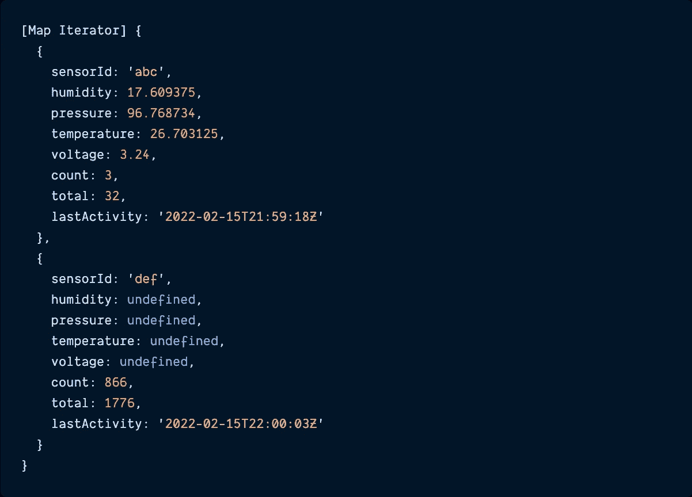**

**这就把我们带到了最后一步:将这个对象映射转换回一个正确的 JavaScript 对象数组(以及由此带来的所有好处——数组更容易操作)。**

## **最终合并的数组:reducedEvents**

****

**可以说这是整个教程中最简单的部分，对象的映射只需通过将它传递给方法就可以转换回数组。**

> *****谨防*** `***Array.from()***` ***用于复制深层对象*****
> 
> ***如果你有需要复制的深度嵌套的对象，那么* `*Array.from()*` *可能不适合你。它只生成数组的浅拷贝实例。***

**因此，如果我们将上面显示的示例传感器事件传递到我们的`reducedEventsIterator()`函数中，最终结果如下所示:**

**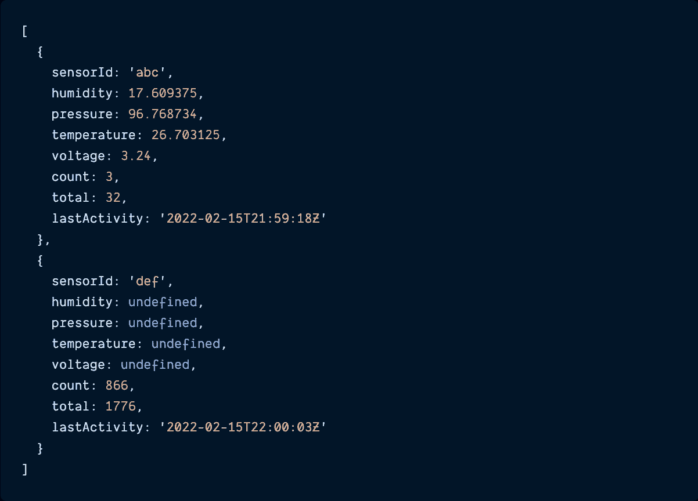**

**这样就有了:一个包含所有可用属性的新合并对象的数组。**

# **结论**

**我喜欢做软件工程师的一个原因是因为我可以定期解决所有有趣的问题。最近，当我构建一个 web 应用程序来显示来自工作中的物联网传感器的数据时，我遇到了一个更独特的问题:获取一系列传感器事件，如果它们属于同一个传感器，则将这些事件合并在一起。问题是，所有的事件都有相同的属性，但是根据您正在查看的事件，有一半的属性的值是`undefined`。**

**因此，我不能使用 spread 操作符或`Object.assign()`将这些事件合并到一个对象中，而是必须更有创造性地使用一些额外的函数和`reduce()`方法。但是它起作用了——即使混合了 TypeScript。**

**过几周再来看看——我会写更多关于 JavaScript、React、IoT 或其他与 web 开发相关的东西。**

**如果你想确保你不会错过我写的一篇文章，在这里注册我的时事通讯:[https://paigeniedringhaus.substack.com](https://paigeniedringhaus.substack.com)**

**感谢阅读。我希望这段 JavaScript 能在将来帮助你——谁能想到合并对象会如此有趣，对吗？**

# **参考资料和更多资源**

*   **[传播运算符](https://developer.mozilla.org/en-US/docs/Web/JavaScript/Reference/Operators/Spread_syntax#spread_in_object_literals) Mozilla 文档**
*   **[object . assign()](https://developer.mozilla.org/en-US/docs/Web/JavaScript/Reference/Global_Objects/Object/assign)Mozilla docs**
*   **[地图对象](https://developer.mozilla.org/en-US/docs/Web/JavaScript/Reference/Global_Objects/Map) Mozilla 文档**
*   **蓝调无线[网站](https://blues.io/?&utm_source=medium&utm_medium=web&utm_campaign=sparrow-accelerator&utm_content=merge-js-objects)**
*   **JavaScript 数组方法 [reduce()](https://developer.mozilla.org/en-US/docs/Web/JavaScript/Reference/Global_Objects/Array/reduce)**