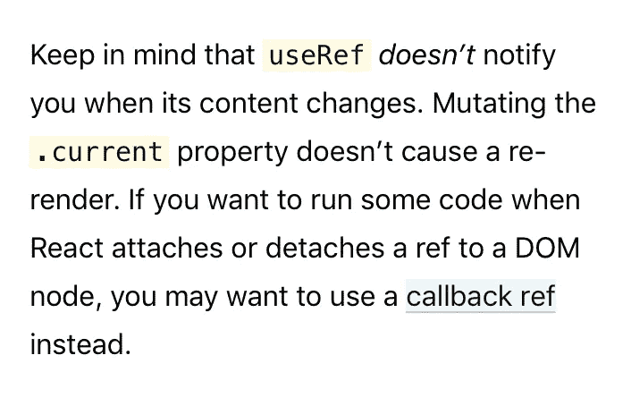

# 合并反应参考

> 原文：<https://itnext.io/mergin-react-refs-5e26f3fcf765?source=collection_archive---------2----------------------->


> *TL；DR —* `*useRef*` *和* `*createRef*` *并不是您可能感兴趣的唯一 API 调用👨‍🔬*

让我们想象一下——你正在打开一个 [React Hooks API Reference](https://reactjs.org/docs/hooks-reference.html#useimperativehandle) ，寻找可用的钩子，然后……你的眼睛发现了一个奇怪的钩子，你可能之前错过了——`useImperativeHandle`。你从未使用过它，可能也从未需要过它，也不知道它有什么用。并且所提供的例子对理解用例没有太大的帮助。
那么是什么呢？

```
function FancyInput(props, ref) {
  const inputRef = useRef();
  useImperativeHandle(ref, () => ({
    focus: () => {
      inputRef.current.focus();
    }
  }));
  return <input ref={inputRef} ... />;
}
FancyInput = forwardRef(FancyInput);
```

嗯，正如我刚才所说——那没什么帮助。我想没人明白这里写的是什么🤔。为什么写在这里🤷‍♂️.让我们用一行代码来解决这个问题。

```
function FancyInput(props, ref) {
  const inputRef = useRef();
  useImperativeHandle(ref, () => ({
+   // this is the PUBLIC API, we are exposing to a consumer via `ref`
    focus: () => {
      inputRef.current.focus();
    }
  }));
  return <input ref={inputRef} ... />;
}
FancyInput = forwardRef(FancyInput);
```

换句话说——曾经有人会`<FancyInput ref={ref} />`说`ref`只会包含**`.focus`。**

> ***这里有一个* ***代码三个盒子*** *你可以用*玩**

**`useImperativeHandle`的力量是一个[桥](https://en.wikipedia.org/wiki/Bridge_pattern)的力量，或者更具体地说——一个[立面](https://en.wikipedia.org/wiki/Facade_pattern) **图案**(你可能知道它是一个**包装**)。**

**然而，`useImperativeHandle`100%没用，对现实无能为力——我会在下面证明。**

**让我们将一切分解为原子操作，以了解我们实际上需要什么，以及还缺少什么。**

# **1.当裁判改变时，我想做些什么**

**让我们假设您想要根据`ref`值公开不同的状态，因为*不同的* `refs`可能意味着*不同的*。但是，您向父对象公开的`wrapper`(和`useImperativeHandle`“公开”a `wrapper`)是**总是静态的**。这在某些情况下可以，但在其他情况下就不行了。比如，你不能暴露一个`real ref`——只能暴露它周围的一个`wrapper`，永远是一个`wrapper`。**

> ***你需要类似于* `*useImperativeHandle(ref, inputRef)*` *的东西来同步* `*ref.current*` *和* `*inputRef.current*` *之间的值，但是它不起作用——只有* `*useImperativeHandle(ref, () => inputRef.current)*` *可以工作，但是当* `*inputRef*` *改变时它不会更新值。你没有办法对* `*inputRef.current*` *的变化做出反应***

**您可以尝试使用`useImperativeHandle`钩子的`dependency`列表来处理这种情况。类似于:**

```
useImperativeHandle( 
   ref, 
   () => inputRef.current, 
   [mmm, butWhen, itsGoing, toChange] // 🤷‍♂️ 🤔
);
```

**好吧，你不需要*依赖*这些依赖关系(并且`eslint`规则不会帮助你)，而是你附加`ref`的东西。更重要的是——你可以将“你的”`ref`附加到同一个`forwardProp`组件上，这样做也是一样的——**你不能控制什么是**`**ref**`**。这是一个黑盒，你不可能安全地预测这个黑盒是如何工作的。****

> ****这种图案非常易碎，请不要使用。请记住，官方文档也要求不要使用它。****

****使这种模式“稳定”的唯一方法是知道`ref`何时更新，并且*反应性地*更新`parentRef`。
怎么做？使用参考号`callback`！这是官方的建议。****

********

****这也不是一个好主意。回调并不好，可能这就是为什么我们有`RefObject`。****

****如何使用`RefObject`并得到变更通知？简单，和 es5 兼容。****

```
**function createCallbackRef(onChangeCallback) {
  let current = null;
  return {
    set current(newValue) {
      // new value set
      current=newValue;
      onChangeCallback(newValue);
    }
    get current() {
      // what shall I return?
      return current;
    }
  }
}**
```

****对象**获取器和设置器**用于救援。还有另一篇关于这种方法的文章，深入解释了不同的用例:****

****[](https://dev.to/thekashey/the-same-useref-but-it-will-callback-8bo) [## 同一个 useRef，但是它会回调🤙

### 很长一段时间，我们没有 ref-我们只有 ref，它是基于回调的。某些东西会通过调用来设置裁判…

开发到](https://dev.to/thekashey/the-same-useref-but-it-will-callback-8bo) 

# 2.我想使用对 DOM 对象的引用

这很好，但是当您需要处理真正的 DOM 元素时，这并没有什么帮助。
问题还是一样——让**有一个本地引用**，并将其与父引用同步。你需要一石二鸟。我的意思是-你需要更新两个就像只有一个！

事实上——这是一个非常需要和非常强大的功能，就像`forwardRef`本身一样有用——能够在本地维护`ref`,对于外部消费者来说仍然是*透明的*。

从某种角度来看，`mergeRef`是一个`forwardRef`，只要它*向前*一个给定的 ref，就不止一个位置。

# 3.我想更新参考文献

但是，`ref`是什么？它可以是一个对象(`ref object`)，也可以是一个函数(`callback ref`)。如果不知道提供的`ref`是什么，如何设置新值？

`React`和`useImperativeHandle`以及`mergeRef`都在内部隐藏了这个逻辑，但是在其他情况下你可能需要它。以`useEffect`为例。
所以给你:

```
function assignRef<T>(ref, value) {
  if (typeof ref === 'function') {
    ref(value);
  } else if (ref != null) {
    ref.current = value;
  }
  return ref;
}
```

如果将来`ref`的形状会再次改变，就像 React 16 发布时那样，这将只是一个需要更新的函数。

# 4.我想改变我的裁判

哪(惊喜！)是`useImperativeHandle`所做的——它给你一个编程的方法来返回其他的东西，从原始的 ref。

所以，如果你想:

*   有一个`local ref`，指的是真正的 DOM 节点
*   用`.focus`方法向父对象公开 ref

然后你必须合并和转换

```
-useImperativeHandle(ref, () => ({
-  focus: () => {
-    inputRef.current.focus();
-  }
-}));
mergeRefs([innerRef, tranformRef(ref, (current) => ({focus:() => current.focus()})
```

如何创作`transformRef`？嗯，我们需要一些我们已经有的零件- `callbackRef`和`assignRef`

```
function transformRef(ref, transformer) {
  return createCallbackRef(
    value => assignRef(ref, transformer(value))
  )
}
```

`transformRef`是两个世界之间真正的“桥梁”，例如在这个[问题](https://github.com/theKashey/react-focus-lock/issues/85)中，有人需要将一个“ref，存储在一个 ClassComponent 实例中，传递给父对象”。

```
const FocusLock = ({As}) => <As ref={ref} />const ResizableWithRef = forwardRef((props, ref) =>
  <Resizable {...props} ref={i => i && ref(i.resizable)}/>
  // i is a ref to a Class Component with .resizable property
);
// ...
<FocusLock as={ResizableWithRef}>
```

*   `FocusLock`期望`ref`成为`DOMNode`
*   `Resizable`是一个**类**组件，所以我们将`ref`转换成一个**类实例**
*   `i => i && ref(i.resizable)` -回调 ref - *将* `i.resizable`转换为焦点锁定 ref，*自适应*API。

和`transformRef`在一起会是什么样子

```
<Resizable {...props} ref={transformRef(ref, i => i.resizable)}/>
```

看起来一样，但不要求`ref`是`callback ref`——你不需要担心`how`你要做什么，只需要担心`what`你要做什么。

# 5.我希望我的裁判不要每次都重新上马

不知道你是否注意到了，但是上面的代码(是的，上面的所有代码)可以工作，但是不会让你(和反应)开心。

问题是:当`ref`改变时，`React`会将`null`设置为旧值，然后将正确的值设置为新值。而且，只要上面的所有函数每次都返回一个新函数或新对象——每次它们都会导致本地和父 refs 的更新。

> 如果你使用回调引用，并基于它们的值运行一些效果——那么这将导致更大的更新。

我们不要那样做。让我们用`hooks`来记忆`ref`

```
function useTransformRef(ref, transformer) {
  return useState(() => createCallbackRef(
    value => assignRef(ref, transformer(value))
  ))[0];
}
```

简单而可靠——我们使用`useState`和`state fabric`作为参数，只创建一次 ref，让我们的代码执行起来更加简单。

# 结论

有一个库，已经实现了我上面提供的所有的*原子*，经过测试和类型化:

[](https://github.com/theKashey/use-callback-ref) [## 卡什/使用回调引用

### 请记住，useRef 不会在内容发生变化时通知您。变异了。当前属性不会导致…

github.com](https://github.com/theKashey/use-callback-ref) 

*   `assignRef`
*   `useCallbackRef` / `createCallbackRef`
*   `useMergeRefs` / `mergeRefs`
*   `useTransformRef` / `transformRef`
*   `useRefToCallback` / `refToCallback`

> *声明:所有* `*mergeRefs*` *的荣誉归于格雷格·伯奇和*[*react-merge-refs*](https://github.com/smooth-code/react-merge-refs)****