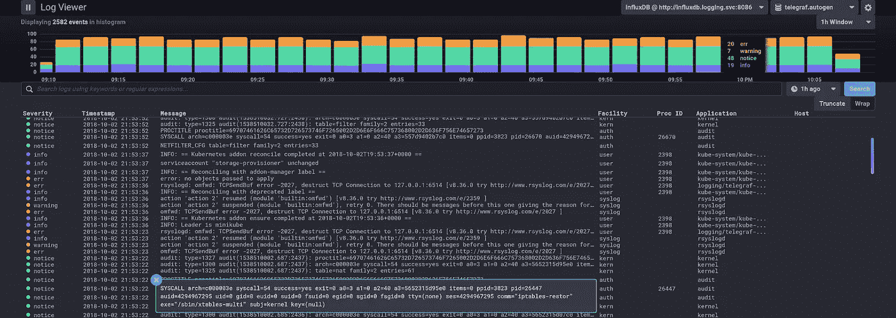
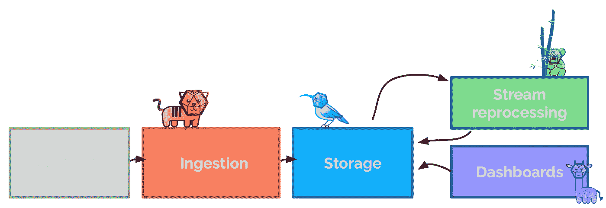
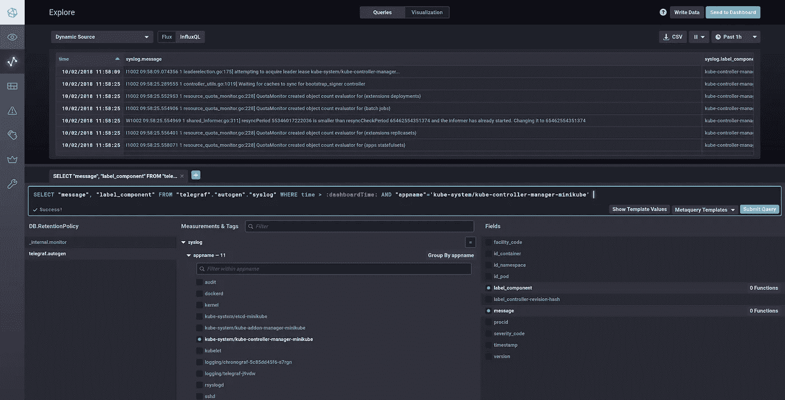
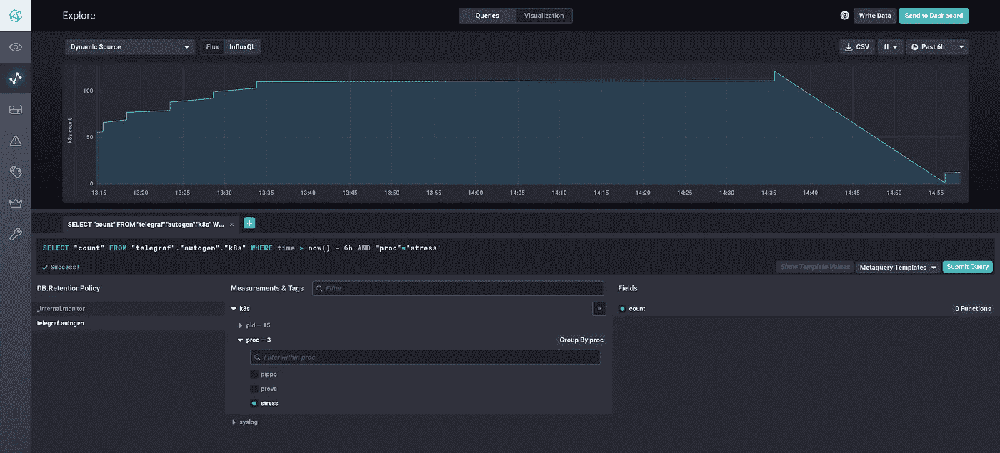
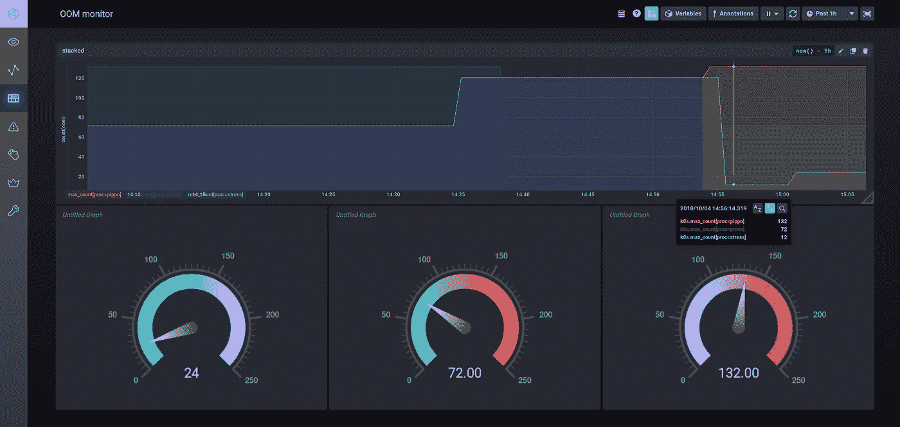

# k8s 日志中的指标

> 原文：<https://itnext.io/metrics-from-kubernetes-logs-82cb1dcb3551?source=collection_archive---------0----------------------->

## 如何将 k8s 日志转换成指标的分步指南



来自内核和 kubernetes 的系统日志严重性直方图。📊

> 这是“从日志到度量”系列博文的第二篇博文。它将引导读者完成一个设置，从 Kubernetes 组件(以及它们所在的内核)发出的 syslog 消息中获取指标，并从中获得可视化和绘图的乐趣。
> 
> 如果您是那种想知道细节、上下文、为什么以及如何解析 syslog 消息的人，请跳回到第一篇博文。

在本系列的第一篇博文中，我用 syslog RFCs、格式和传输的细节让每个人感到厌烦。但是我还介绍了一种使用 [go-syslog](http://github.com/influxdata/go-syslog) 库解析 syslog 消息的有效而快速的方法。

[](https://medium.com/@leodido/from-logs-to-metrics-f38854e3441a) [## 从日志到指标

### 为什么以及如何解析系统日志消息

medium.com](https://medium.com/@leodido/from-logs-to-metrics-f38854e3441a) 

在此基础上，这个故事打算展示从日志和 [InfluxData](https://medium.com/u/9267f20e80cf?source=post_page-----82cb1dcb3551--------------------------------) 栈中提取指标的**完整管道。**

为此，这篇博文附带了一些[伴随代码](http://bit.ly/logs-2-metrics-influx-code)(主要是 YAML😒)演示了*如何在 Kubernetes* 中检测和计数内存不足(OOM)被终止进程的数量。

也就是说，它表明:

1.  如何通过 [Telegraf](https://github.com/influxdata/telegraf) 的 [**syslog 输入插件**](https://github.com/influxdata/telegraf/tree/master/plugins/inputs/syslog) 将 syslog 消息解析成指标并将其存储到 [InfluxDB](http://github.com/influxdata/influxdb)
2.  如何通过 [Chronograf](https://github.com/influxdata/influxdb/tree/master/chronograf) 的新日志查看器和/或仪表盘自动、无障碍地可视化和绘制这些指标
3.  如何通过 [Kapacitor](https://github.com/influxdata/kapacitor) [UDF](https://docs.influxdata.com/kapacitor/v1.5/guides/socket_udf/) 得出新的有意义的指标(例如被杀死的进程 OOM 的数量)。



一个用吉祥物代表我们的日志处理管道的漂亮草图🐯🐦🦒🐨。

让我们一步一步来。

# 烘烤环境🍮

在深入研究之前，我们需要设置我们的本地环境，因为我们假装在本地实验管道。

所以首先我们需要一个当地的 Kubernetes。

但是如何告诉它将其日志消息转发到我们管道的第一部分呢？我们可以将它的 [docker 系统日志记录驱动](https://docs.docker.com/config/containers/logging/syslog)指向我们系统日志接收器的端口(即。一个 Telegraf syslog 输入插件，被配置为通过 TCP 在端口 6514 上监听)。，`--log-opt syslog-format=rfc5424`)。

然而*这样的想法在实践中是行不通的*，因为我们希望我们的 Telegraf 由 Kubernetes 运行，而 docker syslog 日志记录驱动程序无法在不破坏一切的情况下等待它启动。此外，这种驱动程序不能用八位字节计数帧传输日志，我们想要它，因为我们喜欢在做复杂的事情时使我们的生活复杂化。😌

所以让我们为此安排一个计划…

我想到的计划是让 Kubernetes(及其主机的内核)将日志转发到 **journald** 。不幸的是，journald 不发出 RFC 5424 系统日志消息。因此，我们将使用具有以下设置的 **rsyslog** 边车来解决所有问题:

1.  **imjournal** 模块[从 journald 中抓取消息](https://www.rsyslog.com/doc/master/configuration/modules/imjournal.html)
2.  **mmkubernetes** [模块](https://www.rsyslog.com/doc/master/configuration/modules/mmkubernetes.html)将其转换为有效的 RFC 5424 系统日志消息
3.  **omfwd** 模块使用八位字节计数技术将它们发送到我们的系统日志接收器。

这三个步骤转化成了代码，我把它放在了勇士队这篇文章末尾的[附录中。](#6293)

现在我们只需要启动我们的 **minikube** 告诉它使用**journal 和**作为日志驱动程序。就是这样。

```
minikube start --docker-opt log-driver=journald
```

耶！✌

# Telegraf 的系统日志输入插件

如前所述，我们管道的第一个 [InfluxData](https://medium.com/u/9267f20e80cf?source=post_page-----82cb1dcb3551--------------------------------) 组件是 **Telegraf。它是一个插件驱动的服务器代理，用于收集和报告指标。**

我们为它创建了一个 **syslog 输入插件**，它使用了 [go-syslog](http://github.com/influxdata/go-syslog) 库。目的是将其用作 syslog 接收器，以监听通过 [UDP](https://tools.ietf.org/html/rfc5426) 或 [TCP](https://tools.ietf.org/html/rfc6587) 或 [TLS](https://tools.ietf.org/html/rfc5425) 、*带*或*不带*八位字节计数帧传输的 syslog 消息。

缺点是我们(目前)只支持根据 [RFC 5424](https://tools.ietf.org/html/rfc5424) 格式化的 syslog 消息。因此，我们不支持 [RFC 3164](https://tools.ietf.org/html/rfc3164.html) 遗留消息，原因在本系列的第一篇博文中已经解释过。

无论如何，给定一个输入系统日志消息，该插件将在*系统日志测量*中创建以下指标。

标签:

*   严重程度(根据 [Linux 内核](https://github.com/torvalds/linux/blob/master/tools/include/linux/kern_levels.h)其[简称](https://github.com/influxdata/go-syslog/blob/develop/rfc5424/syslog_message.go#L195-L205))—`string`
*   设施(其[简称](https://github.com/influxdata/go-syslog/blob/develop/rfc5424/syslog_message.go#L235-L256)按`man syslog 3`)——`string`
*   主机名— `string`
*   appname — `string`

字段:

*   版本— `integer`
*   severity_code(根据[表 2，第 6.2.1 节](https://tools.ietf.org/html/rfc5424.html#section-6.2.1) )— `integer`
*   设施 _ 代码(根据[表 1，第 6.2.1 节](https://tools.ietf.org/html/rfc5424.html#section-6.2.1) ) — `integer`
*   时间戳(syslog 消息中记录的时间)——`integer`
*   procid — `string`
*   msgid — `string`
*   消息— `string`
*   sdid(结构化数据是否有 ID)——`bool`
*   结构化数据— `string`

现在，简单地说，一些值得解释的事情可以避免你头痛和头晕。

该点的时间戳对应于消息被接收的时间。它不同于上面列出的度量的时间戳，后者实际上代表 syslog 消息中显示的度量(如果有)。

此外，结构化数据(如果存在于日志消息中)通过组合结构化数据标识符(即、`sdid`)和使用配置字段`sdparam_separator`(默认为`_`)的结构化数据元素名称。

最后，提醒您，消息部分可能包含 UTF-8，我邀请您在您的 syslog 消息中使用表情符号，使所有这些更具吸引力！😎

对了，一个例子胜过千言万语。因此，以下系统日志消息(通过八位字节计数帧传输)…

```
173 <165>1 2018–10–01:14:15.000Z mymachine.example.com evntslog — ID47[exampleSDID@32473 iut="3" eventSource="Application" eventID="1011"] An application event log entry ✨
```

…根据[线路协议](https://docs.influxdata.com/influxdb/v1.7/write_protocols/line_protocol_reference/)会导致这种结果:

```
syslog,appname=evntslog,facility=local4,hostname=mymachine.example.com,severity=notice exampleSDID@32473_eventID="1011",exampleSDID@32473_eventSource="Application",exampleSDID@32473_iut="3",facility_code=20i,message="An application event log entry ✨",msgid="ID47",severity_code=5i,timestamp=1065910455003000000i,version=1i 1538421339749472344
```

我们现在已经准备好为我们的 Telegraf 配置这样的插件了。它有各种配置选项,但我们希望保持简单:我们希望在端口 6514 上通过 TCP 接收 syslog 消息，并在最大努力模式下解析它们。这是其配置的核心部分。

```
[[inputs.syslog]]
  server = "tcp://:6514"
  best_effort = true
```

# 统计 OOMs 看 syslogs 🧮

我们假装能够简单地通过查看传入的 syslog 消息流来计算内存不足(OOM)终止进程的数量，以便能够在仪表板中绘制它们。

我们所知道的是，OOMs 将在主机内核中生成日志(我们也将收到日志)，其中的消息部分将包含这种短语:

```
... Kill process <PID> (<PROCESS NAME>) score <OOM SCORE> or sacrifice child
```

该计划(非常简单，仅用于演示目的)是有一个用户定义的函数(UDF ),给定一个日志输入流，它将检测其消息与该格式匹配的日志，并按进程区分计数它们的出现次数，还存储 OOM 分数。

简单来说:我们的流处理器(即 Kapacitor)需要接受一个 syslog 消息流，并通过一个 UDF 保留那些与以下正则表达式匹配的消息。

```
(?m).*Kill process (?P<pid>\d+) (?P<proc>\(.*\)) score (?P<score>\d+)
```

简易柠檬榨汁机。🍋🍑

让我们写一些伪代码来说明我们的*例子* UDF 的逻辑。

```
r := regexp.MustCompile(`...`)          
message, ok := p.FieldsString["message"]
if ok {
  m := r.FindStringSubmatch(message)
  data := mapSubexpNames(m, r.SubexpNames())
  proc := strings.Trim(data["proc"], "()")
  state := h.state[proc]
  if state == nil {
    // initialize state
    state := &myState{Counter: 0}
    // index it by process
    h.state[proc] = state
  }
  h.state[proc].Counter++
  // create point
  newpoint := &agent.Point{
    Time: time.Now().UnixNano(),
    Tags: map[string]string{
      "proc": string(proc),
      "pid":  string(data["pid"])
    },
    FieldsInt: map[string]int64{
      "count": h.state[proc].Counter,
    },
  }
  // send point ...
}
```

如果你想深入了解 Kapacitor UDF，[这里](https://github.com/leodido/logs2metrics-talk/blob/master/main.go)你可以找到它的代码。

最后，我们需要:

*   为我们的 UDF 定义输入点的来源(即，数据库`telegraf`，保留策略`autogen`，测量`syslog`)；
*   将它们限制在我们关心的集合中( *appname* 等于`kernel`并且*消息*包含`sacrifice`字)；
*   来定义它应该将结果输出点流回哪里(即，数据库`telegraf`，测量`k8s`。

下面是翻译这些需求所需的 [TICK 脚本](https://github.com/leodido/logs2metrics-talk/blob/master/kapacitor/tasks/example.tick)。

```
dbrp "telegraf"."autogen"
stream
  |from() 
    .measurement('syslog')
    .truncate(1ms)
    .where(lambda: "appname" == 'kernel')
    .where(lambda: "message" =~ /sacrifice/)
  @example()
  |influxDBOut()
    .database('telegraf')
    .measurement('k8s')
```

我知道，我知道你在想什么…对于 UDF 来说，会有许多其他(更好的)用例适合这个管道。但显然这只是一个演示，我关心的是概念，而不是呈现它们的具体用例，所以请不要怪我，也不要怪我在这种情况下缺乏想象力。[🙏](https://apps.timwhitlock.info/emoji/tables/unicode#emoji-modal)

# 部署管道

现在让我们把所有的碎片放在一起，来计算我们的假 Kubernetes 集群中发生的 OOMs。


我在做 YAML，而不是像过去那样做严肃的事情。🥺

为了简单起见，我们将在单个 Kubernetes 名称空间(名称为`logging`)中做所有事情。应用下面的[命名空间 YAML](https://github.com/leodido/logs2metrics-talk/blob/master/namespace.yaml) 文件。

```
---
# Section: logging namespace
apiVersion: v1
kind: Namespace
  metadata:
    name: logging
```

> 从现在开始，由于 YAML 文件非常冗长，我只报告应用它们的命令。您可以点击 YAML 文件的名称来查看它们(包含一个到 git 库的链接)。

我们还想存储度量，所以我们需要部署我们惊人的时间序列数据库。

```
kubectl apply -f [influxdb.yaml](https://github.com/leodido/logs2metrics-talk/blob/master/influxdb.yaml)
```

现在是 Telegraf plus Rsyslog 的时候了(此时您肯定已经明白为什么了)，它提供了所有额外的东西(例如，也向 InfluxDB 发送指标，共享日志路径，角色使 mmkubernetes 能够调用 Kubernetes APIs，等等)。

```
kubectl apply -f [telelog.yaml](https://github.com/leodido/logs2metrics-talk/blob/master/telelog.yaml)
kubectl apply -f [roles.yaml](https://github.com/leodido/logs2metrics-talk/blob/master/roles.yaml)
```

要设置日志查看器，没有什么特别的需要。

部署 Chronograf 就足够了。然后，我们可以手动创建尽可能多的漂亮仪表板。

```
kubectl apply -f [chronograf.yaml](https://github.com/leodido/logs2metrics-talk/blob/master/chronograf.yaml)
```

此时，我们可以将浏览器指向 [localhost:8888](http://localhost:8888) ，欣赏系统日志指标的展示，并创建一个令人惊叹的直方图。

顺便说一下，如果需要，不要忘记转移 Chronograf 服务。

```
kubectl port-forward svc/chronograf -n logging 8888:80
```

你应该能在这篇文章的标题中看到类似图片的东西！

此外，您可以(也应该)使用浏览器来探索 syslog 消息导致的指标。



通过 Chronograf 的浏览器探索系统日志指标。

所以*时间到了*:让我们用我们编写的 UDF 部署我们的流处理器。

```
kubectl apply -f [kapacitor.yaml](https://github.com/leodido/logs2metrics-talk/blob/master/kapacitor.yaml)
```

为了生成 OOM 典型的 syslog 消息，我们最终部署了一个包含压力工具的 pod(在这方面，我选择了 [polinux/stress](https://hub.docker.com/r/polinux/stress) )。

```
kubectl apply -f [stress.yaml](https://github.com/leodido/logs2metrics-talk/blob/master/stress.yaml)
```

至此，我们的管道已经完成！🎉

它将开始在系统日志流中寻找 OOM 消息，将它们转换成存储在`telegraf.k8s`中的指标。

现在是时候享受通过浏览器查询它们，然后创建一些奇特的仪表板来看看了！



查询 OOM 终止的进程。📈



绘制流程图。📈

> [在这里](https://git.io/k8s-logs-to-metrics-tick)您可以找到包含该演示完整代码的 git 存储库，以及一些开发/调试工具。
> 
> 随时给我发拉请求…有人想更新到 InfluxDB 2.0 吗？😊

# 附录

正如所承诺的，这里有 **RainerScript** ( [文档](https://www.rsyslog.com/doc/v8-stable/rainerscript/index.html))来配置 [rsyslog](https://github.com/rsyslog/rsyslog) 从 journald 获取 syslog 消息，将它们转换为 RFC5424 syslog 格式，并将其与八位位组计数帧一起发送到 syslog 接收器。

这个脚本提供了一些好处:

1.  合适时， *appname* 匹配`namespace/pod`格式
2.  *消息*结尾没有最终误导换行，并使用固定的 UTF-8 字符
3.  一个*结构化的* *数据*段，其 *sdid* 等于`id`，包含`container=<container id>`、`namespace=<namespace id>`和`pod=<pod id>`
4.  一个*结构化的* *数据*段，其 *sdid* 等于`label`，包含`component=<component label>`和`controller-revision-hash=<controller-revision-hash label>`
5.  限速