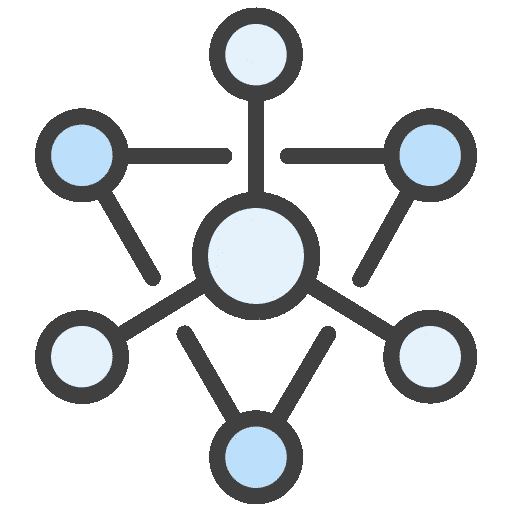

# 带有 OpenFaaS 和。网

> 原文：<https://itnext.io/micro-apis-with-openfaas-and-net-f82115efce4?source=collection_archive---------5----------------------->



无服务器功能正变得越来越流行，但并不是一切都适合这种模式。尽管可以为资源上的每个操作创建一个带有函数的 API，但这很容易变得难以管理。

幸运的是，OpenFaaS 可以承载各种类型的工作负载，而不仅仅是功能，只要它们服务于 HTTP 流量，假设是短暂存储，并且是无状态的。这意味着，如果我们愿意(不是说我们应该)，我们可以将整个 API 捆绑在一个工作负载之后。

# 微型 API

微 API 背后的想法是拥有一个微服务来实现特定上下文的 API——通常是一个或非常有限的一组资源。这种特殊的环境确保你不会重复太多的代码，并关注微服务的行为。

经验法则是，它应该足够小，以便只关注重要的事情(上下文)，并且足够大，以便避免代码重复和碎片化(超出上下文)。

例如，如果我们的上下文是用户，那么微 API 应该只关注用户。另一方面，如果我们的上下文是博客中的帖子，那么*可能*是微 API 既处理帖子又处理帖子评论——或者我们可能有两个独立的微 API。

作为一个例子，让我们考虑我们想要管理待办事项列表上的笔记。我们的上下文是 notes，我们需要以下操作:

*   获取笔记列表
*   检索现有便笺
*   添加新注释
*   更改现有便笺
*   删除便笺

我们的微 API 将实现 notes 资源和上述操作。没别的了。

# **环境**

本文并不关注如何设置一个可用的 OpenFaaS 集群，而是假设您已经有了一个或者知道如何设置。这样做有多种选择，从托管 kubernetes 集群到 [minikube](https://minikube.sigs.k8s.io/) 或 [faasd](https://github.com/openfaas/faasd) 。你可以看一下[这篇文章](https://goncalo-a-oliveira.medium.com/setting-up-openfaas-with-minikube-28ed2f78dd1b)来学习如何用 [minikube](https://minikube.sigs.k8s.io/) 建立一个环境。

# ASPNET 函数

我们可以用。NET 并使用 Dockerfile 托管它，但这将意味着为每个微 API 编写 Dockerfile 和所有项目样板文件。因此，我们将使用 [ASPNET Functions](https://github.com/goncalo-oliveira/faas-aspnet-template) 模板来处理所有这些问题，并且最近添加了一个新的控制器模板，正好适合这些场景。

## 装置

模板随`faas-cli`一起安装，从 git 存储库中取出。

```
$ faas-cli template pull [https://github.com/goncalo-oliveira/faas-aspnet-template](https://github.com/goncalo-oliveira/faas-aspnet-template)
```

这将安装三个模板:

*   aspnet
*   aspnet 控制器
*   aspnet-fsharp

`aspnet`和`aspnet-fsharp`模板是为功能设计的，专注于做一个单一的操作。然而，`aspnet-controller`模板实现了一个`Controller`类，允许我们实现多个操作。

## 创建我们的微 API

让我们从使用`aspnet-controller`模板创建我们的工作负载开始。

```
$ faas-cli new --lang aspnet-controller notes
```

查看笔记文件夹，我们可以看到一个`Controller.cs`和一个`Startup.cs`文件。`Startup.cs`基本上是空的，因为所有的样板文件都在别处处理。在这里，我们将只添加与我们的项目相关的内容。

`Controller.cs`本质上是一个 Hello World，几乎是一个空白页。

```
using System;
using System.Threading.Tasks;
using Microsoft.AspNetCore.Mvc;namespace OpenFaaS
{
    [ApiController]
    [Route("/")]
    public class Controller : ControllerBase
    {
        [HttpGet]
        public Task<IActionResult> GetAsync()
        {
            var result = new
            {
                Message = "Hello!"
            }; return Task.FromResult<IActionResult>( Ok( result ) );
        }
    }
}
```

在我们继续之前，让我们在本地运行我们的项目。有几种方法可以做到这一点，但我们将使用 [FaaS 运行器](https://github.com/goncalo-oliveira/faas-run)来完成，因为这对调试很有用。

```
$ cd notes
$ dotnet build$ faas-run bin/Debug/netstandard2.0/function.dll
OpenFaaS ASPNET Function LoaderTo debug attach to process id 1705.Loaded function assembly bin/Debug/netstandard2.0/function.dll.
info: Microsoft.Hosting.Lifetime[0]
      Now listening on: [http://[::]:9000](http://[::]:9000)
```

默认情况下，它运行在端口 9000 上，但是我们可以用`--port`标志来改变它。让我们试试我们的服务。

```
$ curl localhost:9000
{"message":"Hello!"}
```

## 实施操作

我们首先为笔记的结构创建一个`Note.cs`文件。

```
using System;namespace OpenFaaS
{
    public class Note
    {
        public string Id { get; set; }
        public string Content { get; set; }
    }
}
```

由于这只是出于教育目的，我们没有将笔记存储在物理存储上，因此，在服务运行时，我们只是将它们保存在内存中，使用静态字典。我们也不会为并发性而烦恼。我们还删除了`async`,因为没有任务，以提高代码的可读性。

```
public class Controller : ControllerBase
{
    private static readonly IDictionary<string, Note> dictionary = new Dictionary<string, Note>();
```

现在让我们实现我们的操作。我们从音符列表开始。该操作将只返回笔记的 id，而不是它们的内容。我们删除现有的`GetAsync`方法，并添加以下内容:

```
[HttpGet]
public IActionResult Get()
{
    var notes = dictionary.Values.Select( note => new Note
    {
        Id = note.Id
    } )
    .ToArray(); if ( !notes.Any() )
    {
        return NoContent();
    } return Ok( notes );
}
```

现在检索单个注释的操作，在这里我们需要添加一个路由模板。

```
[HttpGet( "{id}" )]
public IActionResult GetSingle( string id )
{
    if ( !dictionary.TryGetValue( id, out var note ) )
    {
        return NotFound();
    } return Ok( note );
}
```

这里没有什么不同于我们使用 Web API 所做的。让我们添加剩余的操作。

```
[HttpPost]
public IActionResult Post( [FromBody] Note note )
{
    note.Id = Guid.NewGuid().ToString(); dictionary.Add( note.Id, note ); // we should return a 201 Created response here
    // but let's keep it simple as it's not the
    // purpose of the article
    return Ok( note );
}[HttpPut( "{id}" )]
public IActionResult Put( string id, [FromBody] Note note )
{
    if ( !dictionary.ContainsKey( id ) )
    {
        return NotFound();
    } note.Id = id; dictionary[id] = note; return Ok( note );
}[HttpDelete( "{id}" )]
public IActionResult Delete( string id )
{
    if ( !dictionary.ContainsKey( id ) )
    {
        return NotFound();
    } dictionary.Remove( id ); return NoContent();
}
```

完整的源代码可以在 [GitHub](https://github.com/goncalo-oliveira/example-openfaas-microapi) 上找到。

## 测试它

就是这样。让我们构建它并在本地运行它。

```
$ dotnet build$ faas-run bin/Debug/netstandard2.0/function.dll
```

让我们试一试。我们将首先插入两个音符。我在 Linux 上用的是`curl`，不过你可以用 [Postman](https://www.postman.com/) 或者别的。

```
$ curl -X POST -H "Content-Type: application/json" \
 -d '{"content": "this is my first note"}' \
 localhost:9000
{"id":"37b3ad6a-2f60-49aa-95c8-9fd7cdac0e3f","content":"this is my first note"}$ curl -X POST -H "Content-Type: application/json" \
 -d '{"content": "a second note"}' \
 localhost:9000
{"id":"c98d058d-e24e-4b23-907a-9a2d4d298ad6","content":"a second note"}
```

我们现在应该有两个音符。我们来列举一下。

```
$ curl localhost:9000
[{"id":"37b3ad6a-2f60-49aa-95c8-9fd7cdac0e3f"},{"id":"c98d058d-e24e-4b23-907a-9a2d4d298ad6"}]
```

让我们使用 id 来检索第二个笔记。

```
$ curl localhost:9000/c98d058d-e24e-4b23-907a-9a2d4d298ad6
{"id":"c98d058d-e24e-4b23-907a-9a2d4d298ad6","content":"a second note"}
```

现在我们将更新第二个音符并再次检索它。

```
$ curl -X PUT -H "Content-Type: application/json" \
 -d '{"content": "still my second note"}' \
 localhost:9000/c98d058d-e24e-4b23-907a-9a2d4d298ad6
{"id":"c98d058d-e24e-4b23-907a-9a2d4d298ad6","content":"still my second note"}$ curl localhost:9000/c98d058d-e24e-4b23-907a-9a2d4d298ad6
{"id":"c98d058d-e24e-4b23-907a-9a2d4d298ad6","content":"still my second note"}
```

唯一缺少的操作是删除一条注释。我们先删除第一个。

```
$ curl -X DELETE localhost:9000/37b3ad6a-2f60-49aa-95c8-9fd7cdac0e3f$ curl localhost:9000
[{"id":"c98d058d-e24e-4b23-907a-9a2d4d298ad6"}]
```

## 多个控制器

尽管模板被明确设计成只有一个控制器，但这只是概念上的，并不是限制。如果我们的环境需要不止一个控制器，我们可以这样做。我们甚至可以删除`Controller.cs`文件并添加我们自己的控制器，例如`CarsController.cs`和`ModelsController.cs`——就像我们对常规 Web API 所做的一样。

请记住，如果你开始添加与特定上下文无关的东西，那么它可能就不再是一个微 API 了。

# 最后的话

微 API 的概念很有趣，介于无服务器功能和微服务之间。由于 OpenFaaS 能够运行除函数之外的不同工作负载，我们可以使用相同的工具并从中受益。

如果你喜欢，一定要鼓掌，并随时发表评论。另外，别忘了在 GitHub 上启动 [OpenFaaS](https://github.com/openfaas/faas) 和 [ASPNET Functions](https://github.com/goncalo-oliveira/faas-aspnet-template) 项目，以示支持。