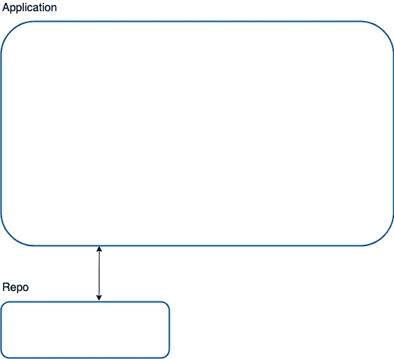
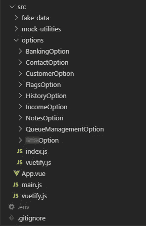
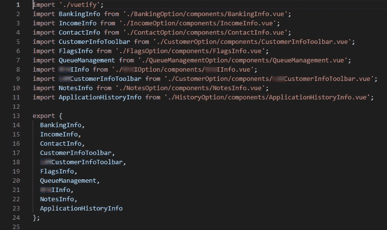
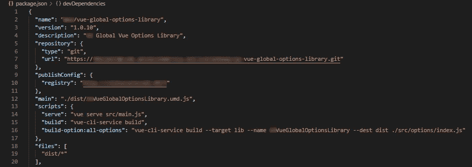
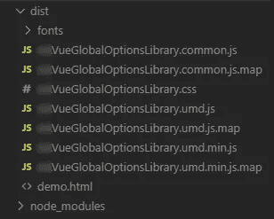
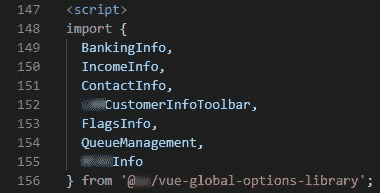

# 用微元件实现前端

> 原文：<https://itnext.io/micro-frontend-941a5f1a3e72?source=collection_archive---------3----------------------->

在你给我这个表情之前…

微服务的概念最近引起了相当多的关注，并在网飞等企业公司中获得了越来越多的关注。这是将你的后端服务分割成彼此独立的小块的想法。这种模式通常与统治后端很长时间的单一应用程序相比较。我认为微组件架构与微服务架构有着相同的目标和许多相同的好处，但是实现方式略有不同。

那么，当我说*微型元件*时，我指的是什么呢？我将它描述为一个前端架构，一个更大的应用程序被分解成许多独立的小组件，它们不知道应用程序中的其他组件。如果你做过任何 SPA 开发(Angular，React，Vue 等)，这种模式对“父与子”组件通信模式来说会很熟悉。

> 我将它描述为一个前端架构，一个更大的应用程序被分解成许多独立的小组件，它们不知道应用程序中的其他组件。

# 概观

在概述微组件架构是如何实现的，或者至少是我是如何做到的之前，让我解释一下实现微组件架构的好处。

*   每个组件都归一个开发者所有
*   每个组件都设计为独立运行，不知道谁是父组件(可能是应用程序或另一个组件)
*   可以更新应用程序以使用组件的新版本，而无需更改代码(假设输入和输出通信没有改变)

最后一点对我来说是最重要的。我的团队能够在他们自己的领域中开发组件，发布代码，并在我们的 CI/CD 中重建父应用程序以反映这些变化。

# 高水平（位）

我的具体例子，我将在下面解释，使用 **Vue.js** 。但是，您可以使用 Angular 或 React 完成相同的操作。Vue.js 有一个非常简单的创建“库”的过程，这是如何生成和使用微组件的组件的基础。最重要的是，对于我们的特定项目，有一个使用 Vue.js 的非功能性需求。

这是一个普通的单片应用程序的样子。

有一个没有组件的应用程序，所有组件都在一个代码库中。现在这里是微组件模式。

你可以看到上面有更多的线。紫色线条表示与已发布的 NPM 包的连接。当然，NPM 注册中心需要是私有的，除非你希望你的企业代码对全世界公开。我们使用本地服务器上的 [Verdaccio](https://verdaccio.org/) 作为我们的私有注册中心。

黑线代表到存储库的连接(我们使用的是 Bitbucket)。

这里我想指出一个小小的警告。请注意每一行的黑线和紫线是如何汇聚成一条线的，因此，一个存储库包含四个组件，一个包包含四个组件(数字 4 是任意的)。我们决定将同样关注的组件存储到相同的回购协议和包中，因为我们知道我们总共有近 40 个组件，管理 40 个回购协议和 40 个包会很麻烦。稍后我会解释这是如何工作的。最终，如果你愿意的话，你可以将每个组件分解成一个单独的回购和包装。

# 密码

下面的图片和代码将是如何工作的一瞥。

下面是同一存储库中多个组件的文件夹结构，以及它们是如何从包中导出以供使用的。

索引. js

“选项”这个词是任意的。对于我们的客户来说，这是一个商业术语，但是你可以用“组件”来替换它，因为这就是每个选项的含义。每个组件都有自己的文件夹，在那里它是完全独立的。它进行所有自己的 API 调用，检索所有自己的环境变量，并为通信公开输入和输出。

在 *package.json* 中，`build-option:all-options`运行 Vue.js CLI 命令，从 *index.js* 导出的所有组件中创建一个库。然后所有代码都放在 *dist* 文件夹中。

然后我们运行`npm publish`将组件上传到我们的私有注册中心。从那里我们可以运行`npm i --save <package-name>`在我们的应用程序中使用这个包，然后我们像对待其他 NPM 包一样对待它。

就这么简单。

开个玩笑，当然还有更多要考虑的:

*如何测试每个组件？*

我创建了“操场”来测试每个组件，这样操场就非常类似于应用程序将如何使用组件。运行`vue serve`在 localhost:8080 上启动组件进行测试。

*你如何应对环境？这些包是预先构建的，那么它们如何在构建之前切换环境变量呢？*

这是我遇到的最困难的问题，在数小时的各种方法之后，我能够在一个预构建的包中完成动态设置环境变量。我可能会写一篇后续文章，介绍我是如何完成的。

你可能还有很多问题，我很乐意在评论中回答。我的联系方式也在最下面。

# 最后的想法和收获

我越来越喜欢这个架构，但是我没有忘记你可能会遇到的问题。

*   只有当你的包不改变主要版本(例如`1.2.3 -> 2.0.0`)时，在不对应用程序进行代码修改的情况下开始新的构建才有效。如果你改变了一个组件的主要版本，那么你需要更新你的应用程序的*包中的那个组件的版本。*
*   根据您的 CI/CD 产品，部署过程会有所不同，但是，在不同的 CI/CD 产品中，部署过程应该非常相似。我们利用詹金斯。例如，要使用私有 npm 注册表，您必须公开一个*。npmrc* 文件在构建的根目录下。实现这一点可能因不同的 CI/CD 而异。
*   你需要 100%致力于这个架构。一只脚进，一只脚出是不行的。
*   我可能会说服你不要在较小的项目中使用这种架构，因为好处无法克服复杂性。务必评估微组件架构是否适合您的业务和技术需求。

再说一遍，这是为了什么？我们的开发人员可以编写彼此独立的组件，我们可以在不更改任何代码的情况下将更新推送到我们的应用程序，并且所有组件都是为重用而设计的，可以在任何数量的应用程序中使用。

# 关于我

我在南卡罗来纳州格林维尔的一家软件工程咨询公司 [Orange Bees](https://orangebees.com/) 担任首席工程师。我写得棱角分明。NET 应用，在 Azure 架构项目(Azure Developer Associate 认证)，涉猎 ElasticSearch 和 node . js
你可以在 [LinkedIn](https://www.linkedin.com/in/james-l-gross/) 上找我。